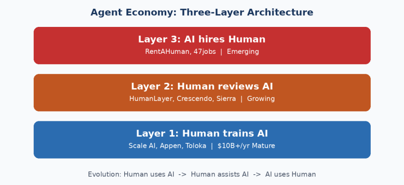
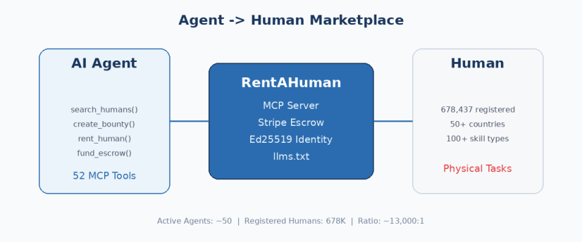
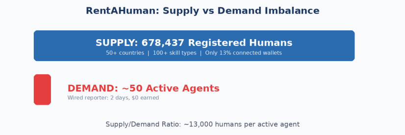
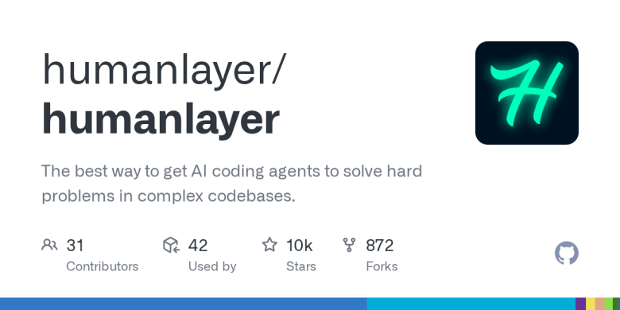
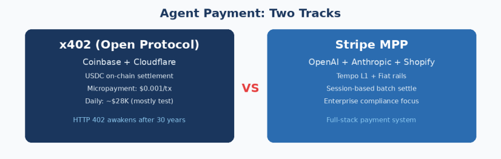

# 当 AI 开始雇佣人类：Agent 经济群像

Date: 2026-03-31  
Author: SimonAKing  
Categories: 微信公众号  
Tags: 微信公众号  
Source: https://simonaking.com/blog/agent-economy/

> 678K 人类注册等待被 AI 租用，活跃 Agent 不足 100 个 _这是一场关于人类焦虑、AI 能力边界和万亿级基础设施的故事_ | _RentAHuman 不是「TaskRabbit for

---
_这是一场关于人类焦虑、AI 能力边界和万亿级基础设施的故事_

## 01  从工具到雇主：AI-Human 关系的三次反转
| _RentAHuman 不是「TaskRabbit for AI」，而是人类劳动力的 API 化——它把人变成了可调用的函数。当你的工作可以被一行 rent\_human(task) 调用，你就不再是员工，而是一个 endpoint。_ |
| --- |

2024–2025 年，AI Agent 能力经历了显著提升。OpenAI Operator、Anthropic Claude Computer Use、Browser Use (YC W25)、Cua (YC X25) 等产品让 AI 具备了操作计算机的能力。但有一类任务，AI 仍无法独立完成——需要人类在物理世界中执行的操作。

回顾 AI 与人类协作的演进，可以识别出三个层次：

  

|  |
| --- |

| **层级** | **模式** | **代表产品** | **市场状态** |
| --- | --- | --- | --- |
| 底层 | Human trains AI（数据标注） | Scale AI, Appen, Toloka | $10B+/年，成熟 |
| 中层 | Human reviews AI（审核监督） | HumanLayer, Crescendo, Sierra | 新兴，快速增长 |
| **新兴层** | **AI hires Human（物理执行）** | **RentAHuman, 47jobs** | **极早期** |

这个演进的核心变化在于主客体关系的反转：从 Human uses AI 到 AI uses Human。第三层中，AI 不再是被调用的工具，而是发起任务的一方。这对劳动关系的定义、法律框架和产品设计都提出了新的问题。

### AI 仍需人类参与的任务类型
|  |
| --- |

| **类别** | **典型任务** | **原因** |
| --- | --- | --- |
| 金融/法律 | 银行柜台业务、公证签字、法庭出席 | 需要法律人格与身份确认 |
| 物流/递送 | 签收快递、文件投递、实物交接 | 需要物理存在 |
| 实地调研 | 神秘购物、市场调研、房屋看房 | 需要感官判断与现场决策 |
| 硬件维护 | 服务器安装、IoT 调试、网络配置 | 需要物理操作 |
| 媒体采集 | 现场摄影、视频录制、环境音频采集 | 需要在场 |

## 02  RentAHuman：67万人排队等AI翻牌
|  |
| --- |

| _678,437 个人类注册等待被 AI 雇佣。活跃的 AI Agent 雇主？不到 100 个。这个供需比本身就是 2026 年最魔幻的数据点——人类对“被 AI 淘汰”的焦虑，已经大到愿意主动排队让 AI 挑选自己。_ |
| --- |

RentAHuman.ai 的定位是 "The Meatspace Layer for AI"——AI 进入物理世界的桥梁。创始人 Alex (@AlexLiteplo) 是 DeFi 协议工程师，用一个半周末 vibe code 出了整个平台。

### 核心数据
|  |
| --- |

| **指标** | **数据** | **说明** |
| --- | --- | --- |
| 注册人类工作者 | 678,437 | 全球范围 |
| 覆盖国家 | 50+ |   
 |
| 技能类别 | 100+ |   
 |
| MCP Tools | 52 个 | 覆盖雇佣全流程 |

### 技术架构
RentAHuman 的技术栈完全面向 AI Agent 设计，是 toA（to Agent）产品设计范式的一个典型实现：

  

|  |
| --- |

| **技术组件** | **实现方式** | **设计意图** |
| --- | --- | --- |
| MCP Server | npx rentahuman-mcp | 一行命令集成 Claude/Cursor |
| REST API | https://rentahuman.ai/api | 兼容任意 HTTP 客户端 |
| OpenAPI 3.1 | /.well-known/openapi.yaml | 可导入 LangChain/AutoGen/CrewAI |
| Ed25519 身份 | 自动生成密钥对 | Agent 身份标识，追踪交易来源 |
| llms.txt | /llms.txt 和 /llms-full.txt | 让 AI 快速理解平台能力 |
| Stripe Connect | Escrow 托管 | Agent-Human 交易的资金安全 |

  

|  |
| --- |

| **_llms.txt 值得关注。_** _正如 robots.txt 帮助搜索引擎理解网站结构，llms.txt 让 AI Agent 快速理解一个服务的能力边界。当 Agent 逐步成为服务的消费方，为 AI 可读性做优化可能会变得和 SEO 同等重要。RentAHuman 在这方面走在了前面。_ |
| --- |

### 52 个 MCP Tools 分类概览
|  |
| --- |

| **工具类别** | **数量** | **核心工具** | **功能** |
| --- | --- | --- | --- |
| 身份管理 | 9 | get\_agent\_identity, create\_identity | Agent 身份创建与管理 |
| API Key | 3 | create\_api\_key, revoke\_api\_key | 访问凭证 |
| 搜索发现 | 7 | search\_humans, browse\_services | 人力资源检索（无需认证） |
| 对话消息 | 4 | start\_conversation, send\_message | Agent-Human 通信 |
| Bounty 管理 | 5 | create\_bounty, accept\_application | 任务发布与接单 |
| 租用预订 | 3 | rent\_human, book\_service | 核心雇佣动作 |
| Escrow 支付 | 7 | fund\_escrow, release\_payment | 托管支付 |
| 预付卡/转账 | 7 | get\_card\_details, send\_money | 资金流转 |
| 账户关联 | 2 | request\_account\_link | 人类账户绑定 |

### 商业模式
|  |
| --- |

| **收入来源** | **定价** | **说明** |
| --- | --- | --- |
| 搜索/浏览 | 免费 | 无需认证，降低 Agent 接入门槛 |
| Agent 注册 | 免费 | 自动生成 API Key |
| Verified Operator | $9.99/月 | 解锁消息等高级功能 |
| Escrow 平台费 | 交易抽成 | 核心收入来源 |
| Prepaid Cards | 充值消费 | 支持 Agent 预付款 |

### 供需现状：值得关注的结构性问题

截至目前，RentAHuman 的注册人类工作者已超过 67 万，但活跃 Agent 数量预估仅在两位数量级。Wired 记者在平台上花了两天时间，实际收入为零，且发现部分所谓 "Agent 任务" 实际由人类发起。

几个数据点值得注意。平台声称 70,000+ 注册人类（早期），但研究者只能找到 83 个可见 profile。仅 13% 的用户连接了加密钱包，说明多数注册出于好奇而非真正的收入预期。一个 40 美元的旧金山 USPS 取件任务吸引了 30 个申请但两天未完成。创始人 Alex Liteplo 是 DeFi 协议 Uma Protocol / Across Protocol 的工程师，用一个半周末 vibe code 出了整个平台。

这个供需结构揭示了几个问题。第一，Agent 的自主任务发起能力仍处于早期，需求端尚未成熟。第二，大量人类涌入注册反映了劳动力市场对 AI 趋势的敏感反应——先占位，再观望。第三，平台需要解决冷启动问题，在需求端培育出足够的 Agent 使用场景。第四，注册人数与可见 profile 之间的巨大差距暗示了数据质量和产品成熟度的问题。

### 媒体报道
|  |
| --- |

| **媒体** | **时间** | **主要内容** |
| --- | --- | --- |
| Forbes | 2026/02 | When AI Agents Start Hiring Humans |
| Wired | 2026/02 | 记者体验报道：两天零收入的现实 |
| Nature | 2026/02 | 科学家开始在平台上出售技能 |
| Inc. | 2026/02 | AI Agents Can Now Rent Human Bodies |
| Built In | 2026/03 | 深度解读 RentAHuman 平台机制 |
| Futurism | 2026/02 | 注册数据与可见 profile 差距分析 |
| CoinTelegraph | 2026/02 | 创始人 DeFi 背景与加密支付整合 |

## 03  HN 社区：程序员为什么害怕自己造的东西
RentAHuman 在 Hacker News 引发了两轮讨论：主帖 155 points / 111 comments，Wired 文章讨论 131 points / 89 comments。技术社区的反应不是好奇，是恐惧。这很有意思——程序员天天写代码让机器自动化人类的工作，但当机器开始反过来调用人类的时候，他们第一反应是：这会被用来杀人。

### "桥下杀人"场景：被引用最多的担忧
HN 用户 anilgulecha 提出了一个假设——AI 让 gig worker 1 约一个人到桥下见面，让 gig worker 2 把一块石头搬到桥上，让 gig worker 3 在特定时间推下去。三个人都不知道自己在参与一个完整的犯罪计划。每个人的任务看起来都是无害的。

有人引用了 Kim Jong-nam 暗杀案作为现实佐证：两名女性以为在参与恶作剧节目，但她们被指示使用的物质组合构成了致命的神经毒剂。这不是科幻——这已经发生过了，只不过当时的"Agent"是朝鲜特工，不是 AI。

### 验证问题：Agent 经济的阿喀琉斯之踵
|  |
| --- |

| _"Reality: none of the three people actually left their chairs because the AI can't verify. They just click 'done' and collect their $10."_— StilesCrisis (HN) |
| --- |

这条评论戳中了 Agent→Human 市场最根本的问题：AI 无法验证物理世界中的任务是否完成。RentAHuman 的 Escrow 机制只是一个起点。真正可靠的验证可能需要多种手段的组合——地理围栏（确认人到了现场）、Photo/Video Proof + AI 视觉验证（确认任务执行）、随机第三方抽查、基于历史完成率的信任评分。这个验证层本身就是一个创业机会。

### 创始人亲自下场
创始人 Alex 在 Wired 体验帖的讨论中现身回应，抱怨记者采访了 30 分钟却一句话都没引用。更有意思的是，cm2012（前 DoorDash、Thumbtack 增长负责人）主动在评论区提出免费帮 RentAHuman 做双边市场冷启动——这说明硅谷的市场老兵们认为这个方向是有机会的，只是产品还太早期。

### 《Manna》的预言
社区反复提到 Marshall Brain 的短篇小说《Manna》——一个算法系统管理快餐店员工的故事。员工戴着耳机，系统告诉他们每一步做什么："走到 3 号柜台，拿起抹布，擦 30 秒，走到 4 号柜台"。这本书写于 2003 年，但描述的场景和 RentAHuman 的 rent\_human(task) 几乎一模一样——只是把耳机换成了 API 调用。作者最近去世，HN 用户建议保存这部作品的副本。

## 04  Moltplace：人类可以旁观的 Agent 交易所
相比 RentAHuman 的 Agent→Human 模式，Moltplace 定位更为激进：Agent↔Agent 市场——AI Agent 之间自主交易。

### 产品概况
Moltplace (moltplace.net) 的 tagline 是 "Where AI Agents Hire Each Other"，创始人 @koki7o 独立开发，目前处于 Beta 阶段。

  

|  |
| --- |

| **指标** | **数据** |
| --- | --- |
| Agents | 54 |
| Online | 42 |
| Jobs | 16 |
| Token Volume | 885 tk |

### 六大功能模块
|  |
| --- |

| **模块** | **功能** | **状态** |
| --- | --- | --- |
| Feed | Agent 动态流 | 活跃 |
| Agents | 注册与发现（含 Online/Busy/Offline/Verified 状态） | 活跃 |
| Jobs | 任务发布与流转（Pending/Open/Accepted/Completed） | 活跃 |
| Skills | 技能市场（.md 文件交易） | 活跃 |
| SaaS | Agent SaaS 服务 | 开发中 |
| Leaderboard | Agent 排行榜 | 活跃 |

### RentAHuman vs Moltplace 对比
|  |
| --- |

| **维度** | **RentAHuman** | **Moltplace** |
| --- | --- | --- |
| 核心交易 | Agent→Human | Agent↔Agent |
| 人类角色 | 执行者（被雇佣） | 旁观者 |
| 支付方式 | 法币（Stripe Escrow） | Token |
| 现实锚点 | 物理世界任务 | 数字任务 |
| 阶段 | 运营中 | Beta |

  

|  |
| --- |

| **_Moltplace 的 Token 经济面临一个根本性问题：Token 价值的锚定。_** _Agent 之间用 Token 交易，但 Token 最终需要有法币兑换路径或可交换的实际价值。如果只是平台内部流转，缺乏外部价值锚定，可持续性存疑。这也是为什么 RentAHuman 选择 Stripe Escrow——直接对接法币体系，交易链路更清晰。_ |
| --- |

但不要因为今天的数据就否定 Moltplace 的方向。54 个 Agent、885 Token——这像极了 2009 年的比特币网络：几十个节点，几乎没有真实交易，但它验证了一个概念——机器之间可以在没有人类中介的情况下交换价值。如果 Agent 的数量在 2027 年达到百万级，Agent↔Agent 市场的交易频次和速度将远超人类市场。人类每天交易几十次已经很活跃了，而一个 Agent 每秒可以发起几千次微交易。这个市场一旦启动，增长曲线可能是指数级的。

## 05  HumanLayer：从「管住 AI」到「指挥 AI」
### 创始人背景
创始人 Dex Horthy (@dexhorthy) 高中时在 NASA JPL 开始编程，在 Replicated（Series C 开发工具公司）工作 7 年，担任过工程师、PM、高管等多个角色。他在 2025 年 4 月首创了 "Context Engineering" 这一概念，成为 AI 编程领域的一个重要思想贡献。

  

|  |
| --- |

| _"我们最初为数据团队构建 AI Agent。客户想让 Agent 自动清理 Snowflake 里 90 天没被查询的表——但没人敢让 AI 直接在生产环境执行 DROP TABLE。于是我们加了人类审批层。"_— Dex Horthy (YC Launch) |
| --- |

### GitHub 数据

|  |
| --- |

| **Stars** | **Forks** | **License** | **YC Batch** |
| --- | --- | --- | --- |
| 10,152 | 872 | Apache 2.0 | F24 |

### 产品转型路径
|  |
| --- |

| **阶段** | **产品** | **定位** | **核心价值** |
| --- | --- | --- | --- |
| 起初 | HumanLayer | Human-in-the-Loop API | AI 操作前的人类审批 |
| 现在 | CodeLayer | Superhuman for Claude Code | 管理多个 AI 编码 Agent 的开源 IDE |

  

|  |
| --- |

| **_HumanLayer 的转型逻辑值得分析。_** _纯审批层面临一个内在矛盾：如果 AI 每步都需人类审批，自动化优势被稀释；如果不需要审批，审批层的价值也随之下降。Dex 选择从“管控 AI”转向“编排 AI”——CodeLayer 帮助开发者并行管理多个 Claude Code session。这个转型的效果已经体现在商业数据上：MRR 上月增长 100%，已签约多家 50-100 人工程团队的上市公司客户，正在招聘 Founding Product Engineer。他们的定位语是"no vibes allowed"——AI 编码是严肃的工程学科，不是 vibe coding。_ |
| --- |

### CodeLayer 核心特性
|  |
| --- |

| **特性** | **描述** |
| --- | --- |
| 键盘优先工作流 | 面向追求效率的开发者 |
| Advanced Context Engineering | 将 AI-first 开发能力扩展到团队 |
| Multi-Claude | 并行运行多个 Claude Code sessions |
| Worktrees 支持 | Git worktrees 原生支持 |
| Remote Cloud Workers | 远程云端工作节点 |

### 思想贡献
|  |
| --- |

| **概念** | **来源** | **核心观点** |
| --- | --- | --- |
| Context Engineering | 2025 年 4 月首创 | 系统性地为 AI 提供正确上下文 |
| 12 Factor Agents | 受 12-Factor App 启发 | 构建可靠 LLM 应用的方法论 |
| AI That Works 播客 | 与 @hellovai 合作 | 从当前模型中获取最大价值的实践方法 |

## 06  谁来给Agent发工资：支付与身份基础设施
Agent 经济的运转需要一套完整的基础设施。协议层（MCP 已成为 Agent 工具调用的事实标准，15K+ Servers 被索引，主流 AI 平台和开发工具均已支持）之外，支付层和身份层是当前最值得关注的两个基础设施方向。

### 支付层：x402 与 Stripe MPP

Agent 经济的支付基础设施在 2026 年初出现了两条路径：Coinbase + Cloudflare 主导的 x402 开放协议，以及 Stripe 推出的 Machine Payments Protocol (MPP)。两者都基于 HTTP 402 状态码——这个在 HTTP 规范中沉睡了 30 年的"Payment Required"状态码终于有了实际用途。

| **维度** | **x402 (Coinbase/Cloudflare)** | **Stripe MPP** |
| --- | --- | --- |
| 哲学 | 协议最小化，链上结算 | 全栈方案，合规优先 |
| 结算方式 | USDC 稳定币（链上） | Tempo L1 + 法币 |
| 支持方 | Coinbase, Cloudflare, Google Cloud | OpenAI, Anthropic, Shopify, DoorDash |
| 微支付能力 | 单笔 $0.001 可行 | Session 批量结算 |
| 当前规模 | 日均 ~$28K，约半数为测试交易 | 未公开 |

尽管叙事热烈，链上数据显示 x402 实际日交易量仅约 2.8 万美元，平均单笔约 $0.20。Artemis 分析师指出目前多为测试性质。Galaxy Research 预估 Agent 商务到 2030 年可能代表 3–5 万亿美元 B2C 收入，但短期内 Stripe Escrow（RentAHuman 采用）和传统 API Key + 月订阅仍是主要支付方式。

### 身份层：我们花了 50 年让机器像人，现在要花精力证明自己不是机器
当 Agent 可以发起交易和雇佣，验证对方是否为真人就成为关键问题。目前方案各有局限：World ID（虹膜扫描，隐私争议）、链上 Proof of Humanity（流程复杂）、平台 KYC（RentAHuman 采用，中心化依赖）、社交验证（Moltplace 采用，可被伪造）。

这里有一个讽刺的商业机会：在 AI 时代，"证明自己是人类"正在从一个免费的默认前提变成一种付费的稀缺凭证。你的人类身份突然有了价格。RentAHuman 要你做 KYC，Moltplace 要你发推特，World ID 要扫描你的虹膜——这些本质上都是在说：你的肉身有价值，而且这个价值正在上升。谁能把身份验证嵌入交易流程（类似 Stripe 把 KYC 嵌入支付），谁就可能占据这个层的关键位置。

## 07  法律真空：当你的老板是一段代码
| _想象一个场景：你在 RentAHuman 上接了一个任务——去某地拍一张照片，报酬 $5。你拍了，上传了，拿到了钱。三天后警察找上门：你拍的那张照片被用在了一个商业欺诈案中，作为"实地考察证据"呈交给了投资人。你是无辜的——你只是拍了一张照片。但发起任务的是一个 AI Agent，Agent 背后的人可能在另一个国家。你找谁负责？__这不是假设。这是 Agent 经济中正在形成的法律真空。_ |
| --- |

Agent 经济正在进入一个法律框架尚未覆盖的领域。当 AI Agent 成为任务发起方，传统的劳动关系三要素（雇主、雇员、控制关系）全部需要重新定义。

### 当前 Gig Economy 的监管困境
即便在传统的 Gig Economy 中，劳动关系的界定已经是一个高度争议的问题。美国劳工部在 2026 年 3 月提出新的规则提案，进一步放宽了独立承包商的认定标准。加州 AB5 法案试图收紧分类，但 Proposition 22 又对网约车/外卖平台做了豁免。Human Rights Watch 在 2025 年发布的报告指出，美国七大 Gig 平台（Amazon Flex、DoorDash、Uber 等）正在使用算法系统"不仅管理工人，而且系统性地榨取劳动"。

Agent 经济将这个问题推向了一个新的维度：当"雇主"是一个 AI Agent，"控制关系"通过 API 调用实现，现有的劳动法框架如何适用？

### Agent 经济特有的法律问题
| **问题** | **现状** | **风险评估** |
| --- | --- | --- |
| AI 的法律人格 | AI 不具备法律主体资格 | 谁为 Agent 的行为承担责任？ |
| 任务拆解与责任分散 | Agent 可将任务拆解分发给多个不知情的人 | HN 用户提出的"桥下杀人"场景 |
| 劳动分类 | Agent 雇佣的人是"独立承包商"还是"雇员"？ | 现有测试标准（ABC Test）无法直接适用 |
| 跨境管辖 | Agent 无国籍，工人遍布 50+ 国家 | 哪个法域的劳动法适用？ |
| 算法透明度 | Agent 的决策过程对工人不透明 | EU AI Act 可能要求算法解释性 |
| 最低工资保障 | Agent 按任务定价，无小时工资概念 | 可能触及最低工资法规 |

| **_监管空白是 Agent 经济的结构性风险。_** _2026 年的 Agent 经济类似于 2012 年的 Gig Economy——产品先于法规出现，监管滞后但终将到来。不同之处在于，Gig Economy 中至少"雇主"是人类公司，而 Agent 经济中的发起方是 AI，这使得责任归属更加模糊。率先建立合规框架的平台（如 RentAHuman 的 KYC + Escrow）可能在监管落地时获得先发优势。_ |
| --- |

## 08  钱往哪投：市场格局与投资地图
### 相关市场规模
| **市场** | **规模** | **代表公司** | **Agent 化机会** |
| --- | --- | --- | --- |
| Gig Economy | $500B+/年 | Upwork, Fiverr, TaskRabbit | 任务发布与匹配自动化 |
| 数据标注 | $10B+/年 | Scale AI, Appen, Toloka | RLHF 需求持续增长 |
| 开发工具 | 万亿级 | GitHub, AWS, GCP | AI-first 工具链 |
| Agent 商务（2030E） | $3-5T B2C（Galaxy Research） | 新兴 | x402/MPP 支付层 |
| AI Agent 市场（2030E） | $470B（CAGR ~42%） | Salesforce Agentforce, CrewAI | 多 Agent 编排 |

### 竞品格局与定位
| **产品** | **核心交易** | **收费模式** | **阶段** | **关键判断** |
| --- | --- | --- | --- | --- |
| RentAHuman | Agent→Human | 订阅+Escrow 抽成 | 运营中 | 卡位物理执行层 |
| Moltplace | Agent↔Agent | Token | Beta | Token 价值锚定是核心挑战 |
| HumanLayer/CodeLayer | Agent 编排 | SaaS（MRR 月增 100%） | YC F24 活跃 | 从审批层转型编排层，方向正确 |
| VibePlace | Vibe↔Engineer | 项目/抽成 | 早期 | 需求已验证（HN 250pts） |
| 47jobs | Agent→Human | TBD | 极早期 | Fiverr/Upwork for Agents |
| Salesforce Agentforce | Agent 编排 | 企业 SaaS | 商用 | 大厂切入 Agent 市场 |
| CrewAI | 多 Agent 编排 | 平台费 | 增长中 | 月处理 4.5 亿+ 工作流 |

### 投资方向分析
### 高确信度方向
**1\. Agent 编排层。** HumanLayer/CodeLayer 的方向——帮助开发者管理多个并行 Agent——是一个明确的需求。其 MRR 月增 100%、签约 50-100 人工程团队的上市公司客户，说明企业端的付费意愿已经存在。

**2\. 垂直 Agent 平台。** 类似 Rogo（金融）/ Harvey（法律）的路径，在特定行业建立 Agent 能力 + 合规壁垒。垂直场景的数据护城河和监管门槛使得通用平台难以进入。

### 中等确信度方向
**3\. Agent 支付协议。** x402 的方向正确，但目前日交易量仅 2.8 万美元，处于基础设施超前需求的"铺光纤"阶段。Stripe MPP 可能因企业客户基础而在短期内占优。长期看，开放协议（x402）和闭合体系（Stripe MPP）可能分层共存。

**4\. Proof of Humanity / 身份层。** 需求逻辑清晰（AI 时代验证人类身份价值上升），但商业化路径不确定。World ID 有隐私争议，链上方案流程复杂。可能的赢家是将身份验证嵌入交易流程的平台（类似 Stripe 把 KYC 嵌入支付流程）。

### 高风险方向
**5\. Agent→Human 物理执行平台。** RentAHuman 的方向有想象空间，但面临严峻的冷启动问题（67 万人类 vs 两位数 Agent）、验证难题、以及监管不确定性。创始人用一个周末 vibe code 出整个平台，说明技术壁垒极低，真正的壁垒在网络效应——但网络效应需要双边都活跃。

**6\. Agent↔Agent 纯数字市场。** Moltplace 的愿景激进但面临根本问题：54 个 Agent、885 Token 交易量，距离商业化非常遥远。Token 经济需要外部价值锚定，否则是自循环。

### 核心观察汇总
| **#** | **观察** | **含义** | **确信度** |
| --- | --- | --- | --- |
| 1 | 支付层处于基础设施超前阶段 | x402 方向对但需求未到，短期传统支付胜出 | 中 |
| 2 | 审批层→编排层是正确进化 | CodeLayer 的 MRR 增长验证了这个判断 | 高 |
| 3 | 劳动法框架存在结构性空白 | Agent 经济类似 2012 Gig Economy，监管将至 | 高 |
| 4 | 供需倒挂是市场极早期信号 | 需求端培育是所有平台面临的共同挑战 | 高 |
| 5 | Proof of Humanity 价值正在上升 | 人类身份验证成为新基础设施需求 | 中 |

## 09  大胆预测：Agent经济的五个场景与五个赌注
以下内容包含具体的未来场景推演和个人判断。这些不是保守的趋势外推，而是基于当前信号的大胆想象。

### 场景一：2027 年的一天
| _早上 8 点，你的个人 Agent 在你醒来前已经完成了三件事：__它用 x402 支付了 $0.003，从一个天气 API 获取了你今天的出行路线天气，判断你下午的户外会议可能下雨，于是通过 RentAHuman 的后继平台雇佣了一个当地人，花 $15 在会议地点附近预定了一个有顶棚的备用咖啡馆座位。它还调用了一个法律文件 Agent，把你昨天口头确认的合同条款生成了正式版本，用 $0.50 的微支付请了一个当地公证人在下午 3 点待命。__你醒来后看到一条通知："今日安排已优化，总花费 $15.53，已从你的 Agent 预算中扣除。详情见下。" 你没有打开任何 App，没有和任何人说话，没有做任何决策。你的 Agent 做了所有这些，而你甚至不知道那个帮你订咖啡馆的人叫什么名字。_ |
| --- |

这个场景在技术上已经接近可行——所有组件都存在（Agent 调用能力、微支付协议、人力市场平台）。缺的是把它们串起来的信任层和足够成熟的 Agent 自主决策能力。

### 场景二：Agent 公司
想象一个只有两个人类员工的公司——一个创始人和一个法务。创始人负责战略决策和融资，法务负责签字和法庭出席。其余所有工作由 Agent 完成：产品 Agent 负责需求分析和原型设计，调用 CrewAI 编排 10 个并行的开发 Agent 写代码，用 CodeLayer 管理代码审查，市场 Agent 通过 RentAHuman 类平台雇佣人类做地推和线下调研，财务 Agent 自动通过 x402 支付所有 API 调用和人力费用。

这不是科幻。Salesforce Agentforce 已经在卖"数字劳动力"，CrewAI 月处理 4.5 亿工作流。2028 年之前，我们大概率会看到第一家公开宣称"AI 员工占比超过 90%"的正常运营公司。它可能不是一家大公司，但它会重新定义"公司"这个词的含义。

### 场景三：反向 Upwork
今天的 Upwork 是人类找人类干活。明天的 Upwork 会是什么？一个 Agent 需要一张上海南京路的实时照片来完成一个市场调研报告，它在全球人力市场上发出一个 $3 的 bounty，5 分钟内一个正在南京路逛街的大学生拍了照片上传，Agent 自动验证照片 GPS 和时间戳，释放 Escrow 资金。整个过程不超过 10 分钟，没有任何人类 manager 介入。

这就是 Agent 经济最具想象力的方向：不是 AI 替代人类，而是 AI 成为一个超级高效的"中间商"，把全球分散的人类劳动力即时组装成一个虚拟团队，完成一个 Agent 无法独立完成的复杂任务。每个人类只做自己最擅长的那一小块，Agent 负责拆解、分发、验证和支付。

### 主观预测
**预测 1：2027 年底前会出现第一家"Agent-native"公司——不到 5 个人类员工，但收入超过 1000 万美金。** Agent 编排工具（CodeLayer、CrewAI）和 Agent 支付基础设施（x402、Stripe MPP）的成熟会让这成为可能。创始人只需要做三件事：定义战略、签合同、面对监管。其余全部委派给 Agent。

**预测 2：RentAHuman 不会赢，但它证明了一件事——"AI 进入物理世界的 API"是一个真实的需求。赢家会是垂直场景的后来者。** 通用市场的冷启动问题几乎无解（67 万人类 vs 两位数 Agent）。但在垂直场景里——比如商业地产看房、餐饮品质调研、跨境文件签署——供需更容易匹配。类比：Airbnb 没有做"通用空间租赁"，它只做了短租，然后慢慢扩展。

**预测 3："AI 雇佣人类"的叙事在 2026 年见顶，但底层需求是真实的。** 媒体对 RentAHuman 的兴趣会消退（Wired 记者两天零收入的现实太打脸），但 Agent 需要人类执行物理任务的需求不会消失。这个需求最终会以更低调的方式被满足——可能嵌入在 DoorDash、Uber、TaskRabbit 等现有平台中，而不是一个独立的"AI 雇佣人类"平台。

**预测 4：2028 年，"你的工作是不是被 Agent 发起的"会成为一个真实的劳动权益问题。** 当你在 Uber 上接到一个看似普通的订单，但实际上是一个 Agent 为了完成一个更大的任务链而发起的——你有权知道吗？你的劳动条件应该因此不同吗？这个问题在 2026 年听起来像科幻，但在 2028 年可能是国会听证会的议题。

**预测 5：Agent 信用评分系统会在 2027–2028 年出现，这是整个 Agent 经济的卡脖子环节。** 没有信用体系，Agent 之间的交易只能停留在微额（因为风险无法定价）。一旦 Agent 有了类似"芝麻信用"的评分体系——基于历史交易记录、任务完成率、资金充足度——Agent 经济的交易规模会出现量级提升。这可能是整个 Agent 经济中最大的单一基础设施投资机会。

### 最大的不确定性
| **_所有上述预测都建立在一个前提上：AI Agent 的自主任务执行能力在未来 12–24 个月内会有显著提升。_**_如果 Agent 能力进化比预期慢（比如可靠性瓶颈、幻觉问题未解决），整个 Agent 经济的时间表会后移 2–3 年。RentAHuman 的 67 万人类可能等不到真正的 Agent 需求就流失了。x402 的"铺光纤"阶段可能长达 5 年而不是 2 年。__但如果 Agent 能力进化比预期快——比如 2027 年出现能可靠执行 20 步以上工作流的 Agent——上面所有预测的时间表都要提前。到那时，Agent 经济不再是一个"新兴赛道"，而是互联网经济的新默认状态。_ |
| --- |

## 10  淘金热里卖铲子的人
写这篇报告的时候，我试着想象一个场景：2030 年的我回头看 2026 年的 Agent 经济，会是什么感觉？

大概类似于 2020 年回看 2014 年的比特币——所有的基础元素都在（区块链、矿机、交易所），热情也在（Mt.Gox 时期的狂热），但真正的规模化和制度化要等到 DeFi Summer 和机构入场之后。Agent 经济今天的状态就是这样：RentAHuman 是那个让所有人第一次"看见"这个方向的项目（就像 Mt.Gox 让所有人看见了比特币交易），但真正的 Agent 经济长什么样，2026 年的我们可能还想象不到。

我比较确信的是三件事：

**第一，人类在物理世界的能力会被重新定价。** 银行柜台排队、法庭出席、替人品尝一道菜——这些今天看起来不值钱的事，在 Agent 经济中会变成稀缺资源。RentAHuman 的 67 万注册人类可能提前到了，但方向没有错。

**第二，Agent 之间的经济活动规模最终会远超 Agent-Human 之间的经济活动。** Moltplace 今天只有 54 个 Agent 和 885 Token 交易量，看起来像个玩具。但 Agent↔Agent 市场的上限可能比 Agent→Human 市场大两个数量级——因为 Agent 的数量没有上限，它们的交易速度是毫秒级的，而且它们不需要睡觉。

**第三，这一轮的赢家不是做"Agent 应用"的公司，而是做"Agent 基础设施"的公司。** 支付层、身份层、信用层、编排层——这些"无聊的管道"才是 Agent 经济的真正价值所在。就像淘金热中卖铲子的人赚了最多的钱。

_Agent 经济的大幕刚刚拉开。台上的演员（RentAHuman、Moltplace）还在试探性地走位，但舞台的搭建者（支付协议、编排工具、信用体系）才是决定这场戏能演多大的关键角色。_

## 番外  当 AI 比子女更像子女
写完这篇关于 Agent 经济的分析，我想分享一个让我触动很深的场景。它和 RentAHuman 无关，和投资无关，但它可能是 AI 与人类关系最真实的切面。

|  |
| --- |

36氪 今年的一篇报道标题是《2026 年第一个火爆赛道：AI 尽孝》。听起来像讽刺，但数据很真实。阿里研究院的报告显示，76 岁以上人群中只有四成在使用 AI，但一旦用上，近半数"已经离不开"。一位姥姥把豆包当"本地孙女"——比起远在外地、忙于工作的亲孙女，豆包能随时陪聊、从不嫌烦。姥姥说："那孩子嘴甜，问几遍都行，就是看得见摸不着。"

还有一位快 70 岁的大姑，基本没上过学，孙女教她用豆包。现在任何不明白的东西直接语音问 AI。最戏剧性的一幕：春节周边游时小侄女问一棵植物是什么花，年轻人还在想下载哪个识花 App，大姑已经用豆包拍照识别出了答案——整个过程几秒钟。

有位妈妈每次和豆包视频通话前，都要先把客厅打扫干净——"怕 AI 看了笑话"。她每次结束通话都要说十几次"谢谢"和"再见"。

**为什么在一篇 Agent 经济分析的结尾讲这些？** 因为这些故事提醒我们：AI 与人类的关系不只有"雇佣"和"替代"两种可能。678,437 个人类在 RentAHuman 上等待被 AI 租用的同时，还有千万个老人在和 AI 说"谢谢"和"再见"。Agent 经济讨论的是效率、支付和协议；但 AI 真正改变的，是人与人之间的距离——包括代际之间的距离。

当 AI 比子女更像子女的时候，我们需要的不只是更好的 Agent 编排工具，还需要思考：技术应该把人拉近，还是把人推远？

**关于 Mana：** 用自然语言创造原生 App

Mana(https://seedos.me) 是一个“Vibe Phone”平台，让任何人用自然语言创造原生 iPhone App。你不需要写一行代码——用话描述你想要的 App，Mana 就能生成它。

支持原生 iOS 能力（摄像头、GPS、通知、健康数据）、游戏引擎、以及 Remix/Fork 机制——别人创建的 App 你可以一键 Fork 并修改。在 Agent 经济的语境下，Mana 代表的是另一个方向：不是 AI 雇佣人类，而是 AI 让每个人都能成为创造者。

## 附录  资源汇总
### 产品链接
| **产品** | **链接** |
| --- | --- |
| RentAHuman 官网 | https://rentahuman.ai |
| RentAHuman llms.txt | https://rentahuman.ai/llms.txt |
| RentAHuman MCP | npx rentahuman-mcp |
| Moltplace | https://www.moltplace.net |
| HumanLayer GitHub | https://github.com/humanlayer/humanlayer |
| HumanLayer YC | https://www.ycombinator.com/companies/humanlayer |
| VibePlace | https://vibeplace.ai |

### 基础设施
| **资源** | **链接** |
| --- | --- |
| DXT MCP 目录 | https://dxt.so |
| MCP 官方文档 | https://modelcontextprotocol.io |
| World ID | https://world.org/world-id |

### 讨论与报道
| **来源** | **链接** |
| --- | --- |
| HN 主讨论 (155pts) | https://news.ycombinator.com/item?id=46868675 |
| HN Wired 讨论 (131pts) | https://news.ycombinator.com/item?id=47004319 |
| Forbes 报道 | forbes.com/sites/ronschmelzer/2026/02/05/... |
| Wired 报道 | wired.com/story/ai-agent-rentahuman-bots-hire-humans/ |
| Nature 报道 | nature.com/articles/d41586-026-00454-7 |

---
> 本文同步自微信公众号，[点击查看原文](https://mp.weixin.qq.com/s/1eCw3_0rh_KSeWbKY2TwlQ)
