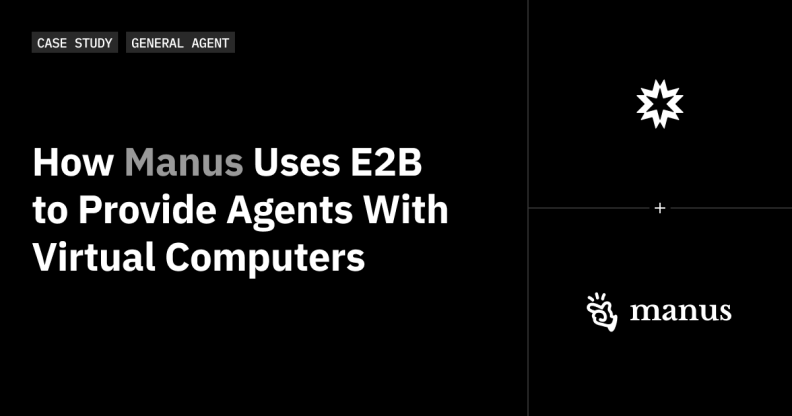
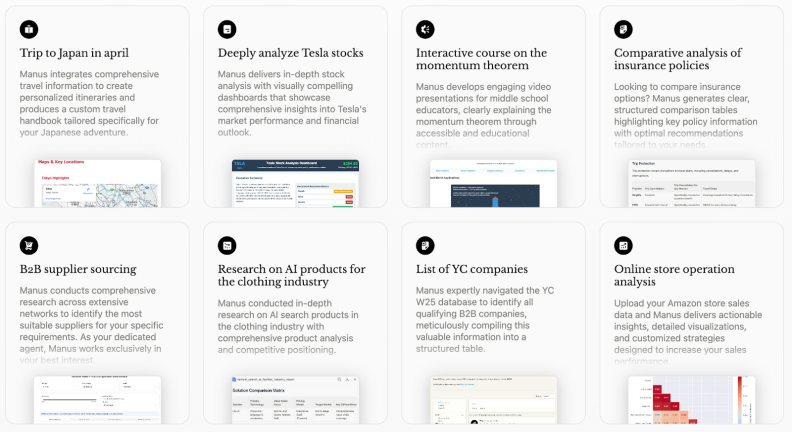
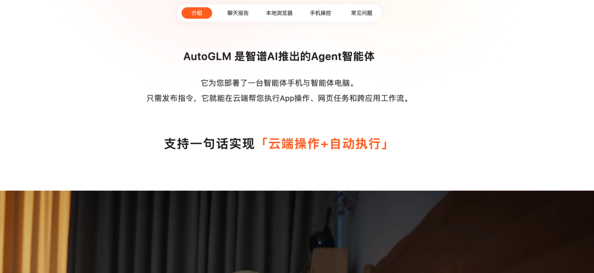
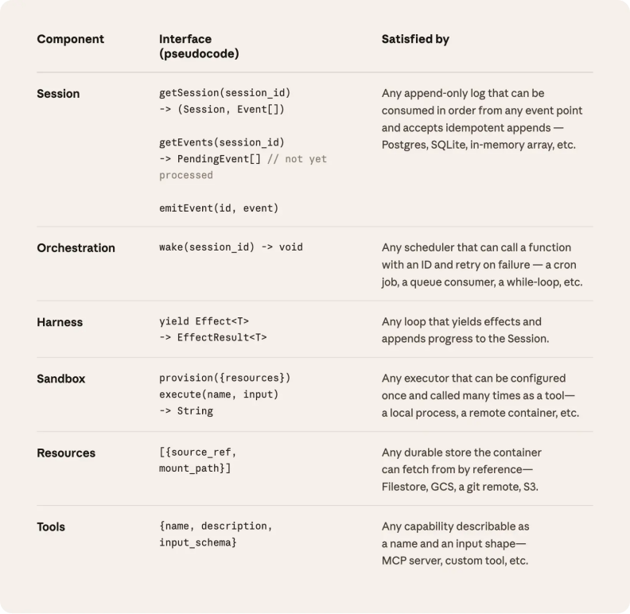
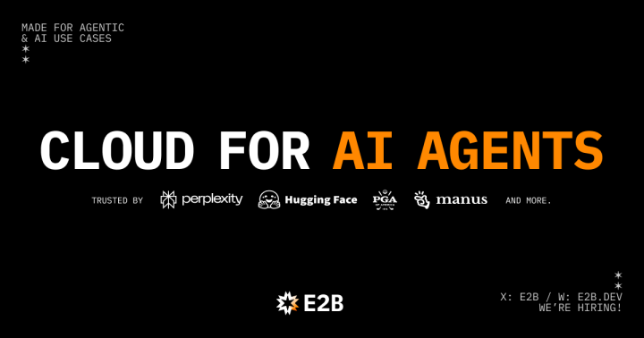
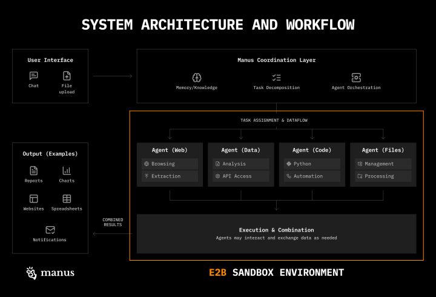
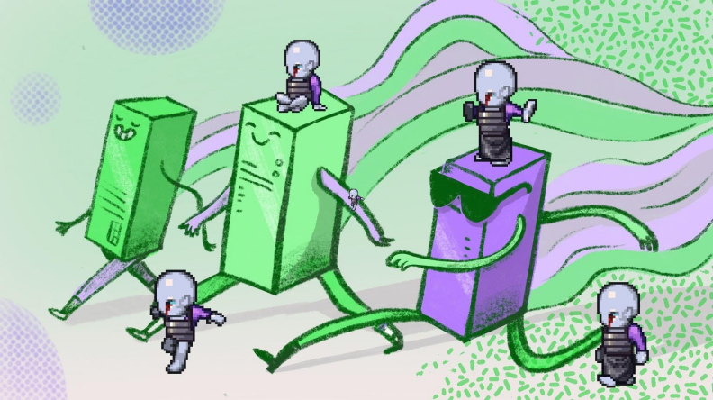
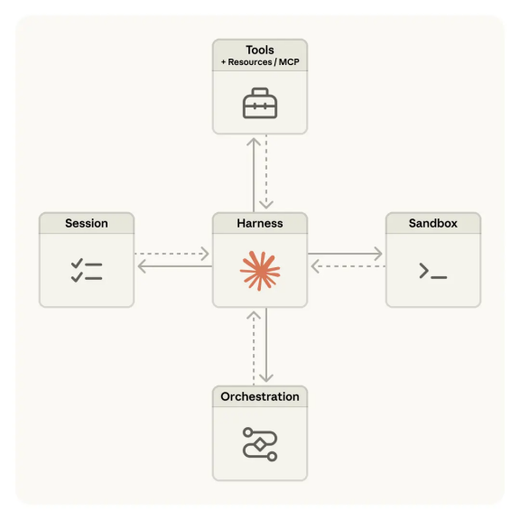
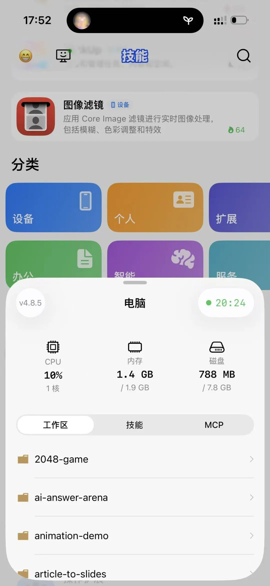

# 每个 Agent 都需要一台"电脑"——从 Anthropic Managed Agents 拆解沙箱赛道

Date: 2026-04-09  
Author: SimonAKing  
Categories: 微信公众号  
Tags: 微信公众号  
Source: https://simonaking.com/blog/agent-sandbox-anthropic-managed-agents/

> Context Window 就是 RAM，Filesystem 就是 Disk。所有重要的东西都应该写到磁盘上。 以 Manus 举例，Agent 在执行任务时会创建三个 markdown 文件：t

---
LLM 基础设施正在发生一个根本性的变化：文件系统成了 Agent 最重要的基础设施。

## 文件系统 = Agent 的工作记忆
Context Window 就是 RAM，Filesystem 就是 Disk。所有重要的东西都应该写到磁盘上。

以 Manus 举例，Agent 在执行任务时会创建三个 markdown 文件：task\_plan.md 记录目标和进度、notes.md 记录调研发现、再加一个结果。当上下文窗口填满时，Agent 不会丢失方向，因为它可以随时重新读 task\_plan.md，把目标重新拉回注意力范围。这解决了长任务中的「Lost in the Middle」问题。

有意思的是，三个完全独立的项目——Manus、Claude Code（CLAUDE.md + Skills 系统 + .claude/MEMORY.md）、OpenClaw ——不约而同地收敛到了同一个方案：**用 Markdown 文件做 Agent 记忆。**  

## 文件系统改变了 Agent 的三件事
**记忆（Memory）：**Agent 不需要专门的「记忆模块」或向量数据库。CLAUDE.md 就是项目级长期记忆，task\_plan.md 就是任务级工作记忆，.claude/MEMORY.md 就是自动捕获的经验积累。

当行业花了几百万美金建向量数据库和 RAG 时，真正跑通了的方案是几个 Markdown 文件。

**技能（Skills）：**Claude Code 的 Skills 系统就是文件——SKILL.md 按需加载到上下文里。40+ 个 Agent 工具现在支持同一套 Skills 规范。技能不是代码，是文件。

**上下文管理（Context Engineering）：**Manus 把完整的工具调用结果存到文件系统，上下文里只保留文件路径引用。需要时用 glob 和 grep 按需读取。这就是 Anthropic 说的「just-in-time context」——不把整个数据库塞进上下文，维护索引，需要时再读。

## 所以沙箱是什么？
说白了，**沙箱就是一个带文件系统的隔离执行环境。**没有文件系统，Agent 就没有状态、没有记忆、没有工作空间、没有技能加载机制。

上面说的所有东西——task\_plan.md、CLAUDE.md、Skills、上下文外部存储——全部依赖一个持久化的、可读写的文件系统。

这就是为什么沙箱是 2026 年 Agent 基础设施里最确定的赛道。

## 一、沙箱为什么重要：三个产品证明的事情
### 1.1 Manus：“云电脑”让 Agent 质变
Manus 不是一个单一的 LLM Agent，而是一个多 Agent 协调系统。Planner 分解任务，Executor 执行，Verifier 检查。但让它从“聊天机器人”变成“能干活的 Agent”的关键，是每个任务都会分配一台完整的云虚拟机。

这台“电脑”有文件系统、浏览器、终端、网络访问。Agent 可以在里面写代码、建网站、做数据分析、甚至建移动应用。

Manus 的联合创始人说：“Manus 不只是跑几行代码。它用 27 种不同的工具，需要 E2B 提供一台完整的虚拟电脑。”

▲ Manus 使用 E2B 为每个任务分配完整虚拟电脑（来源：E2B Blog）

E2B 自己的估算：如果 Manus 自建这套基础设施，需要 3-5 个全职 infra 工程师花好几个月。但 Manus 选择自托管 E2B，把所有精力放在多 Agent 编排上。信号很明确：**沙箱是基础设施，不是应该自建的东西**。

Manus 的 Wide Research 更进一步——把每个用户的可用算力放大 100 倍，让任何人都能通过聊天控制一个超算集群。

▲ Manus 多 Agent 架构：Planner 分解任务，Executor 在 E2B 沙箱中执行（来源：E2B Blog）

### 1.2 AutoGLM：比 Manus 更激进的“云手机 + 云电脑”
智谱的 AutoGLM 走了一条更激进的路。它不只是给 Agent 一个沙箱，而是直接给用户一台云手机和一台云电脑。

云手机装了 30 个 App（微博、小红书、淘宝、抖音…），云电脑是 Ubuntu + 浏览器 + LibreOffice。Agent 在这些环境里像人一样操作。

为什么要这么做？因为真实世界太不确定了。不同用户的微信版本不同、UI 布局不同、还有广告弹窗干扰。智谱的解法不是让模型更智能，而是**创建一个标准化的世界**。

技术路线很清楚：Agent 的能力上限由沙箱的完整性决定。你给 Agent 一个浏览器，它只能浏览。你给它一台完整的电脑，它能做任何图灵完备的事。

### 1.3 Claude Code：Agent 住进你的文件系统
Manus 给 Agent 一台独立的虚拟机，AutoGLM 给一台云手机。

Claude Code 做的事情更直接——**让 Agent 住进你已有的项目目录。**

这是「文件系统作为 LLM 基础设施」最纯粹的体现。Claude Code 不创建新环境，它直接操作你的代码库：读你的源文件理解架构、改你的代码修 bug、跑你的测试验证结果、看你的日志排查问题。CLAUDE.md 文件变成了 Agent 的长期记忆，项目目录结构变成了 Agent 的认知地图，git history 变成了 Agent 的经验积累。

说白了，Claude Code 证明了一件事：**文件系统不只是存储，它就是 Agent 的工作记忆和认知接口。**Agent 不需要专门的「记忆模块」——文件就是记忆。Agent 不需要专门的「知识库」——代码库本身就是知识库。

这跟 Karpathy 说的「LLM 知识库」是同一个方向。

而且 Claude Code 的 session 本身也是文件——JSONL 格式，存在 ~/.claude/projects/ 下面。单个 session 可以增长到 3GB+。整个 Agent 的状态、历史、上下文，全部活在文件系统里。

这就是为什么 Anthropic 在 Managed Agents 里把 session 从容器里抽出来做成独立的外部存储——因为这些文件太重要了，不能跟着容器一起销毁。

三个案例放在一起看就很清楚了。Manus 给 Agent 一台新电脑（独立文件系统），AutoGLM 给 Agent 一台标准化设备（受控文件系统），Claude Code 让 Agent 操作你的电脑（共享文件系统）。

**形态不同，但底层需求一样：Agent 需要一个能读写文件的持久化环境。**这就是沙箱。

### 二、产品案例深度拆解
### 2.1 Perplexity：从用户到自建
Perplexity 是 E2B 最重要的案例之一。每月 3.4 亿次搜索，用 E2B 为 Pro 用户做代码执行和数据可视化。从开始集成到上线只用了一周。但现在 Perplexity 已经在建自己的 Sandbox API——基于 K8s pod 隔离，每个 session 独立 pod。

Perplexity 的 Sandbox API 有一个很有意思的安全设计：沙箱没有直接网络访问。需要出站时，走外部代理，代理按域名匹配并注入凭据。沙箱内的代码永远接触不到 API key。**这和 Anthropic Managed Agents 的“凭据不进 sandbox”完全一样**。两家独立得出的相同结论。

这也说明一个趋势：大客户会从 E2B “毕业”，自建沙箱基础设施。这对 E2B 的商业模式是一个潜在威胁。

### 2.2 Hugging Face：沙箱做 RL 训练
Hugging Face 用 E2B 做 Open R1 的强化学习训练，同时拉起数百个沙箱。LMArena（最流行的 AI 模型评测榜）用 E2B 跑 Web-Arena 评估。Meta 用 Modal 做神经调试器 Code World Model，同时拉起数千个并发沙箱做 RL。

这揭示了沙箱的第二个大用活：**不只是运行时，还是训练时**。Agent 需要在沙箱里学习操作环境，就像 AutoGLM 的 ComputerRL。所以沙箱的用量会比光“执行任务”场景大得多。

### Devin（Cognition）：估值 $10.2B 的沙箱原住民
Devin 是最早把「Agent 在沙箱里工作」这件事做到极致的产品。每个 Devin 实例都在独立的沙箱环境里运行，配备 shell、代码编辑器、浏览器和持久化文件系统。Devin 2.0 更进一步——可以同时开多个并行实例，每个跑在独立的云端 IDE 里。这就是 Anthropic 说的「多脑多手」在产品层的体现。

**数据很硬：**ARR 从 2024 年 9 月的 $1M 飙到 2025 年 6 月的 $73M。收购 Windsurf 后合并 ARR 约 $150M。估值 $10.2B（2025.09 Founders Fund 领投 $400M Series C）。Goldman Sachs 在用，12000 名工程师旁边跑着一群 Devin。

**对沙箱赛道的意义：**Devin 证明了一件事——当你给 Agent 一台完整的「电脑」（shell + 编辑器 + 浏览器），而不只是一个代码补全接口，产品形态会完全不同。Devin 能做的事情（自动调试、跑测试、部署代码）和 Cursor/Copilot 那种补全工具完全不在一个维度。差别就在于有没有沙箱。

### Bolt.new（StackBlitz）：浏览器就是沙箱
Bolt.new 是沙箱赛道最戏剧性的故事。StackBlitz 花了 7 年做 WebContainers（在浏览器里跑完整 Node.js 环境），但到 2023 年底 ARR 只有 $80K，投资人下了最后通牒。然后 2024 年 6 月 Claude 3.5 Sonnet 发布，StackBlitz 把 AI 和 WebContainers 结合，做出了 Bolt.new。

**结果：**30 天从 $0 到 $4M ARR。6 个月到 $40M ARR。500 万用户。$700M 估值，$135M 融资。

**Bolt.new 的沙箱路线和其他所有玩家都不一样：**它不用云端 VM，不用 Firecracker，不用 Docker。沙箱就是你的浏览器。WebContainers 在浏览器 tab 里虚拟了一个 Linux 环境，跑 Node.js、npm、dev server，全部在客户端。启动是毫秒级，零网络往返，而且几乎没有服务器成本——因为算力在用户设备上。

这对成本结构的影响是颠覆性的。Lovable 用 Fly.io 跑云端沙箱，每个用户都要付服务器钱。Bolt.new 把计算推到客户端，能开免费层（100 万 token/月）还保持高利润率。CTO Albert Pai 说得直白：「大家以为我们有一个巨大的服务器农场，其实服务器就是你的浏览器。」

### OpenAI Codex：云端沙箱跑代码
OpenAI 的 Codex（2025 年发布的 coding agent，不是早期的代码补全模型）也是沙箱原住民。每个任务在独立的云端沙箱里执行，有完整的终端、文件系统和网络访问。和 Devin 的架构类似但定位不同——Codex 更侧重在现有 IDE 工作流里嵌入 Agent 能力，而不是做独立产品。

### Replit Agent：容器即产品
Replit 是最早把「在线 IDE + 容器化执行」做成产品的公司之一。Replit Agent 在独立容器里跑用户的代码，从生成到部署一条龙。他们的优势是容器基础设施成熟（自研 Nix-based 环境），但代价是每个容器都有服务器成本。和 Bolt.new 的客户端沙箱形成鲜明对比。

### Lovable：Vibe Coding 的代表，沙箱跑在 Fly.io 上
Lovable 是 vibe coding 赛道最火的产品之一——输入自然语言描述，直接生成带前端、后端、数据库、认证的完整应用。它的沙箱跑在 Fly.io 的云端容器上。这意味着每个用户的每次构建都要付服务器钱。和 Bolt.new 的客户端沙箱对比非常有意思：同样是 vibe coding，Bolt.new 把计算推到浏览器、服务器成本接近零；Lovable 用云端容器、成本和用户量正相关。两种沙箱路线，两种成本结构，两种商业模式。

### v0（Vercel）：用自家 Sandbox 吃自家狗粮
Vercel 的 v0 在 2026 年初从组件生成器进化成了全栈开发工具，加了 sandbox-based runtime——能导入 GitHub 仓库、拉 Vercel 环境变量、在沙箱里构建完整应用。用的就是 Vercel 自己的 Sandbox 产品（Firecracker microVM + Fluid 计算）。600 万开发者，$9.3B 估值。这是大厂用自己的沙箱基础设施做上层产品的典型案例。

### OpenHands（原 OpenDevin）：开源 Devin 替代品
68.6K GitHub Stars，$18.8M Series A。OpenHands 是最流行的开源自主 coding agent。每个任务跑在 Docker 沙箱里，有完整的文件编辑、终端、浏览器能力。SWE-bench Verified 上用 Claude 跑出 77.6% 的成绩。有意思的是他们的 V1 SDK 正在从「强制 Docker」转向「可选沙箱」，默认用 LocalWorkspace 降低使用门槛。这也是一种对 sandbox 需求的回应——不是每个任务都需要完整隔离。和 Anthropic 的「沙箱按需加载」异曲同工。

### Phoenix.new：Sprites 的标杆案例
Chris McCord（Phoenix 框架作者）在 Fly.io Sprites 上做了 Phoenix.new——Agent 生成 Phoenix 应用后，可以直接看到应用的运行日志。这在临时化沙箱里做不到。因为 Agent 写完代码后沙箱就销毁了，你看不到运行时的行为。持久化沙箱让 Agent 能利用应用的整个生命周期——不只是写代码，还包括看日志、调试、监控。Kurt Mackey 说这就是为什么「临时沙箱的时代结束了」。

### PPIO：中国的 Agent 沙箱基础设施
PPIO 是国内较早推出 Agent Sandbox 产品的云服务商，为 Agent 提供专门的云端运行环境。智谱 AutoGLM 的「云端执行」思路在国内正在被更多公司采纳。当 Agent 需要操作真实应用（外卖、打车、购物）时，标准化的云端环境比在用户手机上跑要可控得多。这可能是国内沙箱赛道的一个独特方向。

**划重点：**以上所有成功的 Agent 产品——Manus、AutoGLM、Devin、Bolt.new、Claude Code、Perplexity、Replit Agent——都有一个共同点：它们给 Agent 一个可以「动手」的环境。区别只在于这个环境是云端 microVM（E2B/Firecracker）、云端容器（Docker）、浏览器沙箱（WebContainers）、还是云手机/云电脑（AutoGLM）。但没有任何一个成功的 Agent 产品是「只动嘴不动手」的。沙箱不是可选项，是必要条件。

### 三、Anthropic Managed Agents：三个核心架构设计
### 3.1 推理层与执行层分离
Anthropic 最早和大多数人一样，把所有东西塞进一个容器。结果这个容器变成“宠物”——挂了 session 就没了，卡住了你得进去“救治”。

更要命的是客户想把 Claude 连到自己的 VPC，当 harness 和 sandbox 绑在一起时，网络边界成了大问题。

解法：把 Agent 拆成三个独立接口。Harness（编排循环，无状态）调用 Sandbox（执行环境）就像调用任何工具：

execute(name, input) → string

容器和 harness 都变成“运行环境”——挂了就换。效果：**p50 TTFT 降 60%，p95 降 90%+**。安全边界也重新划定——凭据永远不进 sandbox，Git token 在初始化时写入 remote，OAuth token 存在外部 vault。这是从架构上堵死。microsandbox 的“secret 不离开宿主机”异曲同工。

▲ 解耦后：Harness 从容器抽出，Session 独立存储，Sandbox 按需创建

### 3.2 沙箱按需加载
这是最容易被低估的设计。以前每个 session 都得等容器启动——clone 仓库、装依赖、拉事件——哪怕只是回答一个简单问题。解耦后，Claude 觉得需要执行代码时才通过 provision({resources}) 拉起容器。大多数 session 的 TTFT 不再受 sandbox 冷启动影响。

对沙箱服务商来说，**你的冷启动速度可能没你想的那么重要**。如果上层架构做得好，大多数请求根本不触发 sandbox。但反过来，当确实需要 sandbox 时，启动速度又很关键。这解释了为什么 Zeroboot 的 0.79ms 启动如此重要——如果沙箱能像函数调用一样快，Agent 可以在每个决策点 fork 一个新环境。

### 3.3 上下文动态召回：Session 不等于 Context Window
Anthropic 把 session log 从容器里抽出来，做成外部持久化的 append-only 事件流。关键接口：

getEvents() — 按位置选取事件流切片

emitEvent(id, event) — 写入新事件

这解决了三个问题。第一，容器挂了不丢数据。第二，context window 和历史记录解耦——全量保存、按需召回，拿回来还能在 harness 里做任意变换。第三，harness 升级不影响历史数据。

为什么“存储”和“管理”分开很关键？Anthropicn 明确说了：“我们无法预测未来模型需要什么样的 context engineering”。他们举了真实例子：Sonnet 4.5 有 context anxiety，必须用 context reset。同样的 harness 放在 Opus 4.5 上，行为消失了。Reset 变成死代码。

## 四、主要玩家深度分析
### 4.1 E2B：跑在最前面，但后面追得很紧

▲ E2B：为 AI Agent 提供云端沙箱执行环境（来源：E2B）

**优势：**2亿+ sandbox，88% Fortune 100，客户包括 Manus、Perplexity、Hugging Face、Groq。开源核心。自托管可选。

**商业模式：**按秒计费 + $150/月 Pro。这个定价让小用户痛苦。服务 Manus 这样的大客户时又被 beta storage 和 24h 限制卡住。

**战略动向：**正往“开源沙箱协议”方向发展。计划加 Secrets Vault、监控、多沙箱管控台。这和 Anthropic 的 meta-harness 思路一致——标准化接口、开源生态。E2B sandbox 月创建量一年内从 4万增长到 1500万，375 倍。

▲ E2B 沙箱创建量增长趋势（来源：E2B）

**风险：**Pause/Resume 在 beta，有已知数据丢失 bug。无真正 SSH。ARR 只有 $1.5M（截至 2025.06），和融资量不成比例。

### 4.2 Daytona：增速最猛的挑战者
**优势：**2025 年从开发环境转型。<90ms 冷启动。支持 fork/snapshot/Computer Use。客户包括 LangChain、Turing、Writer。

**商业模式：**3 个月 $1M ARR，6 周翻倍。$24M Series A 由 FirstMark 领投（投过 Airbnb/Pinterest/Discord），Datadog 和 Figma Ventures 战投。

**风险：**默认 Docker 隔离，弱于 microVM。仅一个区域、20 人团队。Apache 2.0 开源是大优势。

### 4.3 Fly.io Sprites：持久化派的实践者
**优势：**持久化 Firecracker VM。100GB Tigris-backed 存储、30秒 auto-sleep。预装 Claude Code。社区调研结论：比 Machines 方案减少 60-70% 自定义代码。cgroup 实测计费。4h Claude Code session 约 $0.44。

▲ Fly.io Sprites：持久化 Firecracker microVM，闲置自动休眠（来源：Fly.io Blog）

**风险：**2026.01 才发布。无 SLA。不能选区域。闭源。

### 4.4 Modal：AI 基础设施平台，沙箱只是其中一块
**优势：**ARR $50M，估值冲 $2.5B。Meta 用它跑 reinforcement learning，Scale AI 用它做 MCP server。serverless GPU 原生支持。Python SDK 体验极佳。$30/月免费额度。

**风险：**gVisor 隔离弱于 microVM。24h sandbox 生命周期。无 BYOC。不会为沙箱专门优化。

### 4.5 新兴玩家速览
**Zeroboot：**0.79ms 启动，比 E2B 快 190倍。如果成熟，沙箱会像函数调用一样廉价。

**microsandbox (YC X26)：**本地优先 microVM + 网络层 secret 注入。专为 claude --dangerously-skip-permissions 安全执行设计。

**Vercel Sandbox：**Firecracker + Fluid 计算，I/O 等待不计费，bursty 工作负载降 95% 成本。但 session 限 5h。

**Google Agent Sandbox：**开源，K8s 原生。适合已有 K8s 的团队。

**Alibaba OpenSandbox：**协议驱动、多语言 SDK。开源 K8s 规模化方案。

## 五、结语：从“沙箱”到“Agent OS”
回头看整个赛道，最有意思的不是哪家沙箱服务更快、更便宜，而是整个行业正在从“沙箱”向“Agent OS”演进。

E2B 说自己要做“沙箱界的 HTTP 协议”。Anthropic 用 session/harness/sandbox 三个抽象做了类似操作系统的事。Manus 给每个任务一台“完整的个人电脑”。AutoGLM 给每个用户一台“云手机”。Sprites 的口号是“可一秒召唤的持久式电脑”。Daytona 叫自己“可编程的可组合计算机”。

▲ Managed Agents 架构概览：Session / Harness / Sandbox 三层虚拟化

**所有人都在说同一件事：Agent 需要一台电脑**。区别只在于这台电脑是临时的还是持久的、是台式机还是手机、是开源还是闭源、是单用户还是多用户。

而 Anthropic 的 Managed Agents 架构给出了最清晰的答案：**不要针对具体的电脑编程，要针对“能使用任何电脑”的接口编程**。execute(name, input) → string。底下是什么，以后再说。

最后聊聊我们自己在做的事。

Mana 的定位是 Vibe iPhone——用自然语言创建原生 iPhone 应用、系统扩展，

我们的架构从一开始就是基于 computer 的。我们的 Agent 需要一台「电脑」来帮用户生成、测试、部署应用。  

每个用户任务分配独立的执行环境，Agent 在里面跑代码、装依赖、构建应用。我们经历了这篇报告里描述的所有问题：容器变成宠物、session 和 sandbox 耦合、冷启动拖慢体验。

我的判断：沙箱赛道的终局不是某一家赢，而是像 Anthropic 说的那样——接口标准化，实现可替换。今天我们跑在 E2B 上，明天可能换成 Sprites 或者别的什么。只要 execute(name, input) → string 这个接口不变，上层的 Agent 逻辑就不用动。这就是为什么我们从一开始就把执行环境藏在接口后面。

如果你也在做 Agent 产品，或者对 Vibe iPhone 这个方向感兴趣，欢迎大家留言讨论，分享你的观点！

觉得内容不错的朋友能够帮忙右下角点个赞，分享一下。你的每次分享，都是在激励我不断产出更好的内容。

---
> 本文同步自微信公众号，[点击查看原文](https://mp.weixin.qq.com/s/gy94q-5_xqwp7F1evZvr1g)
