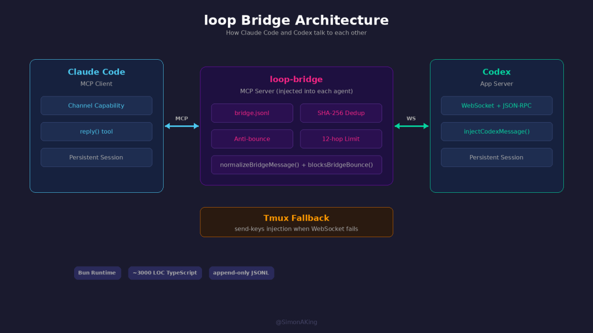
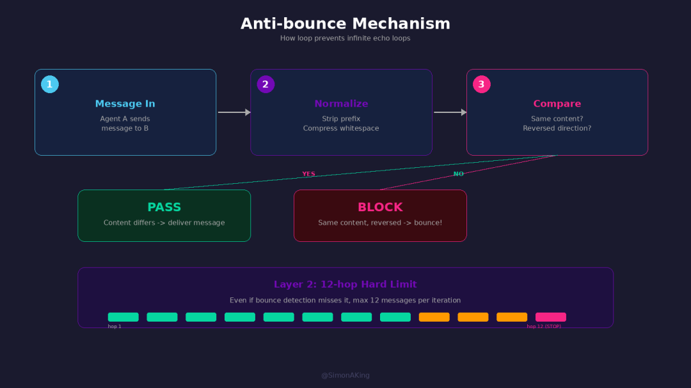
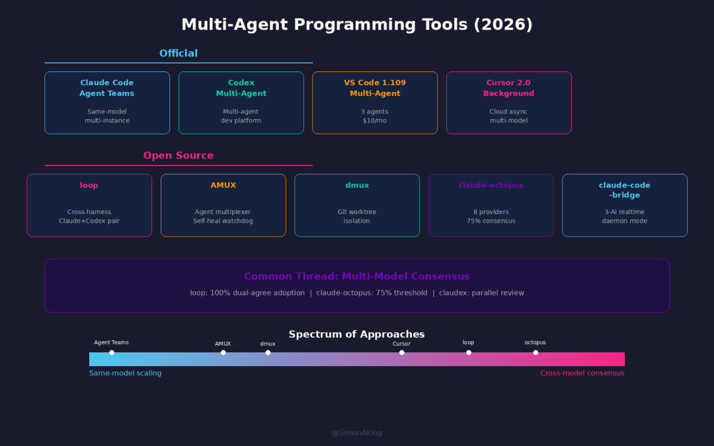
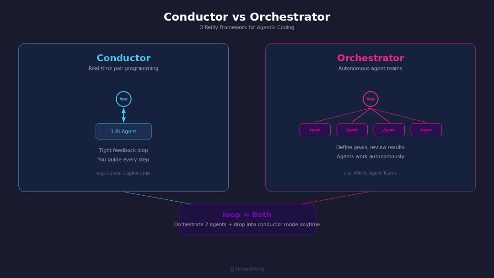

# AI Coding 的下一步：不是谁更强，是怎么组队

Date: 2026-03-27  
Author: SimonAKing  
Categories: 微信公众号  
Tags: 微信公众号  
Source: https://simonaking.com/blog/ai-coding-multi-agent/

> 试想一下这个画面： 左边终端跑着 Claude Code 在写代码，右边终端跑着 Codex 在 review，中间有个 bridge 让它们直接对话。你坐在后面，看它们讨论你的代码该怎么改。 这不是

---
## 一、两个 AI 在终端里吵架

左边终端跑着 Claude Code 在写代码，右边终端跑着 Codex 在 review，中间有个 bridge 让它们直接对话。你坐在后面，看它们讨论你的代码该怎么改。

这不是科幻，是一个叫 loop 的开源 CLI 工具正在做的事。作者 Axel Delafosse 在实际使用中发现了一个出乎意料的规律：当两个 AI 独立给出相同的 code review 意见时，团队采纳率是 100%。

不是因为 AI 永远对。而是两个完全不同的模型——不同架构、不同训练数据——看同一段代码得出同一个结论，这种共识的可信度远超任何单个模型的 confidence score。

模型多样性 > 模型能力。这个 insight 可能比工具本身更值钱。

## 二、拆解 loop：两个 AI 到底怎么对话的

loop 的核心问题很简单：Claude Code 和 Codex 是两个完全独立的进程，没有共享内存，没有公共 API。怎么让它们对话？

Bridge：一个 MCP 传话筒

loop 给每个 agent 注入了一个 MCP Server，叫 loop-bridge。Claude 说的话通过 bridge 转成 Codex 能理解的格式推过去，反过来也一样。有点像两个说不同方言的人，中间站了个翻译。

具体来说，Claude 这边利用了 Claude Channel 能力——Codex 的消息以 channel notification 的形式推给 Claude，Claude 用 reply tool 回复。Codex 这边走的是 App Server 模式，通过 WebSocket 和 JSON-RPC 通信，loop 直接往 Codex 的 thread 里注入消息。

消息存储：朴素但有效

消息持久化用的是最朴素的方案：一个 bridge.jsonl 文件，append-only，一行一条消息。每条消息用 SHA-256(发送方>接收方 + 消息内容) 生成签名，防止重复投递。

为什么不用数据库？因为 loop 的设计哲学是尽量轻量。3000 行 TypeScript，Bun 运行时，一个 jsonl 文件。够用就行。

Anti-bounce：防止无限互夸

两个 AI 对话真的会陷入循环。Claude 说“这里有个 race condition”，Codex 说“对，确实有 race condition”，Claude 再说“没错，我也发现了”——无限复读。

loop 的解法分两层。第一层是 bounce 检测：每次发消息前，检查对方最近一条已送达的消息。如果内容 normalize 后一样（去前缀、压缩空白），而且方向刚好反转（A→B 的内容和 B→A 一样），直接拦截。

不过这个 normalize 只做了文本层面的比较，差一两个字就能绕过。所以还有第二层兜底：12-hop 上限。每轮 bridge 最多传递 12 条消息，到了就强制停下来进入下一个 iteration。

一层拦复读，一层拦话痨。不完美，但在 3000 行代码的约束下，够用。

Paired Loop 工作流

完整流程是这样的：两个 agent 同时启动持久 session，主 agent（默认 Codex）接到任务开始写代码，每轮结束后 drain bridge 消息（最多 12 hop），检测到 done signal 后进入 review 阶段。

review 有个巧妙的设计：claudex 模式下，Claude 和 Codex 并行 review，两份 review 结果同时交给主 agent。如果两个 reviewer 指出同一个问题，主 agent 会优先修复——这就是 100% 采纳率的来源。两个都 PASS 后，自动创建 Draft PR。

Tmux Fallback

还有个有趣的工程细节：如果 WebSocket 通道不通，loop 会 fallback 到往 tmux pane 里直接 send-keys——本质上就是模拟人在终端里打字。简单粗暴，但确保通信不断。

## 三、不止 loop：Multi-Agent 编程工具全景

loop 不是孤例。2026 年上半年，Multi-Agent 编程工具正在集体爆发。

1\. 官方能力：三巨头的 Multi-Agent 布局

Claude Code Agent Teams

Anthropic 的官方方案。一个 Claude Code session 当 team lead，分配任务给多个 sub-agent，协调工作并汇总结果。每个 sub-agent 是独立的 Claude Code 实例，有自己的上下文和工具权限。

跟 loop 的区别：Agent Teams 是同一模型的多实例协作，loop 是不同模型的跨 harness 协作。前者解决的是“一个人干不完”，后者解决的是“一个人看不全”。

Codex Multi-Agent

OpenAI 的方案。Codex 从一个 coding agent 进化成了 multi-agent 开发平台，多个 agent 可以并行处理不同任务。架构上更偏向长时间运行的工作流和编排。

VS Code Multi-Agent (1.109)

微软在 2026 年 1 月发布的 VS Code 1.109 直接支持 Claude、Codex 和 Copilot 三个 agent 并排运行，Agent Sessions 面板统一管理所有 agent session——本地的、后台的、云端的。一个 $10/月的订阅跑三个 agent。

Cursor Background Agent

Cursor 2.0 引入了 Background Agent，可以把任务交给云端 agent 异步执行。同时支持在 session 中切换模型（GPT-5.3-Codex、Claude Sonnet 4.5、Gemini 3 Pro 等），本质上也是 multi-model 协作。

2\. 开源社区：百花齐放

AMUX — Agent 多路复用器

开源的 Claude Code agent 多路复用器，可以同时跑几十个 agent，每个在独立的 tmux pane 里。附带 Web dashboard 实时查看每个终端的状态。最狠的功能是自愈 watchdog：当 agent 的上下文使用率低于 20% 时自动 compact，防止 context window 爆掉。还有 SQLite 看板防止多个 agent 重复做同一件事。

github.com/mixpeek/amux

dmux — Dev Agent Multiplexer

另一个开源 agent 多路复用器，核心区别是每个 agent 跑在独立的 git worktree 里，天然避免文件冲突。适合把一个大任务拆成多个独立子任务并行处理。

dmux.dev

claude-octopus — 八爪鱼编排器

Claude Code 的多 LLM 编排插件，同时调度 8 个 provider（Codex、Gemini、Perplexity、OpenRouter、Copilot、Qwen、Ollama），47 个命令，50 个 skill。最有意思的是 75% 共识门槛——只有 75% 以上的模型同意，变更才能进入生产。跟 loop 的 100% 采纳率是同一个思路：用多模型共识替代单模型信心。

github.com/nyldn/claude-octopus

claude-code-bridge — 跨 AI 编排

让 Claude、Codex 和 Gemini 实时协作，支持持久上下文和 daemon 模式（空闲 60 秒自动关闭节省资源）。Codex 可以把子任务委派给 OpenCode agent 执行。

github.com/bfly123/claude\_code\_bridge

Pair Programmer by VideoDB — 感知增强

完全不同的思路。它不是让多个 AI 互相对话，而是给 AI 装上“眼睛和耳朵”——实时录制你的屏幕、麦克风和系统音频，AI 可以用自然语言搜索“我刚才提到 auth bug 的时候在看什么文件？”。减少人和 AI 之间的信息断层。

github.com/video-db/pair-programmer 

## 四、从 Conductor 到 Orchestrator

O’Reilly 最近发了一篇文章叫 Conductors to Orchestrators: The Future of Agentic Coding，提出了一个很有用的框架来理解这些工具的区别：

Conductor（指挥）：你和一个 AI 紧密配合，实时指导它的每一步。像 Cursor 的交互模式——你写 prompt，AI 改代码，你看结果，再调整。你全程在 loop 里。

Orchestrator（编排）：你定义高层目标和任务分解，多个 AI agent 自主执行。你不关心每一行代码怎么写，只关心最终结果是否正确。像 AMUX 同时跑十几个 agent，你只管 review 和 merge。

loop 有意思的地方在于它处在两者之间——它是 orchestrator（编排两个 agent 协作），但你随时可以切换成 conductor（在 tmux 里直接跟任何一个 agent 对话）。这种灵活性可能是当前阶段最实用的形态。

开发者的角色正在从 implementer 变成 manager。问题从“怎么写这段代码”变成了“怎么让正确的代码被写出来”。微妙但深刻的变化。

## 五、Agentmaxxing：极限在哪？

社区里出现了一个新词：Agentmaxxing——尽可能多地并行跑 AI coding agent，每个处理不同任务，你只负责 review 和 merge。

实践中的上限大概是 5-7 个并发 agent。超过这个数，rate limit、merge conflict 和 review 瓶颈会把收益吃掉。你能同时跑 20 个 agent，但你没法同时 review 20 个 PR。

这揭示了一个更根本的问题：Multi-Agent 编程的瓶颈不在 agent 端，在人端。agent 可以无限扩展，但人类的注意力带宽是固定的。

解法可能在两个方向：

方向一：agent 自审。loop 的 claudex review 就是这个思路——让 agent 互相审查，只把共识性的问题提交给人类。降低人类需要处理的信息量。

方向二：更好的 dashboard。AMUX 的 Web dashboard、VS Code 的 Agent Sessions 面板都在尝试——把多个 agent 的状态压缩成人类能快速扫描的信息密度。

## 六、趋势判断

1\. Multi-Harness 是确定的方向

越来越多人同时跑 Claude Code + Codex + Cursor + Gemini CLI，不是为了对比谁更好，而是因为不同模型有不同的盲区。这个趋势会继续加速。agent harness 之间的互操作（loop 在做的事）会成为刚需。

2\. 共识机制会越来越重要

loop 的 100% 采纳率、claude-octopus 的 75% 共识门槛、claudex 并行 review——都指向同一个方向：多模型投票比单模型判断更可靠。未来可能会出现标准化的“AI 共识协议”。

3\. Agent 通信需要标准

现在每个工具都在造自己的 bridge/通信方案。loop 用 MCP + jsonl，claude-code-bridge 用 daemon，claude-octopus 用自己的路由。缺一个标准协议。MCP 是最有希望的候选，但目前还不够。

4\. 人的角色在变，但没有消失

从写代码到指挥 AI 写代码，再到管理 AI 团队。工作形态在变，但“理解需求、做决策、判断质量”这些核心能力反而更重要了。Agentmaxxing 的上限不在 agent 数量，在人的判断力带宽。

最后打个广告：

目前我们正在全力打造 Mana——一个让每个人用自然语言创造 iPhone 原生应用的平台。

文章里聊的是 AI 怎么给开发者组队编程。但我们想再往前走一步——99.9% 的人口袋里都有一部 iPhone，却只能用别人做的 App。如果你用自然语言描述想法，AI 直接生成可运行的原生应用呢？

Mana 内置 115 个原生 iOS Skill（相机、传感器、健康数据、推送通知、AI、地图……），支持 Phaser/Pixi.js/Three.js 游戏引擎，还有和文中产品一样的 **Remix 机制**——看到别人做的好 App，一键 Fork 改造成自己的版本。

**把 iPhone 变成每个人的 Vibe Phone**——这才是真正的技术平权。

目前团队正在全力打磨中，预计接下来两周开启内测，敬请期待: seedos

---
> 本文同步自微信公众号，[点击查看原文](https://mp.weixin.qq.com/s/Ih4VeGji8CYuUFvBIzV6lQ)
