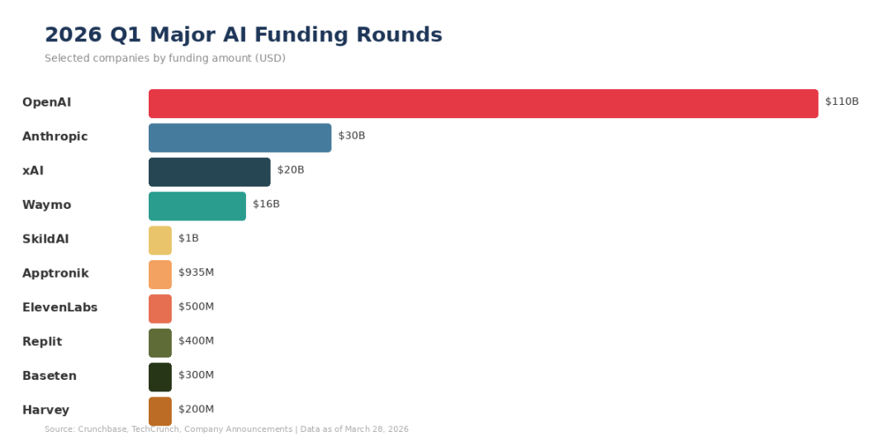
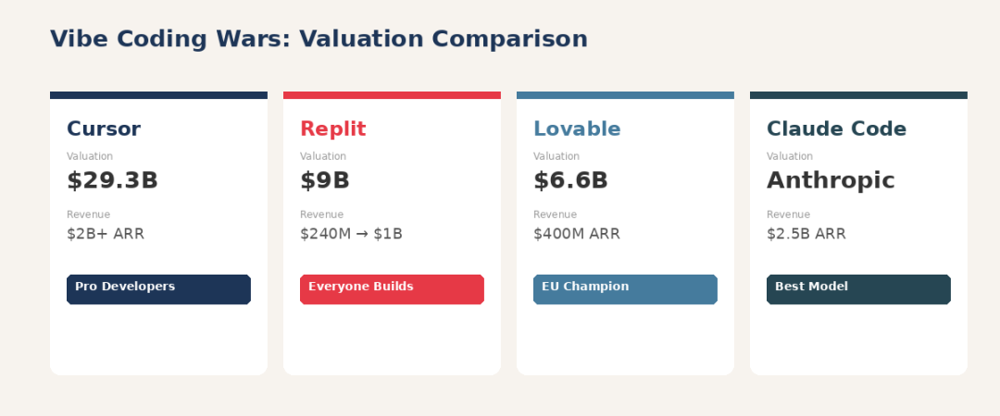
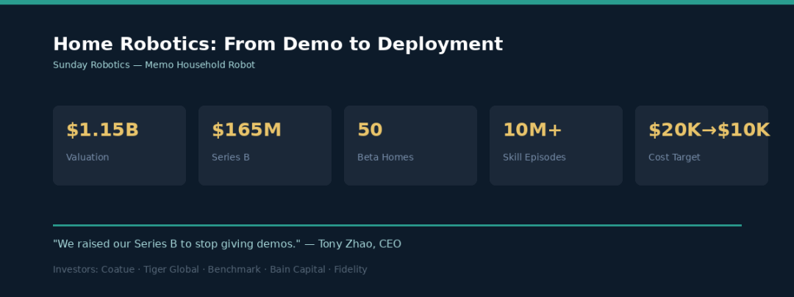
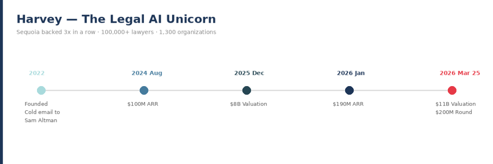
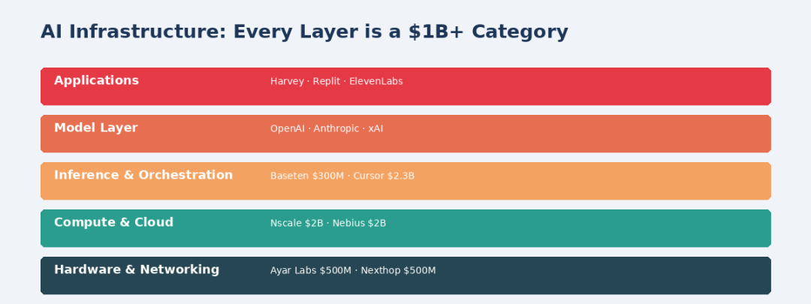

# 2026 年 Q1，AI 融资彻底疯了：1890 亿美元单月纪录背后的五大最热赛道

Date: 2026-03-28  
Author: SimonAKing  
Categories: 微信公众号  
Tags: 微信公众号  
Source: https://simonaking.com/blog/ai-funding-2026-q1/

> OpenAI 单轮融1100亿，Anthtropic 融300亿，家务机器人都成独角兽了——创业者还有机会吗？2026年3月28日 · 阅读约15分钟 · AI产业深度如果你觉得2025年的AI融资已

---
2026年3月28日 ·  阅读约15分钟  ·  AI产业深度

如果你觉得2025年的AI融资已经够夸张了，那2026年第一季度会彻底刷新你的认知。

2026年2月，全球创业公司融资总额达到1890亿美元——这是有史以来单月最高纪录。更疯狂的是，其中**83%的资金**仅流向了三家公司：OpenAI（1100亿）、Anthropic（300亿）和Waymo（160亿）。AI相关创业公司吸走了当月90%的全球风投资金。

这些数字背后，不仅仅是头部公司的军备竞赛。真正有意思的是，在巨头们疯狂吸金的同时，一批垂直赛道的新玩家正在以惊人速度崛起——做“vibe coding”的Replit六个月估值翻三倍到90亿美元，做家务机器人的Sunday刚成立就成了独角兽，法律AI公司Harvey三天前刚拿到110亿美元估值。

我深入研究了2026年Q1最值得关注的融资动态，发现了五条清晰的赛道主线。每一条都代表着AI从“技术概念”到“真实商业价值”的跨越。

## 先看全景：2026年AI融资的几个关键数据

AI创业公司在2024年拿走了全球41%的风投资金，这个比例在2026年2月飙升到了90%。这不是泡沫那么简单——背后的逻辑是：AI创业公司融的钱更多，但团队人数并没有暴增，因为AI模型的运行成本本身就极高，资金主要流向了算力和基础设施。

**“***融资轮次变少了，但每轮的金额在增大。更少的押注，但每注更重。AI创业公司融更多的钱，不是因为员工多——而是因为运行AI模型的成本就是高。***”**

— Peter Walker, Carta数据分析主管

| **关键信号**2023-2024年成立的基金，IRR（内部收益率）表现是过去十年最好的。这说明AI浪潮中的早期投资确实在创造回报——至少在纸面上。但也有分析师提醒，很多回报来自后续轮次的估值抬升，最终能否通过IPO或收购变现，还是未知数。 |
| --- |

**①** **Vibe Coding：软件开发的“iPhone时刻”**

如果2025年有一个词定义了AI应用层的爆发，那就是**Vibe Coding**——用自然语言描述需求，AI自动生成完整的应用程序。2026年，这个赛道正式进入了“赢者通吃”的阶段。

**Replit**的故事之所以引人注目，不仅仅是因为增速——而是它代表了一个根本性的转变：软件开发的门槛正在从“会写代码”变成“会说话”。创始人Amjad Masad来自约旦，6岁开始编程。Replit从一个“浏览器里的代码编辑器”起步，花了9年时间，在Vibe Coding浪潮中一飞冲天。2025年全年收入2.4亿美元，目标2026年底达到10亿。85%的世界500强企业员工在使用。

| **公司** | **估值** | **年化收入** | **定位差异** |
| --- | --- | --- | --- |
| Cursor (Anysphere) | $293亿 | $20亿+ | 专业开发者工具 |
| Replit | $90亿 | $2.4亿→冲刺$10亿 | 全民造软件平台 |
| Lovable | $66亿 | $4亿 ARR | 欧洲最强Vibe Coding |
| Claude Code | Anthropic旗下 | $25亿（年化） | 最强编码模型能力 |

有一个让我印象深刻的细节：Replit的CEO Amjad在两年前邀请Y Combinator创始人Paul Graham到家里看产品演示。当Graham本能地想看生成的代码时，Amjad告诉他不需要看——编程以后用英语就好了。Graham后来回忆说这个体验是“颠覆认知的”。

| **⚠️ 另一面：Reddit上的真实声音**不要被融资数字迷惑。Reddit上最热门的帖子标题是“Vibe Coding in 2026 is a Complete Scam”。有用户一个月在Replit上花了700美元，一年花了12000美元。另一位用户的吐槽很有代表性：“我花了半天让AI修它自己搞坏的东西，它说修好了但其实没有，然后又搞坏了。”Vibe Coding的质量天花板是否能撑起这些估值，是这个赛道最大的悬念。 |
| --- |

**②** **家用人形机器人：从Demo到真正进家门**

2026年，机器人赛道正式进入了“超级轮次时代”。仅仅在三月的第二周，Mind Robotics（5亿）、Rhoda AI（4.5亿）、Sunday（1.65亿）和Oxa（1.03亿）就合计融了超过12亿美元。加上年初SkildAI的14亿和Apptronik的9.35亿，2026年机器人融资有望突破200亿美元。

但最让我兴奇的，是一家要把机器人送进你家洗碗的公司。

**Sunday Robotics**的CEO Tony Zhao说了一句话让我印象很深：“我们融B轮的目的是停止做Demo。”这句话精准地击中了机器人行业的痛点——过去几十年，家用机器人一直停留在实验室演示阶段。

Sunday的差异化在于三点。第一，它选择了**轮式底盘**而非双足行走——稳定性和安全性远高于人形设计。第二，它发明了**“技能捕获手套”**，寄给了上千名志愿者，让他们在自己家里录制真实的家务操作数据。这些来自500+真实家庭的1000万条家务“情节”训练了Memo的基础模型。第三，成本控制——目前手工制造一台约2万美元，目标零售价控制在1万美元以下。

**“***消费者不要硬件，也不要软件——他们要的是一个能解决问题的完整系统。Sunday的整合方法跳过了一次性遥控演示阶段，进入了机器人真正服务人类的世界。***”**

— Aaref Hilaly，Bain Capital Ventures合伙人

这里面最有趣的商业逻辑是：**数据飞轮**。每一个Beta家庭都是数据贡献者，Memo在你家干活的同时也在学习你家的环境。越多家庭使用→越多数据→越强的模型→越好的体验→越多家庭使用。这和特斯拉FSD的逻辑几乎一模一样。

**③** **垂直行业AI：法律赛道跑出110亿美元公司**

当很多人还在争论“AI应用层到底有没有护城河”的时候，Harvey用数字给出了答案。

**Harvey**三天前（3月25日）刚宣布的这轮融资，我认为是2026年最有信号意义的融资事件之一。因为它证明了一个关键命题：在OpenAI和Anthtropic合计估值超过万亿美元的时代，**垂直应用层不仅能活下来，还能活得非常好**。

CEO Winston Weinberg是前律师，CTO Gabe Pereyra是前Google DeepMind和Meta的研究科学家。2022年公司创立的起点是一封发给Sam Altman的冷邮件。现在服务1300+组织，客户包括HSBC和NBC环球，平台上已构建25000+个定制AI Agent。Sequoia连续领投三轮——这种级别的连续押注极为罕见。

**“***他们为‘AI原生应用公司’写教科书，就像当年Salesforce为‘云原生应用’写教科书一样。***”**

— Pat Grady，Sequoia合伙人

| **给创业者的启示**Harvey的成功路径不是去和OpenAI竞争基础模型，而是在一个监管密集、知识壁垒极高、工作流程极其复杂的行业里，把通用AI能力“翻译”成专业人士真正能用的工具。法律、医疗、金融合规、税务——这些领域都有类似的机会。 |
| --- |

**④** **AI基础设施：每一层都在诞生十亿美元公司**

2026年的一个显著趋势是：AI数据中心的**每一个组件——从芯片到网络到存储到编排——都在成为独立的十亿美元投资品类**。

| **公司** | **领域** | **融资金额** | **关键词** |
| --- | --- | --- | --- |
| Nscale | AI数据中心 | $20亿 | 欧洲最大AI基础设施 |
| Nebius | 新型云平台 | $20亿 | Nvidia投资的“新云” |
| Ayar Labs | 光子芯片 | $5亿 | 用光代替电传数据 |
| Nexthop AI | AI网络 | $5亿 | 数据中心内部网络革命 |
| ElevenLabs | 语音AI | $5亿 | 估值翻三倍至$110亿 |
| Baseten | AI推理平台 | $3亿 | 模型推理基础设施 |

这里面最值得关注的趋势是**“Neocloud”（新型云）**的崛起。传统的AWS/Azure/GCP虽然强大，但AI工作负载对GPU集群的需求催生了一批专门为AI训练和推理优化的新型云平台。Nebius拿到Nvidia的20亿美元投资，Nscale在欧洲建设最大的AI数据中心集群——这些都是与传统云巨头平行发展的新物种。

另一个让我惊讶的是**ElevenLabs**——一家语音AI公司，D轮融5亿美元，估值从33亿翻到110亿美元。Sequoia领投，a16z四倍加注。他们的技术能在29种语言中生成几乎无法分辨的人类语音。当语音AI开始成为企业基础设施时，它的价值空间就打开了。

**⑤** **模型层巨头混战：万亿估值俱乐部**

最后，不能不提房间里的大象。2026年2月发生了私募科技史上最戏剧性的一周：

| **公司** | **融资金额** | **投后估值** | **关键信息** |
| --- | --- | --- | --- |
| OpenAI | $1100亿 | $8400亿 | Amazon $500亿、Nvidia/SoftBank各$300亿 |
| Anthropic | $300亿 | $3800亿 | 年化收入$140亿，Claude Code $25亿 ARR |
| xAI | 与SpaceX合并 | ~$1.25万亿 | 计划2026年6月IPO |

这些数字已经超出了大多数人的认知范围。但真正的信号不在于这些头部公司能融多少钱，而在于它们的**收入增速**。Anthropic的年化收入从零到140亿美元，被称为“企业软件史上最快的收入爬坡”。Claude Code单个产品的年化收入就达到25亿美元。当一个产品能在半年内达到25亿美元年化收入时，这不是泡沫的节奏，这是一个新时代的节奏。

## 对创业者的启示：在巨头的阴影下，机会在哪里？
看完这些数字，很容易产生两种极端反应：要么觉得“一切都被头部垄断了，没机会了”，要么觉得“钱这么多，随便做个AI产品就能融资”。我认为现实在两者之间，有几个关键判断：

**第一，垂直深度 > 水平广度。**Harvey的故事证明，在一个足够深的垂直行业里，把通用AI能力转化为专业工作流，是完全可以建立壁垒的。法律、医疗、金融合规、建筑工程——这些领域的AI机会远未被充分开发。

**第二，数据才是护城河。**在AI时代，代码可以被生成，模型可以被调用，但特定场景下积累的高质量数据是难以复制的。Sunday的家务数据飞轮、Harvey的法律工作流数据、Dash0的生产环境数据——都是同一个逻辑。

**第三，速度就是一切。**Replit六个月估值翻三倍，Harvey四个月估值从80亿到110亿，Sunday刚出隐身模式就成了独角兽。在这个市场里，“完美的产品”远不如“足够好但更快”。

**第四，要诚实面对质量问题。**Vibe Coding的Reddit吐槽、机器人的实际可靠性挑战、法律AI的准确性风险——这些都是真实的。融资狂潮不等于产品已经成熟，最终决定谁能活下来的，是用户是否真的愿意付费续约。

| **⚠️ 冷思考：83%的资金流向三家公司**当一个月90%的风投资金流向AI，83%的AI资金流向三家公司时，这究竟是市场的理性配置，还是资本的路径依赖？没有护城河（专有数据、垂直深度或切换成本）的中间层AI创业公司，正在面临越来越大的压力。 |
| --- |

2026年Q1的AI融资图谱，本质上讲述了一个分化的故事：头部通吃vs垂直深耕，速度至上vs质量壁垒，平台野心vs专精价值。无论你是创业者、投资人还是从业者，理解这个格局的关键不在于记住这些天文数字，而在于看清数字背后的结构性力量。

AI的淘金热还在加速。但最终挖到金子的，不一定是买铲子最多的人，而是**知道在哪里挖的人**。

**\- END -**

数据来源：TechCrunch, Crunchbase, CNBC, Bloomberg, 公司官方公告

数据截至2026年3月28日

| 我是 Simon（**@simon\_aking**），前字节跳动 AI 工程师。说实话，研究这些产品的过程中，我有一种很强烈的共鸣感。文章里写的每一个趋势——Vibe Coding 让非程序员造软件、垂直场景的数据飞轮、速度决定生死——都和我自己正在做的事情直接相关。Replit 在解决的问题是：让每个人都能造 Web App。Spielwerk 让每个人都能做游戏。而我们在做的 **Mana**（**@mana\_\_app**），想解决的是一个更贴近日常的场景——**让每个人都能做 iPhone App**。在 Mana 上，你用自然语言描述想法，AI 直接生成可运行的 iPhone 原生应用——不只是小游戏，而是工具、社交、效率、生活方式等全品类。内置 115 个原生 iOS Skill（相机、传感器、健康数据、推送通知、AI、地图……），支持 Phaser / Pixi.js / Three.js 游戏引擎，还有和文中提到的产品一样的 Remix 机制——看到别人做的好 App，一键 Fork 改造成自己的版本。我一直在想一个事实：每个人的口袋里都有一部 iPhone，但 99.9% 的人只能用别人做的 App。这件事在 Vibe Coding 时代应该被改变。Mana 要做的，是把 iPhone 变成每个人的 **Vibe Phone**——用自然语言创造属于自己的应用，这才是真正的技术平权。目前团队正在全力打磨中，预计接下来两周开启内测。感兴趣的朋友，敬请关注：**[seedos](https://mp.weixin.qq.com/s?__biz=Mzg5NDg3NjA4MQ==&mid=2247484240&idx=1&sn=a6ac0d79e7fbb9da61a70b34ae4c4f42&scene=21#wechat_redirect)** |
| --- |

---
> 本文同步自微信公众号，[点击查看原文](https://mp.weixin.qq.com/s/QCAH9tMpsjDgdRK6MWLVkQ)
