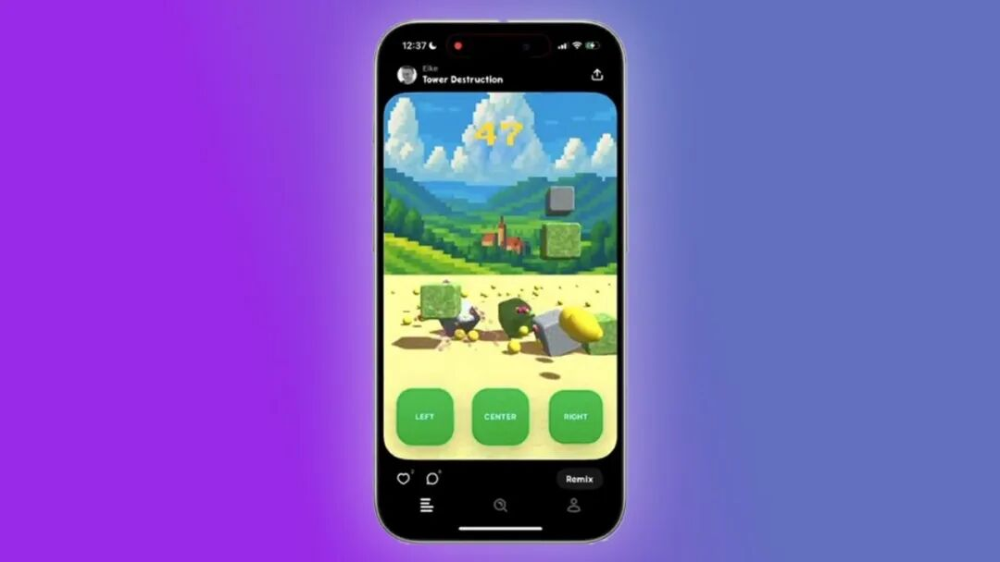
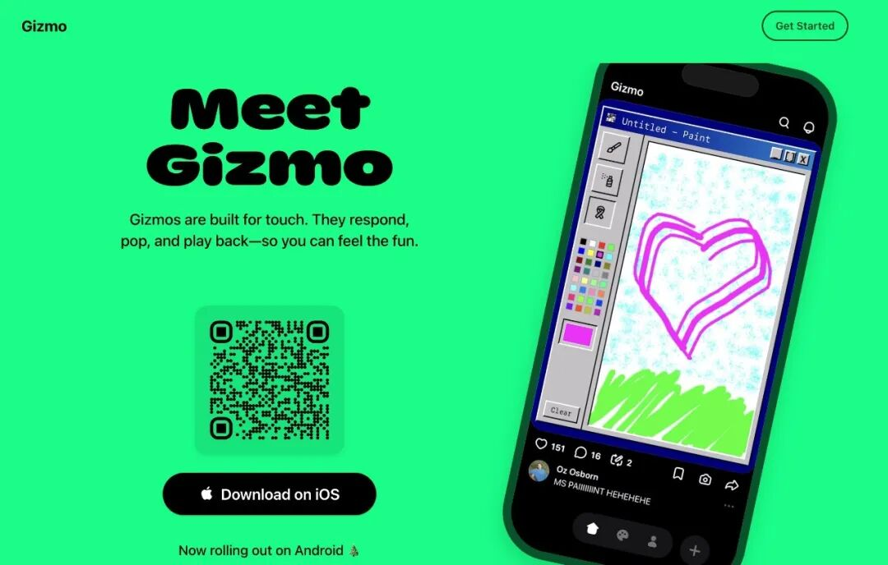
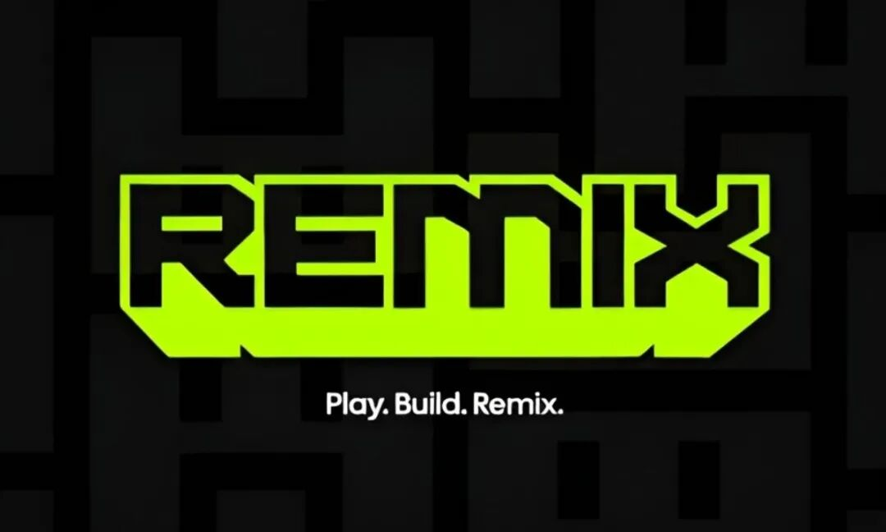
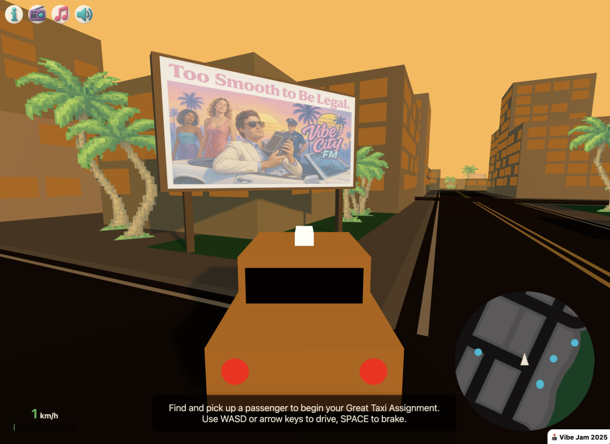
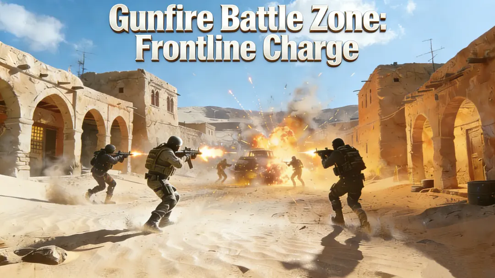
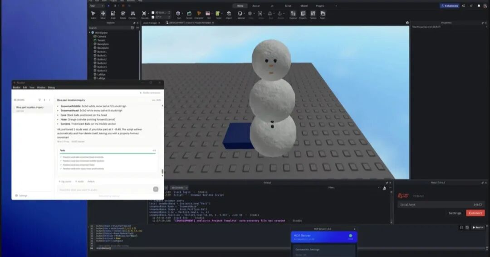

# AI 小游戏社区：TikTok 之后，下一个 UGC 内容革命

Date: 2026-03-26  
Author: SimonAKing  
Categories: 微信公众号  
Tags: 微信公众号  
Source: https://simonaking.com/blog/ai-mini-games/

> 2025年，一个全新的赛道正在爆发——AI小游戏社区。从Spielwerk到Gizmo（已被Meta收购），从Web3原生的Remix到老牌巨头Roblox的AI转型，这个赛道正在重新定义游戏的创作与

---
本文将从产品形态、核心特点和技术架构三个维度，深度拆解这一赛道的关键玩家。

## 一、什么是AI小游戏社区？

AI小游戏社区的核心公式是：AI生成游戏 + 社交分发 + UGC社区。用户通过自然语言描述即可生成可玩的小游戏，并在社区中分享、发现、remix他人的作品，形成「创作→分发→再创作」的飞轮。这类产品降低了游戏开发门槛，让每个人都能成为游戏创作者。

与传统游戏引擎（Unity/Unreal）面向专业开发者不同，AI小游戏社区的核心用户是零编程基础的普通人。它的产品逻辑更接近TikTok而非Steam——不是「搜索→下载→安装→玩」，而是「刷→玩→点赞→remix→发布」，整个链路在几秒内完成。

## 二、五层技术架构

所有AI小游戏社区产品底层都遵循类似的五层架构：

输入层（自然语言/模板）→ LLM生成层（GPT/Claude负责代码生成）→ 运行时沙箱（iframe/WebView安全隔离）→ 渲染引擎（HTML5 Canvas/WebGL/Phaser）→ 分发层（社区Feed/分享链接）

不同产品在每一层的实现方式和侧重点各有不同，这些取舍决定了它们截然不同的产品形态。

## 三、七大产品深度拆解

## 1\. Spielwerk（Minit Games）—— 信息流派标杆

## 创始团队与融资

Spielwerk由Eike Drescher和Valerie Krämer联合创办，二人此前在Sequoia投资的Bento（后被Linktree收购）共事，曾参与Twitter、Trade Republic等产品的开发。公司主体为Minit Games GmbH，总部位于德国汉堡。

2026年3月，Minit Games宣布完成 €170万（约$200万）Pre-Seed轮融资，由LVP（伦敦风投合伙人，欧洲顶级游戏VC）和Sony Innovation Fund（索尼创新基金）联合领投，天使投资人包括Stefan Klemm、Timo Soininen和Klaas Kersting（InnoGames创始人）。索尼的参与尤为值得关注——这意味着传统游戏巨头已经开始押注「AI短视频式游戏」赛道。

## 产品形态与核心交互

打开Spielwerk就是一个竖屏无限滑动的小游戏Feed，体验极度接近TikTok——每个游戏占满一屏，手指上下滑动切换。核心交互闭环是：刷→玩→点赞/评论→Remix（fork别人的游戏改造）→发布。

用户在App内用自然语言描述游戏想法，平台使用GPT-5（据Eike在推文中提到）生成可玩版本，从输入到可玩仅需10-30秒。这种「即时满足感」是Spielwerk的核心卖点——和TikTok的「3秒抓住注意力」是同一个产品哲学。

## 技术亮点与差异化

Spielwerk的技术核心在于自研的轻量级HTML5游戏引擎，专门为移动端竖屏优化。LLM生成HTML5+Canvas代码后，在iframe沙箱中安全运行，无需下载任何东西。平台的AI推荐算法分析用户实时信号和行为模式，将创作者内容匹配给合适的受众——这比传统应用商店的「搜索→下载」模式效率高一个数量级。

创始人Ole Schaper（注：Minit Games另一位联合创始人，前Sviper/The Sandbox高管）的原话很精准：「玩家越来越多时间花在算法驱动的Feed中，但游戏仍然被困在传统商店模式里。」

当前状态：2026年3月刚完成融资，目前处于邀请制早期Alpha阶段，计划逐步扩大开放。

## 2\. Gizmo（Atma Sciences）—— 被Meta收购的社交游戏平台

## 创始团队与融资

Gizmo的母公司Atma Sciences Inc.由一群前Snapchat工程师于2024年创立，核心团队包括CEO Josh Siegel、CTO Daniel Amitay、Brandon Francis和Rudd Fawcett。这个团队背景至关重要——他们在Snapchat积累了丰富的「短内容+社交分发+移动端体验」经验，这些基因深刻影响了Gizmo的产品形态。

融资方面，Atma Sciences在被Meta收购前筹集了约\*\*$548万\*\*，投资方包括顶级早期基金First Round Capital和Uncommon Projects。

## 产品形态与核心交互

和Spielwerk类似的竖屏Feed，但范围更广——不仅是游戏，而是一切互动内容：谜题、meme、互动艺术、动画、数字玩具。用户输入一段Prompt，AI生成可触控的互动内容，支持戳、滑、拖、画、摇等多种交互模式。例如「一只可以拖来拖去的蜗牛」这样简单的描述，就能生成一个可交互的小应用。

Gizmo更像是「TikTok for interactive content」——如果说TikTok让每个人都能做视频，Gizmo想让每个人都能做互动体验。

## 被Meta收购的深层意义

2026年3月，Meta完成了对Gizmo团队的acqui-hire。注意：这不是传统收购——Meta没有买下Gizmo的产品或用户群，而是雇佣了整个团队，获得了技术的非独占许可。团队加入了Meta的Superintelligence Labs（MSL），该部门由Scale AI创始人Alexandr Wang和前GitHub CEO Nat Friedman领导。

这笔交易的战略含义非常清晰：Meta正在为Instagram和Facebook开发Prompt驱动的互动内容Feed。试想一下，在Instagram的Reels旁边新增一个「互动内容」Tab，用户可以用AI生成并分享小游戏和互动体验——这将直接利用Instagram 20亿MAU的分发能力，对所有独立创业公司构成降维打击。

对创业公司的启示：Spielwerk和Remix的窗口期可能只有12-18个月——在Meta将互动内容Feed整合进Instagram之前，它们需要建立足够的网络效应。

## 3\. Remix（原Farcade）—— Web3原生的游戏社区

## 创始团队与融资

Remix从Farcaster生态起家，2025年改名Remix以拓宽定位。融资方面完成了$500万Seed轮，由Archetype领投，Coinbase Ventures、Variant Fund参投，Zynga联合创始人Justin Waldron也以个人身份投资。此前的追加轮$175万使总融资达到$675万。

这份投资人名单本身就是一张「Web3 × 游戏」的顶级牌桌：Archetype是crypto领域顶级基金，Coinbase提供链上基础设施和分发渠道，Variant专注于数字资产和社区ownership，Justin Waldron带来Zynga的游戏运营经验。

## 产品形态与核心交互

移动端竖屏游戏Feed，创作方式是Prompt描述或Remix已有游戏（类似「接力改编」）。和Spielwerk最大的区别是Web3原生：支持Farcaster和World身份登录，游戏内物品和创作者收益准备上链。

Remix已经拥有超过800款游戏和50万+玩家。平台还推出了Snap Apps功能，将高人气游戏转化为独立的、可分享的Web App，无需编程或游戏引擎——这是一个非常聪明的分发策略，让好游戏突破平台围墙。

## 分发策略的独特性

Remix的分发版图是赛道中最广的：iOS App、Telegram（TON生态）、Farcaster、Base App、World App、未来还将接入Coinbase钱包App。在Telegram上拥有独立入口是关键——Telegram上有大量crypto-native用户，这与Remix的Web3定位完美契合。

## 技术亮点

架构的独特性在于双轨创作模式：既可以用AI Prompt生成游戏（面向普通用户），也可以用Game SDK手写HTML5游戏接入（面向开发者）。SDK提供标准化消息接口，游戏通过postMessage与平台通信，处理得分上报、排行榜、用户身份等。

Web3层建在Base链（Coinbase的L2）上，支持链上身份验证和未来的游戏内资产交易。变现模式包括广告分成和应用内购，创作者还可以出售游戏内物品并为Feed曝光付费推广。

风险与机遇：如果Web3游戏叙事在2026-2027年再度升温，Remix是赛道中最大受益者；如果不升温，它可能被困在crypto小众圈子。

## 4\. Pieter Levels —— Vibe Gaming运动的起源

## 这不是一个平台，而是一个「证明」

Pieter Levels不是一个公司或平台，而是整个「vibe game」运动的起源叙事。2025年2月，这位荷兰独立开发者用Cursor + Claude花了3小时做出了 fly.pieter.com 一个浏览器端MMO飞行模拟器。

游戏上线后迅速病毒式传播：17天从$0到$100万ARR，峰值同时在线2.6万人，累计32万+玩家。2026年稳定在\*\*$10万+/月的收入水平。他随后发起的2025 Vibe Code Game Jam收到1170款\*\*参赛游戏，彻底引爆了这个赛道。

## 为什么Pieter的故事重要？

他证明了一个关键假设：「一个人 + AI + 几小时 = 月入十万美元的游戏产品」。这个叙事是所有AI小游戏平台的底层信仰来源。

但这里有一个关键nuance：Pieter的成功高度依赖个人品牌。他在Twitter有50万+粉丝，他的每一条推文都是免费的分发渠道。普通人用同样的工具做出同样质量的游戏，大概率获得零流量。

这正是Spielwerk/Remix等平台试图解决的问题：提供内置分发。不需要你是网红，平台的算法Feed会帮你找到玩家。

## 技术栈的极简主义

fly.pieter.com 的技术栈极其简单：纯前端HTML/JS/CSS + Three.js 3D渲染 + Cursor IDE + Claude Sonnet协作编程 + Cloudflare Pages部署。没有后端服务器，没有数据库，没有App Store审核——这种「反工程化」的开发方式本身就是一种产品声明。

## 5\. Rosebud AI —— 工具派领军者

## 融资与规模

Rosebud AI在2024年底完成了\*\*$2500万Series A轮融资\*\*，估值较上轮增长40%。公司入选Forbes「2025年最值得关注的AI创业公司」和AI 100榜单。这是赛道中融资额最大的纯工具型玩家。

## 产品形态与差异化

Web端AI游戏引擎，采用对话式界面（Chat-first）——用自然语言描述游戏世界、镜头角度、光照、角色模型和玩法机制，AI Agent自动生成场景、物理系统、交互逻辑、UI和测试关卡。

Rosebud和Spielwerk/Gizmo的根本区别在于：后者是内容消费平台（刷游戏），Rosebud是创作工具（做游戏）。它面向有一定开发基础或对游戏设计有明确想法的创作者，支持更复杂的游戏类型：RPG、策略、模拟经营、3D世界。

## 关键差异化功能：

内置Stripe变现层：创作者可以在游戏中添加Tip Jar（打赏罐）和应用内购，平台抽成（类似Roblox模式）

代码可导出：不像Spielwerk等封闭平台，Rosebud的游戏可以导出源代码独立运营

PixelVibe：自研AI 2D素材生成引擎，可生成角色Sprite表、道具、场景元素并自动做帧动画

2D + 3D双轨：通过Phaser（2D）和Three.js（3D）同时支持两种游戏类型

## 技术亮点

Rosebud的架构核心是多Agent协作系统——不是一个LLM做所有事，而是多个专用Agent分工：场景设计Agent、物理系统Agent、UI Agent、资产生成Agent。用户的自然语言被路由到不同Agent，各自生成对应模块的代码和资产，最终拼装成完整游戏。这种分工模式比单一LLM的「一口气生成全部代码」质量更高，也更可控。

## 6\. SEELE AI —— 中国团队的3D游戏引擎

## 融资与背景

SEELE AI总部位于深圳，获得百度风投（Baidu Ventures）和美图（Meitu）的投资。据Bloomberg报道，SEELE正在寻求新一轮融资，估值达到数亿美元级别。这是赛道中唯一一家有中国互联网巨头背书的公司，意味着其在中国市场的分发和算力资源有天然优势。

## 产品形态与差异化

Web端IDE，全链路AI素材生成是最大差异化。其他产品（Spielwerk、Remix）主要做2D小游戏，Rosebud在尝试3D，但SEELE是赛道中3D能力最强的一家。

SEELE支持从3D模型、2D Sprite、PBR材质（Diffuse、Roughness、Metallic、Normal、AO全套）、骨骼动画、BGM到角色配音，全部用AI在平台内生成。生成速度：2D游戏2-5分钟，3D游戏2-10分钟，单个3D资产30-60秒（1K-300K三角面，512px-4K纹理）。

支持的游戏类型：FPS射击、RPG冒险、3D平台跳跃、赛车、模拟、开放世界沙盒。

## 技术壁垒

SEELE的核心技术是自研的EVA-01多模态大模型——专为游戏3D资产优化的生成模型。底层整合了百度的Ernie X1和Ernie 4.5模型以及百度智能云和昆仑AI芯片，确保大规模生成的算力支撑。

双引擎架构：浏览器端用Three.js (WebGL)实时预览和运行，同时支持导出为Unity项目（C#脚本、FBX模型、物理组件全配好）。Unreal Engine 5支持计划在2026年Q2推出，届时SEELE将成为唯一支持Three.js + Unity + UE5三引擎的平台。

这意味着创作者可以从SEELE开始快速原型设计，但不被锁定在平台内——可以导出到主流引擎继续开发。这是SEELE和Spielwerk/Gizmo的根本区别：前者是「起点」，后者是「终点」。

## 7\. Roblox —— 老牌巨头的AI转型

## 为什么Roblox是「房间里的大象」

Roblox是这条赛道的终局参照：8500万+ DAU、自研AI基座模型、每年数十亿美元的创作者分成——这是新玩家极难正面挑战的壁垒。它花了17年证明了UGC游戏平台的商业模型可行。所有新产品要么在做「更轻的Roblox」，要么在做「Roblox不愿意做的细分」。

## Cube基座模型：从3D到4D

Roblox的AI战略核心是自研的Cube基座模型——将3D形状Token化（把几何形状转换为离散token），然后用GPT式自回归Transformer做「文本→3D形状」和「形状→形状」的生成。这个架构已经开源。

Cube 3D自2025年3月推出以来，已帮助用户生成了超过180万个3D物体。

更前沿的是4D生成——2026年2月进入公开Beta。4D不仅生成静态3D物体，还包括其行为逻辑和交互。例如Prompt「一辆赛车」，生成的不只是模型，还包括可以开上去驾驶的完整交互逻辑。早期接入阶段，用户已生成16万+个4D物体，使用4D生成的玩家平均游戏时长提升了64%。

4D生成使用「Schema」模板系统——例如Car-5 Schema定义了车辆的主体+四轮的五组件框架，AI在此框架内生成具体的几何形状、材质和物理行为。

## AI工具的实际影响

AI工具用户的内容发布量同比增长31%，AI辅助的新游戏开发时间缩短35-40%。

## 新玩家的机会窗口

Roblox的优势也是它的包袱：重客户端（不适合信息流刷游戏）、Lua脚本门槛（尽管有AI辅助，仍比纯Prompt生成复杂得多）、偏低龄审美（Z世代长大后审美升级）。新产品在这些缝隙中仍有空间：更轻（Web原生）、更移动（竖屏Feed）、更潮（成人向审美）、更Web3（链上变现）。

## 四、产品定位光谱

这些产品可以沿「娱乐消费 vs 创作工具」的光谱排列：

纯娱乐消费（左端）：Spielwerk、Gizmo → 用户主要是玩家和浏览者，产品逻辑接近TikTok 混合型（中间）：Remix、Pieter Levels → 创作和消费并重，创作者既是用户也是内容供给方

专业创作工具（右端）：Rosebud、SEELE → 面向开发者，产品逻辑接近Unity/Unreal 全光谱覆盖：Roblox → 既有海量玩家也有专业开发者，横跨整个光谱

一个有趣的观察：光谱两端的产品不会直接竞争。Spielwerk（信息流）和SEELE（工具）虽然都做AI游戏，但本质上是完全不同的产品，天花板、用户画像、商业模式完全不同。

## 五、四大技术挑战

1）游戏质量天花板：AI生成的游戏目前以简单的2D小游戏为主，离3A级体验还有很大差距。Spielwerk的「Cheats」系统（预设游戏模板约束LLM输出空间）和Rosebud的多Agent协作（专门的Agent负责游戏设计质量）是两种不同的解法。

2）安全沙箱：UGC平台运行用户生成的代码，需要防止恶意代码（XSS、无限循环、内存泄漏）。Gizmo选择Claude（安全性更强的LLM）+ 双层审核是一种策略；Roblox使用受限的Luau语言是另一种。同时，Feed模式要求游戏在<1秒内加载，这对沙盒的冷启动性能要求极高。

3）3D生成质量：这是目前最大的技术壁垒。SEELE的EVA-01模型（30-60秒生成PBR材质的3D模型）和Roblox的Cube（3D Token化路线+4D行为生成）代表了两种技术路线。Spielwerk/Gizmo/Remix选择回避3D，用2D Canvas快速起量，但长期来看3D能力是必争之地。

4）内容审核：UGC平台必须处理不当内容，需要AI辅助审核 + 社区举报机制的组合方案。

## 六、五大趋势预测

1）巨头入场加速：Meta收购Gizmo只是开始，预计Google、Apple、腾讯等将通过收购或自建方式入局。一旦Instagram上线互动内容Feed，独立创业公司将面临亿级流量的直接竞争。

2）Remix/Fork成为行业标配：就像GitHub让代码Fork标准化，AI小游戏平台会让「游戏Remix」成为基础能力。真正的壁垒不在于有没有Remix功能，而在于谁能建立最大的Remix网络效应——最多可Remix模板 × 最活跃创作者 × 最好推荐算法。

3）信息流派与工具派分化加剧：Spielwerk和SEELE虽然都做AI游戏，但本质上是完全不同的产品。前者天花板是UGC内容平台（参考TikTok），后者天花板是游戏引擎市场（参考Unity）。两者不会直接竞争。

4）多模态生成爆发：从文本Prompt进化到语音、图片、视频输入，生成质量将大幅提升。SEELE的EVA-01多模态模型和Roblox的4D生成已经在探索这个方向。

5）创作者经济成熟：类似YouTube的广告分成和Roblox的开发者分成模式将成为标配。Rosebud内置Stripe变现、Remix的链上经济、Spielwerk的算法分发——每家都在建立自己的创作者激励飞轮。

## 结语 & 关于作者

写完这篇拆解，我有一个很强烈的感受：这7个产品做的事情，本质上都是同一件——降低创造的门槛。Spielwerk把游戏开发从Unity简化成打字，Roblox让12岁的孩子能做3D世界，Rosebud让不会写代码的人也能上架Steam。

但游戏只是软件世界的一个切片。

我是 Simon（@simon\_aking），前字节跳动AI工程师。研究这些产品的过程中，我越来越觉得自己正在做的事情走在同一条路上——只不过我们把这件事从游戏推向了更大的领域。我们做的产品叫Mana（@mana\_\_app）。简单说：Spielwerk让每个人都能做游戏，Mana想让每个人都能做iPhone App。

在Mana上，你用自然语言描述想法，AI直接生成可运行的iPhone原生应用——不只是小游戏，而是工具、社交、效率、生活方式等全品类。内置115个原生iOS Skill（相机、传感器、健康数据、推送通知、AI、地图……），支持Phaser/Pixi.js/Three.js游戏引擎，还有和文中产品一样的Remix机制——看到别人做的好App，一键Fork改造成自己的版本。

每个人的口袋里都有一部iPhone，但99.9%的人只能用别人做的App。Mana要做的，是把iPhone变成每个人的Vibe Phone——用自然语言创造属于自己的应用，这才是真正的技术平权。

目前团队正在全力打磨中，预计接下来两周开启内测，敬请期待：seedos!

---
> 本文同步自微信公众号，[点击查看原文](https://mp.weixin.qq.com/s/ZyS1YCNKFqTVzuk5aNG9Rw)
