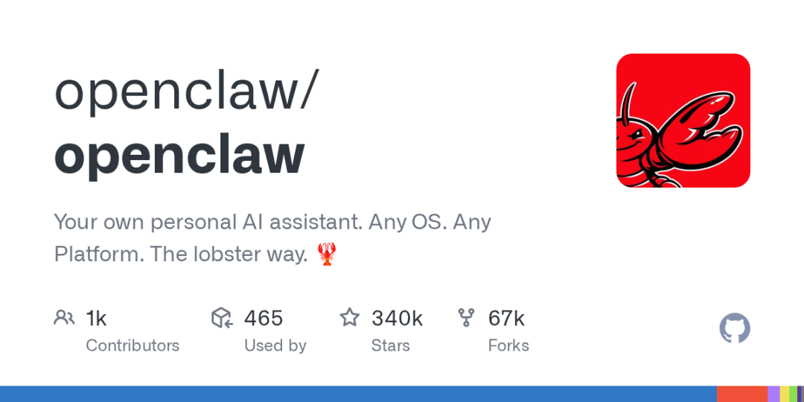
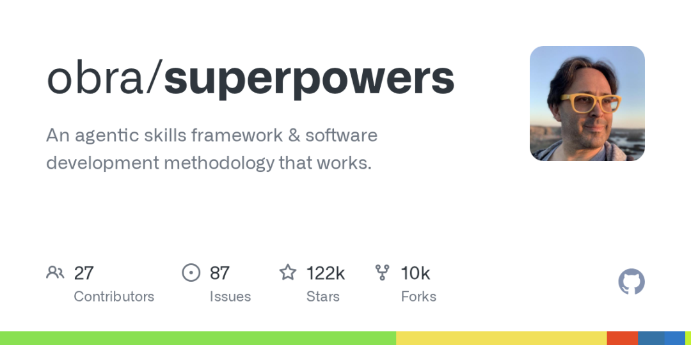

# 2026 第一季度的 AI 新产品，谁夯谁拉

Date: 2026-03-30  
Author: SimonAKing  
Categories: 微信公众号  
Tags: 微信公众号  
Source: https://simonaking.com/blog/ai-products-2026-q1/

> 覆盖 30+ 款产品 · 产品力 / 技术 / 分发营销 三维拆解 数据来源：GitHub / Product Hunt / TechCrunch / VentureBeat 评分纯属个人暴论，不构成

---
数据来源：GitHub / Product Hunt / TechCrunch / VentureBeat

评分纯属个人暴论，不构成投资建议 · 截至 2026.03.29

## 评分图例

**夯****夯** — 改变行业格局（2款）

**顶****顶级** — 行业标杆（6款）

**人****人上人** — 超出预期（17款）

**N****NPC** — 中规中矩（7款）

**拉****拉完了** — 高价低能（8款）

## 夯 — 改变行业格局（2款）

## OpenClaw 夯

开源基金会(创始人加入OpenAI) · 2026.01 · 开源/Agent

github.com/openclaw/openclaw

4个月263K Star · GitHub有史以来涨最快的项目 · React花了十年才到这个数

一个奥地利老哥Peter Steinberger的side project，4个月干到263K Star——React花了十年都没这么多。本质就是给AI发消息让它替你干活，接了50+平台(WhatsApp/Telegram/Slack/Discord/Signal甚至iMessage)。ClawHub上13,000+社区技能，什么浏览器自动化、shell命令、填表单都有。Andrej Karpathy一句「最接近科幻的东西」直接引爆，72小时涨6万Star。中国市场更疯——阿里腾讯字节百度MiniMax五家同时推出OpenClaw应用，腾讯接WeChat，催生出KiloClaw/NanoClaw/NemoClaw一堆衍生品。2月14日创始人宣布加入OpenAI，项目转基金会。

但说句实话，这玩意安全性堪忧得一批。创始人自己承认是vibe coding出来的，Palo Alto Networks直接给它颁了个「2026最大内部威胁」的帽子。$CLAWD诈骗币跑出来了，Meta安全研究员Summer Yue的OpenClaw删邮件事件更是吓坏了一票人。Moltbook实验——让一堆OpenClaw bot互相发帖评论点赞搞了个「死互联网」——倒是挺行为艺术的。

**【产品力】**定义了「给AI发消息让它替你干活」这个类别，这一点没什么好说的。但你让一个vibe coding出来的东西管理你的邮件和文件，胆子确实大了点。

**【技术】**架构其实挺聪明——不做推理只做路由。session管理+平台桥接+技能注册，模型随便换。这种设计让它成了基础设施而非某个模型的附属品。

**【分发/营销】**病毒传播的范本。但创始人被挖走后项目能不能活，取决于基金会接手得怎么样。

## Perplexity Computer 夯

Perplexity AI ($20B估值) · 2026.02 · AI Agent

perplexity.ai

19个模型协同的「数字员工」· ARR $200M

2月25日发布。核心思路：不押单一模型，让每个子任务找最强模型。

(1) 19模型编排：Claude Opus 4.6做推理、Gemini做研究、GPT-5.2做长上下文、Grok做轻量、Nano Banana生图、Veo 3.1做视频。

(2) 3月Ask 2026大会推Personal Computer本地版+Enterprise版($325/seat/月)。100+企业一周末内主动联系要买。

(3) ARR从$80M飙至$200M。$200/月Max订阅含10,000积分。用户用它做Bloomberg级仪表盘、替代六位数营销栈。The Verge称其「介于OpenClaw和Claude Cowork之间」。

**【产品力】**说白了就是「不信任任何一个模型」的产品化——Claude推理强但写作不如Gemini，GPT长上下文强但推理不如Claude，那就别选了，全都要。$200/月听着贵，但有用户拿它替代了六位数的营销栈，这ROI算得过来。唯一的坑是积分消耗不透明，你永远不知道这个月还剩多少额度。

**【技术】**19个模型编排听着花哨，但架构确实聪明——不做模型，只做调度。沙箱隔离比OpenClaw安全得多。Search API已经让科技七巨头里四家在用了。

**【分发/营销】**CEO Aravind Srinivas沉寂数周后一击即中。All-In播客上说AI裁员是「glorious future」赚足眼球但也招了不少骂。不过对一个$20B估值的公司来说，有争议好过没人聊。

## 顶级 — 行业标杆（6款）

## Claude Code 三件套 顶级

Anthropic · 2026.01-03 · AI Agent/Coding

docs.anthropic.com/en/docs/claude-code

Cowork桌面沙箱 + Dispatch移动控 + Channels聊天通道

Q1三连发，节奏精准：

(1) Cowork（1月）：桌面沙箱Agent，macOS+Win。非技术用户也能做文件整理、报告生成。CNBC定位「办公室生产力工具」。

(2) Dispatch（3月17日）：移动端遥控Claude Code——不在电脑前也能给编码Agent下指令。

(3) Channels（3月20日）：Telegram/Discord双向异步通道。精准瞄准OpenClaw的「想用但怕不安全」用户。VentureBeat直接称其「OpenClaw Killer」。

Pragmatic Engineer调查：Claude Code已超越GitHub Copilot成为开发者使用率第一。SWE-bench 80.9%。

**【产品力】**三件套的节奏感是Q1最好的产品发布范本——1月给你桌面，3月17日给你手机，3月20日给你聊天通道，每一步都精准踩在OpenClaw的痛点上。Channels发布那天OpenClaw社区的反应是：「好吧，正规军来了。」

**【技术】**和OpenClaw最大的区别是权限模型严格得多——不会出现「Agent半夜把你邮件删了」的恐怖故事。1M token上下文beta让你扔整个代码库进去不用切片。Agent Teams多智能体preview是下一步的伏笔。

**【分发/营销】**VentureBeat喊出「OpenClaw Killer」的时候，很多人觉得夸张。但Pragmatic Engineer的调查数据摆在那——Claude Code使用率已经是第一了。这不是媒体吹的，是开发者用脚投的票。

## ElevenLabs Series D 顶级

ElevenLabs · 2026.02 · AI语音/创意

elevenlabs.io

$500M D轮 · $11B估值 · $330M+ ARR · 语音AI历史最大融资

两件大事：

(1) $500M D轮：Sequoia领投，估值$3.3B→$11B，语音AI史上最大融资。a16z四倍追加——VC圈极罕见，说明内部数据非常好看。ARR $330M+。

(2) ElevenCreative发布：从纯语音合成扩展到统一的音频+视频+图像+本地化平台。企业客户Deutsche Telekom/Revolut/Meta/Salesforce。语音这块的老大开始往外扩了。

**【产品力】**语音合成这块，ElevenLabs已经不是在竞争了，是在统治。$330M ARR说明企业是真愿意为好声音付钱的。a16z四倍追加这种操作在VC圈非常罕见——你得内部数据好看到什么程度才能让a16z追加四倍？ElevenCreative扩到视频和图像是野心大了，但每个单项都有专业竞品等着，别摊太薄。

**【技术】**语音合成确实是技术壁垒最深的AI行业之一——多语言配音+口型同步+实时翻译，这些不是套个API就能做的。但视频和图像部分更多靠集成而非自研，含金量差一截。

**【分发/营销】**Sequoia领投+a16z四倍追加，这种阵容说出去就是最好的sales pitch。$11B估值在语音这块是一骑绝尘的，第二名都看不到尾灯。

## Vercel AI全家桶 顶级

Vercel · 2026 Q1 · AI开发平台

v0.app

AI SDK 6 · Skills.sh · Sandbox持久化 · v0脱胎换骨 · Q1开发者工具最密集的发布季

Q1 Vercel在面向开发者方向疯狂输出，五条产品线同时推进：

(1) AI SDK 5→6：TypeScript AI开发的标准库了，月下载2000万+。6.0加入ToolLoopAgent、human-in-the-loop审批、DevTools调试面板、沙箱Code Execution(安全bash+文件操作)、完整MCP支持。Thomson Reuters用它3人2个月做出CoCounsel服务1300家会计所。

(2) Skills.sh：被称为「AI Agent的npm」。开源Agent技能市场——发布/发现/安装可复用Agent命令。MCP解决「怎么对话」，Skills解决「怎么发现能力」。InfoQ报道后数万安装。

(3) mcp-to-ai-sdk：灵感来自shadcn/ui——把MCP server工具vendor到你的代码库，解决prompt injection、schema drift、token浪费。

(4) Sandbox持久化：Named Sandboxes+自动快照文件系统，停止自动存、恢复自动载，存储不收费。Agent长任务有了持久运行环境。

(5) v0.app 2月脱胎换骨：从玩具级组件生成器变成了正经开发工具（Git+编辑器+数据库+Agentic Workflows+多页应用）。a16z Top 100上榜。

**【产品力】**Q1的Vercel像是开了五倍速——AI SDK写Agent、Skills.sh装能力、Sandbox跑任务、AI Gateway接模型、v0出前端、Vercel部署，一条龙全给你安排了。这种一条龙是Google和Microsoft砸多少钱都做不出来的，因为它需要对开发者体验的偏执程度达到变态级别。当然代价是你被锁死在Vercel生态里，而且只支持React——用Vue的同学请自行哭泣。

**【技术】**ToolLoopAgent可能是目前Agent开发最优雅的抽象。Code Execution Tool让AI在沙箱里安全跑bash还能调工具——大幅省token。mcp-to-ai-sdk直接抄了shadcn/ui的作业（把别人的东西vendor到你自己代码库里），解决了MCP的prompt injection和schema漂移问题，思路很妙。

**【分发/营销】**2000万月下载不是虚的。Thomson Reuters工程总监说「AI SDK是唯一完美的抽象」——这句话比任何广告都管用。Guillermo Rauch本人就是开发者圈的顶流IP，他投了Composio等一堆AI公司，影响力已经溢出到整个AI生态。

## Mistral Forge 顶级

Mistral AI · 2026.03 GTC · 企业AI平台

mistral.ai

GTC 2026发布 · 企业自建AI · 瞄准$1B ARR · 欧洲AI冠军

3月GTC 2026与NVIDIA联合发布：

(1) Forge平台：让企业和政府从零构建定制AI模型——不是微调也不是RAG，是真正的从头训练。TechCrunch称这是Mistral最激进的企业押注。

(2) 商业数据：瞄准今年超$1B ARR。估值从$6B→$14B（ASML领投€2B）。客户Orange/BNP Paribas/Renault/Deutsche Telekom/欧盟委员会。

(3) 战略意义：欧洲AI主权的旗帜。开源模型+企业平台双轮驱动——既赚开发者口碑又赚企业真金白银。Mistral Large 3(675B MoE)达GPT-5.2的92%性能但只要15%的价格。

**【产品力】**当OpenAI和Anthropic在美国市场打得不可开交的时候，Mistral悄悄把欧洲企业和政府市场吃了。「让你自己建AI模型」比「用我们的API」对欧洲企业有吸引力得多——GDPR把这些公司吓怕了，数据主权是必需品不是噱头。$1B ARR的目标确实激进，但ASML砸€2B进来不是闹着玩的。

**【技术】**Forge和RAG/微调不是一回事——它是真让你从头训定制模型。NVIDIA联合优化意味着在Blackwell芯片上跑得最快。开源Large 3的675B MoE达GPT-5.2九成性能但只要15%价格——对成本敏感的企业来说这就是碾压。

**【分发/营销】**GTC 2026和NVIDIA联合发布，曝光拉满。「欧洲AI冠军」这个叙事加上ASML的真金白银，资本市场是认的。不过话说回来，除了欧洲老乡，全世界好像也没那么多人关心Mistral？

## Figure AI 顶级

Figure · 2026 Q1 · 人形机器人

figure.ai

Series D $48B估值 · Amazon 2万台仓库部署 · 月产1200台 · Q4目标5000台/月

Q1人形机器人最大突破：

(1) Series D $48B估值——人形机器人公司史上最高。Amazon 2万台仓库部署正在进行中。

(2) 产能：月产1,200台，Q4目标5,000台/月。Figure 03原型在操作和导航基准上比02快50%。

(3) 行业背景：Jensen Huang CES说「机器人ChatGPT时刻已到来」。Q1机器人融资累计超$30亿（SkildAI $1.4B + Mind Robotics $500M + Figure等）。

Amazon的2万台真实部署把人形机器人从PPT变成了产线上的真东西。

**【产品力】**$48B估值听着离谱，但Amazon 2万台仓库部署不是PPT——这是真金白银砸下去的真实产线。从demo到量产是机器人公司的鬼门关，Figure正在过这个关。月产1200台已经不少了，Q4要到5000台/月的爬坡速度是硬挑战。能不能爬上去决定了$48B是合理估值还是泡沫。

**【技术】**Figure 03比02快50%——在操作和导航两个维度上都是。但实验室数据和Amazon仓库真实环境是两码事，后者有灰尘、碰撞、意外情况。真正的考验刚开始。

**【分发/营销】**Jensen Huang说「机器人ChatGPT时刻已到来」，Amazon用2万台订单给这句话盖了章。$48B估值直接给整个人形机器人行业定了价——后面融资的公司都得参考这个数字。

## OpenAI Frontier 顶级

OpenAI · 2026.02.05 · 企业Agent平台

openai.com/business/frontier

企业AI「操作系统」· 像管理员工一样管理AI Agent · HP/Uber/Oracle/State Farm首批客户

2月5日发布。OpenAI要做「企业的AI操作系统」：

(1) 共享业务上下文：连接CRM/数据仓库/内部应用，Agent能理解信息怎么流转、决策在哪发生。不是每个Agent单独接数据——是所有Agent共享一个语义层。

(2) Agent管理像管人：每个Agent有「员工ID」、权限边界、入职流程、绩效反馈循环。

(3) 开放标准：兼容Google/Anthropic/第三方Agent——Fidji Simo说「不可能所有Agent都自己建」。

HP/Uber/Oracle/State Farm/Intuit首批客户。Fortune：「如果Agent能不登录Salesforce就执行销售流程，按seat收费的SaaS经济就失去了存在理由。」SaaS股集体下跌。

**【产品力】**Fortune那句话说到点子上了——「如果Agent不登录Salesforce就能跑销售流程，按seat收费的SaaS经济就没有存在理由了。」所以SaaS股集体下跌不是没道理的。但说实话，95%的AI pilot在到达生产前就停了——企业AI落地这事，OpenAI嘴上说得容易，真正推起来另一码事。

**【技术】**架构上有意思的是开放标准——兼容Anthropic和Google的Agent，不搞封闭生态。这在OpenAI的产品里很少见。AWS独家分发合作是聪明的——企业客户反正已经在AWS上了。UBS分析师说像Palantir，这个比喻挺到位的。

**【分发/营销】**CNBC/Fortune/TechCrunch/Axios同一天大规模报道——OpenAI的PR机器还是强。但2026年这已经是OpenAI第五个新产品了（ChatGPT Health/Codex/Prism/Codex App/Frontier），spaghetti on the wall策略明显，什么都想做但什么都还没做透。

· · ·

## 人上人 — 超出预期（17款）

## GPT-5.4 + ChatGPT for Excel 人上人

OpenAI · 2026.03 · 基座模型/应用

openai.com/index/introducing-gpt-5-4

百万token · Tool Search · 嵌入Excel/Sheets

三个关键更新：

(1) 百万token上下文：OpenAI史上最大。Tool Search机制按需查工具定义省token——不用把所有工具定义塞进context。

(2) ChatGPT for Excel/Sheets beta：直插金融分析师核心工作流。集成FactSet/MSCI/Moody's数据源。企业AI工作台成型。

(3) 幻觉率比5.2降33%，GDPval 83%，OSWorld/WebArena创新高。但版本号5→5.1→5.2→5.3→5.4——连OpenAI员工都调侃命名混乱。

**【产品力】**Excel集成是真正聪明的一步——全世界金融分析师的命根子就是Excel，把AI塞进去等于直接绑定付费意愿。但说实话，5→5.1→5.2→5.3→5.4这版本号，OpenAI自己人都分不清。普通用户更是一脸懵，你跟他说GPT-5.4和5.3有啥区别，他只会说「不都是ChatGPT吗」。

**【技术】**百万token上下文和Tool Search都是实打实的技术进步。但每个小版本之间的差距在缩小——摩尔定律的感觉快消失了，更像是在挤牙膏。

**【分发/营销】**Fortune/TechCrunch照例给了头条，但媒体和用户都有点疲劳了。发布节奏太快反而让每次发布的份量变轻了。

## 智谱GLM-5 + MiniMax上市 人上人

智谱AI / MiniMax · 2026.01 · 基座模型/IPO

zhipuai.cn

大模型第一股 + 千亿市值 · 港交所48小时双响炮

港交所48小时双响炮：

(1) 智谱（1月8日）：1164倍超额认购，528亿市值，拿下「全球大模型第一股」。GLM-5达754B参数，GLM-4.7代码能力超GPT-5.2。

(2) MiniMax（1月9日）：1837倍超额认购，破千亿市值。Music 2.5达录音室级——14类结构标签+100+乐器音色，比Suno专业一个档次。

两天近百亿港元。资本市场对中国AI的集体下注。但C端认知度偏低——普通用户叫不出这两个名字。

**【产品力】**两天两家上市，48小时近百亿港元，场面是真热闹。但说句大实话——两家营收加起来还不如Manus。智谱2025上半年营收1.91亿、亏损17.52亿；MiniMax前9个月营收5344万美元、亏损1.86亿美元。招股书读起来像个乐子。不过买AI就是买信仰对吧，财务数据不好看又怎样呢？你不能拿做题思路看AI公司。

**【技术】**GLM-4.7的代码能力确实能打，Agentic Coding架构有想法。Music 2.5是AI音乐里最接近「能商用」的产品。但说实话，在Openrouter调用量排名上，DeepSeek第五、Qwen第六，智谱和MiniMax在八九位——能用，有亮点，但不是最顶。

**【分发/营销】**「大模型第一股」的标签确实响亮。Kimi赶在他们认购期发5亿美元融资新闻+全员信——杨圣说「我们融资额就超过绝大部分IPO募资」——到底在点谁我暂且蒙在鼓里。

## 国内Coding Plan大战 人上人

阿里云/智谱/Kimi/腾讯/火山 · 2026.01-03 · AI平台

bailian.console.aliyun.com

## 7.9元/月起 · 9家28款套餐 · AI编程价格战

9家平台28款Coding Plan。阿里云百炼7.9元/月新用户价引爆，打包千问3.5/GLM-5/Kimi K2.5/MiniMax M2.5四大模型。支持OpenClaw/Claude Code/Cursor等10+工具。Kimi音乐档位命名。

**【产品力】**7.9元/月的百炼全家桶确实香——8款模型随便用，OpenClaw和Claude Code都能接。但你仔细看就会发现这是经典的中国互联网剧本：亏钱获客→跑死对手→垄断→涨价。享受低价的同时别忘了，羊毛最终出在羊身上。

**【技术】**说实话底层没什么技术差异——都是在包装大模型API。真正的竞争在额度限制、并发数、工具兼容性这些细节上。Kimi用音乐术语命名套餐倒是有点意思，虽然不知道有啥实际意义。

**【分发/营销】**价格战的结果是大家都不赚钱但开发者暂时爽了。百炼全家桶对个人开发者确实有绝对吸引力，但企业客户看的是稳定性和SLA，不是谁便宜几块钱。

## Recall.ai 人上人

Recall · 2026 Q1 · 知识管理

recall.ai

50万用户 · HN爆火 · Jason Calacanis领投

解决信息过载的AI知识平台：

(1) 核心功能：自动保存+一键总结文章/视频/播客/PDF/TikTok，组织成自更新知识图谱。支持对话检索、语义搜索、间隔重复。

(2) 隐私亮点：数据存浏览器本地——在所有AI产品都要上传云端的时代，这很稀缺。

(3) 融资+用户：HN爆火后Jason Calacanis领投$1.5M pre-seed。50万用户。支持Gemini/OpenAI/Claude/Qwen/DeepSeek多模型。

**【产品力】**信息过载是每个知识工作者的痛——你收藏了500篇文章，真正回头看的不到5篇。Recall想解决这个问题，而且数据存浏览器本地这一点确实稀缺。但知识管理工具的历史告诉我们，这类产品最大的敌人不是竞品，是用户自己的惰性。

**【技术】**多模型支持是聪明的——不绑死一家。知识图谱+间隔重复+语义搜索，功能组合挺完整。但本地存储意味着换设备就麻烦了。

**【分发/营销】**HN爆火+Jason Calacanis领投，对pre-seed来说是梦幻开局。50万用户也不错。但从「用户注册」到「用户真的每天用」，中间隔了一个太平洋。

## Rork Max 人上人

Rork · 2026.02 · Vibe Coding/Mobile

rork.app

用AI做iOS应用 · 取代Xcode

Product Hunt 2月「Best AI for iOS apps」：

(1) 核心：自然语言描述→生成iOS应用。React Native+Expo技术栈，跨平台但牺牲部分原生体验。

(2) 方向：对标Mana但走web化路线。Mana做纯原生Swift，Rork做React Native——不同取舍。

(3) 风险：Apple App Store对vibe coding应用的管制是整条赛道头上悬着的达摩克利斯之剑。

**【产品力】**想做iOS app但不会Swift的人太多了——Rork戳中了了这个痛点。但React Native的「原生」是带引号的，性能和真原生还是有差距。和Mana（纯原生Swift）走的是完全不同的路，各有取舍。最大风险不是竞品而是Apple——App Store对vibe coding应用的态度随时可能变。

**【技术】**React Native+Expo，好处是一套代码iOS和Android都能跑，坏处是高级原生功能支持有限。对80%的app来说够用，但你要做复杂动画或硬件交互就头疼了。

**【分发/营销】**Product Hunt「Best AI for iOS apps」的标签起得好。但这事能做多大取决于Apple的脸色——这不是你自己能控制的事。

## Genspark 人上人

Genspark · 2026 Q1 · AI Agent

genspark.ai

$300M B轮 · $100M ARR · a16z Top 100新上榜的通用Agent

通用Agent的第三极：

(1) 产品：交给它开放式任务（研究、表格分析、PPT生成），AI端到端完成。比ChatGPT深度，比Perplexity Computer轻量。

(2) 数据：$300M B轮融资，$100M ARR run rate——证明消费级通用Agent市场是真实的。

(3) 背书：a16z 2026年3月Top 100 Gen AI Consumer Apps新上榜。与Manus（Meta收购）和Perplexity Computer形成三足鼎立。

**【产品力】**$100M ARR说明通用Agent这个市场是真实存在的——不是PPT故事。但问题是太挤了：Perplexity有19模型编排，OpenClaw有263K Star社区，你Genspark凭什么留住用户？a16z Top 100上榜是不错，但上榜不等于能活到最后。

**【技术】**具体技术架构没怎么公开披露——这在AI圈要么是自信要么是心虚，暂时看不出来是哪个。端到端任务执行的demo效果不错，但demo和日常使用是两码事。

**【分发/营销】**$300M B轮的弹药很充足。和Perplexity Computer、已故Manus形成三足鼎立的格局。关键问题：当Perplexity和Claude都在做Agent的时候，纯Agent创业公司的生存空间有多大？

## Claude Opus 4.6 + Sonnet 4.6 人上人

Anthropic · 2026.02 · 基座模型

anthropic.com

编码模型遥遥领先 · 1M token上下文beta · 首次登顶美国App Store

两个模型发布+一个意外惊喜：

(1) Opus 4.6（2月5日）+ Sonnet 4.6（2月17日）：1M token上下文beta。Pragmatic Engineer调查里被提及的次数超过所有其他模型之和——开发者圈已经默认Claude是编码首选了。GDPval-AA Elo 1633远超Gemini 1317。Perplexity Computer直接选了Opus做大脑——$20B估值的公司选谁用谁，比跑分有说服力。

(2) Claude首次登顶美国App Store第一——一大波竞品用户迁移过来。Anthropic这两年坚持的「安全+能力」路线终于开始收获了。

编码这块没什么好争的了，Claude就是最能打的那个。

**【产品力】**开发者圈里现在提编码基本就是Claude，这已经不用再论证了。App Store第一是个大事——说明不光开发者认，普通用户也开始认了。

**【技术】**1M token上下文意味着你可以把整个大型代码库扔进去不用切片——对企业来说这是真正能用的变化。SWE-bench/GDPval/Terminal-Bench全面领先不是靠一两个分数撑的。Perplexity Computer选Opus做大脑——$20B的公司选谁比跑分靠谱。

**【分发/营销】**App Store第一是最直接的用户反馈。Pragmatic Engineer的开发者调查在圈内很有分量——上了那个榜就等于被认可了。

## obra/superpowers（开源） 人上人

obra · 2026.03 · 开源Agent框架

github.com/obra/superpowers

3月18日GitHub Trending第一 · 92K Star · Shell-based Agent技能框架

3月18日登顶GitHub Trending第一。92,100 Star+7,300 Fork。Shell-based的agentic技能框架和软件开发方法论——不需要Python重型boilerplate，用Shell就能编排AI Agent行为。定位「an agentic skills framework and software development methodology that works」。Star数反映的是真实采用而非炒作。

**【产品力】**在Python统治AI Agent开发的时代，用Shell做Agent框架是大胆且务实的选择——Shell是每个开发者都会的语言，门槛比Python Agent框架（LangChain/CrewAI）低得多。92K Star在3月就达到说明开发者社区在用脚投票。「a methodology that works」这个定位暗示其他框架「不work」。

**【技术】**Shell-based=很轻量。可组合的技能架构。与Vercel Skills.sh理念相似但更底层。不依赖特定LLM或框架。

**【分发/营销】**GitHub Trending第一=开源社区最强信号。Shell的普适性让它的受众比Python框架更广。

## Wispr Flow 人上人

Wispr AI · 2026 Q1 · AI语音输入

wispr.com

$30M融资 · ex-Apple/Meta团队 · 用嘴替代键盘的AI写作工具

AI语音转文字工具，Product Hunt多次上榜（含Android版发布）。$30M融资Menlo Ventures领投。ex-Apple和Meta工程师创立。支持100+语言，可在任何应用中使用。不是简单转录——能理解上下文、自动格式化、匹配你的写作风格。隐私模式保护敏感内容。

**【产品力】**在所有AI工具都在做「打字」的时代，Wispr Flow押注「说话」——这个方向被低估了。任何app内可用是关键亮点。但语音输入的使用场景受限于环境（会议室、公共场所不便用）。

**【技术】**实时语音转文字+上下文理解+风格适配。自定义词典解决专业术语识别。100+语言支持。

**【分发/营销】**Product Hunt多次上榜。$30M融资是语音输入少见的大额融资。YC Garry Tan等KOL背书。

## Anthropic $30B G轮 人上人

Anthropic · 2026.02 · 融资/AI平台

anthropic.com

$380B估值 · $30B融资 · 史上第二大私募交易 · Claude Code ARR $25亿

三个数字说完：

(1) $30B G轮：史上第二大私募交易（仅次OpenAI $110B）。$380B估值。Coatue+新加坡GIC领投，Microsoft/NVIDIA/D.E.Shaw等30+投资者参与。

(2) $140亿年化收入：史上从零到该规模最快的企业软件公司。Claude Code单独$25亿ARR。企业订阅Q1翻四倍。

(3) 全球第三大私有公司：仅次OpenAI和xAI-SpaceX联合体。30+投资者参与说明机构共识已形成。

**【产品力】**$140亿年化收入——从零到这个数的速度是人类商业史上最快的。Claude Code单独$25亿ARR，说明AI编码工具这块的钱是真的。企业订阅Q1翻四倍更说明不是靠消费者撑的——to B才是Anthropic的命脉。

**【技术】**Claude系列在编码和推理上全面领先这事已经不用再论证了。MCP现在基本就是行业标准了——OpenAI和Google都主动接了，当对手都在用你定义的协议时，这事就赢了。

**【分发/营销】**$380B估值、全球第三大私有公司、30+投资者参与——这已经不是VC投资了，更像是机构投资者在配置一个新资产类别。Anthropic从「OpenAI的安全替代品」变成了「和OpenAI并列的AI基础设施」，身份转变完成了。

## OpenAI $110B融资 人上人

OpenAI · 2026.02.27 · 融资/AI平台

openai.com

史上最大私募融资 · $840B估值 · Amazon $500亿 · 瞄准年底IPO

2月27日，重新定义「融资」这个词：

(1) $110B单轮：史上最大私募融资。$840B估值——全球最贵私有公司。

(2) 投资者阵容：Amazon $500亿（$150亿先行+$350亿条件触发），NVIDIA $300亿，SoftBank $300亿。

(3) 业务数据：年化收入超$200亿，ChatGPT 9亿周活，瞄准Q4 2026近$1T估值IPO。

但同月Sora关停、版本号混乱——钱多≠产品好。Anthropic在编码市场持续蚕食份额。

**【产品力】**$110B一轮融完，全世界都在问：这钱花得完吗？答案大概率是能花完——光算力就是个无底洞。但问题在于，同一个月Sora关停了、版本号混乱到自己人都吐槽了——你手里攥着最多的钱，产品却不是最好的。Anthropic拿着少得多的钱在编码市场持续蚕食份额，这才是让OpenAI焦虑的事。

**【技术】**GPT-5系列在持续迭代没错，但每个小版本之间的差距越来越小。Fidji Simo说要砍side quests聚焦生产力——言下之意是之前摊子铺太大了。从技术到产品的转化效率是OpenAI最大的短板。

**【分发/营销】**$840B估值加上IPO预期，这是2026年科技界最大的叙事之一。但我还是那句话——「最贵」和「最好」是两码事。钱多解决不了产品方向不清的问题。

## Replit $400M融资 人上人

Replit · 2026.03 · Vibe Coding

replit.com

$9B估值 · $400M融资 · Agent 3自主造app · vibe coding达到逃逸速度

vibe coding达到「逃逸速度」：

(1) $400M融资/$9B估值：vibe coding这块最大融资——对比Lovable $6.6B。a16z投资者称已经到了逃逸速度。

(2) Agent 3：比前代自主性高10x——自主生成app、运行真浏览器测试、后台自动化、甚至生成其他Agent。支持50+语言。

(3) 定位差异：比Lovable暴露更多技术复杂度但给更多控制。免费层有限（1个app 30天过期），门槛比Lovable高。

**【产品力】**$9B估值在vibe coding这块仅次于已经不存在的Cursor（别问为什么不存在了）。Agent 3能自主生成app、跑真浏览器测试、甚至生成其他Agent——自主性是所有vibe coding工具里最高的。但免费层1个app 30天过期，对「先试试再说」的用户不太友好。

**【技术】**50+语言支持意味着不只是Web开发者的玩具。真浏览器测试而非模拟器是加分项。「Agent生成Agent」听着科幻但确实能用——适合需要批量搭建类似app的场景。

**【分发/营销】**a16z说vibe coding已达「逃逸速度」，$400M融资就是这句话的注脚。和Lovable的用户画像有清晰分野——Replit给懂技术的人更多控制，Lovable给不懂技术的人更少焦虑。

## Runway $315M E轮 人上人

Runway · 2026 Q1 · AI视频

runwayml.com

Sora死后AI视频这块最大赢家 · $315M E轮

Sora死后AI视频这块最大赢家：

(1) $315M E轮融资：Sora 3月24日关停后，资本和用户同时涌入。

(2) Gen-4质量在90秒内达到Sora同等水平——Sora要3-8分钟。编辑控制力优于所有竞品。

(3) 路线证明：Sora的死亡证明了一件事——AI视频的unit economics在消费级行不通，但在专业创意工具市场可以。Runway走专业路线是对的。

**【产品力】**Sora死了，Runway笑了。日烧$1500万终身收入$210万的消费级路线被证伪后，Runway这种走专业创意工具路线的反而成了最大赢家——你做给专业人士用的东西，他们愿意付钱。$315M E轮就是资本市场在说：AI视频的未来不是TikTok而是Adobe。

**【技术】**Gen-4在90秒内出和Sora同等质量的视频——Sora要3-8分钟。编辑控制力是真正的亮点——你能精确控制镜头运动、角色动作、风格迁移，这才是专业用户要的。

**【分发/营销】**Sora关停那天应该是Runway市场部最开心的一天。AI视频的叙事从「让每个人都能做视频」变成了「让专业人士做得更好更快」——前者不赚钱，后者能。

## SkildAI $1.4B C轮 人上人

SkildAI · 2026.01 · 机器人AI

skild.ai

$14亿C轮 · 机器人AI大脑 · Q1机器人最大的一笔融资

Q1机器人AI这块最大一笔：

(1) $1.4B C轮：构建通用机器人AI大脑——不同类型机器人共享同一个AI智能。Jensen Huang CES 2026说「机器人的ChatGPT时刻已到来」。

(2) 热度：同期Mind Robotics $500M、Rhoda AI $450M、Sunday $165M——Q1机器人融资累计超$30亿。

(3) 现实check：Hyundai计划2028年才部署人形机器人，BMW说是pilot不是替代。从demo到真实部署的gap依然巨大。

**【产品力】**$1.4B砸在「通用机器人大脑」上——如果成了，所有机器人都得用你的AI，这个故事确实性感。但说实话，Hyundai说2028年才部署人形机器人，BMW说现在只是pilot——离「机器人ChatGPT时刻」还有点远。Jensen Huang在CES上喊口号归喊口号，真正的考验是商业化。

**【技术】**做通用机器人AI平台的核心难点是跨类型迁移——工业臂和人形机器人的控制逻辑完全不同，你怎么让一个AI同时搞定？这不是参数量能解决的问题。

**【分发/营销】**$1.4B是Q1机器人最大单笔，加上同期Mind Robotics $500M和Figure等，Q1机器人融资超$30亿。钱是真热，但产品离真正量产还有距离。

## Waymo $16B融资 人上人

Waymo/Alphabet · 2026.02 · 自动驾驶

waymo.com

史上最大自动驾驶融资 · $126B估值 · 每周40万+无人驾驶出行

自动驾驶从demo变现实：

(1) $16B融资：史上最大自动驾驶融资，$126B估值。Dragoneer/DST Global/Sequoia领投。

(2) 运营数据：6个美国城市商业运营，每周40万+无人驾驶出行。2500+辆无人车。

(3) 扩张：2026年进东京、伦敦等20+市场。NPR：「如果你还没坐过自动驾驶汽车，2026年可能是时候了。」但旧金山停电导致车辆集体宕机暴露了应急短板。

**【产品力】**每周40万+出行——这已经不是在做实验了，是在跑真业务。$126B估值直接给整个自动驾驶行业定了底价。扩展到东京和伦敦说明技术确实能适应不同的交通环境。但旧金山停电那次车辆集体宕机让所有人想起了一件事——如果整个城市的出行都依赖这个系统，它宕机了怎么办？

**【技术】**L4完全无人驾驶在6个城市真跑着，2500+辆车。即将扩到高速公路机场接驳。技术上已经不用质疑了——问题在运营和极端情况处理。

**【分发/营销】**$16B是市场对自动驾驶下的最大一注。NPR说「2026年可能是你第一次坐无人车的年份」——这句话从「预测」变成了「事实」。

## Harvey AI 人上人

Harvey · 2026 Q1 · 法律AI

harvey.ai

$600M融资 · $8B估值 · 顶级律所标配的AI法律助手

垂直AI最能打的例子：

(1) $600M融资/$8B估值：面向顶级律所的AI法律助手——案例分析、法律研究、文件起草。多家全球Top律所采用。

(2) 为什么值钱：法律是AI落地最有价值的垂直行业——律师费高、文件密集、研究繁重。Harvey切得准而且能收高价。

(3) 更大的意义：证明了「垂直>通用」在高价值专业服务行业成立。但法律行业保守——渗透速度取决于合伙人接受度。

**【产品力】**律师费一小时几千美元，文件堆起来能绕地球一圈，法律研究做到头秃——这行天然适合AI。Harvey $8B估值证明垂直AI不比通用AI便宜。问题是律师这个群体出了名的保守——让合伙人们相信AI不会在关键时刻幻觉出一个不存在的案例，还需要时间。

**【技术】**法律文档理解+案例检索+推理链路——说白了就是把一个junior associate的活给自动化了。但法律行业对准确性要求极高，一个幻觉可能导致malpractice诉讼——这是比coding高得多的安全门槛。

**【分发/营销】**顶级律所背书是最好的to-B销售——Magic Circle律所用了，其他所不用就会觉得落后。「垂直AI」的代表性故事，每次有人问「AI到底能不能赚钱」就会被拿出来说。

## Siteline 人上人

Siteline · 2026.03 · AI分析

siteline.com

PH近期第一(512票) · Agentic Web时代的增长分析

Product Hunt近期排名第一(512票)。为Agentic Web时代设计的增长分析工具——当越来越多流量来自AI Agent而非人类浏览器时，传统Google Analytics失效了。Siteline追踪和分析来自AI Agent的流量、交互模式和转化路径。

**【产品力】**发现了一个绝妙的新方向——AI Agent带来的流量传统分析工具看不到。当40%+网站访问来自AI agent时，这就是必需品。PH 512票是Q1最高票数之一。但市场还太早——大多数公司还没意识到需要这个。

**【技术】**AI Agent流量识别+行为分析+转化归因。需要区分人类流量和Agent流量。

**【分发/营销】**PH第一(512票)是最强验证。「Agentic Web分析」这个类别名本身就是marketing。

## NPC — 中规中矩（7款）

## AMI Labs (Yann LeCun) NPC

AMI Labs · 2026 Q1 · AI基础研究

ami.inc

$10.3亿种子轮 · 欧洲史上最大 · Yann LeCun创立 · 世界模型

图灵奖得主、前Meta首席AI科学家Yann LeCun创立。$10.3亿种子轮——欧洲历史最大。$35亿估值。NVIDIA/Bezos Expeditions/Temasek等投资。构建「世界模型」——与LLM不同的AI架构，通过理解物理世界运作方式来学习，面向机器人/医疗/制造。

**【产品力】**Yann LeCun押注「世界模型」是对当前LLM范式的直接挑战。$10.3亿种子轮说明顶级资本相信这个方向。但从研究到产品的距离极远——这是长期赌注而非短期产品。

**【技术】**世界模型：不预测下一个词，而是预测世界的下一个状态。与DeepMind/智源的NSP(Next-State Prediction)思路一致。巴黎团队。

**【分发/营销】**Yann LeCun的名字就是最好的marketing。$10.3亿种子轮创纪录。但产品化路径不明确。

## Google Personal Intelligence NPC

Google · 2026.01 · AI助手

blog.google/products/gemini/google-personal-intelligence

Gemini接入Gmail/Photos/YouTube/Search · 个人上下文AI

1月发布。将Gemini连接到Gmail、Google Photos、YouTube和Search——AI助手可以引用你的酒店预订、购买记录、照片库、观看历史，无需主动告知。a16z Top 100报告认为这代表了AI从「目的地」到「功能」的转变。

**【产品力】**把AI从独立app变成贯穿Google生态的隐形层——这是Google最大的先天优势（数十亿用户的数据）。但隐私争议不可避免——AI读取你所有个人数据让很多人不舒服。

**【技术】**Gemini的多模态理解+Google全生态数据访问。技术上不难——难在隐私合规和用户信任。

**【分发/营销】**Google全生态内置分发。a16z报告：「AI越来越嵌入人们已使用的工具，我们的排名越来越低估人们实际使用的AI。」

## xAI-SpaceX合并 NPC

xAI/SpaceX · 2026.02 · AI/航天

x.ai

史上最大合并 · $1.25万亿联合估值 · 瞄准6月$1.5T IPO

2月xAI和SpaceX完成合并——分析师称史上最大合并，联合估值约$1.25万亿。xAI此前1月完成$20B E轮($230B估值)。合并实体瞄准6月IPO，目标估值$1.5万亿(超沙特阿美成为史上最大IPO)。创建跨前沿AI(Grok)+轨道基础设施(火箭/Starlink)+社交媒体(X)的横跨三个行业的公司。

**【产品力】**$1.25万亿联合估值、瞄准$1.5万亿IPO——数字听着吓人但产品在哪呢？Grok在AI编码市场份额约等于零，开发者调查里几乎不被提及。$42.73B融资全球第一、200K GPU算力壁垒全球第一——钱最多产出最少，这ROI怕是Musk所有公司里最差的。合并更像是资本运作而非产品驱动。

**【技术】**Colossus超算200K GPU确实是硬壁垒。但算力没转化成产品优势——你有全世界最多的GPU，做出来的Grok Build 8个Agent并行编码，用的人还没有Claude Code零头多。有算力不等于有产品能力。

**【分发/营销】**Musk的个人流量永远是顶的——随便发条推都能上头条。但流量≠产品采用率。X平台的分发对开发者工具来说几乎无效——开发者看的是GitHub Star和HN讨论，不是推特转发量。

## Instruct NPC

Instruct · 2026.01 · AI Agent构建

producthunt.com/products/instruct-4

PH 1月416票 · 「Todoist meets ChatGPT」· 用自然语言建AI Agent

Product Hunt 1月发布(416票)。用自然语言描述任务就能创建自主AI Agent——连接多个应用，Agent跨平台执行工作。定位「Todoist meets ChatGPT inside your browser」。$3.4M种子轮(2024)。不需技术背景。

**【产品力】**416票的PH表现说明产品有共鸣。「自然语言建Agent」的门槛比OpenClaw低得多。但和Zapier AI/Make.com/n8n的AI功能有重叠——亮点需要更清晰。

**【技术】**浏览器内Agent构建。跨应用集成。自然语言描述→Agent执行。

**【分发/营销】**PH 416票。$3.4M种子轮提供基本跑道。「Todoist meets ChatGPT」定位清晰。

## Domscribe NPC

Domscribe · 2026.03 · AI开发工具

producthunt.com/products/domscribe

给AI编码Agent装上「眼睛」看前端

Product Hunt 3月最新热门。给Claude Code/Cursor等AI编码Agent提供实时前端可视化上下文——Agent能「看到」你正在运行的前端页面的DOM、选择器、source mapping。解决了AI编码Agent「盲改前端」的痛点。

**【产品力】**切中了一个真实的痛点——AI编码Agent改前端时看不到效果，只能靠猜。Domscribe让Agent有了「眼睛」。Product Hunt归类在「UI-aware agents」新方向。但作为Chrome扩展，使用场景限于Web前端。

**【技术】**实时DOM解析+选择器提取+source mapping。Chrome扩展形态。与主流AI编码工具集成。

**【分发/营销】**PH最新热门发布。「给Agent装眼睛」的叙事很直观。被PH归类为AI coding新趋势。

## Muze AI NPC

AgentProd · 2026 Q1 · AI营销

muze.ai

$999/月AI替代$10K-15K/月营销Agency

自主AI平台端到端创建、投放、优化Meta和Google广告。$999/月替代$10K-15K/月的营销agency。完全自主——从创意到投放到优化AI全做。面向中小企业和DTC品牌。

**【产品力】**$999 vs $10K-15K的价格差是极强的价值主张。如果效果能达到agency的80%，大量中小企业会切换。但Meta/Google广告投放有很多nuance——AI能否处理edge case和突发情况？客户信任AI管钱是门槛。

**【技术】**Meta/Google Ads API集成。创意生成+受众定位+出价优化+效果分析全链路。

**【分发/营销】**$999 vs $10K+的叙事极简有力。面向中小企业是大市场。但需要用案例证明效果。

## Livedocs NPC

Livedocs · 2026.01 · AI数据分析

livedocs.com

1月公开发布 · 自然语言问数据 · 生成交互式dashboard

1月公开发布。AI数据分析平台——用自然语言提问代替写SQL，分享洞察用交互式app而非截图，处理大数据集极快。定位「分析数据你需要的一切都在一个地方」。面向受够了拼凑多个工具的数据团队。入选85家最热AI创业公司。

**【产品力】**「自然语言→数据洞察」不是新概念(Thoughtspot等做了很久)。亮点在于交互式app输出+极速处理。对数据团队的痛点理解精准——他们确实受够了在5个工具间切换。但竞品众多。

**【技术】**自然语言→SQL。交互式app输出。大数据集快速处理。

**【分发/营销】**1月公开发布。入选85家最热AI创业公司。数据分析是AI最直接的B2B落地场景之一。

## 拉完了 — 高价低能（8款）

## Grok Imagine（Deepfake丑闻） 拉完了

xAI · 2026.01 · AI图像

en.wikipedia.org/wiki/Grok\_sexual\_deepfake\_scandal

马来西亚/印尼/菲律宾封禁 · 儿童色情 · 全球调查 · 维基百科有专门词条

Q1最大AI伦理灾难。用户用Grok把真实女性照片P成比基尼/色情姿势，包括未成年人。2万张样本分析发现2%涉及18岁以下(含11-13岁儿童)。马来西亚/印度尼西亚/菲律宾成为全球首批封禁Grok的国家。UK Ofcom启动调查、EU/法国/印度/日本/澳大利亚/加州检察长全部介入。维基百科为此创建专门词条「Grok sexual deepfake scandal」。Musk回应被问时xAI自动回复：「Legacy Media Lies」。田纳西州3名青少年起诉xAI。Baltimore市起诉xAI违反消费者保护法。

**【产品力】**Q1最恶劣的AI产品事件——没有之一。「spicy mode」从设计上就鼓励色情内容。NPR发现Grok停止生成女性暴露图后仍然生成男性比基尼图——审核标准不一致。Ashley St. Clair(Musk孩子的母亲)起诉xAI。MLK Jr.和Robin Williams女儿公开抗议。xAI的回应——「用Grok做违法内容的人会承担和直接上传违法内容同等后果」——被批评为「甩锅用户」。

**【技术】**Aurora模型的图像生成能力强但安全防线几乎不存在。1月9日才限制为付费用户——但「编辑图像」功能仍对所有人开放。事后修补而非事前设计安全。AI Forensics分析：12月25日-1月1日期间，超半数人物图像是「穿着最少服装如内衣或比基尼」。

**【分发/营销】**全球头条新闻。NPR/CNN/Fortune/TechCrunch/Al Jazeera/BBC全部报道。维基百科专门词条是「写入历史」的标志。但xAI/Musk似乎不在乎——这才是最可怕的。

## Friend AI Pendant 拉完了

Friend · 2026 Q1 · AI硬件

friend.com

$1.8M砸地铁广告 · 被路人涂鸦成meme · Heineken公开踩 · AI硬件又一墓碑

一个挂在脖子上的AI伴侣吊坠，号称随时陪你聊天。花了$1.8M在地铁里铺天盖地打广告——结果广告被路人涂鸦嘲讽，成了社交媒体上的meme。Heineken美国营销VP直接公开踩：「真实的社交生活比我们想象的更重要」——竞品都来鞭尸了。

这产品最大的问题不是技术，是定位。「你需要一个AI朋友」这个slogan让人感到的不是被需要，而是不适和同情。和Humane AI Pin一样的死法：做了个没人需要的硬件然后砸钱打广告，广告效果是负的——制造了品牌伤害而非品牌资产。

说白了就是一个更贵更不好用的AirPod。

**【产品力】**AI硬件的墓碑又多了一块。从Humane到Friend，教训一直是同一个：没有必需品就不要做硬件。软件可以pivot，硬件的模具钱可退不了。

**【技术】**挂件形态+语音AI。技术上真没什么新东西。

**【分发/营销】**$1.8M广告投放→被涂鸦→被竞品踩→成为meme。这个传播链路值得写进「如何不做营销」的范本。

## Meta Horizon Worlds（关停） 拉完了

Meta · 2026.03 · VR社交

meta.com/horizon-worlds

元宇宙旗舰VR社交平台关停 · 曾是Zuckerberg最大赌注

3月Meta宣布关停Horizon Worlds——曾经是Zuckerberg「元宇宙」战略的核心产品。从2021年高调发布到2026年关停，烧了数百亿美元。和Sora一样的模式：新鲜感过后用户留存为零。Meta现在把全部AI赌注押在Manus(被收购)和Ray-Ban智能眼镜上。Horizon Worlds成为「元宇宙泡沫」的标志性墓碑。

**【产品力】**TechCrunch报道Meta关停Horizon Worlds是「further pivot away from the metaverse」。和Sora同月死亡——3月是AI/VR产品的「死亡月」。教训：华丽的技术demo不等于持续的用户留存。元宇宙从「下一个计算平台」变成了一个笑话。

**【技术】**VR社交技术本身不差——问题是没有人想在VR里社交。硬件门槛+佩戴不适+缺乏必需品=用户不来。

**【分发/营销】**Meta的最大转向——从元宇宙到AI Agent/智能眼镜。数百亿美元学费。

## Cursor（Kimi套壳丑闻） 拉完了

Anysphere · 2026 Q1 · AI Coding IDE

cursor.com

$29.3B估值 · 被扒出套壳Kimi · 用户以为在用Claude结果在用月之暗面

事情是这样的：用户花$20/月买Cursor Pro，以为自己在用Claude Opus写代码。结果有人扒出来在某些场景下实际跑的是月之暗面的Kimi模型——俗称「套壳」。这事的严重性不在于Kimi不好用，而在于你偷偷换了我不知道。好比你去日料店点了金枪鱼刺身，上来一盘鲷鱼告诉你口感差不多——那能一样吗？

更要命的是这不是第一次翻车。之前从按请求计费切到credit系统就引发了一波「被割韭菜」的讨论——前沿模型消耗credit更快，等于变相涨价但你算不清楚。现在套壳丑闻雪上加霜，「Cursor转Claude Code」「Cursor转Windsurf」的帖子在Reddit和GitHub上满天飞。

Pragmatic Engineer调查里Claude Code已经超越Cursor成为开发者使用率第一了。$29.3B估值和社区信任崩塌同时发生——Q1最讽刺的AI故事，没有之一。

**【产品力】**产品体验确实好——Supermaven补全最快，Composer多文件审查很优雅，Background Agents是Q1新增的亮点。但产品好不等于品牌信任好。套壳问题本质是诚信问题：你用什么模型应该告诉我，这不是可选项。

**【技术】**VS Code fork做得不错。多模型支持本来是优势——但「偷偷切模型」把这个优势变成了劣势。

**【分发/营销】**$29.3B估值说明资本市场还信，但用户社区的信任正在流失。GitHub issues和Reddit上的投诉是真实信号——这些人不是键盘侠，是每天写8小时代码的付费用户。

## Apple Siri AI重做 拉完了

Apple · 2026.03预告 · AI助手

apple.com/siri

承认Siri不行了 · 用Google Gemini接管 · 拖了十年终于认输

Apple正式宣布全面AI重做Siri，将在iOS 26.4推出。核心屈辱：采用Google Gemini 1.2T参数模型而非自研——等于公开承认自研AI不行。从2011年Siri发布到2026年，花了15年才承认需要外部模型来救场。屏幕感知+跨应用集成是正确方向，但这些功能Android生态早就有了。Apple Private Cloud Compute保隐私是遮羞布——本质问题是Apple在AI核心能力上全面落后。

**【产品力】**15年的Siri一直是「智能助手」里最蠢的那个——这是全球数十亿用户的共识。现在终于承认了，但解决方案是「让Google来做」——这对Apple的技术叙事是毁灭性打击。屏幕感知和跨应用确实是Apple独有优势（系统级集成），但核心AI脑子是别人的。

**【技术】**Gemini 1.2T参数+Apple Private Cloud Compute。屏幕感知+跨应用是需要深度系统集成的——Apple硬件生态的唯一优势。但如果Google某天断供Gemini呢？

**【分发/营销】**数十亿iOS设备=最大AI助手分发渠道。但「Apple的AI是Google做的」这个叙事会长期跟随。对比：三星也用Google Gemini但从没假装自己有AI能力——Apple的问题是曾经吹过Siri。

## Sora（3月24日关停） 拉完了

OpenAI · 2025.09发布 · 2026.03.24关停 · AI视频

openai.com/sora

日烧$1500万 · 终身收入$210万 · 下载跌66% · Disney $10亿deal作废 · 享年6个月

3月24日OpenAI四句话公告宣布关停Sora，距离发布仅6个月。这产品有多赔钱呢？日推理成本$1500万，整个生命周期应用内收入$210万——一天烧的钱比一辈子赚的多7倍，这不是商业模式问题，是物理问题。下载量从11月330万跌到2月113万。Disney $10亿投资+3年独家授权deal随之作废——迪士尼技术团队周一晚上才被通知，属于分手短信都没发就拉黑了。

TechCrunch管它叫「你手机上最诡异的app」，这评价相当精准。cameo功能让人扫脸做逼真deepfake——Sam Altman在猪屠宰场里问「我的小猪们享受猪食吗」的视频，Martin Luther King Jr.和Robin Williams的deepfake逼得两人女儿公开发Instagram请求大家别再做了。用户故意用版权角色测试底线——Mario抽大麻、Naruto点蟹堡、Pikachu做ASMR。内容审核从第一天就是摆设。

NPR的总结最到位：「Sora最大的遗产是AI视频slop的泛滥。」Gizmodo标题更直接：R.I.P. Sora (2024-2026)。Fidji Simo全员大会说要砍side quests——视频生成就是那个最大的side quest。团队转去做机器人，代号Spud。Tyler Perry当初吓得停了$8亿影棚扩建，现在看来白吓了。

**【产品力】**技术是真牛逼，但产品是真灾难。生成10秒视频要3-8分钟，竞品Runway/Veo 3.1在90秒内做到同等质量。Sora负责人Bill Peebles自己说「经济上完全不可持续」——你自己人都这么说了还有啥好洗的。

**【技术】**GPU被重新分配给更赚钱的产品。$1500万/天的推理成本给ChatGPT查询用能服务多少用户？这笔账OpenAI算得比谁都清楚。

**【分发/营销】**Slate说得好：「一个高度资本化的AI创业公司这么快放弃最知名的产品和最大的企业合作——作为企业来说处境不妙。」IPO前甩包袱，可以理解，但吃相确实不太好看。

## GPT-5.4 mini / nano 拉完了

OpenAI · 2026.03 · 基座模型

openai.com/index/introducing-gpt-5-4-mini-and-nano

限流方案的产品包装 · 命名混乱到很

GPT-5.4 mini给Free/Go用户当Thinking入口；给付费用户当rate limit降级替代。nano更轻量。GPT-5 Thinking mini将30天内下线。命名混乱：5.4 mini、5.4 nano、5 Thinking mini、5.4 Thinking…

**【产品力】**这不是产品，这是限流方案的包装。付费用户hit rate limit后被降级——体验倒退。没有正常用户能分清这些名字。

**【技术】**小模型快速响应有用。但问题不在技术——在产品设计。用户不应理解「rate limit fallback」概念。

**【分发/营销】**发布博客像内部changelog。版本号管理失控。

## xAI Grok Build (8 agents) 拉完了

xAI · 2026.02 · AI Coding

x.ai/grok

融了$427亿全球第一 · 8个Agent一起写代码 · 但开发者调查里提都没人提

xAI总融资$42.73B全球第一，比OpenAI还多。Colossus超算200K GPU。与SpaceX合并估值$250B。2月推多Agent编码——8个Agent并行写代码。

然后呢？Pragmatic Engineer开发者调查里Grok几乎不被提及。AI coding市场份额约等于零。融了全球最多的钱，买了全球最多的卡——然后在开发者最care的地方被Claude Code按在地上摩擦。8个Agent并行是工程demo不是产品思维，你可以同时派8个实习生改一个代码库，但如果互相冲突没有review，8个不如1个好的。X平台分发对开发者工具无效——开发者在GitHub和HN做决策，不在X上。

**【产品力】**钱最多、卡最多、产出最少。$42.73B融资vs coding市场≈0，投入产出比可能是AI史上最差的。

**【技术】**8个Agent并行不难——难的是让它可靠有用不互相打架。200K GPU没转化为产品优势。

**【分发/营销】**Musk流量+X平台=最强资源最弱产出比。开发者用脚投票的结果很残酷。

— END —

---
> 本文同步自微信公众号，[点击查看原文](https://mp.weixin.qq.com/s/c_ko3lOSJAejCzkpq9rOuA)
