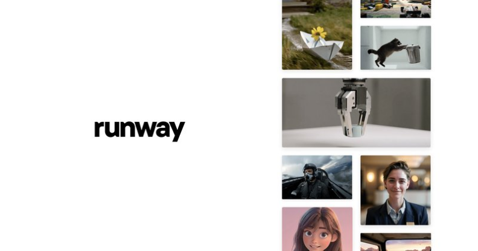
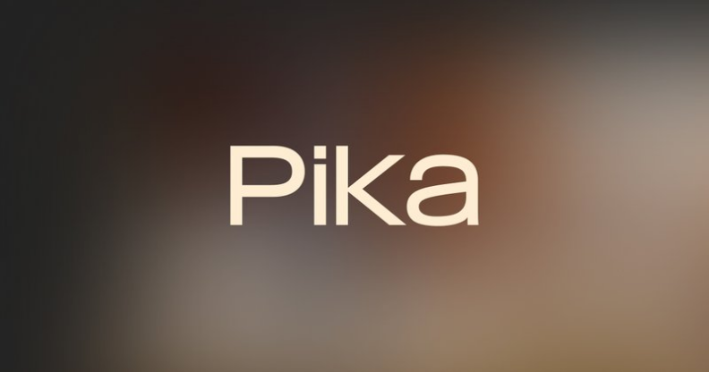
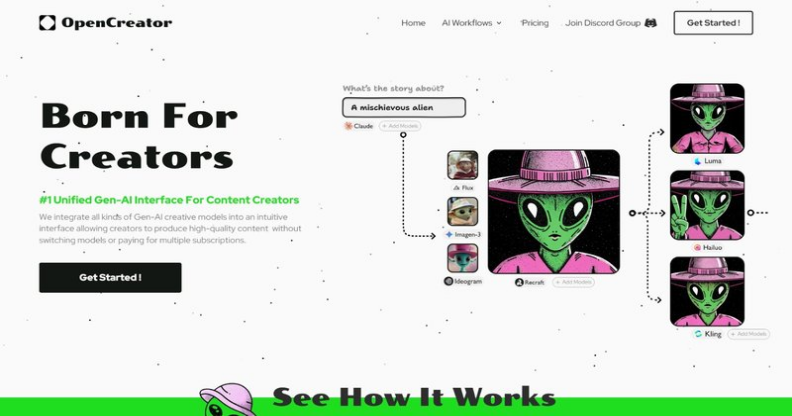
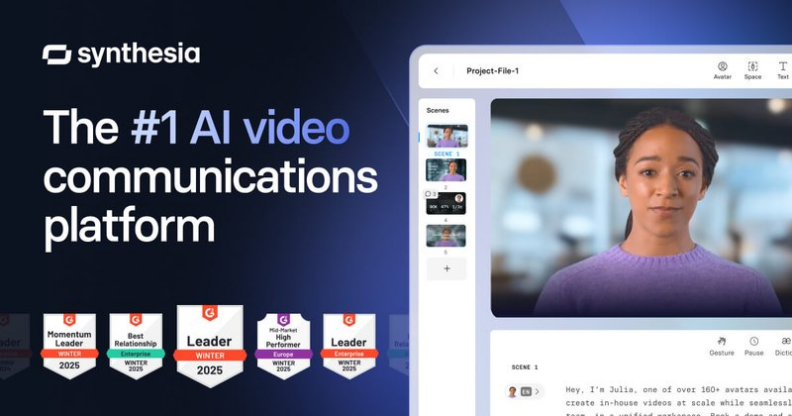

# AI 视频生成赛道深度分析

Date: 2026-04-02  
Author: SimonAKing  
Categories: 微信公众号  
Tags: 微信公众号  
Source: https://simonaking.com/blog/ai-video-generation/

> 先说结论模型层的第一仗打完了，产品层的战争才刚开始。2026年Q1的AI视频生成赛道，表面上热闹——Seedance 2.0炸场、Sora关停、可灵 3.0上4K、Veo 3.1稳扎稳打——但底层逻辑

---
**模型层的第一仗打完了，产品层的战争才刚开始。**

2026年Q1的AI视频生成赛道，表面上热闹——Seedance 2.0炸场、Sora关停、可灵 3.0上4K、Veo 3.1稳扎稳打——但底层逻辑已经变了。

变化是什么？单模型的“画质军备竞赛”正在让位于“谁能帮用户把片子做出来”的产品之争。去年大家还在比“谁的Demo更炸”，今年的问题变成了：你的工具能不能让一个人从一句话变成一条成5分钟的成片？能不能让一个电商卖家5分钟出一套主图？能不能让Agent自己跑完从剧本到交付的全流程？

这才是2026年这条赛道真正值得看的东西。我做Mana的经验也是这样——技术本身从来不是最难的部分，难的是怎么把技术变成用户真正会用的产品。

但在展开之前，先梳理一下现在这个赛道里到底有哪些玩家，各自是什么定位。不梳清楚这个，后面的分析就是空谈。

## 玩家全景图：四个象限
我把当前赛道里的玩家分成四类。这个分法不是我发明的，但我觉得它比什么“第一梯队第二梯队”有用得多：

**第一类：模型厂商（有自研模型，并以模型能力为核心卖点）**

字节跳动（Seedance / 即梦）、快手（可灵）、Google（Veo）、OpenAI（Sora，已死）、Runway、MiniMax（海螺）、生数科技（Vidu）、阿里（万相）、智谱（清影）、爱诗科技（PixVerse）、Pika、Luma AI

这一层的特点是：重研发、重算力、重参数。大厂的优势是GPU和数据，创业公司的优势是转向快。

**第二类：全流程工作台（聚合多模型，提供从剧本到成片的完整链路）**

LibTV（LiblibAI）、TapNow（Tamar AI）、OpenCreator

这一层的特点是：不自研模型（或不以模型为核心卖点），而是把多个模型能力编排成工作流。竞争维度是产品设计、场景理解和生态运营。

**第三类：C端流量型（靠特效、玩法、社交裂变拉用户）**

PixVerse、Pika、海螺 AI

这一层的特点是：模型能力不一定最强，但用户增长最快。Pika靠AI捏捏特效弯道超车，PixVerse靠毒液特效爆了，海螺靠meme表情包拉爆海外。有人说这跟“抖音贴纸”差不多，说得没错，但“抖音贴纸”的变现效率可能比“电影级画质”高得多。

**第四类：垂直场景型（针对特定行业或场景做深）**

数字人赛道（HeyGen、D-ID）、短剧工厂（MovieFlow、白日梦）、电商素材（潮际好麦、对庆科技）

这一层不跟前三类直接竞争，但在各自的小池塘里可能活得最滑润。

## 关键数据一览
先放一组数据，让大家对这个赛道的体量有个直觉感知：

**融资规模：**2025年全球AI视频相关公司融资总额30.8亿美元，同比增长94.6%。Runway累计融资8.6亿美元（估值53亿），Luma AI融贄9.68亿（估值40亿），爱诗科技累计融资超4亿人民币，Pika累计融贄1.35亿美元（估值4.7亿）。资本在用脚投票：视频生成赛道是AI领域融资最热的方向之一。

**收入规模：**Runway 2025年ARR约3亿美元，30万付费客户；MiniMax（海螺） 2025年总收入约7900万美元，同比94%，视频模型累计生成超6亿条视频；爱诗科技ARR超4000万美元，商业化不到一年收入增长超10倍；Pika有超50万用户、每周生成数百万视频。这个赛道已经有人开始赚钱了，虽然多数还在亏损。

**用户规模：**爱诗科技（PixVerse）全球用户突破1亿，MAU 1600万；Hailuo累计生成6亿条视频；Runway有30万客户；Grok Imagine仅1月单月生成超1亿段视频；Luma Dream Machine上线4天用户超100万。这个赛道的用户增速是极其快的。

**市场规模：**2024年全球AI视频生成器市场规模约6.15亿美元，预计到2032年增长刳25.6亿美元，年均复合增长率20%。听起来不小，但跟大语言模型的级36%增速比起来，视频赛道还是小弟弟。

## 模型层：字节一骑绝尘，但这不是终局
### Seedance 2.0（字节 / 即梦）—— 地表最强的代价
2月7号内测，9号上微博热搜，10号传媒板块集体涨停，12号马斯克发推感叹“It's happening fast”，冯驜直接封它“地表最强”。一周之内，这个模型完成了从技术圈层到资本市场到大众舆论的全链路引爆。

划重点，Seedance 2.0到底强在哪：

**可用率。**做过AI视频的人都知道“抽卡”这个行业暗语——以前生成5次能用 1次就不错了，真实成本是账面的5倍。Seedance 2.0的可用率据多位从业者反馈到了90%以上。这不是画质提升，这是成本结构的质变。算一笔账：假设每段15秒视频API成本5块钱，做一个90分钟的片子，理论成本1800块，以前实际要花近万块，现在基本就是2000块。

**自运镜。**你不用再跟模型说“镜头从左往右平移”了。告诉它故事是什么，它自己决定怎么拍。导演们引以为傲的运镜能力，被集成到了模型里。贾樟柯都发文说要用它做短片。

**多模态混合输入。**最多同时丢进去9张图、3段视频、3段音频加文字指令。不是单一的文生视频了，是真正的多模态混合创作。

**音画同步。**生成视频的同时生成匹配的音效配乐，口型和情绪对得上。这是以前需要后期单独处理的工作，现在一次生成就搞定。

**但Seedance 2.0也带来了2026年AI视频领域最大的争议——版权。**

内测第一天就有大量用户生成了迪士尼角色、漫威IP、日本动漫角色的视频。迪士尼直接发律师函，美国电影协会连发两次声明，派拉蒙也跟进了停止侵权通知，日本政府表示要展开调查。影视飓风的Tim发现，模型仅凭一张人脸照片就能生成与真实声音近乎一致的音频，而整个过程中没有使用任何声音样本。

说白了，模型太强了，强到用户可以随手“复制”任何IP，而字节的内容审核还没追上模型能力。这个问题不解决，Seedance 2.0在海外市场的商业化会非常难走。你连版权问题都管不住，品牌方凭什么敎把预算给你？

目前Seedance 2.0通过即梦和豆包两个产品触达C端用户，API也已经开放。生成15秒视频约消耷30万tokens，价格在行业里算中等偏低。排队高峰期曾经超1000人，等待时间超3小时。如果你要问我这个模型值不值这个热度——值，但字节要解决的问题远不止技术本身。

### 可灵 3.0（快手）—— 字节的最强对手
2月5号上线，比Seedance 2.0早3天。这个时间点不是巧合。

可灵 3.0最大的卖点是原生4K/60fps输出，行业第一个。多语种音频支持也是亮点。在短视频场景上，可灵的生成速度一直是优势，对于抖4射频率要求高的短视频创作者来说，这个速度差异是决定性的。

但说句公道话，可灵在精细度和复杂运动场景上，跟Seedance 2.0还是有差距。不过快手有一个字节没有的东西：短视频生态。可灵生成的视频可以直接进入快手的分发体系，这个闭环是技术参数比不了的。

### Sora的死亡—— 这个赛道最重要的信号
**3月25号，OpenAI正式宣布关停Sora应用和API。**

没错，那个曾经震撼AI视频整个行业的产品，上线6个月就死了。原因很直接：IPO在即，GPU资源分配给视频生成不划算，变现效率远不如文本和代码产品。

我觉得这是2026年AI视频赛道最重要的事件，没有之一。它传递的信息非常清晰：模型能力≠产品成功，更≠商业成功。你可以做出世界上最牛的视频模型，然后因为找不到商业模式而死掉。这不是假设，这是刚刚发生的事实。

我的看法是，Sora的死应该让很多人冷汗一下。你看看这个赛道里有多少公司的故事是“我们的模型很强”，而不是“我们怎么赚钱”？Runway一年亏1.55亿美元，Sora直接死了，Grok Imagine三个月就从免费转付费。GPU成本是悬在每家公司头上的达摩克利斯之剑。谁解决不了这个问题，谁就是下一个Sora。

这给所有做AI视频的公司提了个醒：光有好模型不够，你得想清楚怎么赚钱。字节有即梦+豆包+剪映的流量入口和商业化体系，快手有短视频生态，Google有云服务。纯做模型的创业公司如果没有清晰的商业场景，会非常危险。

### 海外三巨头现状：Veo稳、Runway专、Sora死
**Veo 3.1**是Google的答案。4K原生输出、按秒计费的API、参考图像锁定角色一致性——商业化思路很清晰，瞄准的是企业级和专业创作者。在MovieGenBench基准测试中，Veo 3.1的提示词遵循性排名最高。说白了，Veo赢在“稳”，不是“炫”。

**Runway Gen-4.5**在Elo评分上排第一。这家公司的数据很说明问题：累计融贄8.6亿美元，估值53亿（2026年2月Series E），2025年ARR约3亿美元，30万付费客户，422名员工。投资人包括Nvidia、Google、Adobe、General Atlantic、SoftBank。Runway已经在商业化上走通了，包括每家主要电影工作室都是客户。Amazon《大卫之家》第二季用了超过350个AI生成镜头。但亏损依然很大——2024年收入约4400万美元但EBITDA亏损1.55亿。视频生成太吃GPU了。

*Runway Gen-4.5：估值53亿美元，专业创作者的首选*

### 中小模型厂商：分野已经开始
**海螺 AI（MiniMax）**靠meme表情包和人物表演在海外爆了。MiniMax 2025年总收入约7900万美元，同比增长94%，毛利率从12%提升到25%。视频模型累计帮创作者生成超6亿条视频。但说句公道话，海螺的模型能力和第一梯队还有差距。有测评者直言它“在画质上比当前领先模型还差一档”。它赢在了产品化、运营和商业化速度上。在“六小虎”里商业化走在前列。

**PixVerse（爱诗科技）**可能是最有希望先赚到钱的视频生成创业公司。全平台累计用户突破1亿，移动端MAU 1600万，ARR超4000万美元，2024年11月启动商业化后不到一年收入增长超10倍。融资历史：A轮超4亿人民币，B轮6000万美元（阿里领投），B+轮1亿人民币。创始人王长虎是前字节视觉技术负责人，参与过抖音和TikTok从0到1的建设。它的路径很有意思：模型卷不过的时候就转C端特效，毒液特效、万圣节特效这些东西技术门槛不高但用户爱玩。入选a16z全球Top 50生成式AI消费级移动应用第25位。

**Pika**两位斯坦福博士生郭文景和孟辰霖创立，累计融贄1.35亿美元（B轮8000万美元，Spark Capital领投），估值4.7亿。超50万用户，每周生成数百万视频。靠AI捏捏特效弯道超车，已集成进Adobe Firefly。但模型能力在排名中垫底，Meta曾在2025年7月洽谈收购。还在做“AI Selves”数字分身产品，在思考视频之外的事。团队只有30人左右，典型的“小而精”。

*Pika：30人团队，估值4.7亿美元，“小而精”的典型*

**Vidu（生数科技）**由清华大学朱军教授团队创立，写实风格稳定，支持32秒视频，4D生成是亮点。全球首个融合Diffusion与Transformer的U-ViT架构，生成16秒视频仅10秒。但还没有形成独特的竞争优势，在商业化上跟可灵、PixVerse有明显差距。朱军认为2026年视频大模型商业化会加快，但目前行业还没到一家独大的状态。

**万相（阿里）**典型的“导演型”模型，参数控制非常细，但不适合“一键出片”。官方自己也承认：它是给有shot list的人用的。

### Grok Imagine Video（xAI）—— 七个月从零到第一
2025年7月，xAI还没有视频产品。2026年1月底，Grok Imagine在Artificial Analysis的Video Arena上同时拿下了文生视频和图生视频两个第一。七个月，从零到第一。中间还收购了一家叫Hotshot的视频创业公司。仅1月就生成了超过1亿段视频。

但于3月19号，Grok视频生成已经从免费层移到了付费订阅。原因跟Sora一样：GPU成本太高。马斯克的打法是先免费拉爆用户，再收费。目前只支持720p，没有专业工作流工具，更像是聊天产品里的功能而不是独立创作平台。如果能把分辨率推到1080p，今年夏天之前就可能成为最强综合玩家。

### 开源阵营：被低估的野蛮力量
**HunyuanVideo 1.5（腾讯）** 只有83亿参数，RTX 4090上75秒就能生成视频。完全开源，对数据不能出境的企业场景是目前最实用的选择。

**LTX-2（Lightricks）** 针对NVIDIA生态优化，年收入不超1000万美元的公司可免费商用。本地部署的桌面版编辑器是隐私敏感团队的禁区。

**Wan 2.6（阿里开源）** 艺术风格保持特别强，给它水彩画它就用水彩动起来，不会变写实。每秒生成成本0.05美元，是最便宜的选择之一。

开源模型的意义不只是免费。LibTV、TapNow这些平台能聚合多模型，前提是有开源模型可以低成本调用。开源陪的是场地，闭源赚的是门票。

## 产品层：真正的战争在这里
模型层的格局在2026年Q1已经基本清晰了。但模型不等于产品，产品不等于生意。接下来的问题是：谁能把这些模型能力变成真正可用的工作流？

这里我重点分析三个产品，因为它们代表了三条完全不同的路线。

### LibTV（LiblibAI）—— 赌“Agent是下一个用户”
3月18号上线，我觉得这是2026年Q1最值得关注的新产品之一。

LibTV最有意思的设计是“双入口”——人类创作者用无限画布手搞视频，AI Agent通过Skill接口自动跑全流程。行业里第一个从产品设计的第一天就把Agent当用户来服务的视频工具。

极客公园有篇文章写得很好：“给它一段参考视频，加一句话，然后你去忙别的了。十几分钟后，Agent交回一支完整的TVC——它自己写了剧本，自己拆了分镜，自己选了模型生成每一个镜头，自己剪辑，自己配乐。”

说白了，LibTV赌的是一个判断：未来视频创作的“用户”不只是人类，还有大量的Agent。Jensen Huang在GTC 2026上说得很直接——每家公司都需要一个Agent系统战略。这个判断对不对另说，但产品设计上确实走在了前面。

功能层面，LibTV集成30多个视频模型，20多个专业工具，从剧本到分镜到成片可以在一个画布上完成。定价也很激进，免费给300条顶级模型视频额度。背后的逻辑是LiblibAI积累了三年的模型资源和2000万创作者社区，供给侧有成本优势。

但说句公道话，LibTV上线才两周，产品稳定性和社区活跃度还需要时间验证。而Agent自动做视频的体验，目前还主要依赖OpenClaw生态，这个生态本身也还在早期。

我个人的感觉是，LibTV的愿景很大，但时机可能早了半步。Agent自动做视频这件事，当前更像是“概念验证”而不是“日常工具”。但话说回来，如果你等到时机成熟再做，就轮不到你了。做产品就是这样，早了可能死在沿途，晚了肯定死在起点。LibTV选了早，这需要勇气。

### TapNow（Tamar AI）—— 赌“电商才是最大的市场”
TapNow走了一条跟LibTV完全不同的路：电商+广告垂直场景。

它的核心不是“做最好的视频”，而是“让品牌方和电商卖家能批量生产可投放的商业视频”。上传一张矿泉水白底图，2分钟出一条日系广告片。输入产品官网URL，5分钟出一套符合亚马逊、TikTok Shop规范的主图。

TapNow聚合了Veo 3.1、可灵、Hailuo等多个模型，但核心竞争力不在模型，而在工作流模板和电商场景的深度适配。本土化模特生成（自动匹配欧美/东南亚审美）、JSON级镜头参数控制、一键拉片复刻同款——这些功能都是电商场景下的硬需求。

有用户反馈电商素材点击率从2.3%提升到5.7%。汤臣倍健的南极TVC是它的标杆案例——全AI生成，达到百万级商业片质感。TapTV社区开源12万个工作流。

我觉得TapNow的路线是对的。为什么？因为电商是目前AI视频变现效率最高的场景，没有之一。一套7张主图成本约2.5美元，比外包设计便宜一个数量级。而且电商场景的需求是明确的、可量化的、可重复的——这正是AI最擅长的。

但话说回来，依赖第三方模型是一个风险。如果字节哪天决定不让第三方平台调用Seedance，或者Google改了Veo的定价策略，TapNow的成本模型就会被动摇。这是所有“模型聚合型”产品的共同难题。

*TapNow：电商+广告垂直场景的AI视觉创作引擎*

### OpenCreator —— 赌“效率工具”路线
OpenCreator的定位是“统一的AI创作工作站”，把Seedance、Veo、Sora（在它还活着的时候）、可灵等模型塞进一个界面。同一个Image-to-Video流程里可以一键切换模型、对比输出结果。

它的核心价值不是模型能力，而是模型聚合+工作流复用。对于需要频繁测试不同模型的创作者来说，省时间。但整体定位偏工具，缺少LibTV那种Agent双入口的前瞻性，也没有TapNow那种电商垂直场景的深度。工具类产品的问题是护城河很浅，任何模型厂商都可以自己做一个类似的聚合界面。

*OpenCreator：统一的多模型创作工作站*

### 更多值得关注的产品层玩家
除了上面三个重点分析的，还有一批产品在近两个Q集中上线或重大更新，值得单独拎出来说说：

**Lovart AI —— AI设计Agent。**定位不是视频生成器，而是“设计合作伙伴”。聚合了Nano Banana Pro、Seedream、可灵等模型，核心特色是ChatCanvas——你可以跟图像“对话”，选中某个区域说“把灯光调暖”，它只改那部分。这比重新写prompt强多了。定价也清晰，Pro版每月11000积分，解锁可灵 2.6和Wan 2.6等高级模型。对设计师和品牌方来说，这可能比纯视频工具更实用。

*Lovart AI：ChatCanvas让你跟图像“对话”*

**Google Flow —— 电影级AI制片。**Google的官方制片工具，内置Veo 3.1。定位是场景级叙事控制，适合影视前期预演。跟即梦、LibTV的“一站式”定位类似，但背后Google的算力和4K输出是其他玩家没有的。

**ElevenCreative（ElevenLabs）—— 音视频一体化。**ElevenLabs本来是做语音合成的，现在把音频、视频、图像和本地化统一到一个平台。刚在Product Hunt上线，思路是“内容创作不应该拆成图像、视频、音频三个工具”。这个判断是对的。

**LTX Studio（Lightricks）—— 叙事控制。**专注场景级叙事规划，从剧本到分镜到视频的前期预演工具。定位很像“AI版的故事板”。背后Lightricks也是Facetune的母公司，对移动端体验很有经验。同时LTX-2开源模型支持本地部署，形成了“开源模型+云端平台”的双轨布局。

**Synthesia —— 数字人赛道的隐形冠军。**超过5万个团队在用，240多个AI头像，160多种语言。不做AI视频生成，做AI视频“制作”——培训视频、产品说明、内部沟通。听起来不性感，但这可能是目前变现最稳定的AI视频场景。不需要比画质，企业客户要的是“能用、能复制、能规模化”。

*Synthesia：不性感但最赚钱的AI视频场景*

**InVideo AI —— 脚本到视频自动化。**输入脚本自动匹配画面、背景音乐和转场，周刷新免费额度，有水印。适合快速社交媒体内容。和TapNow的“专业化”路线相比，InVideo走的是“极简化”，目标用户是不懂视频制作的中小企业。

**Pictory 2.0 —— 2026 Q1新上。**Product Hunt上新一代产品，加了AI头像、生成式视觉和交互式托管。定位是“不需要拍摄和剪辑软件的专业视频”，跟Synthesia有直接竞争。

**Nano Banana 2（Google）—— 图像生成的新王。**虽然主要是图像模型，但它是视频生成的上游——大量视频工作流是“先生图再动起来”。Nano Banana 2嘨2月上线，速度接近Flash，质量接近Pro，在Gemini中免费用。它降低了“图生视频”整个链路的起点成本。

**fal.ai —— API聚合平台。**把Seedance、Kling、Hailuo、Veo、Wan等模型统一封装成一个API，一个账号、一个计费。不做前端产品，只做开发者服务。每秒价格从0.05美元（Wan）到0.50美元（Sora Pro）。对于需要把视频生成嵌入自己产品的开发者来说，这类“模型中间商”的价值是明确的。

**OiiOii（闹闹 / Hogi AI）—— AI动画创作Agent。**全球首个专业动画Agent工具。创始人闹闹是前腾讯产品经理，之后在字节和B站都待过。产品的思路很有意思：把编剧、分镜师、角色设计师、音效师等角色做成多个Agent协作，但工作流透明化，用户可以随时介入调整。计划招100个内测用户，结果来了10万人排队。162种艺术风格，特别擅长中国传统文化元素。定位很明确：做AI动画，不做写实视频。

**白日梦—— 短剧/漫剧工厂。**专为小说推文、漫画推文和文生视频创作者设计。强调角色一致性和长时长生成，自动抽取角色、分镜和画面风格，批量生成分集视频。对网文改编、条漫动画化这类场景特别友好。是国内“AI短剧”赛道的代表产品。

**清影（智谱AI）—— GLM生态的视频入口。**基于CogVideoX模型，支持4K/60帧、10秒视频，自带CogSound音效生成。免费用。技术能力不差，但尚未形成独特的产品定位，更像是智谱大模型生态的一个功能模块。在测评中对复杂提示词的理解能力很强。

**Luma Ray 3（Luma AI）—— 3D感知的特殊位置。**在图生视频排名中不算前列，但有一个独特优势：3D空间感知。给它一张产品图或建筑渲染，它能推断深度，生成尊重三维结构的镜头运动。对电商产品视频和房地产可视化来说，这个专长很有价值。

**MovieFlow —— AI长片工厂。**输入故事梗概，自动拆剧情结构、分镜，生成数分钟的连续影片。优势在于“长”和“自动化”，适合YouTube剧情向内容、长广告或教育短片。跟OiiOii的区别是MovieFlow把Agent封装在后台，用户不能在中间节点介入，而OiiOii让用户当“导演”。

**腾讯智影—— 企业级工具箱。**腾讯的AI智能创作工具，集成了视频剪辑、数字人、文字转视频、视频转绘等功能。不是最炫的，但背靠腾讯云，对企业客户来说“够用”可能比“最强”更重要。

**Adobe Firefly Video —— 房间里的大象。**Adobe终于下场了。基于Firefly图像模型扩展到视频，主打“商业安全”（训练数据合规，不会有版权问题）。对于已经在用Premiere/After Effects的团队来说，这是最自然的选择。但定价不便宜，对于独立创作者可能不是首选。

## 我的四个判断
### 判断一：“抽卡时代”结束了
Seedance 2.0的90%可用率意味着AI视频生成的成本模型彻底变了。以前生成的视频多数要扔掉，现在多数能用。这会加速AI视频从“实验品”变成“生产工具”。当生成成本降到足够低，Agent才能放开手脚做视频——这也LibTV赌Agent赛道的前提条件。

### 判断二：模型层会快速同质化，产品层会加速分化
大家都在用类似的DiT架构，模型能力的差距在缩小。但产品层的分化反而在加速：即梦做流量入口，LibTV做Agent双入口，TapNow做电商垂直，Runway做专业创作者，PixVerse做C端特效。每家选的赛道不同，竞争的维度也不同。没有“最好的AI视频产品”，只有“最适合你场景的”。

### 判断三：电商和短视频是最先赚到钱的场景
影视级长片很酷，但离规模化变现还很远。电商产品图、广告素材、短视频内容——这些场景的需求明确、可量化、可重复、对质量的容忍度相对高。这正是AI最擅长的。PixVerse的收入已可覆盖绝大部分成本，TapNow把电商主图成本压到2.5美元一套——这些都是实打实的变现信号。

我的判断很明确：这个赛道里最先赚到大钱的，不会是做“AI电影”的公司，而是做“AI广告素材”和“AI短视频特效”的公司。原因很简单：广告主买单是按效果付费的，点击率从2.3%涨到5.7%，这个效果立竿见影，不需要你去说服他“AI视频是未来”。而“AI电影”现在还停留在“看，我用AI做了一个很酷的预告片”的阶段——酷是酷，但谁付钱？

### 判断四：Agent是下一个“用户”，但还太早
LibTV的双入口设计不是噐头，是一个正在发生的趋势。Figma、Canva、Spotify都在接OpenAI的Apps SDK，大量SaaS工具在接Skill接口。但说句实话，现在Agent自动做视频的体验还很粗糙，主要的用户还是人类创作者。这个赛道真正爆发可能还需要6-12个月。但提前布局总比后知后觉好。

## 最后说几句
回到开头的判断——模型层的第一仗打完了，字节暂时领先，但模型优势窗口期很短。Veo 3.1在企业级场景已经很强了，可灵在短视频场景有生态优势，Runway在专业创作者群体里根基很深。

真正决定这条赛道终局的，不是谁的模型参数更好看，而是谁能把“AI生成视频”这件事变成一个可重复、可规模化、能赚钱的生意。

从Sora的死亡到PixVerse的近乎盈亏平衡，从字节的版权困境到LibTV的Agent赌注，从海螺的meme爆发到TapNow的电商深耕——这条赛道的故事，已经不是“谁的模型更强”的故事了。

我其实最佩服的是PixVerse。王长虎在字节待过，最懂短视频用户要什么。模型卷不过就去做C端特效，不装“我们要做电影级”，老老实实做毒液变身、万圣节活动这种用户爱玩的东西。结果呢？一年不到就近乎盈亏平衡。这种务实，在一个天天喊“颠覆影视行业”的赛道里太稀缺了。

**毕竟Sora都死了，模型能力从来不是唯一的答案。**

---
> 本文同步自微信公众号，[点击查看原文](https://mp.weixin.qq.com/s/Kx2EbfREO9ffOFWljiIWAw)
