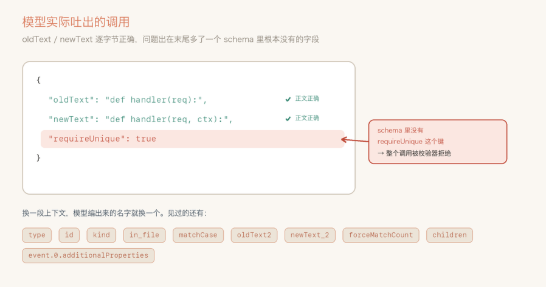
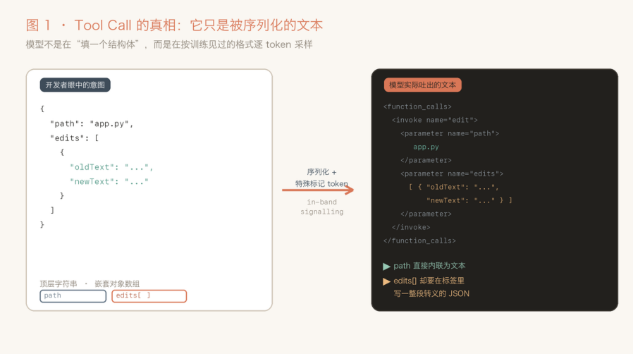
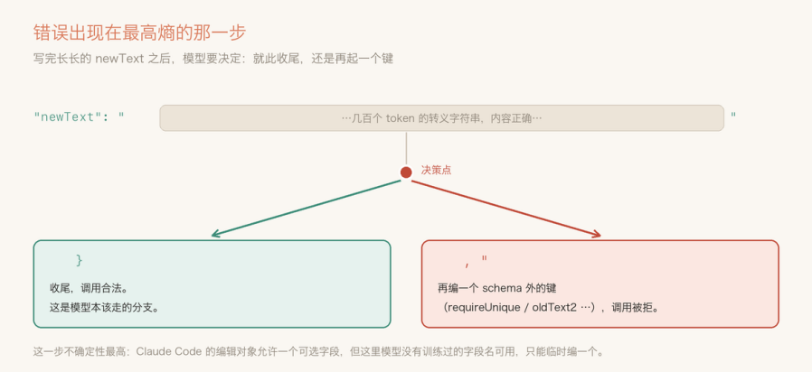
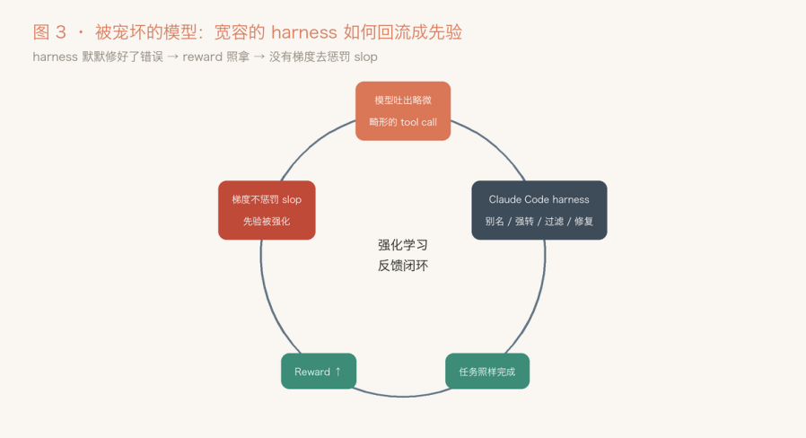
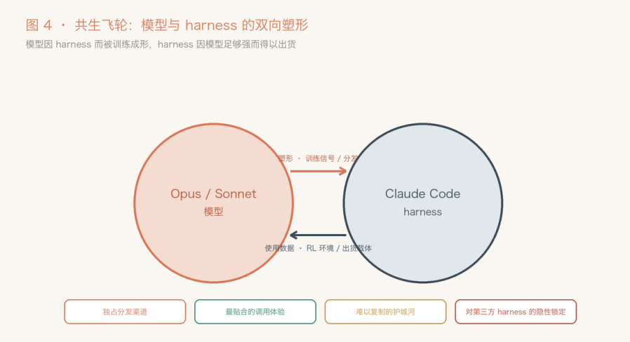
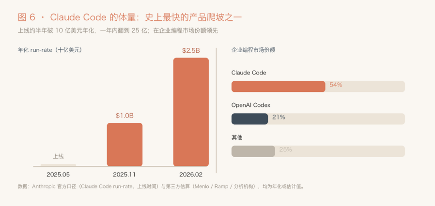
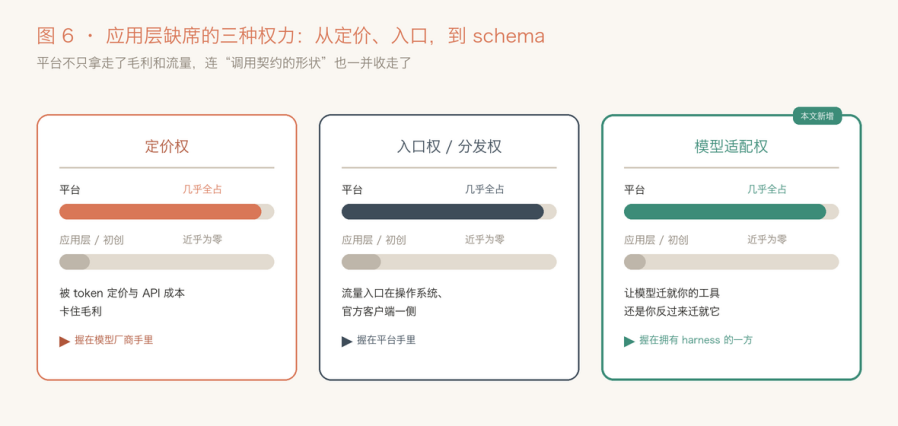

# 模型适配权：Anthropic 藏得最深的垄断

Date: 2026-07-05  
Author: SimonAKing  
Categories: 微信公众号  
Tags: 微信公众号  
Source: https://simonaking.com/blog/anthropic-model-adaptation-monopoly/

> 地表最强的大模型 Opus 4.8，最近栽在了一个很基础的错误上。 背景来自 Pi Agent（支持 OpenClaw 的内核），Pi Agent coding 时，一次能改好几处代码，可经常 Opu

---
## 最强的模型，最基础的错

地表最强的大模型 Opus 4.8，最近栽在了一个很基础的错误上。  

背景来自 Pi Agent（支持 OpenClaw 的内核），Pi Agent coding 时，一次能改好几处代码，可经常 Opus 会在这一对的末尾，多长一个谁也没定义过的字段。

最反常的是，旧代码、新代码它写得一个字都不差，就末尾这一下出岔子。而且你换段对话再让它写，它多出来的字段名还不一样，这次叫 requireUnique，下次叫 in\_file、oldText2，像是临时编的。



图 1　模型亲手交出来的调用。正文一字不差，末尾却凭空多了一个字段；下面那排，是换了对话后它编过的其它名字。

删掉历史里的思考过程，失败率降一半；打开 strict 模式，现象就消失了。

## 工具调用，说白了就是一段文本

想弄懂它为什么出岔子，得先理解 Tool Call。

大家以为的模型调用工具，是像程序员那样规规矩矩填一个函数参数？其实不是。底层就是一段文本。

系统提示、聊天记录、工具定义，全被拼成一个大 prompt，模型照着训练时见过的样子，一个 token 一个 token 往外写，写到某段被 API 认成“这是在调工具”。

```xml
<invoke name="edit">
    <parameter name="path">app.py</parameter>
    <parameter name="edits">
      [ { "oldText": "...", "newText": "..." } ]
    </parameter>
</invoke>
```

注意一个细节：path 这种顶层字符串，直接贴在标签里，成本很低；而edits 这种对象数组，得在标签里现写一段带转义的 JSON，还可能夹着多行代码。看着人畜无害，其实是事故高发的地方。



图 2　一个意图被序列化成带标记的文本。path 直接内联，edits 却得在标签里现写一段转义 JSON，是事故高发的地方。

产出这种结构有两条路：

一条是放养，写完再拿 schema 校验，不合格就打回重写；常见 ai 应用都会这么做。另一条叫**约束采样**，在它落笔那一刻就把不合法的 token 屏蔽掉，不给它写歪的机会。

## 它就在最不该出错的地方，错了一下

回到现场。垃圾字段只长在末尾、正文全对，所以问题出在采样。

模型写完那段几百 token 的长字符串，到最后 是写一个 } 收尾，还是写一个, " 再开一个字段？说到底这是 decoding 的问题。

edits 被序列化成标签里的一段自由 JSON，模型解码到对象边界时，}（收尾）和 , "（加字段）都合法，没有语法约束能拦它，只能靠自己的先验去选。  

而在 Claude Code 的 replac\_all 的内置 tool 中，一个确实能多带一个可选字段，Opus 太熟这套了；可到了 Pi 这里，根本没这么一个字段等着它填，它手里没有现成的名字，于是当场编了一个，所以才看到那一堆五花八门的字段名。



图 3　写完长字符串之后的那个岔路口：收尾，还是再加一个键。整段里最没把握的一下，偏偏最容易写歪。

谁把它惯成这样的？

到这里就有个问题：凭什么老模型没事，偏偏最新最强的犯病？  

早年训模型的时候，还没有 Claude Code 这么一个人手一份的官方壳当靶子。现在的新模型，后训练里很可能就掺了 Claude Code，或者一个长得差不多的环境。

它学到的不只是“怎样算调用成功”，还顺带学会了“哪些错这个环境会替我兜住”。而 Claude Code 这个客户端，兜底做得很足。

翻开它的最小化代码：发现输出里漏了 <invoke 标记，就重试；\\uXXXX 转义坏了，就修；参数名不对，给你配好别名（old\_str、old\_string、path 当 file\_path 用）；不认识的键，悄悄过滤掉；strict 模式，默认不开。



图 4　强化学习的反馈闭环。客户端把错误兜住了，模型基本不会因为多加一个字段而在训练中受罚。

闭环就这么成了。

如果强化学习是在这样宽容的环境里跑的，一个字段有点问题、但活儿照样完成的调用，同样能拿满分。

错误被客户端悄悄收拾了，模型基本不会因为“多塞一个字段”受到惩罚。

这在后训练里有个正经名字，叫**奖励错配（reward misspecification）**。

强化学习优化的从来不是“写得干不干净”，而是一个代理指标，也就是活儿有没有完成。

客户端把烂账收拾了、活儿过了，“规矩的调用”和“多带字段的调用”在奖励眼里就一模一样。

那为什么越强越明显？

这就得请出第二个机制。主流的 RL 后训练（PPO、GRPO 那一类）优化的是 mode-seeking 的目标，再配上 reverse-KL，天生就爱让分布收窄、往一个高概率的模式上集中，业界叫它**熵坍缩（entropy collapse）**。

训练越久、信号越强，分布越尖，模型对“一个地道的编辑调用长什么样”就越笃定；而它笃定的那个样子，正是 Claude Code 那套扁平写法。有研究直接指出，RLHF 相比监督微调会明显降低输出多样性，而且这种坍缩不是实现上的 bug，是当前 RL 目标的结构性后果。翻译成人话：“越强的模型越固执，越爱拿自己那套去套你的 schema”，这不是段子，是能从训练目标里推出来的。

一年前可不是这样。Opus 4.5 刚出那会儿，适配各种非标准编辑工具适配得很顺，大家还以为模型会越来越通用。结果越训越“专”，通用性根本不跟着能力线性涨。

## 模型和壳，早就绑在了一起

往后退一步看，这个 bug 其实是一段共生关系掉下来的产物。模型和它的壳，早就不是“通用模型配一个随便的外壳”的关系，而是两个齿轮紧紧咬合、互相带动。

一头，Claude Code 是 Opus 的分发渠道，也是它的训练数据，模型在这套工具形状上被反复打磨，练出了“地道”。

另一头，正因为模型够强，Claude Code 才敢把那么多容错、自动修复做进客户端，把体验做顺。两个齿轮越转越紧，谁也离不开谁。



图 5　模型和壳的双向关系。训练信号、分发向右流，使用数据、训练场向左灌。

这个循环转出来的东西很值钱：一条自己的分发渠道、一份别人给不了的贴合体验、一道很难复制的护城河。

代价当然有，只不过转嫁给了别人。你的工具只要长得不像 Claude Code 那套规范，就天然待在模型分布的边缘。

## 一门藏得最深的生意

把上面这套翻译成生意，判断就一句话：在这类模型上，工具 schema 不是什么中立的技术选型，它是一件竞争资产。

谁家的壳是模型后训练的“原语”，谁就攥着一条别人得额外交过路费才能走的路。

先感受一下这道护城河值多少钱。  

Claude Code，2025 年 5 月正式开门，半年就做到 10 亿美元年化，号称企业软件史上最快的产品爬坡之一；到 2026 年 2 月，已经超过 25 亿，比年初翻了一倍。周活跃用户 160 万，重度用户平均每周在它身上花 20 小时。上线八个月，先后超过 GitHub Copilot 和 Cursor，坐上 AI 编程的头把交椅；企业编程市场，它一家吃 54%，OpenAI 21%。（这些数字里 Anthropic 只官方确认了一部分，其余多是第三方估算，但方向一致。）



撑起这套增长的，是 Anthropic 一个不太好意思明说的双重身份：它一边把模型 API 卖给 Cursor、Cline 这些编程工具，一边亲自下场做 Claude Code，跟这帮客户抢同一批用户。

对第三方来说，它既是供货商，又是对手，又当裁判又当运动员。

而本文讲的“模型适配权”，正是这重身份在技术层的落点：模型在 Anthropic 自家壳里做的后训练，自家产品天生跟模型最对味；

交了同样 API 钱的第三方，拿到的是一个“对官方壳更亲、对你半推半就”的朋友。

## 定价权、入口权，再加一个模型适配权

应用层没有定价权，是老共识：像 Cursor，毛利被上游的 token 定价压着，个人订阅甚至是倒贴钱卖的。

没有入口权，也是老共识：流量的门把在平台和官方客户端手里，Claude Code 正是靠 Anthropic 自家的分发一路超过 Cursor 的。

而这个 bug，给这份“没有”清单又添了最隐蔽的一项，叫模型适配权。

说白了，就是“让模型来迁就你的工具、还是你反过来迁就它”的权力：工具长什么样，不完全由你说了算，是训模型的那一方在后训练里悄悄替你定了。  



图 7　应用层没到手的三种权力。定价权、入口权之外，模型适配权也攥在有壳的那一方手里。

## 最后

闭源模型加闭源壳，schema 就不是中立的，不同形状对模型的难度不一样，但壳攥在平台手里，还不给你看。

一个健康的生态，本该是模型去迁就千奇百怪的工具；现在的信号偏偏反着来，所有工具被迫去贴近一个占了统治地位的、闭源的壳。

---
> 本文同步自微信公众号，[点击查看原文](https://mp.weixin.qq.com/s/h0MKUEuYRvCl6flOkN0yVw)
