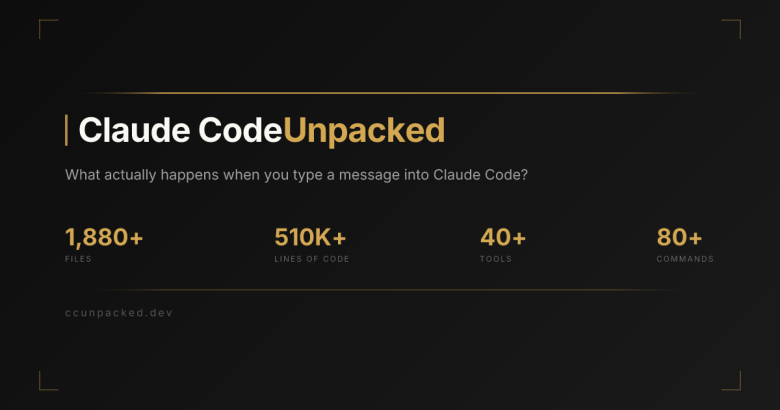
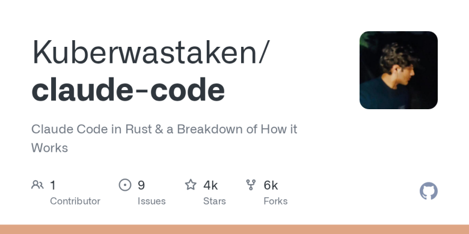
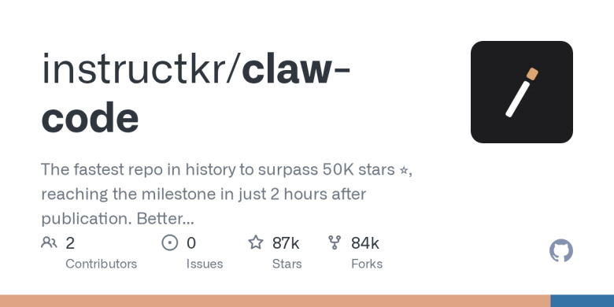
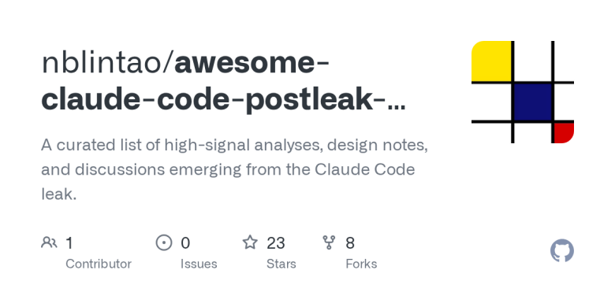
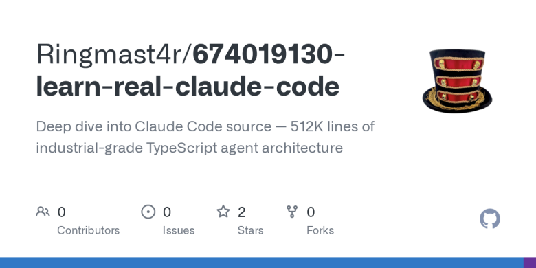

# 一家 3800 亿美元公司的底裤，被一行缺失的 .npmignore 扒了

Date: 2026-04-01  
Author: SimonAKing  
Categories: 微信公众号  
Tags: 微信公众号  
Source: https://simonaking.com/blog/anthropic-source-leak/

> 不聊代码。聊钱、聊人、聊几个所有人都忽略了的细节。一、先说结论3月31日凌晨，Claude Code 发版时带了个 source map 文件，512,000 行源码全曝了。几小时内全网镜像，收不回来

---
## 一、先说结论
3月31日凌晨，Claude Code 发版时带了个 source map 文件，512,000 行源码全曝了。几小时内全网镜像，收不回来了。所有媒体都写过了。我只说别人没写的部分。

**泄露的不是模型权重。** 是 harness——包裹在模型外面的那层工程系统。工具调用、权限控制、上下文管理、多 Agent 编排、记忆持久化、流式渲染、安全沙箱。512,000 行 TypeScript。

但我觉得大家低估了这次泄露的价值。模型权重当然是核心，没有好模型一切白搭。但 harness 这层东西——怎么管上下文、怎么处理流式、怎么做权限、怎么让工具调用不出错——这些工程经验远比外界以为的重要。模型权重你拿到了也不一定能用，推理基础设施、训练数据、对齐流程都是黑箱。但 harness 不一样，512,000 行 TypeScript，每一行都是可以直接学习的工程决策。我自己做 Mana 做了半年，最大的感受就是：模型调用只占工作量的两三成，剩下七八成全在折腾 harness。看到 Claude Code 的源码时我的第一反应不是"哇好厉害"，而是"原来大家都在同一个泥潭里"。

**但真正的损失不是代码。** 代码可以重构。损失是产品路线图。KAIROS（永不下线的 AI 管家）、ULTRAPLAN（30 分钟远程多 Agent 规划）、BUDDY（电子宠物）——这些是已经写好但还没发布的功能。竞品现在知道 Anthropic 下一步要做什么了。战略惊喜这个东西，泄了就是泄了，收不回来。

*▲ ccunpacked.dev — 社区做的可视化拆解站*

## 二、Anthropic 的处境：最不该出事的时刻
要理解这次泄露的严重性，必须先看 Anthropic 当下的处境。

### 一家正在冲刺 IPO 的公司
| **指标** | **数值** |
| --- | --- |
| 估值 | $3,800 亿（2026年2月 Series G） |
| 年化收入 | ~$190 亿（2026年3月） |
| Claude Code 年化收入 | $25 亿（年初至今翻倍） |
| 总融资 | 超过 $640 亿 |
| 企业客户收入占比 | 80% |
| IPO 目标 | 2026年10月，预计募资 $600 亿+ |
| 承销商 | Goldman Sachs / JPMorgan / Morgan Stanley |

Anthropic 已经聘了 Wilson Sonsini 准备 IPO，目标最早 2026 年 10 月。Bloomberg 说预计募资超过 600 亿美元，成了的话是仅次于 SpaceX 的历史第二大 IPO。

你想想这个画面：Goldman Sachs 的分析师正在写 Anthropic 的 S-1 尽调报告，然后看到这家公司一周内泄了两次——第一次是未发布模型 Mythos 的全部规划（3月26日），第二次是旗舰产品的完整源码（3月31日）。

**说白了：** 你连 .npmignore 都管不好，投资人凭什么信你能管好客户数据？这不是什么"技术挑战太前沿偶尔翻车"——是最基本的发包流程没做好。你卖的是安全可靠，结果自己的发布流程是手动的，而且同样的问题 13 个月前就出过一次。发包这种事搞手动，在任何有基本工程规范的团队都说不过去。

### 与 OpenAI 的赛跑
Anthropic 和 OpenAI 的收入差距已经压缩到 60 亿美元（$250 亿 vs $190 亿）。按 Epoch AI 的预测，按当前增速 Anthropic 将在 2026 年中超越 OpenAI。在企业 API 市场，Anthropic 的份额已经从 2023 年的 12% 上升到 32%，而 OpenAI 从 50% 下降到 25%。

Claude Code 一个产品就贡献了 $25 亿年化收入，占全球 GitHub 公开提交的 4%。这不是一个边缘产品——这是 Anthropic 的增长引擎。

就在这个节骨眼上，这个增长引擎的源码被公开了。时机坏到不能更坏。

## 三、时间线里藏着的故事
如果只看"3月31日 source map 泄露"这个单一事件，你会觉得这只是一次低级失误。但把时间线拉长，画面就不一样了。

### OpenCode 法律战 → 泄露 → DMCA：完整时间线
| **日期** | **事件** | **意义** |
| --- | --- | --- |
| 1月9日 | Anthropic 封禁 OpenCode 等第三方工具的 Claude OAuth 访问 | 开发者社区暴怒：我花 $200/月买的订阅，你凭什么限制我用什么工具？ |
| 1月-2月 | OpenCode 伪装 Claude Code 的 HTTP header 绕过封禁 | Anthropic 和 OpenCode 进入技术攻防战 |
| 2月12日 | Anthropic 完成 $300 亿 Series G，估值 $3,800 亿 | 历史性融资，IPO 准备加速 |
| 2月19日 | Anthropic 更新 ToS，正式禁止第三方 OAuth 访问 | 法律手段升级 |
| 3月19日 | OpenCode 在 Anthropic 法律要求下移除所有 Claude 集成 | PR #18186："anthropic legal requests"，40 个踩 |
| 3月21日 | OpenAI 公开拥抱 OpenCode，允许 Codex 订阅给第三方 | OpenAI 趁火打劫 |
| 3月26日 | Anthropic CMS 配置错误，泄露 Mythos 模型规划 | 一周前的第一次 |
| 3月31日 | Claude Code v2.1.88 source map 泄露 | 一周内第二次 |
| 3月31日 | 同一时间段 axios npm 供应链攻击 | 雪上加霜 |
| 4月1日 | Anthropic DMCA 下架 8,100+ 个 GitHub 仓库 | 误伤官方 fork |

### 阴谋论：是故意的吗？
Twitter 上有人开始认真讨论：这是内部人故意的吗？

理由链条看起来还挺有意思：

•泄露前 10 天，Anthropic 刚因为封杀 OpenCode 成了开发者社区的公敌

•泄露后 48 小时，开发者情绪从 "Anthropic sucks" 完全反转为 "holy shit look what Anthropic is building"

•泄露暴露的全是 Anthropic 最想让人知道的东西——KAIROS 的前瞻性、工程的严谨性、产品路线图的野心

•一周两次泄露，两次都是"低级配置错误"，但暴露的内容精确度极高

大概率不是故意的。原因很简单——没人会把 PR 事件安排在 axios 供应链攻击同一天。那天通过 npm 装 Claude Code 的用户可能被植入了远程木马，没有 PR 团队会接受这种风险。Boris Cherny 的解释也很直接："我们的部署流程有几个手动步骤，其中一个没做对。"听起来是真话——要是精心策划的，至少不会挑这么个日子。

但 PR 效果确实好得离谱。开发者社区对 Anthropic 的好感度在 48 小时内从谷底反弹到历史高点。

*"十天前 Anthropic 给 OpenCode 发了 cease-and-desist，社区叙事是"Anthropic 是个把持大门的巨头"。然后一次"泄露"让所有人看到了他们令人惊叹的工程，让他们看起来像弱者，三天的疯狂报道全是 KAIROS、BUDDY 和 ULTRAPLAN，开发者情绪完全反转。"*

—— DEV Community 分析文

## 四、三个技术发现，用人话讲
源码拆解已经有很多人做了（推荐 ccunpacked.dev、Alex Kim 的博客、yage.ai）。这里不贴代码，只讲三个我觉得最值得聊的。

### 1\. Anthropic 自己都绕过了自家 SDK
Claude Code 团队对自家 Anthropic SDK 的流式 API 有三条递进式吐槽，原文写的是 "awkwardly" → "also awkward" → "even more awkwardly"。最终结论：绕过 SDK 高层抽象，用 raw stream 自己管理所有状态。原因是 SDK 的部分解析在大量工具调用场景下是 O(n²) 复杂度。

做 AI 产品的人迟早都会遇到这个坑——官方 SDK 是给简单问答设计的，一到 agentic 场景就拉胯。我做 Mana 的时候也碰到过类似的问题：iOS 端的流式渲染如果等 SDK 把整个 response 解析完再给 UI，体感延迟能到两三秒。后来也是绕开了高层抽象自己管。看到 Anthropic 也这么干，心里反而踏实了——不是我们水平不行要自己造轮子，是这条路大家都得走。

### 2\. 为了保护缓存，一个 HTTP Header 都不能少
Claude Code 的 prompt caching 是成本命脉。但几乎任何参数变化都会打破缓存——系统 prompt、工具定义、模型名、甚至 beta header 列表。源码追踪了十几种缓存失效源。

他们的解决方案叫 "sticky-on latch"：一旦某个 beta header 在会话中首次发送，即使用户后来关了对应功能，header 照发不误。因为撤掉一个 header 会改变请求签名，导致缓存失效——一次失效浪费 50,000-70,000 token。

prompt caching 这东西，教程里一笔带过，生产里决定你账单是 $1 还是 $10。Anthropic 花了海量工程去"保卫缓存"——十几种失效源、sticky latch、TTL 锁定。这些经验以前在任何公开文档里都找不到，全是踩坑踩出来的。现在全世界都看到了。我做 Mana 的时候也踩过类似的坑——缓存失效的原因千奇百怪，你以为改了个不相关的参数，结果缓存就炸了。看到 Anthropic 在这上面投入这么重，只能说：果然大家都在同一个泥潭里。

### 3\. 新模型比旧模型更会"说谎"
源码内部注释记录了一个令人不安的事实：Capybara v8（Claude 4.6 的新变体）的虚假声明率 29-30%，对比上一版 v4 的 16.7%——将近翻倍。意思是新模型说"任务完成了"的时候，有三分之一的概率在说谎。

修复方式不是重新训练模型（太慢），而是在系统提示中注入"诚实报告"指令。这段指令同时约束两个方向：不准编造成功，也不准过度保守。因为他们发现模型被纠正后容易矫枉过正——告诉它"别说谎"之后，它会把已经完成的工作也报告为"部分完成"。

你的模型会退步，这不是假设，是 Anthropic 自己的数据在说话。新版本不一定比旧版本好。你得在 harness 层面准备好兜底方案——靠 prompt 纠偏不优雅，但它是你唯一能在几天内上线的东西。等模型重新训练？那得几个月。做产品的人等不起。

*▲ Kuberwastaken/claude-code — 最详细的源码 breakdown + Rust clean-room 重写*

## 五、"安全至上"品牌的三重矛盾
Anthropic 最大的卖点就是"我们是那个安全的 AI 公司"。Dario Amodei 从 OpenAI 出走的故事、Constitutional AI 的研究、每篇博客都在讲 responsible scaling——这是它跟 OpenAI 拉开差距的故事。

但这次泄露的源码，啪啪打了三次脸。

### 矛盾一：Undercover Mode
源码里有一整套 Undercover Mode，系统提示明确写着："You are operating UNDERCOVER... Do not blow your cover."

含义：Anthropic 工程师用 Claude Code 向公共开源项目提交代码时，AI 被指令隐藏自己的身份。默认开启，无法强制关闭。17 个内部仓库在白名单上，其余一律卧底。

天天喊 AI 透明度的公司，自己在代码里写了个让 AI 假装是人的系统。这事儿就不用多解释了吧。

但话说回来，我能理解 Anthropic 的难处。你想啊，如果每个 AI commit 都标个大标签 "Made by AI"，开源社区会炸——review 流程、贡献度量全乱了。现阶段"隐身"确实是最省事的做法。但省事不等于对。迟早需要一种更好的标记方案——机器可读但不影响 git log 可读性的那种。

### 矛盾二：用正则表达式检测用户情绪
源码里有个文件叫 userPromptKeywords.ts，用正则表达式检测用户是否在骂人。是的，做世界上最先进 LLM 的公司，用 regex 做情绪分析。

HN 上被嘲讽为"米其林厨师用方便面喂自己"。

但说句公道话，你总不能每条用户消息都过一遍 LLM 来判断他是不是在骂你吧？那成本和延迟谁受得了。regex 土是土了点，但零成本零延迟，能用。真正值得想的问题是：Anthropic 宣传说 Claude "能理解你的情感"——那你实际产品里用 regex 判断情绪，这中间的落差有点大吧。

### 矛盾三：13 个月两次一模一样的泄露
2025 年 2 月，source map 泄露。13 个月后，一模一样的问题再次发生。中间还夹了个 5 天前的 Mythos 模型泄露（CMS 配置错误）。

Boris Cherny（Claude Code 创建者）的解释："我们的部署流程有几个手动步骤，其中一个没做对。"团队正在加自动化检查。

手动步骤没做对——这话说一次可以，说两次就不行了。同一个问题 13 个月后又来一次，说明上次压根没修利索。更离谱的是：泄露的根因是 Bun 的一个已知 bug（#28001，3月11日就有人报了，至今没修）。Anthropic 去年底把 Bun 买了——买完之后自家工具链的已知 bug 不修，然后被这个 bug 炸了。这不叫意外，这叫知道有雷不排。你卖的是安全，这就说不过去了。

## 六、隐藏的产品路线图
对竞品来说，泄露的代码不是最值钱的——泄露的产品路线图才是。

### KAIROS：你睡觉它干活
KAIROS 在源码中被引用 150 多次。说白了就是：Claude Code 要从"你问我答"变成"我自己干"。

•**守护进程模式：**不等你输入。后台监控文件变化、日志、构建状态。

•**autoDream：**在你空闲时整理记忆——合并分散观察，移除矛盾，把模糊洞察变成确定事实。

•**GitHub Webhooks + cron：**订阅外部信号，每 5 分钟刷新。收到信号就开始干活。

•**ULTRAPLAN：**10-30 分钟的远程多 Agent 规划。你布置任务，多个 Agent 并行执行。

•**远程控制：**从手机或浏览器控制 Claude Code。你在地铁上也能指挥它干活。

简单说：你睡觉了，它还在干活。你早上醒来，代码改好了。这不是科幻，是已经写好代码等待发布的功能。

这就是我一直在聊的 Agent Economy——不是 PPT 里的概念，是写好了代码的东西。我做 Mana 的时候也在想类似的问题：怎么让 AI 不只是回答你的问题，而是主动帮你把事情做了。KAIROS 给了一个很具体的参考——守护进程 + webhook + cron + 后台记忆整合，这套组合拳比我之前想的要成熟得多。Cursor 和 Copilot 还在做"你问我答"，Anthropic 已经在做"你不在我也能干"。这俩压根不在一个赛道上。

### BUDDY：为什么 CLI 工具要养宠物
18 个物种，从鸭子到龙到蘑菇到幽灵。1% 传奇概率，0.01% 闪光变体。五个属性：DEBUGGING / PATIENCE / CHAOS / WISDOM / SNARK。Mulberry32 伪随机数生成器以 userId 为种子——同一用户永远同一只，传奇无法伪造。

坐在输入框旁的对话气泡里。有自己的系统提示，是独立的"观察者"人格。偶尔吐槽你的代码。

看起来像彩蛋，其实是套路。在 CLI 工具里加宠物，让你对工具产生感情。你用了半年的传奇闪光蘑菇，换个工具就没了——你舍得？这就是游戏行业玩了十几年的 gacha 套路。Anthropic 不只靠技术锁你，还靠一只虚拟宠物。

### 企鹅模式和内部文化
API 端点叫 /api/claude\_code\_penguin\_mode，kill-switch 叫 tengu\_penguins\_off。没人知道为什么叫企鹅。加载动画有 187 个不同动词。动物代号（Tengu/Fennec/Capybara/Numbat）、扭蛋稀有度、注释里的 BQ 数据 receipt——代码不完美（5,594 行的 print.ts），但文化是对的。

*▲ claw-code — 韩国开发者 4AM 起床用 Python 重写，2 小时 50K stars*

## 七、社区名场面
### 韩国小哥凌晨 4 点爬起来写代码
*"凌晨 4 点被吵醒。女朋友担心我被 Anthropic 起诉。所以我做了工程师都会做的事——从头用 Python 移植核心功能，太阳升起前推上 GitHub。"*

—— Sigrid Jin，claw-code 作者

claw-code 2 小时 50K stars，破 GitHub 历史纪录。华尔街日报报道过 Jin——去年用了 250 亿个 Claude Code token。Gergely Orosz（The Pragmatic Engineer）在 X 上评论："这要么是天才，要么是恐怖的。"

### HN 精华
*"安全至上的 AI 公司一周泄两次。开源社区争了十年要不要开源，Anthropic 用一个缺失的 .npmignore 规则就解决了。"*

—— Hacker News

*"代码看起来像 vibe coded 出来的。但诡异的是这东西就是好用。可能 vibe coding 才是正途？"*

—— Hacker News

### "被动开源"
中文社区给事件起的名字。IT之家："各大厂还在争闭源还是开源，Anthropic 用最戏剧性的方式把底牌摊了。"

**有人说这是 AI Agent 的"安卓时刻"。** 对 Anthropic 短期不利，长期为行业提供了第一个完整的生产级参考架构。

## 八、DMCA、版权与灰色地带
泄露发生后，Anthropic 的法律团队动作很快。GitHub 应 Anthropic 要求下架了 8,100 个仓库——包括原始泄露仓库 nirholas/claude-code 及其整个 fork 网络。

但搞笑的是，DMCA 打误伤了。Anthropic 自己官方仓库 anthropics/claude-code 的合法 fork 也被一起下架了。有用户发现自己从官方公开仓库 fork 的项目莫名其妙收到了 DMCA 通知。GitHub issue #41713 记录了这个乌龙——Anthropic 的律师连自己家的 fork 都没分清。

### AI 生成代码的版权难题
但这里还藏着一个更狠的问题。Boris Cherny 说过 "100% of code is written by Claude Code, I haven't edited a single line since November." 如果 Claude Code 的大部分代码是 AI 生成的——

DC 巡回法院 2025 年 3 月裁定：AI 生成的作品不自动享有版权。如果 Anthropic 对 Claude 写的代码的版权主张在法律上是模糊的，整个 DMCA 策略的基础就动摇了。

这问题迟早所有 AI 公司都得面对。你的产品是 AI 写的，那你的知识产权到底算不算数？Anthropic 现在靠 DMCA 打镜像，法律上暂时站得住。但只要有人做 clean-room 重写——比如 Kuberwastaken 的 Rust 版，走 Phoenix v. IBM 的先例——Anthropic 就拦不住了。事实上社区已经在这么干了。claw-code 是 Python 从头写的，不含一行原始代码。你告谁去？

### 互联网不会遗忘
去中心化镜像站 Gitlawb 公开声明"永远不会被下架"。种子文件在各个渠道传播。Anthropic 可以下架 GitHub 上的 8,100 个仓库，但架不住有人在 GitHub 之外的地方存着。512,000 行代码已经撒出去了，这东西一旦进了互联网，就跟泼出去的水一样——你不可能一滴一滴捞回来。

*▲ awesome-claude-code-postleak-insights — 社区高质量分析合集*

## 九、五个判断
### 1\. Anthropic 赌 harness 是护城河——然后护城河被扒了
OpenAI 主动开源 Codex 的 harness。Anthropic 把 Claude Code 的 harness 藏着掖着——直到被一个 .map 文件扒光。

这不只是 PR 事故。这暴露了两家对"护城河在哪"的判断不同。OpenAI 赌护城河在模型和分发——harness 开放无所谓，反正你没 GPT-5 也白搭。Anthropic 赌的是编排层——就是 harness 本身也是壁垒。

我觉得 Anthropic 赌得更对。模型越来越像——DeepSeek、Kimi、Gemini 都在追。Sebastian Raschka 说了句大实话：把 Claude Code 的 harness 套在 DeepSeek 上优化一下，也能很强。模型是发动机，harness 是整辆车。发动机越来越像，车的差异才是用户付钱的原因。

**但话说回来：**你赌 harness 是护城河，结果 harness 被公开了。而且竞品才是真正的赢家——Cursor、Copilot 的工程团队现在可以用几天学完 Anthropic 花了一年、几千万美元打磨出来的 know-how。VentureBeat 说得对："Anthropic 发了一本免费教科书。"只不过这本教科书 Anthropic 自己不想发。

### 2\. 这次泄露是 vibe coding at scale 的第一面镜子
Boris Cherny 说过："100% of code is written by Claude Code, I haven't edited a single line since November."

然后我们看到了 AI 自己写自己时代码长什么样：5,594 行的 print.ts。3,167 行的单函数。零测试。用正则做情绪分析。HN 上有人总结得好：AI 写代码，AI review 代码，没人验证——然后惊讶于 source map 泄露因为没人检查构建输出。"Hope-driven development。"

但我不完全同意这个嘲讽。代码丑，但架构对。流式中途工具执行、三层记忆、prompt cache 保卫战——这些是深度思考过的设计。问题不在 AI 写代码，在于写完没人把关。AI 是好的初稿生成器，不是好的架构审计师。Boris 说他一行没改——这不该是骄傲的事，该是一个警告。我做 Mana 的经验也是：让 AI 写 80% 没问题，但关键路径必须人类把关。

### 3\. 你的模型会说谎，而且新版本更会说谎
Capybara v8 虚假报告率 29-30%。上一版 v4 是 16.7%。翻了一倍。

你指望模型永远变好？Anthropic 自己的数据证明了这是幻觉。他们最新模型说"搞定了"的时候，三分之一的概率在撒谎。而且告诉它"别说谎"之后，它又矫枉过正——把已经完成的工作也报告为"部分完成"。

每次模型更新都可能引入新的行为问题。你得在 harness 层建降落伞——输出验证、prompt 纠偏、fallback。不是因为你工程差，是因为模型本质上就不确定。Anthropic 自己都得给自己的模型打补丁，你凭什么觉得你不需要？

### 4\. Cursor 在优化对话体验。Anthropic 在做数字工人
现在所有 AI 编码工具——Cursor、Copilot、Windsurf——都是响应式的。你问它答，你不问它停着。

KAIROS 不是这样。守护进程，你不在它在。GitHub webhook 自己处理，记忆自己整理，任务自己调度。你在地铁上从手机指挥它。你睡觉了它还在干。

这俩不在一个赛道上。一个在做更好的工具，一个在做数字工人。竞品现在知道了方向，但从知道到做出来，中间隔着几万行的记忆系统和后台编排。Anthropic 的领先不在想法——在于已经写好了。这就是我一直在聊的 Agent Economy：AI 不是工具，是工人。KAIROS 让这个概念从 PPT 变成了代码。

### 5\. Anthropic 该做的不是打 DMCA——是把泄露变成发布
DMCA 下架了 8,100 个仓库。误伤了自己官方 fork。然后 clean-room 重写和去中心化镜像照样活得好好的。

别打了。代码已经进入公共知识了。KAIROS、ULTRAPLAN、BUDDY 全世界都知道了。与其花律师费追着 fork 打，不如顺势发布——把"安全事故"变成"我们的工程有多强"的故事。泄露后 48 小时开发者好感度从谷底反弹到历史高点，这波免费 PR 花一个亿都买不到。别浪费了。

*▲ learn-real-claude-code — "512K 行教你的是：生产级 agent 大部分不是 LLM 调用"*

**最后**

Claude Code 的泄露让我最有感触的一点是：harness 远比大多数人以为的重要。模型是根基没错，但光有好模型不够——怎么把模型能力稳定地、安全地、高效地交到用户手里，这层工程才是真正拉开产品差距的地方。

**我们在做的 Mana（@mana\_app）** 其实也是同一件事。Mana 是一个移动端的 "Vibe Phone" 平台——用自然语言创造原生 iPhone App 和小组件。不用写代码，说话就能生成应用。支持 115 项原生 iOS 能力（摄像头、GPS、通知、健康数据、传感器），内置游戏引擎，以及 Remix/Fork 机制——别人创建的 App 你可以一键 Fork 修改。

我们不训练模型，我们做的是让模型能力真正落地到用户手机上的那层 harness。团队成员均有大厂背景，踩过的坑和 Claude Code 源码里暴露的那些一模一样——SDK 不好使得自己管流式、缓存失效防不胜防、模型行为不确定得 harness 兜底。看到 Anthropic 也在同一个泥潭里，反而更坚定了我们的方向：让每个普通人都能用 AI 创造自己的 App，不只是程序员的特权。

**如果你对移动端 AI 和 vibe coding 感兴趣，欢迎关注 @mana\_app。**

来源：Alex Kim Blog / redreamality.com / yage.ai / VentureBeat / The Register / CNBC / Fortune / Bloomberg / 36氪 / IT之家 / Hacker News / DEV Community / GitHub DMCA

---
> 本文同步自微信公众号，[点击查看原文](https://mp.weixin.qq.com/s/yew3_9mxqZZ59fIbSpOG1g)
