# 深度分析：Apple 的 AI 困局 一家万亿公司的傲慢、内斗与自我救赎

Date: 2026-04-04  
Author: SimonAKing  
Categories: 微信公众号  
Tags: 微信公众号  
Source: https://simonaking.com/blog/apple-ai-dilemma/

> 一、**Siri：从行业先驱到全公司最大的笑话** 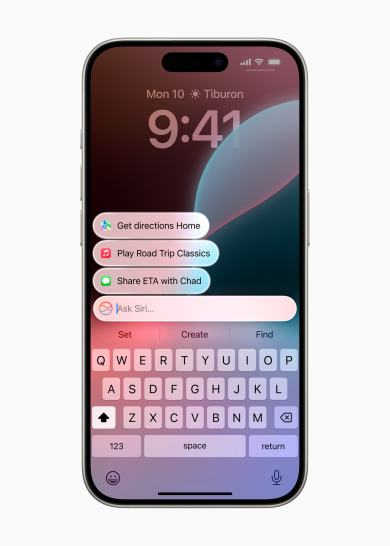 *新Siri的“发光边框”——两年了，用户等来的就这个* 2011年，Siri随iPhone 4S登场，教会了几亿人怎

---
一、**Siri：从行业先驱到全公司最大的笑话**

2011年，Siri随iPhone 4S登场，教会了几亿人怎么跟手机说话。那一年，Google Assistant还不存在，Alexa是个想都不敢想的东西。Apple当年在AI这条赛道上，起步比谁都早。

然后呢？十四年过去了。

2025年，Siri成了科技圈最大的meme。连三星的Bixby在很多场景下都比它好用。

John Gruber——跟踪Apple二十多年的老牌评论人——给Apple 2025年AI表现打了F，原话是*“一场彻底的、非常公开的失败”*。如果Apple Report Card里有单独的AI评分项，这个F会更扎眼。

问题出在哪？The Information在2025年4月做了一篇炸弹级报道，超过半打前Apple AI团队员工接受了采访，揭开了Siri溃败的内幕。

## 二、Siri内部：一部宫斗剧
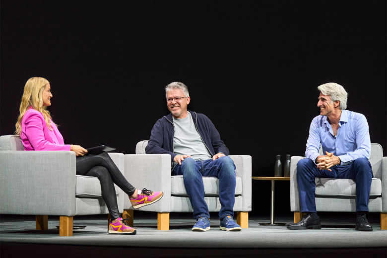

*Giannandrea和Federighi同台——台上握手言欢，台下两个团队打得不可开交*

先说人。

**John Giannandrea**——2018年从Google挜来的AI掌门，直接向Tim Cook汇报。

他的AI/ML团队内部有个不雅绰号，叫**“AIMLess”**——漫无目的。这个绰号在Apple工程师之间广为流传，说明了内部人怎么看这个团队的执行力。

The Information的报道揭了一个关键细节：Giannandrea在2022年ChatGPT发布时，曾跟团队说chatbot没什么用。没什么用。高层对ChatGPT引发的革命**没有产生任何紧迫感**。一位前员工的原话概括了一切：*"Senior leaders didn’t respond with a sense of urgency to the debut of ChatGPT in 2022.”*

再说Siri的直接负责人**Robby Walker**。多名前同事评价他：缺乏野心，不敢冒险，沉迷于“小赢”。他的得意之作包括：把“Hey Siri”的“Hey”去掉——这个功能花了**两年多**才搞定。他还用边际百分比的方式优化Siri的响应延迟。

更离谱的是一件事：有一组工程师想用LLM让Siri具备情感敏感度——比如检测到用户在痛苦中时给出合适的回应。Walker否了这个项目。

架构决策也是反复横跳。最初的计划是同时做两个模型——端侧小模型代号“Mini Mouse”、云端大模型代号“Mighty Mouse”。后来Walker拍板改成只做一个大的云端模型。然后又变了。这种反复横跳让工程师极其沮丧，不少人选择离职。

**两支团队的内斗**才是最致命的。Giannandrea的AI/ML组和Federighi的Software Engineering组之间，已经到了互相猜忌的地步。Software Engineering的人不满AI组薪资更高、升迁更快、还能“周五早退和休更长的假”。

与此同时，Federighi悄悄搭建了自己的AI兵力——一个叫**“Intelligent Systems”**的数百人团队，由他的副手Sebastian领导。这个团队被内部认为是实际交付Apple Intelligence功能的主力。两套AI团队在同一家公司并行，互不信任。

## 三、WWDC 2024：那场改变一切的“假演示”
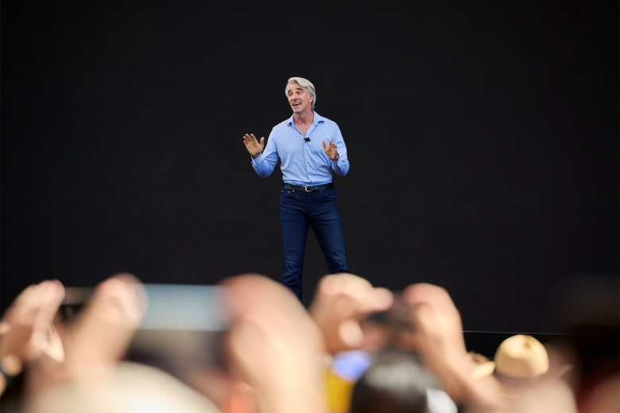

*Federighi在台上演的那些功能，Siri团队自己都没跑通过*

2024年6月，WWDC舞台上，Apple展示了Apple Intelligence最惊艳的功能——Siri帮你查邮件找航班信息、跨App安排午餐，一气呵成。

但据The Information报道，这场演示**让Siri团队自己都惊了**——因为他们从来没见过能跑起来的版本。当时唯一在测试设备上真正运行的新功能，只有Siri的那个发光边框动画。

划重点：这是Apple历史上的一次重大背离。这家公司以前的规矩是——发布会上只展示已经在测试设备上跑通、且市场团队确认能按时发布的功能。

WWDC 2024打破了这个传统！

然后 Apple 拿这些不存在的功能去卖iPhone 16。

官网首页写着“Hello, Apple Intelligence”，门店销售拿它当最大亮点。一个beta都算不上的东西，拿来卖手机。

## 四、四次跳票：从“即将到来”到“再等两年”
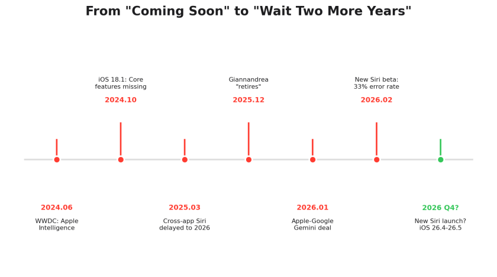

*两年了，核心功能还在“即将推出”*

时间线值得仔细看：

**2024年6月** WWDC发布Apple Intelligence，暗示年底上线核心Siri功能

**2024年秋** iOS 18.1上线，只有Writing Tools等基础功能，“更聪明的Siri”没来

**2025年3月** Apple正式宣布：跨App操作的Siri和个人上下文功能延期到2026年

**2025年3月** Tim Cook对Giannandrea失去信心，Siri从Giannandrea手中被剥离，交给Vision Pro的Mike Rockwell

**2025年4月** Rockwell开始全面清洗Siri管理层，把Vision Pro的得力干将调入Siri团队

**2025年12月** Giannandrea正式“退休”（说是退休，更像被退休），Apple从官网领导层页面直接删了他

**2026年1月** Apple与Google签多年合作协议，用Gemini驱动下一代Siri

**2026年2月** Bloomberg报道：内测中的新Siri错误率高达33%，响应延迟达3秒，部分功能可能推到iOS 27甚至2027年

四次跳票。从一家以“one more thing, available today”闻名的公司嘴里说出来，简直是品牌自杀。

Craig Federighi自己都承认了：这个功能*"didn’t work reliably enough to be an Apple product"*。Greg Joswiak更直接：*"We never want to ship something that had an error rate that we felt was unacceptable.”*

但话说回来，根据一个不存在的功能卖了一整代iPhone，多少有点超前了。

## 五、新AI掌门：从Google挜来的人，现在要用Google的模型
Giannandrea被“退休”后，Apple请来了**Amar Subramanya**——之前是微软AI Corporate VP，再之前在Google干了16年，负责过Gemini Assistant的工程。

MacRumors上有条高赞评论说得精辟：“一个负责过Gemini开发的人，现在来负责一个将由Gemini驱动的Siri。逻辑闭环了。”

Subramanya向Federighi汇报，不再向Tim Cook。这意味着AI不再是一个独立的战略层级，而是被塞进了Software Engineering下面。

你可以理解为：Apple终于承认AI不是一个可以单独存在的研究项目，它必须是产品的一部分。

但Giannandrea只是冰山一角。2025年12月那一周，Apple经历了**Tim Cook时代最大规模的高管离职潮**：

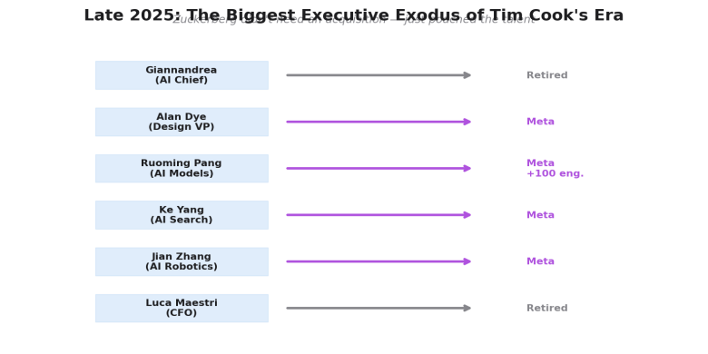

*扎克伯格没花一分钱收购费，靠挖人就抽干了Apple的AI血*

**John Giannandrea** — AI掌门，“退休”

**Alan Dye** — 自2015年起负责Human Interface Design，被Meta挜走，去领导Reality Labs设计工作室。Billy Sorrentino（高级设计总监）跟他一起走了

**Kate Adams** — 2017年起担任总法律顾问，宣布2026年底退休

**Lisa Jackson** — 环境、政策与社会责任VP，2026年1月退休

**Ruoming Pang** — AI Foundation Models团队负责人，7月已跳槽Meta，带走了约100名工程师

**Ke Yang** — Siri AI驱动的Web搜索负责人，10月跳槽Meta

**Jian Zhang** — AI机器人研究负责人，9月跳槽Meta

**Luca Maestri** — CFO，也在这一年选择了退出

一周内三位SVP级高管宣布离开，这在Apple历史上极其罕见。Fortune直接说了：*"Apple won’t be the same in 2026.”*

而Meta是最大的赢家——设计、AI Foundation Models、AI搜索、AI机器人四条线的负责人全去了Meta。扎克伯格没花一分钱收购，完成了对Apple AI团队的“外科手术式抽血”。

## 六、Apple与Google的AI联姻：万亿级的“投降书”
2026年1月12日，Apple和Google发了一份联合声明：下一代Apple Foundation Models将基于Google的Gemini和云技术。

说白了，Apple自己做不出足够好的大模型，买了Google的。据传每年费用约10亿美金，结构上是云计算合同。这笔交易的背景比表面更复杂：

## 1\. Jony Ive是导火索。
2025年5月，OpenAI以64亿美金收购了Ive的公司io。Apple的传奇设计师跑去帮Sam Altman做AI硬件。知情人透露，Ive转投OpenAI后，Apple和OpenAI的关系急剧冷却，这直接推动了Apple转向Google。

## 2\. Apple做过“bake-off”。
Google和OpenAI都参与了竞标。Google赢在技术全面性和Apple能接受的合作条款——Eddy Cue在反垄断案庭审中透露，Google之前竞标Apple Intelligence时提了“很多Apple不愿接受的条件，也没跟OpenAI接受的一样”。这次Google学乖了。

## 3\. OpenAI被边缘化了。
ChatGPT在Apple设备上变成了“可选的附加功能”，Gemini才是核心。Fortune的分析师直接说：Apple用户如果觉得Gemini好用，可能会开始把Gemini等同于AI，OpenAI的品牌心智优势就没了。Sam Altman自己说Apple是OpenAI的长期主要竞争对手。

我深度怀疑 Gemini 情绪价值给足了：

## 七、用户买账了吗？
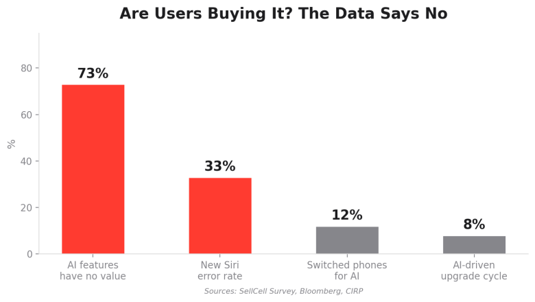

*73%的用户觉得Apple的AI功能“没什么用”——这数字比不做AI还尴尬*

数据说话。

SellCell的调查：**73%**的Apple Intelligence用户表示AI功能没什么价值或不如手机其他功能重要。作为对比，三星用户那边这个数字是87%——所以不只是Apple的问题，但Apple是那个嘴上喊得最响、落地最差的。

通知摘要是最大的灾难现场。一位母亲发短信说“今天爬山差点累死我”，AI摘要变成“试图自杀，但已康复”。BBC的新闻标题被AI改得面目全非，逼得Apple把新闻类通知摘要直接砍掉。有人收到Amazon包裹追踪摘要说：“你的包裹同时在8个站外、已送达、明天将送达。”

Apple期待的“AI超级换机潮”完全没有出现。Consumer Intelligence Research Partners的调查显示，大多数人去年换iPhone的原因还是——旧手机坏了。分析师们最初期望Apple Intelligence能驱动一波换机需求，但“我们没有看到市场预期的那种增长”。

Macworld的测试更直观：用同一张照片分别测试Apple的Clean Up、三星的Galaxy AI和Google Gemini的图片编辑功能，Apple的结果用他们自己的话说“不只是输了，是尴尬级别的输”。

Reddit 上的差评更是每天都能刷到。

## 八、论文打得响，产品一塡糊涂
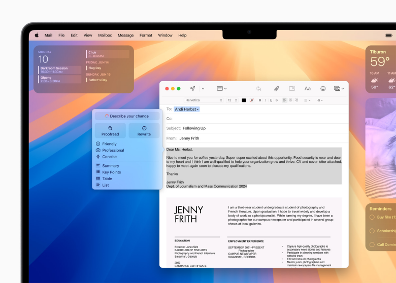

*Writing Tools——Apple Intelligence里少数真正能用的功能，但也就那样*

Apple的研究团队不是吃素的。这一点需要公平地说。

**《The Illusion of Thinking》**——2025年6月发表，用可控的拼图实验环境证明，所有前沿推理模型（包括o3、DeepSeek-R1）在复杂度超过阈值后会“推理崩溃”——准确率归零，而且推理token反而减少，仿佛模型“放弃了”。

这篇论文火遍全网，一度被各路媒体解读为“AI根本不会思考”。

我的判断：这篇论文与其说是纯粹的科研贡献，不如说是一次精准的**战略传播**。Apple在说什么？“我们不是落后了。那些烧几百亿训大模型的公司，它们的推理模型可能根本没有真正在推理。我们走小模型、端侧、任务专注的路，才是更严谨的方向。”

但学术界反响很分裂。Simon Willison直接说这篇论文“获得了远超其应得的关注度”，因为标题迎合了“LLM被过度炒作”那群人。有人发了反驳论文《The Illusion of the Illusion of Thinking》（后来被证实是恶作剧），但真正的学术反驳也不少——指出很多失败是因为输出token限制而非推理能力本身。Apple自己也承认研究用的是黑箱API，无法观察模型内部状态，结论不一定能泛化到所有推理领域。

除了这篇明星论文，Apple的研究实力体现在：

**Foundation Models Tech Report 2025（7月发布）：**397位作者联合署名，详细介绍了约30亿参数的端侧模型和服务端MoE模型的架构，包括KV-cache共享、2-bit量化感知训练等技术。端侧模型在公开benchmark上达到或超过同等大小的开源基线。

**MLX框架（2023年12月开源）：**专为Apple Silicon优化的机器学习框架，NumPy风格API，支持Swift/C++/Python绑定。这是Apple在开发者生态上做的最聪明的事之一——让Mac成为本地AI开发的最优硬件。

**ICLR、ICML、NeurIPS、CVPR：**Apple在所有顶会都有大量论文，覆盖计算机视觉、隐私保护、扩散模型、强化学习等。论文产出不输Google DeepMind和Meta FAIR。

**《The Super Weight in Large Language Models》：**发现LLM中极小的参数子集（有时只有一个参数）对模型整体功能有不成比例的影响。

**Private Cloud Compute：**这是Apple在隐私计算领域的真正创新——服务器端推理数据加密传输，Apple自己都无法访问用户内容。

说白了，Apple的研究团队有能力。问题是研究和产品之间有一条巨大的鸿沟——论文发了很多，产品交不出来。这是一个典型的“科研与工程脱节”的案例。

## 九、Apple做对了什么？
公平起见，要说说Apple这几年在AI上不全是灾难的地方：

## 1\. 芯片。
Apple Silicon的Neural Engine确实是硬实力。有测试显示Apple芯片每美元可输出1亿token，而Nvidia H100只有1200万。M5芯片在MLX上的本地推理速度比M4提升了19-27%。这是Apple最坚固的护城河。

## 2\. Foundation Models Framework（WWDC 2025）。
把约30亿参数的端侧模型以API形式开放给第三方开发者。最关键的点是：**零推理成本**。开发者在Apple生态内做AI App，不用付API费。这是目前唯一一个大规模提供免费端侧推理的平台。

## 3\. 隐私架构。
不管你怎么评价Apple的AI功能有多拉，Private Cloud Compute的架构设计确实领先。端侧处理优先、服务端加密、Apple自己无法看到用户数据——这不是营销话术，是有真实技术实现的。

## 4\. 收购策略（虽然太小了）。
DarwinAI（深度神经网络压缩）、Mayday Labs（AI日程管理）、Pointable AI（RAG和Agent）、WhyLabs（ML监控）、Common Ground（数字分身）——这些收购都指向正确的方向，但规模太小。Apple至今最大的收购是2014年30亿买Beats。有分析师说Apple“可能需要收购Anthropic”——但Anthropic 2025年3月的估值已经是615亿美金了。

## 5\. MLX开源生态。
这个框架让Mac成为了本地跑LLM最方便的平台之一。Ollama已经整合了MLX后端。这对开发者的吸引力是真实的。

## 十、95亿 vs 3000亿：这不是一个量级的比赛
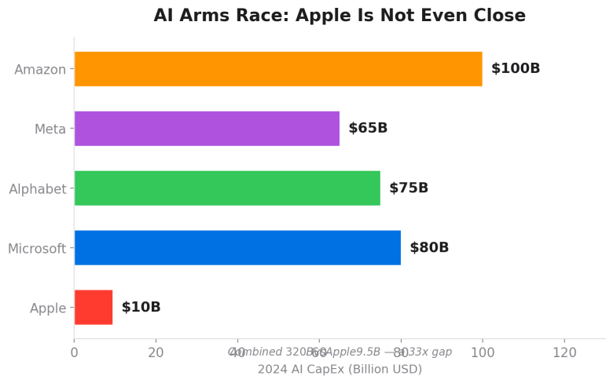

*别人砸3200亿搞AI，Apple只掏了95亿——差了整整33倍*

2024财年，Apple的资本支出是95亿美金，占总收入的2.4%。

同一年，Meta、Amazon、Alphabet、Microsoft四家计划总共投入超过**3000亿美金**。Amazon一家就要花1000亿，微软800亿。

Apple连训大模型的GPU都是**租Google Cloud的**。

这个差距不只是钱的问题。它意味着Apple在AI基础设施上根本不在同一个赛道。它的策略是——让别人训好模型，我来做整合和端侧优化。

这条路能走通吗？也许能。毕竟Apple从来不靠做底层技术赢，它赢的是整合、体验和生态。

但话说回来，如果底层模型能力完全受制于人，你的天花板就是别人给你的。以前Apple“不做搜索引擎，用Google的”——每年收200亿美金的默认搜索费。现在“不做大模型，用Google的”——每年付10亿美金的Gemini授权费。角色从**收租的**变成了**付租的**。

## 十一、外部威胁：Ive + Altman的组合拳
Jony Ive转投OpenAI这件事，值得单独说。

2025年5月，OpenAI以64亿美金收购了Ive的公司io。Ive将负责OpenAI的硬件产品设计。Altman说得很明确：这个设备要挑战手机作为人机交互主要入口的地位。

这不只是挜了Apple一个人。Ive带走了一批前Apple设计团队的人。而且io的合并意味着OpenAI现在有了一个世界级的工业设计能力——这正是OpenAI过去最缺的拼图。

Apple这边呢？也在做AI穿戴设备——一个类似AirTag大小的“AI Pin”，有双摄像头和无线充电，计划2027年推出，初始产量2000万台。

但OpenAI的设备据说2026年底就要出。先发优势在OpenAI那边。

更讽刺的是，Ive离开Apple是2019年的事。六年了，Apple没有再出过一个能定义品类的硬件设计——Vision Pro太贵太重，AirPods Pro只是迭代。AI时代的硬件定义权，可能要落到他的前设计师和他最大的AI对手手里。

## 十二、App Intents：一个“画了饼但开发者不买单”的框架
Apple Intelligence的终极愿景是什么？不是Writing Tools，不是Genmoji，而是**Siri能跨App帮你干活**。比如你说“找到Safari里那个菜谱，把食材加到我的购物清单里”——Siri理解你的意思，调用两个App，完成多步骤操作。

这个愿景依赖一个关键基础设施：**App Intents**。

App Intents不是新东西。它的前身SiriKit 2016年就有了，2022年升级为App Intents框架，用于Shortcuts、Spotlight、锁屏Widget等系统级整合。但WWDC 2024的那场“假演示”里，Apple把App Intents提升到了一个新高度——它是Siri理解和操作第三方App的“接口层”。

问题在哪？Apple的整个Siri AI升级计划，**高度依赖第三方开发者主动适配App Intents**。这不是Apple自己能搞定的事。开发者需要在自己的App里写代码、声明Intent、定义Entity、标记Schema——工作量不小，而且Apple至今没有发布正式可用的Siri端。

划重点：开发者被要求为一个**他们从未见过能跑起来的Siri**写适配代码。Apple的开发者文档至今仍然写着：*"Siri’s personal context understanding, onscreen awareness, and in-app actions are in development and will be available with a future software update."*——“未来的软件更新”，连个日期都没有。

据Mark Gurman报道，Apple目前只和大约8个头部App（包括几款知名社交和效率工具）在定向合作开发App Intents。Apple内部的工程师也在担忧：系统能否兼容足够多的App？在银行、健康等高敏感场景，准确率够不够？

这里有一个鸡生蛋蛋生鸡的困局：如果开发者不适配，新Siri就没有足够多的App可以操作，体验就不会好；体验不好，开发者更没动力适配。

对比一下微信小程序的路径：微信是先做好了基础设施和分发渠道，用流量和商业利益吸引开发者涌入。Apple的App Intents目前既没有成型的Siri，也没有给开发者可见的流量回报。这就是为什么App Intents虽然技术上设计得不错，但生态推进极其缓慢。

## 十三、小程序/Mini Apps：Apple学微信，学了个寂寞
说到微信小程序，就不得不提Apple在“轻量级应用”赛道上的尴尬历史。

2020年，Apple在iOS 14发布了**App Clips**——允许用户不下载完整App，通过NFC、二维码或链接直接启动一个轻量版应用，完成点餐、付停车费等即时任务。发布时，全世界的科技媒体都说：这不就是微信小程序吗？

微博上有人直接问：“App Clips，这不就是小程序吗？”

从功能层面看，App Clips确实是Apple对微信小程序模式的学习。但差距巨大：

微信小程序2017年上线，到2024年已经有超过**700万个**小程序，日活超过4亿，小游戏总用扃10亿，年交易规模数千亿。它已经是一个平行于App Store的应用分发生态。

App Clips呢？上线四年后，有策划者统计，被活跃使用的App Clips只有几十个。开发者采纳率极低。2020年底的统计显示只有10-20个App Clips被推荐。

2025年，Apple又推出了**Mini Apps Partner Program**——试图修复App Clips失败的问题。区别是Mini Apps可以持久留存（App Clips 30天后自动删除）、有更完整的开发者支持和变现路径。Apple还在从微信小程序的商业模式中抽佣——Bloomberg估计Apple从微信小程序交易中收取15%佣金，可能每年带来数十亿美金收入。

但核心问题没变：Apple至今没有像微信那样建立起一个有自发生长能力的小程序/轻应用生态。原因很简单——Apple的分发模型是App Store中心化审核制，而微信小程序是社交裂变+二维码扫码的去中心化分发。两种哲学，两种结果。

比如我做Mana，做的是让用户用自然语言创建原生iPhone App。说白了，Mana想做的事情和App Clips/Mini Apps的方向有重叠——都是降低App的创建和使用门槛。但Apple的平台策略对这类“让用户自己造App”的工具，态度非常矛盾。它一边鼓励开发者用App Intents接入Siri，一边又在封杀能帮用户跳过App Store的工具。

这就引出了下一个话题。

## 十四、Vibe Coding封杀令：Apple在AI时代最危险的一次傲慢
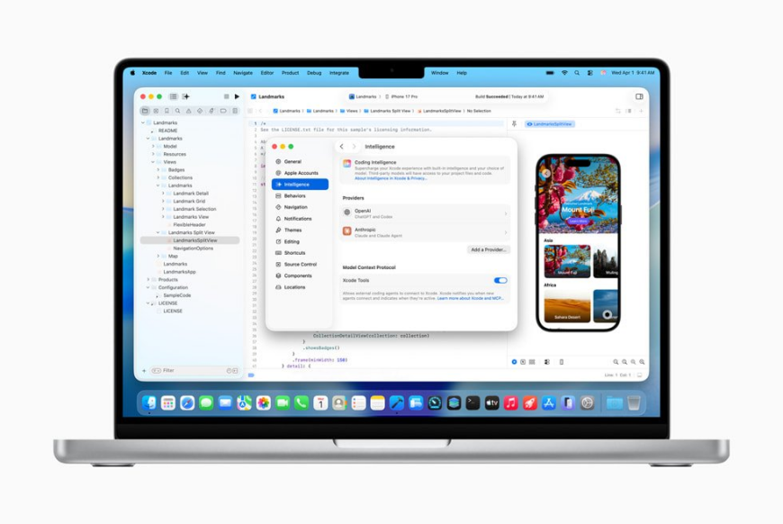

*Xcode自己拥抱AI编程，却不让用户在iPhone上vibe coding——双标到家了*

2026年3月，Apple悄悄封杀了多款“vibe coding”应用。

什么是vibe coding？这个词是Andrej Karpathy在2025年2月造的——用自然语言描述你想要什么，AI帮你生成并运行代码。不需要编程经验，对话式创建软件。Replit、Vibecode、Anything等App把这种能力带到了iPhone上。

然后Apple动手了。

The Information在3月18日报道：Apple以App Store审核规则**2.5.2条**为由，阻止Replit和Vibecode发布更新。这条规则的核心是：App必须是“自包含”的，不能下载、安装或执行会改变自身或其他App功能的代码。

表面看，这是一条存在多年的规则。Apple的发言人也说了：“这不是针对vibe coding App的新政策。”

但深层的逻辑很清楚：

## 第一，收入威胁。
Vibe coding App让用户可以直接在手机上创建web应用，这些应用不经过App Store，Apple抽不到30%的佣金。这直接挑战了Apple最核心的商业模式。

## 第二，分发威胁。
当一个App内部可以生成并运行无限多的新应用时，它本质上变成了一个**绕过Apple审核的替代App Store**。Apple审核的意义就没了——审过的App和用户实际运行的App完全是两回事。而且vibe coding已经在冲击App Store的审核体系本身——Sensor Tower数据显示，2025年12月App Store月度提交量同比增长**56%**，创四年新高。有开发者在Reddit上抱怨审核等了六周还没过，连Elon Musk最近都在吐槽iOS审核太慢。Apple自己声称90%的提交仍在48小时内处理完，但开发者社区的体感完全不是这样。

## 第三，竞争威胁。
Apple自己在Xcode里拥抱AI编程拥抱得比谁都积极。2025年9月Xcode 26集成了ChatGPT和Claude做代码辅助；2026年2月Xcode 26.3更进一步，引入了Anthropic的**Claude Agent SDK**和OpenAI的**Codex**，支持完整的agentic coding——AI可以自主浏览项目文件结构、理解架构、写代码、跑测试、甚至通过Xcode Previews视觉验证UI效果。Apple还采用了Anthropic开发的**MCP（Model Context Protocol）**作为开放标准接口，任何兼宽MCP的Agent都能接入Xcode。

Susan Prescott（Apple开发者关系VP）的原话是：*"Agentic coding supercharges productivity and creativity.”*

所以逻辑是这样的：**用Claude Agent在Xcode里自主写代码、跑构建、改项目设置？Apple鼓励。用Replit在iPhone上用AI生成一个App？Apple封杀。**同样是AI生成代码、同样是执行未经审核的代码，区别只在于：一个走Apple的工具链和App Store，一个不走。

具体的处理方式：

**Replit**（估值90亿美金）被告知：如果把生成的App改成在外部浏览器打开而不是App内WebView，就可以恢复更新。Replit从1月起无法发布更新，在开发者工具下载榜上从第一跌到第三。

**Vibecode**被告知：去掉“为Apple设备创建App”的功能，才能通过审核。

**Anything**更惨——直接从App Store下架。创始人尝试了浏览器版workaround，也被拒绝了。

讽刺的是什么？Apple一边在WWDC上推Foundation Models Framework鼓励开发者做AI App，一边在App Store里封杀让用户自己做App的AI工具。一边说“AI是Apple的未来”，一边把AI时代最有活力的开发者工具踢出去。

竞争律师Gene Burrus直接说了：Apple有“在自己平台上封杀竞争对手”的历史。

Google Play Store呢？没有对同类App施加相同限制。

我的看法：这可能是Apple在AI时代犯的最危险的一次傲慢。不是因为Replit或Vibecode本身多重要——而是因为vibe coding代表的趋势不可逆。当非程序员可以用自然语言创建软件时，整个“App Store审核-分发-抽成”的模型就面临根本性挑战。Apple可以封杀一个Replit，封杀十个Anything，但它封杀不了这个趋势本身。

更值得玩味的是Anything的遭遇。这个App去年11月上线，9月刚融了1100万美金、估值1亿。用户已经通过它在App Store上发布了数千个App。12月起Apple就开始阻止它更新，Anything团队试了浏览器预览的workaround——Apple拒了，3月26日直接下架。连妥协的机会都不给。

而同一周，一个功能几乎一模一样的印度vibe coding应用Emergent，更新被批准了，还冲上了开发者工具榜第一。规则一样，执行不一样。这种选择性执法，才是最让开发者寒心的。

但Anything团队没认输。今天（4月3日），他们在X上官宣了一个骚操作：**把vibe coding搬到了iMessage里。**推文原话：*"Apple is scared of vibe coding. They removed Anything from the App Store, so we moved app building to iMessage. Good luck removing this one, Apple."*

说白了，App Store不让活，那就寄生在Apple自己的iMessage生态里。iMessage extension是Apple自己开放的能力，你总不能把自己的Messages也下架了吧？这步棋直接把Apple架在了一个极其尴尬的位置上——封杀iMessage extension等于打自己的脸，不封杀等于默认vibe coding继续在iOS上存在。

X上瞬间炸了。开发者社区的情绪很一致：这不是一个App的反抗，这是整个vibe coding趋势对Apple围墙花园模式的正面挑战。

CNBC的专栏标题说得好：*"Apple’s crackdown on AI apps puts it on the wrong side of history.”*——Apple站在了历史的错误一边。

## 十四点五、Siri Extensions：Apple终于想通了？
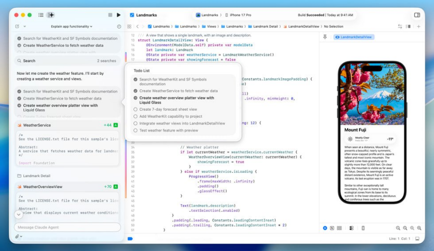

*Claude Agent已经能自主写代码跑测试了——Siri连跨App操作都搞不定*

就在封杀vibe coding的同一周，Bloomberg的Gurman又爆了一个大料：Apple计划在iOS 27中推出**Siri Extensions**——允许第三方AI助手接入Siri。

这意味着什么？如果你装了Gemini、Claude或ChatGPT的App，你可以通过Siri直接调用它们。Siri变成了一个AI的**路由器**，而不是唯一的AI。

目前测试版系统里已经有了相关描述：*"Extensions allow agents from installed apps to work with Siri, the Siri app and other features on your devices.”*用户可以在设置里自行开关想用哪些AI服务。Apple还计划在App Store里开辟一个专门的AI应用专区。

我的判断：这是Apple在AI策略上做过的最聪明的一步棋。

原因很简单——Apple终于想通了一个道理：**自己做不出最好的AI，那就做AI的平台**。就像它做不出最好的App但做了App Store一样。Siri不需要比ChatGPT聪明，它只需要成为你调用ChatGPT的入口。

而且这里面有商业利益。用户通过Siri订阅第三方AI服务，Apple照样抽成。ChatGPT的独占地位结束，变成和Gemini、Claude平等竞争。Apple从“依赖OpenAI”变成了“让所有AI公司来我这里交租”。

但讽刺也在这里：一边在Siri层面开放第三方AI接入，一边在App Store层面封杀让用户自己用AI造App的工具。一边说“来我的平台”，一边说“但只能用我允许的方式”。

这两件事放在一起看，Apple的逻辑其实很一致：**欢迎AI，但必须经过我的收费站。**

## 十五、接下来的12个月
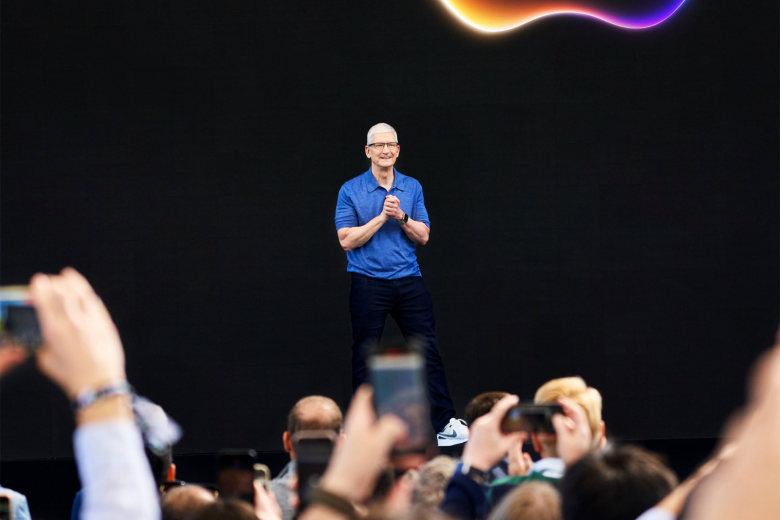

*Cook还有大约1.5年来证明Apple的AI不是一场昂贵的笑话*

TD Cowen分析师说得直接：Apple大约还有**1.5年**来拿出让人信服的AI方案。

Needham分析师Laura Martin说Apple在AI上落后竞争对手一到两年：“如果Android那边每年都在集成最新的Gemini和生成式AI，你下次换手机的时候——一年后、两年后——Android的AI体验会越来越好，Apple就会开始丢用户。”

新Siri（代号Campos，由Gemini驱动）如果顺利的话会在iOS 26.5或者27推出。如果再跳票，如果用户体验还是比不过直接用ChatGPT——Apple就要面对一个它从未面对过的局面。

## 我的判断
Apple的AI困局不是单一问题，是一系列矛盾的叠加：

## 技术上有能力，组织上执行不了。
芯片世界级、论文高产、MLX生态健康——但一个AI负责人对chatbot视而不见、一个Siri主管花两年去掉一个“Hey”、两个团队互相甩锅记日志、WWDC上演一场没人见过能跑起来的demo。

## 嘴上喊开放，手上在封杀。
一边推Foundation Models Framework鼓励开发者做AI应用，一边在App Store封杀vibe coding工具。一边说App Intents是Siri的未来，一边连正式可用的Siri都发不出来让开发者测试。

## 傲慢。
Apple的傲慢在于：它以为自己可以用“慢就是快”来应对每一个技术浪潮。在手机、手表、芯片上这套成立。但AI不是硬件，AI是速度和规模的竞赛。更要命的是，vibe coding这种趋势正在从根本上动摇“App Store审核-分发-抽成”的商业模式。Apple不是输给了某个对手，而是在用旧世界的规则试图管理新世界的创新。

好消息是Apple在调整——换人、换架构、换策略。坏消息是时间窗口只剩大约一年半甚至更短。

15亿台设备和全球最有消费力的用户群，是Apple最后的缓冲。如果这个缓冲期内还拿不出东西，那Apple在AI时代的故事，就不是“后来居上”，而是“起个大早，赶了个晚集”。

最后：

> 这篇文章里反复出现的一个矛盾：Apple自己在Xcode里全面拥抱AI编程，却用2.5.2条款封杀iPhone上的vibe coding工具。
> 
> 我们做的Mana，就踩在这条线上——用自然语言直接生成原生iPhone App，零代码门槛。
> 
> 接下来我们准备放一个大招：将团队过去沉淀的 **105个原生Skill全部开源**。这些Skill覆盖了从UI组件到系统能力调用的完整链路，是我们在端侧vibe coding上踩过的每一个坑、验证过的每一条路。
> 
> 移动端vibe coding是AI时代尚未被攻下的最大战场。
> 
> Mana要做的，不只是一个工具，而是这个品类的基础设施。
> 
> 欢迎关注、试用、交流合作。

---
> 本文同步自微信公众号，[点击查看原文](https://mp.weixin.qq.com/s/yUitXuzysxZdi2CTFIJjCQ)
