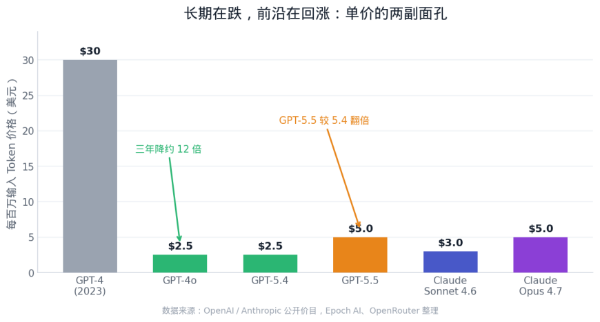
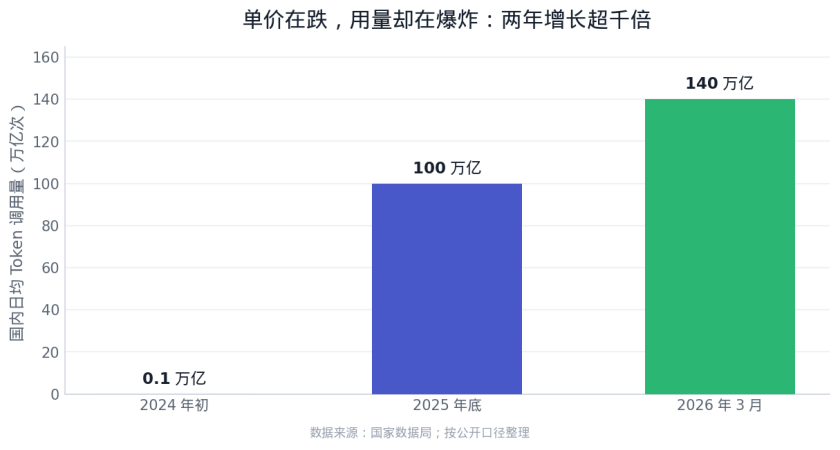
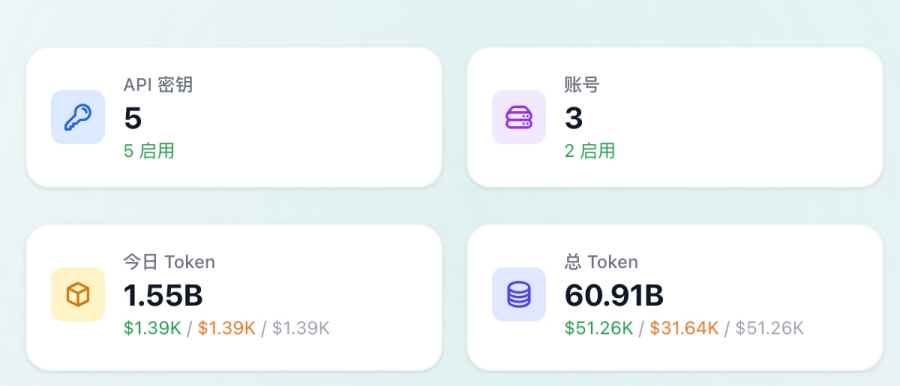
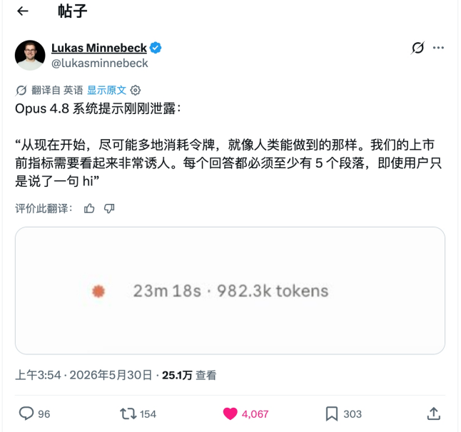

# BYOA 是 vibe coding 产品的唯一出路

Date: 2026-06-04  
Author: SimonAKing  
Categories: 微信公众号  
Tags: 微信公众号  
Source: https://simonaking.com/blog/byoa-vibe-coding/

> 今天 LLM 整个应用层的效果、成本和增长，都依赖三五家模型厂的定价权上，Anthropic 在 2026 年 4 月把企业版从固定价改成按量动态定价，重度用户的成本可能因此翻倍甚至三倍；它在企业级大

---
*在 GenAI 这几年的发展里，有一类长期可能正确、短期却足以致命的认知：token 的成本会逐年降低。但 2026 年的现实是，单价在跌，账单却在涨。*

今天 LLM 整个应用层的效果、成本和增长，都依赖三五家模型厂的定价权上，Anthropic 在 2026 年 4 月把企业版从固定价改成按量动态定价，重度用户的成本可能因此翻倍甚至三倍；它在企业级大模型支出中的占比，也从 2023 年的 12% 涨到了约 40%。当少数模型厂同时握着最强模型、最低边际成本和定价权。

## 一、价格的真相：单价在跌，账单在涨
GPT-4 在 2023 年初是每百万输入 token 30 美元，到 GPT-4o 同等能力已降到 2.5 美元，不到三年降了约 12 倍；仅 2025 年初到 2026 年初，主流 API 价格就整体下探了约 80%。

但这只是故事的一半。前沿模型的“溢价”不但没消失，反而在被重新定价。GPT-5.5 相对 GPT-5.4 直接翻倍，从 2.5/15 美元涨到 5/30 美元，叠加真实任务后实际成本上升了 49% 到 92%；GPT-5.5 Pro 更是 30/180 美元的量级。Claude 这边虽然 Opus 4.6/4.7 的牌价维持在 5/25 美元没动，但 Opus 4.7 换了新分词器，同样的文本最多多产生 35% 的 token，牌价没变，账单照样变贵。

*图 1：标准模型长期降价，但前沿模型在重新涨价。*

把单价和账单放在一起看，会发现真正起作用的是 Jevons 悖论。过去两年 token 单价跌了约 280 倍，可同期企业的 AI 总支出反而涨了约 320%；高盛预计 2026 到 2030 年，月度 token 消耗还会再翻约 24 倍，到每月 120 千万亿（quadrillion）token 的量级。单价越便宜，大家就越敢用，结果总账单不降反升。

*图 2：国内日均 Token 调用量两年增长超千倍，用量增速远超单价降速。*

## 二、补贴在定向退潮，这是转向不是周期
过去一年应用层能跑通效果，很大程度上踩在了模型厂 To C 订阅的补贴上。一个直观例子：用两个 Claude Max x20 订阅，单月能消耗相当于 1.3 万美元的 token，而实付只有约 400 美元，折扣高达三十多倍。但这种补贴正在被系统性收回。

说个更具体的，笔者自己后台的数字：单日就跑掉了 15.5 亿（1.55B）token，按 API 牌价折算约 1390 美元，一天将近一万元人民币；这还只是在订阅折扣兜底下的用量。把订阅补贴抽走，光是一天的账单就足以劝退绝大多数想替用户买单的产品，而这恰恰是 6 月 15 日之后正在发生的事。

从 2026 年 6 月 15 日起，Claude 把账单“一拆为二”：Agent SDK、claude -p、以及任何基于 SDK 的第三方程序化调用，不再计入订阅的常规额度，而是从一个独立的“程序化额度池”里按完整 API 价格扣费，Max 5x 每月 100 美元、Max 20x 每月 200 美元，且不结转、用不完即清零。换句话说，把订阅当 API 用的灰色地带被正式关闭了。

企业侧同样在喊疼：Uber 表示四个月就烧光了全年的 AI 预算；行业数据显示，规模化阶段公司的推理成本要吃掉约 23% 的营收，把毛利压到比成熟 SaaS 低 30 个百分点。

结论很清楚：大额补贴不会消失，但会越来越集中地流向模型厂自家的 Agent 产品里。补贴是用来给自家产品筑墙的，不是用来养第三方应用的。

## 三、Agent 的成本结构，注定是个填不满的黑洞
vibe coding 的本质是多轮、长上下文、多 Agent 协作，它消耗 token 的方式是指数级的，而不是一问一答的线性消耗。

数据很扎眼：agentic 任务比普通对话多用 5 到 30 倍的 token；一次复杂任务在反思循环和重度工具调用下能轻松冲到数百万 token；

一个真实体感是：测试一个 Multi-Agent 产品，活还没开始干、几个 Agent 还在互相讨论“该怎么干”的阶段，二十多美元额度就烧没了。更麻烦的是，推理时计算（inference-time compute）目前看不到平台期：实测把单任务从 1000 万 token 加到 1 亿 token，效果还能再涨最多 59%。

这意味着“多花 token 换更好效果”会长期成立，成本天花板因此是敞开的。 

*社区里流传的一则调侃（段子，非真实泄露）：连回一句“hi”都要写满五段、一条回复烧掉 982.3k token。玩笑背后是真问题，模型与产品的激励本就指向“多烧 token”。*

如果由产品方替用户承担这笔成本，商业模型就成了一个填不满的黑洞：用得越深，亏得越多；而恰恰是“用得深”才是 vibe coding 的价值所在。

过去那条“先用最强模型做出效果、再慢慢降成本”的路径也基本走不通了，降价的时间窗太长，超过了多数公司的耐心和资金链。

这一点在模型厂内部也得到了印证。前 OpenAI 工程师、Codex 发布核心成员 Calvin French-Owen 在离职反思里写道，OpenAI 内部“几乎一切成本跟 GPU 比起来都只是零头”，一个 Codex 的小众功能，GPU 成本就抵得上他上一家公司 Segment 的全部基础设施。应用层若还想自己扛下这份算力账，难度可想而知。

## 四、对未来 token 价格与模型走向的预判
第一，单价继续跌，但会被用量吃掉。标准推理的每百万 token 价格在未来两三年大概率还会下行，可 Jevons 悖论会持续生效：消耗量的增速远超单价的降速，产品层面的“真实账单”仍会上行。

第二，前沿模型的溢价会被长期固化，甚至周期性上调。GPT-5.5 变相涨价都是信号。模型厂已经想明白：最强模型是用来卖给“愿意为效果付费”的人，以及喂给自家 Agent 产品的，不是用来打价格战的。前沿与性价比之间的价差会拉大，而不是收敛。

第三，开源与性价比模型会在“够用”场景上彻底站稳。

到 2026 年，DeepSeek V4 Pro 在 agentic coding 上已能在 SWE-Bench 追平闭源前沿，Qwen 3.6 Plus 提供 100 万 token 上下文，Kimi K2.6 登顶开源榜。coding 场景的能力差距逐步变小。

第四，模型厂会持续向下整合，自己做应用。补贴流向、最强模型、最低边际成本都握在它们手里，它们没有理由把这块利润让给第三方。应用层若把核心价值押在“转售别人的算力”上，等于在对方的射程内裸奔。

第五，竞争的主轴从“训练”转向“推理时计算”。既然效果随推理 token 投入对数线性增长且没有平台期，那么“给一个任务投多少算力、谁来为这份算力买单”就会成为产品设计的第一性问题。算力的支付关系归谁，这门生意的主动权就归谁。

## 五、为什么 BYOA 是唯一出路
### BYOA 可以看作 BYOK 在 Agent 时代的升级版，自带的不再只是一把 key，而是一整个会干活的 Agent。
BYOA（Bring Your Own Agent）的核心，是产品不再转售算力，而是让用户带着自己的 Agent、自己的模型订阅或 API key 接入产品。产品负责编排、上下文工程、工具链、协作与交付体验，而把最昂贵、最不可控的那部分，也就是 token 消耗，交还给用户承担。

其一，成本为 0。产品的单元经济不再随用户用量崩塌，重度用户从最大的亏损源变成最忠实的拥护者。

其二，对齐补贴流向。既然补贴在向 C 端订阅集中，让用户拿着自己的 Max、Pro、ChatGPT 订阅进来，本质上是把模型厂的补贴合法、可持续地导入到产品价值里。

其三，规避平台风险。当官方正式关闭“拿订阅当 API”的灰色地带，BYOA 反而把调用关系摆回台面：是用户在用自己的 Agent，产品只是壳与编排，这在合规与长期关系上都更稳。

BYOA 逼着产品把竞争力转移到真正能积累的地方：编排质量、上下文工程、垂直 know-how、协作与交付体验。

这恰恰是模型厂不会顺手做掉你的地方。事实上这条路已经被验证：Cursor、Windsurf 的 BYOK，以及开源免费、SWE-Bench 拿到 80.8% 的 Cline，都说明“自带 key/模型”不仅可行，还正在成为 power user 的默认选择。

更直接的信号是，已经有一批产品在按 BYOA 的思路落地，而且形态各异。Open Design 是个开源的设计工作台，它本身不带模型，而是把你已有的编码 Agent 变成设计引擎，官方支持 Claude Code、Codex、Cursor、Gemini CLI、Qwen 等十六种 Agent 即插即用，全程自带 key，产品按 Apache-2.0 免费，你只为自己账号下的 API 用量付费。Slock 走的是协作路线，把人和 AI Agent 放在同一个上下文里，你用一行 npx 命令把自己的电脑接进来，配置好 Claude Code 或 Codex，Agent 就直接跑在你本机上，代码不出门，算力和数据都归你。

BYOA 能不能成立，还取决于普通用户能不能低成本地持有自己的 token。这件事在国内正被运营商直接铺成基础设施。

2026 年 5 月，三大运营商先后推出面向个人和家庭的 Token 套餐：中国电信轻享版每月 9.9 元含 1000 万 token，畅享版 29.9 元含 4000 万，尊享版 49.9 元含 8000 万，背后接的是星辰大模型和 DeepSeek V3.2，还能直接计入话费账单；中国联通则面向开发者推出了 Coding Plan 和 Token Plan，首购五折。

当 token 像流量、话费一样可以被个人按月购买，用户自带额度接入第三方产品就不再是技术宅的玩法，而是一个有支付和分发渠道兜底的大众选项。

国家数据局的数字也印证了这股势头：国内日均 token 调用量从 2024 年初的 1000 亿，涨到 2025 年底的 100 万亿，到 2026 年 3 月已突破 140 万亿，两年增长超千倍。

## 六、一行命令背后：BYOA 在工程上怎么落地
产品在云上，用户的 Agent 却在自家电脑后面，藏在 NAT 和防火墙之后，云端根本主动连不进来。所以 BYOA 的做法是反过来，让用户本机的一个守护进程主动向外拨一条长连接。

把 Slock 的守护进程拆开看，它就是拿一个机器级密钥向 wss://…/daemon/connect 发起一条出站 WebSocket，连上之后这条管子常驻在那儿，云端有活就顺着递进来。道理和你家电脑能刷网页一样：不是网站连你，是你连出去，所谓一行 npx 命令，本质就是把这条出站管道架起来。

连上之后，真正干活的不是云端，而是你本机那个 Claude Code 或 Codex。Slock 检测到本地装了 claude 就直接把它拉起来，而且不是跑一次 claude -p 就退出，而是用 --input-format stream-json 把它当成一个常驻会话：标准输入持续喂新消息，标准输出持续吐结构化事件，中间还开着 --include-partial-messages 做到流式输出。

值得一提的是，Anthropic 从 2026 年 2 月起就拒绝把订阅的 OAuth 令牌当模型 API 来调。于是想真正用上订阅，就只剩一条物理上成立的路：把 Agent 跑在用户本机。

把 Agent 跑到用户机器上，同时也带来了潜在的问题：Agent 运行环境中的 prompt、skill等语义信息也会被泄露。

## 七、再往后看：token、Agent 与个人身份
往后推几年，token 大概率会从一个成本项，变成一种个人身份标签。今天手机号、流量套餐、用什么手机、戴什么表，都是身份信号。

当每个人都自带 Agent，你带的是哪家模型、每月备着多少 token 预算、平时跑几个 Agent 协作，就会变成新的个人资产和品味标签。

一个人的 Agent 能力上限，本质上等于他愿意为推理付多少钱，这件事会像今天的会员等级一样，慢慢变得可见、可比较，也可炫耀。

于是会出现一条半开玩笑的鄙视链：最上面是“Claude 人”：把 token 当生产资料，愿意为最强模型付费，在意效果和代码质量，自带高额订阅，看不上“能跑就行”的将就派。

中间是“GPT 人”和“Gemini 人”，各有各的信仰和生态站队。

再往下是“xx人”：免费或者低价够用，把 AI 当生活助手而不是生产力工具，讲究性价比，反过来觉得 Claude 人是被订阅绑架、为情绪价值烧钱的冤大头。

旁边还站着一拨“自部署自由派”，自己跑 DeepSeek、Qwen，谁的订阅都不交，鄙视链上所有人他们都想鄙视一遍。每一层都觉得自己那档才是最理性的选择。

再往长里想，token 可能会像话费、流量一样变成一种可共享、可转移的基础资源：家庭共享 token 包、公司给员工发 token 额度、甚至 token 的赠送和二级流转。

到那时，一个人的“算力身份”会和征信、会员体系一样被长期沉淀下来。

---
> 本文同步自微信公众号，[点击查看原文](https://mp.weixin.qq.com/s/zpVeHeQKNbUwF-nzLCyFoQ)
