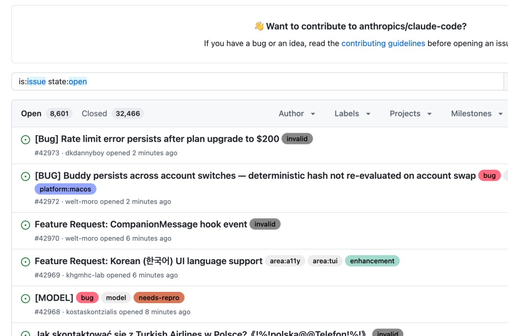
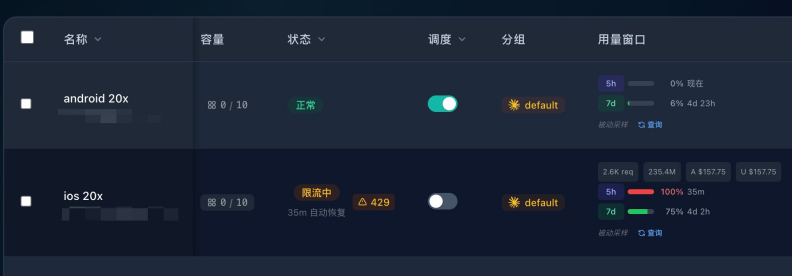
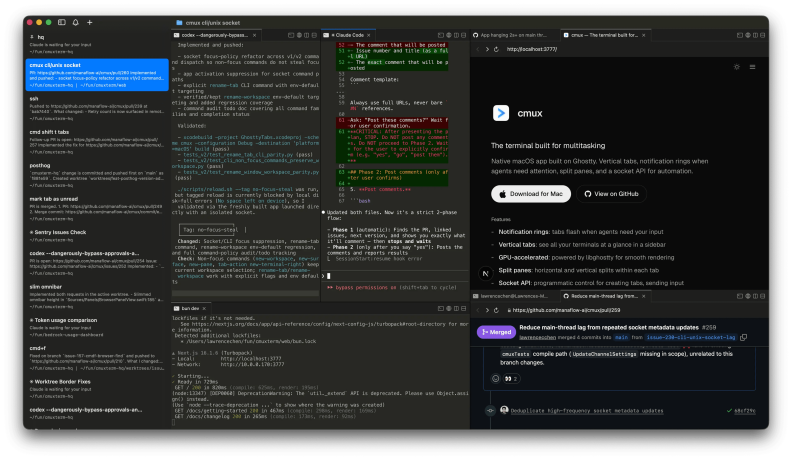
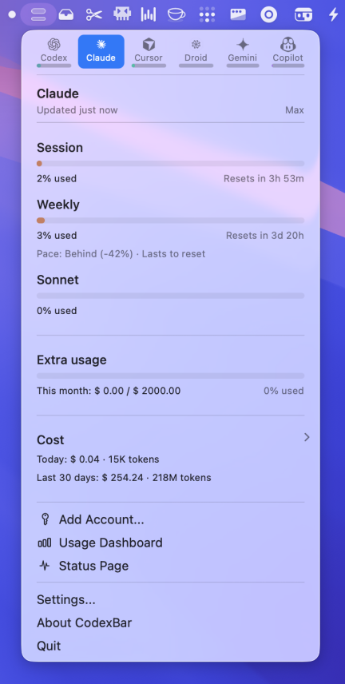
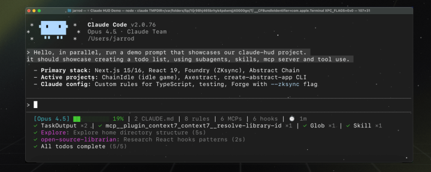
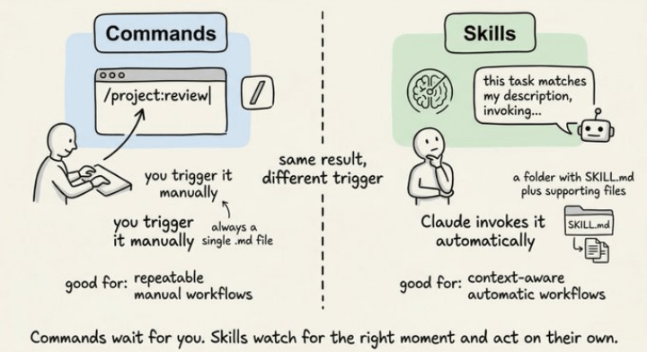
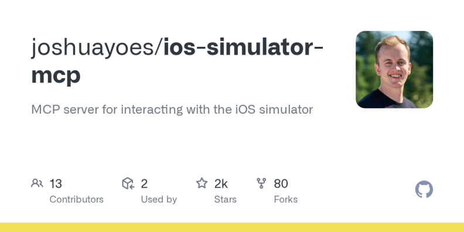
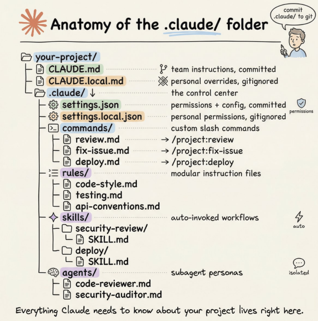
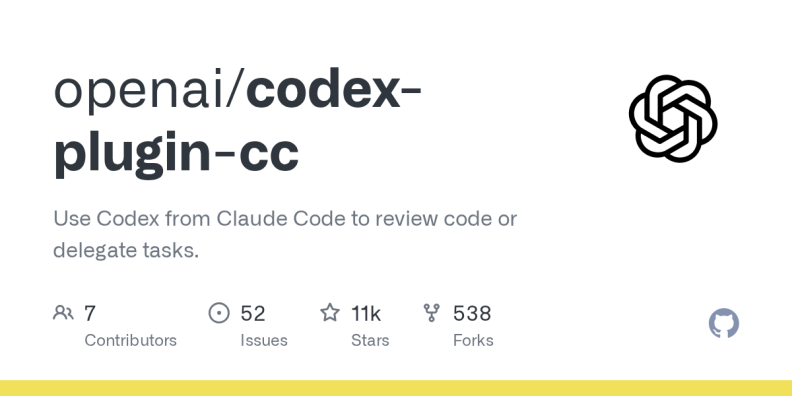

# 烧了 250 亿 token 后，我总结的 3w 字 Claude Code 使用教程

Date: 2026-04-03  
Author: SimonAKing  
Categories: 微信公众号  
Tags: 微信公众号  
Source: https://simonaking.com/blog/claude-code-guide/

> Claude Code 大概是 2026 年最让人又爱又恨的开发工具。上周 Anthropic 在 Reddit 上承认：\"用户撞限速比我们预想的快得多。\"有 Max 用户（$200/月）说 19 分

---
Claude Code 大概是 2026 年最让人又爱又恨的开发工具。

上周 Anthropic 在 Reddit 上承认："用户撞限速比我们预想的快得多。"有 Max 用户（$200/月）说 19 分钟烧完了 5 小时额度。有人说 30 天只有 12 天能正常用。有人说一个 hello 吃掉了 2% 的会话配额。GitHub 上有人逆向了 Claude Code 二进制，发现两个 prompt cache bug 导致 token 消耗悄悄膨胀了 10-20 倍。

我们团队在 Claude Code 上烧了 252 亿 token——Sub2API 后台下图，API 等价费用 $22,950。用这些 token 做了 Mana（@mana\_\_app），一个让用户用自然语言创建原生 iPhone 应用的平台。日均十几个小时挂在 Claude Code 上，两个 Max x20 账号轮着用，每天消耗几亿 token 是常态。


**▲ Sub2API 后台：总消耗 252 亿 token，API 等价费用 $22,950**

我们从第一天就在跟这些问题打交道。下面是 250 亿 token 换来的经验。

## 一、这工具有多离谱
先说一个数字：我的 Sub2API 后台，总消耗 252 亿 token，API 等价费用 $22,950。如果按 API 计费而不是订阅，这笔钱够买一辆车。

但这不是重点。重点是——**Claude Code 不想让你知道你烧了多少钱。**

你输 /cost，它告诉你"订阅用户不需要关心费用"。Anthropic 不公布任何套餐的具体 token 额度，只说"Pro 是免费版的 5 倍"——5 倍是多少？不告诉你。有人逆向了 Claude Code 的二进制文件，发现了两个导致 prompt cache 失效的 bug，**让实际 token 消耗悄悄膨胀了 10-20 倍**。降级到旧版本 2.1.34 之后问题明显缓解。

社区的吐槽已经到了什么程度？有 Max 20x 用户（$200/月）说 19 分钟就烧完了 5 小时的额度。有人在 Reddit 说一个 hello 吃掉了 2% 的会话配额。有人说"30 天里我只有 12 天能用上 Claude"。GitHub 上有人写了一封致 Anthropic 的公开信，标题叫"Critical: Widespread abnormal usage limit drain"——我提了工单，没人回；我在 Twitter 上问，没人回；Reddit 上唯一的官方回复是"我们在调查"。

3 月 31 号，Anthropic 承认了："用户撞限速比我们预想的快得多。"

**GitHub Issue 区更是灾难现场。** Claude Code 的 issue tracker 目前有 6000+ 个 open issue，其中 3554 个标记为 bug。每周新增 2000-2500 个。有人做过分析：**49-71% 的 issue 关闭是 bot 自动执行的**——Anthropic 用 Opus 4.6 做分类，用 dedupe bot 标记重复，然后自动关闭。问题是，被标记为"重复"的 issue 会自动锁定并关闭，而它指向的"原始 issue"可能也早就被关了。

一个 ECONNRESET 的 bug 从 2025 年 12 月就有人报，到 2026 年 3 月还在反复被关闭又被重新提交。有人统计了 12 个相关 issue，70 多条社区评论提供了 root cause 分析，**零条 Anthropic 工程师的回复**。Hacker News 上有一个帖子专门讲这事：Claude Code 的 issue 页面 60 天不活跃就自动关闭，评论区一片嘘声。



**▲ Claude Code GitHub Issue Tracker：8000+ open issues，每周新增 2000+**

同一天，Claude Code 51 万行源码因为 .npmignore 漏了一个 .map 文件，被意外发布到了 npm。这已经是第二次了——2025 年 2 月就出过一次。源码里有个叫 "Undercover Mode" 的系统专门防止 AI 在 git commit 里泄露内部信息，结果 Anthropic 自己把整个源码发了出去。

不过泄露出来的东西确实让人对这个产品刮目相看：三层记忆压缩系统、42 个按需加载的工具、KAIROS 自主后台 daemon、ULTRAPLAN 云端远程规划——VentureBeat 的评价是"这不是 LLM 的包装壳，是一个完整的软件工程操作系统"。

我的判断一样：Claude Code 是当下最好的 AI 编程工具，没有之一。但 Anthropic 的运营水平配不上这个产品。

## 二、降智是真的，不是你的错觉
先讲一个技术事实：Anthropic 官方在 2025 年 8 月承认过，由于推理堆栈（inference stack）的更新，Opus 4.1 和 Opus 4.0 确实出现了质量下降。根本原因是 XLA 编译器的一个 bug——模型用 bf16 浮点计算下一个 token 的概率，但 TPU 需要 fp32，精度不匹配导致模型经常选不到"最优解"token。一个微小的概率偏差，累积起来就是整体回复质量的大幅下降。

说人话：Claude 本来要说"？"，结果因为算错了概率说成了"。"。一两次没关系，几百次之后整个输出就是一坨。

这个问题后来回滚了。但 2026 年 3 月，类似的问题又来了：

·**status.claude.com 记录**：3 月 21 日 Opus 4.6 和 Sonnet 4.6 同时出现大面积报错。3 月 26-27 日网络性能降级导致服务中断。3 月 31 日到 4 月 1 日，Opus 和 Sonnet 请求超时率飙升。

·**社区实测**："凌晨两点用起来顺畅无比，白天高峰期被限流之后就非常糟糕。"——这不是降智，这是 Anthropic 在高峰期偷偷降了你的服务质量。

·**版本回退有效**：有人把 Claude Code 从最新版降到 2.1.34，token 消耗立刻恢复正常。说明不是模型变笨了，是客户端代码有 bug。

**所谓"降智"，三分之一是真的模型问题，三分之一是 prompt cache 失效导致 token 爆炸（上下文被截断后质量当然差），三分之一是高峰期限流。**

怎么应对？

1.**装 CodexBar 监控用量**，异常消耗第一时间发现

2.**关注 status.claude.com**，有 incident 的时候别硬上，换个时间或者切 Codex 干活，或者一些“智商监听”站点。

3.**觉得明显变笨了，先 \`/clear\` 再试**——大概率是上下文积累到触发了自动压缩，截断之后模型丢失了关键信息

4.**高峰期（美东 8am-2pm）降低期望**，或者直接错峰用

5.**版本有问题就降级**：npx @anthropic-ai/claude-code@2.1.34 可以跑指定版本

  

## 三、80% 的 token 其实白烧了
我的判断是，大部分人使用 Claude Code 时，有至少一半的 token 消耗是不必要的。四个主要的"吞金陷阱"：

**第一，上下文雪球。** Claude Code 为了保持对话连续性，每次交互都会完整加载所有历史对话和上传的文件。对话越久，每次请求的 token 越多——像滚雪球一样膨胀。更讽刺的是，当上下文超过一定长度，模型开始"降智"——遗忘之前的指令，逻辑开始混乱。你花了更多的钱，反而得到了更差的结果。

**第二，模型选错。** Opus 比 Sonnet 贵几倍，但在大部分日常编程任务上，能力差距远没有价格差距那么大。我见过太多人一上来就挂 Opus，写个 CSS 也用 Opus，完全没必要。

**第三，MCP 工具的隐性消耗。** 如果你装了很多 MCP 服务器（Chrome DevTools、数据库、各种插件），每个工具的定义都会被注入到上下文里。实测数据显示，MCP 工具描述可以轻松吃掉 10% 的上下文窗口——还没开始干活呢。

## 四、正确姿势：我的完整工作流
### 账号和付费篇：这块坑最多，先说清楚
划重点：国内用户，付费这一步就能劝退一半人。我把自己趟过的路都写出来。

**IP 是第一道关。** Anthropic 对 IP 检测很严，国内直连大概率被封号。我的做法是买一台美国住宅 IP 的 VPS，搭建中转服务（推荐用 sub2api，GitHub 上搜得到）。注意一定要是住宅 IP，不是机房 IP——很多便宜的 VPS 给的是数据中心 IP，Anthropic 能识别。

**付费有三条路，各有各的坑：**

1. **Web 直接付**：用美国住宅 IP 访问 claude.ai 直接订阅，信用卡或 Google Pay 都行。这是最干净的方式，价格就是标价，没有额外费用。

2. **Google Pay**：通过 Google Play 订阅，操作比较方便。但问题是——**会多收大约 50 美金的税/手续费**。理论上用免税州地址可以避免，但我自己试了几轮也没完全解决。

3. **Apple Store**：通过 iOS 应用内购买，跟 Google Pay 一样的问题——**也会多收约 50 美金**。苹果税嘛，懂的都懂。套餐怎么选：我买了 2 个 Max x20。

先说结论：如果你是重度用户（日均 8 小时以上使用 Claude Code），一个 Max x20 ($200/月) 是不够的。

我目前的做法是同时开两个 Max x20 账号。原因很简单——一个 x20 的 5 小时窗口大约 900 条消息，一次 plan 平均消耗 8 条，算下来 5 小时大约能跑 100 个任务。听起来很多对吧？但如果你用 cmux 开多个 pane 并行跑任务，加上偶尔触发 Opus 的高消耗请求，一上午额度就见底了。

两个 x20 轮着用，基本能覆盖一整天的高强度开发。一个账号撞墙了切另一个，等 5 小时窗口重置再切回来。$400/月听起来不便宜，但算算账：一个全职初级开发的月薪远不止这个数。



**▲ Sub2API 账号管理：ios 20x 账号已限流（429），5h 窗口 100%，35 分钟后自动恢复**

**不确定自己用量的话，别一上来就买 x20。** 先开一个 Max x5（$100/月）跑一两周，感受一下你的日均消耗节奏。不够用再升级到 x20，Anthropic 支持随时升级，差价按比例补。大部分非全天候开发的用户，一个 x5 其实够用了——前提是你会管理上下文（后面会细讲）。如果 x5 经常在下午就撞墙，再考虑 x20 或者双账号方案。

### 工具篇：终端和监控
**Vibe Island 把 MacBook 刘海变成 AI 控制台。** 这是我最近发现的最惊喜的工具——它把 MacBook 的刘海区域变成了一个 AI agent 的实时控制面板。Claude Code、Codex、Gemini CLI、Cursor，所有 agent 的状态一目了然，直接在刘海上审批权限请求、回答 Claude 的提问、跳转到对应终端。


**▲ Vibe Island：MacBook 刘海变身 AI agent 实时控制面板**

核心体验是：你在编辑器里写文档或者看需求，Claude Code 在后台跑任务，需要你介入时刘海弹出来——点 Allow 或 Deny 就行，不用切窗口。零配置，第一次启动自动写好所有 hook。原生 Swift 开发，内存占用不到 50MB，不是又一个 Electron 套壳。一次性买断 $19.99，不收订阅。

**cmux 作为终端。** 如果你同时跑多个 Claude Code 实例，需要一个趁手的终端复用器。cmux 是基于 Ghostty 的原生 macOS 应用——垂直标签、分屏、内置浏览器，关键是它能自动检测 Claude Code 任务完成并发桌面通知。这在并行开发时是救命的。



**▲ cmux：基于 Ghostty 的原生 macOS 终端，垂直标签 + 分屏 \+ agent 完成通知**

比传统的 tmux 好在哪？不需要配置文件，不需要前缀键，GUI 原生集成。你开 3 个 agent 跑不同功能，cmux 会在有任何一个需要人类介入时弹通知。

**CodexBar 看用量。** 这是一个 macOS 菜单栏小工具，实时显示你的 Claude Code 额度消耗——5 小时窗口用了多少、周额度还剩多少、什么时候重置。Anthropic 自己不提供这个信息（故意的），所以你必须自己装。它同时支持 Codex、Cursor、Gemini 等十几个工具的用量监控，基于本地解析，不需要密码。免费开源。



**▲ CodexBar：macOS 菜单栏实时显示各工具的额度消耗和重置倒计时**

**社区插件推荐：**



**▲ claude-hud 插件：状态栏实时显示上下文消耗百分比**

·/plugin install claude-hud：在 Claude Code 状态栏实时显示 context 消耗百分比，一目了然还剩多少空间

·/plugin install code-simplifier：官方出品，自动简化冗余代码，间接省 token

### 配置篇：我的完整 settings.json
文件位置：~/.claude/settings.json

```
"alwaysThinkingEnabled": true,  
  "model": "opus",  
  "enabledPlugins": {  
    "claude-hud@claude-hud": true  
  },  
  "statusLine": {  
    "type": "command",  
    "command": "（claude-hud 插件的状态栏命令，安装后自动配置）"  
  },  
  "env": {  
    "ANTHROPIC\_AUTH\_TOKEN": "sk-你的token",  
    "ANTHROPIC\_BASE\_URL": "http://你的中转"

    "CLAUDE\_CODE\_NO\_FLICKER": "1",  
    "CLAUDE\_CODE\_DISABLE\_NONESSENTIAL\_TRAFFIC": "1",  
    "CLAUDE\_CODE\_DISABLE\_FILE\_CHECKPOINTING": "1",  
    "CLAUDE\_CODE\_DISABLE\_FEEDBACK\_SURVEY": "1",  
    "CLAUDE\_CODE\_DISABLE\_AUTO\_MEMORY": "0",  
    "CLAUDE\_CODE\_ADDITIONAL\_DIRECTORIES\_CLAUDE\_MD": "1",  
    "DISABLE\_EXTRA\_USAGE\_COMMAND": "1",  
    "MAX\_CONSECUTIVE\_AUTOCOMPACT\_FAILURES": "3"  
  }
```

逐条解释这些环境变量：

| **变量** | **值** | **作用** |
| --- | --- | --- |
| CLAUDE\_CODE\_NO\_FLICKER | 1 | 新版本 claudecode tui |
| CLAUDE\_CODE\_DISABLE\_NONESSENTIAL\_TRAFFIC | 1 | 重要。关闭所有非必要的网络请求——遥测、分析、错误上报全砍掉。用中转服务的必开，减少不必要的流量和被检测的风险 |
| CLAUDE\_CODE\_DISABLE\_FILE\_CHECKPOINTING | 1 | 关闭文件检查点。每次编辑文件 Claude 默认会存一个快照用于回滚，关掉它省 I/O 也省 token |
| CLAUDE\_CODE\_DISABLE\_FEEDBACK\_SURVEY | 1 | 关掉弹出的满意度调查，别打断我的心流 |
| CLAUDE\_CODE\_DISABLE\_AUTO\_MEMORY | 0 | 保留自动记忆功能（设 0 = 不关闭）。Claude 会在夜间自动整理你的项目偏好，这个功能值得留着 |
| CLAUDE\_CODE\_ADDITIONAL\_DIRECTORIES\_CLAUDE\_MD | 1 | 让通过 --add-dir 添加的额外目录也加载它们的 CLAUDE.md。多仓库开发必开 |
| DISABLE\_EXTRA\_USAGE\_COMMAND | 1 | 关闭额外的用量查询请求，省一点是一点 |
| MAX\_CONSECUTIVE\_AUTOCOMPACT\_FAILURES | 3 | 自动压缩连续失败 3 次后熔断停止，防止死循环烧 token |

  

### 启动篇：我的日常启动方式
```
alias cc="claude --dangerously-skip-permissions"
```

一条 alias 搞定。\--dangerously-skip-permissions 跳过所有文件操作的权限确认弹窗，agent 模式下效率提升非常明显。

注意：这意味着你完全信任 Claude 不会做傻事。  

日常流程：打开 cmux → 按任务拆分 pane（一个 bug 一个 pane、一个 feature 一个 pane）→ 每个 pane 里 cc 启动→ 任务做完 /clear → 开始下一个。cmux 就是你的任务管理器，每个 pane 就是一个独立的 agent 工位。

### 模式篇：opusplan 是隐藏的最优解


**▲ opusplan 模式：Plan 阶段用 Opus 推理，执行阶段自动切 Sonnet，省 68% token**

Claude Code 有三种权限模式，用 **Shift+Tab** 循环切换：Normal（每步确认）→ Auto-Accept（自动执行）→ Plan（只规划不执行）。大部分人只知道前两种。

但真正的杀手锏是/model opusplan。

opusplan 是一个"秘密菜单"模型别名：**plan 模式下自动用 Opus 做架构决策和复杂推理，执行阶段自动切到 Sonnet 写代码**。你不需要手动切模型——它自己判断。

为什么这是最优解？因为 Opus 的推理能力确实比 Sonnet 强一档，但它的 token 消耗也高一档。大部分代码生成工作 Sonnet 完全够用，只有在"想清楚怎么做"这一步需要 Opus。opusplan 自动帮你分配了——相当于用大厨写菜谱，然后让二厨执行，菜的质量不会降，但成本省了一大截。

实测数据：一个 10 万 token 的 feature 实现，opusplan 比全程 Opus **省约 68% 的 token 消耗**，架构质量不打折。

我的日常是这样的：每次启动 Claude Code 第一件事就是 /model opusplan。遇到特别棘手的 bug（竞态条件、类型推导问题、第三方库的诡异报错），临时 /model opus 切到纯 Opus 全力思考，解决完再切回来。

**effort level 也值得调。** 输入/effort 可以选 low / medium / high / max 四档。low 和 medium 适合简单任务（改个变量名、加个字段），快且省。high 是默认值。max 只有 Opus 才能用，不限 thinking token 预算，适合那种"我完全想不通为什么这段代码有问题"的时刻。

### 上下文管理篇：40% 是关键数字，cmux 是核心载体
这是最重要的一节。

Claude Code 的上下文窗口默认 200K token（Max 用户 Opus 可以到 1M）。系统会在上下文消耗达到 **87%** 时触发自动压缩。但话说回来，等到 87% 才压缩，质量已经开始下降了——模型在高上下文占用率时，注意力会分散，开始丢指令。

**我的经验是：40-50% 时就手动 \`/compact\`。**

但/compact 只是战术动作。真正的战略是——**用 cmux 做任务隔离，每个任务一个干净的上下文**。

我的实际工作流是这样的：cmux 里开多个 pane，每个 pane 对应一个独立任务。比如左边 pane 跑"修 auth 模块的 bug"，右边 pane 跑"加一个新的 API 端点"，再开一个 pane 做"写单元测试"。每个 pane 都是一个独立的 Claude Code 实例。

关键来了：**一个任务做完，直接在那个 pane 里 \`/clear\`，然后开始下一个任务。** 不要在同一个上下文里连续做多个不相关的任务——这是最大的 token 浪费。你让 Claude 在修完一个 auth bug 之后紧接着去写 UI 组件，之前 auth 相关的所有上下文（读过的文件、讨论过的方案、跑过的测试）全都在上下文里白占空间，模型一边要"记住"这些没用的东西，一边要理解新任务。

所以核心节奏是：

·**同一任务内**：每 5-6 轮对话手动 /compact，在 40% 上下文消耗时就触发。compact 时可以加保留指令，比如 /compact 保留 API 变更列表和已修改文件清单

·**任务切换时**：直接/clear，彻底清空。cmux 的 pane 还在，你的文件改动还在，但 Claude 的上下文从零开始——它会重新读 CLAUDE.md 获取项目背景，然后以最小上下文开始新任务

·**并行任务时**：cmux 多 pane 各跑各的，互不污染。Vibe Island 会在刘海上显示每个 pane 的状态，哪个需要你介入一看便知

装了 claude-hud 插件的话，状态栏会实时显示上下文占用百分比——你一看就知道该不该 compact 了。

进阶配置：如果你想让自动压缩更早触发而不是等到 87%，可以设 CLAUDE\_AUTOCOMPACT\_PCT\_OVERRIDE 环境变量。比如设成50，系统就会在 50% 时自动压缩——配合手动 compact，双保险。

说白了，cmux + /clear 的组合拳，本质上是在模拟"给每个任务配一个新的实习生"。每个实习生只知道他自己负责的那件事，不会被别人的工作干扰。这比让一个实习生从早到晚做所有事情，效率高得多，也省钱得多。

  

### CLAUDE.md 篇：最高 ROI 的投入
CLAUDE.md 是项目根目录下的一个文件，Claude Code 每次启动都会读它。把你的技术栈、目录结构、开发命令、代码风格写进去，它就不用每次重新花 token 去探索。社区实测结论：一份好的 CLAUDE.md 可以减少 30-40% 的 token 消耗。

但很多人写得太长了。社区共识是控制在 200 行以内——超过这个长度，Claude 开始均匀地忽略你的指令（不是只忽略最后的，是全部都忽略得更多）。Claude Code 的系统提示本身已经占了大约 50 条指令，留给你的有效指令空间大概只有 100-150 条。

**\`/init\` 命令是你的起点。** 各个模型的/init 都可以用，它会分析你的代码库、检测构建系统和测试框架，自动生成一份 CLAUDE.md 初始版本。我的经验是，一份好的 /init 输出能覆盖项目关键结构的 80%。

生成之后要做两件事：**删冗余，加专属。**

删的标准：如果删掉这一行 Claude 不会犯错，那就删。加的是 /init 覆盖不到的东西——比如你常用的 MCP 工具的使用指令（"截图用 ios-simulator MCP 而不是手动 simctl"）、团队特有的代码风格说明（"所有 commit message 用中文"）、以及一些 Claude 容易犯的错误的纠正（"不要用 any 类型，用泛型"）。

把 CLAUDE.md 当成给新员工的 onboarding 文档来维护——说清楚"这个项目是什么、怎么跑、哪些事能做哪些不能做"就够了。

  

### MCP 篇：装和你运行环境匹配的 MCP
MCP（Model Context Protocol）服务器是给 Claude 接入外部工具的能力。核心原则是：**装和你的运行环境直接相关的 MCP，别装一堆用不上的。**

举个例子，我做 Mana 涉及大量 iOS 开发，所以我装了两个关键 MCP：

**ios-simulator-mcp**（github.com/joshuayoes/ios-simulator-mcp）：让 Claude 直接操控 iOS 模拟器——截图、检查 UI 层级、点击、滑动、输入文字、设置 GPS 位置。最有用的场景是：Claude 改完一个 UI 组件后，自动截图看看效果对不对，不用你手动打开模拟器确认。这就是前面说的"给 Claude 验证能力"。



**▲ ios-simulator-mcp：让 Claude 直接操控 iOS 模拟器截图、点击、滑动**

**XcodeBuildMCP**（github.com/cameroncooke/XcodeBuildMCP）：让 Claude 直接控制 Xcode 的完整构建流程——build、test、debug、部署。它有 59 个工具，覆盖从 simulator/build-and-run 到debugging/breakpoint 的整个链路。配好之后 Claude 可以自主完成"改代码 → 编译 → 跑测试 → 发现报错 → 修复 → 再编译"这个循环，不需要你在中间来回切窗口。

安装很简单：

```
claude mcp add ios-simulator npx ios-simulator-mcp  
claude mcp add xcodebuild npx xcodebuildmcp
```

但要注意前面说过的：**每多挂一个 MCP 服务器，上下文就多吃一份工具描述的 token**。  

ios-simulator-mcp 带了十几个工具定义，XcodeBuildMCP 有 59 个。如果你装了十几个 MCP 而只用了两三个，其他都是在白烧钱。

我的做法是：只常驻真正高频使用的 MCP，其他的按需加载。XcodeBuildMCP 支持通过配置文件选择性加载工作流（simulator / ui-automation / debugging），不需要全部打开。

**其他场景的 MCP 推荐思路一样——装和你的开发栈直接绑定的：**

·做 Web 前端 → Chrome DevTools MCP，让 Claude 自己打开浏览器看效果

·做后端→ 数据库 MCP，让 Claude 直接查表验证数据

·做 React Native → ios-simulator-mcp + Android 模拟器 MCP 两个都装

### .claude 文件夹解剖：你的 AI 控制中心


**▲ .claude/ 文件夹完整结构（图源：Avi Chawla / Daily Dose of Data Science）**

很多人把项目里的.claude/ 文件夹当成黑盒——知道它存在，但从来没打开过。这是巨大的浪费。.claude/ 是 Claude Code 在你项目里的整个行为控制中心。（这部分参考了 Avi Chawla 的深度拆解文章，推荐原文阅读：blog.dailydoseofds.com/p/anatomy-of-the-claude-folder）

**首先要知道：有两个 .claude 目录，不是一个。**

·**项目级** your-project/.claude/：团队配置，提交到 git，所有人共享同一套规则

·**全局级** ~/.claude/：你的个人偏好和机器本地状态，比如会话历史、自动记忆

完整结构长这样：

your-project/  
├── CLAUDE.md                  # 团队指令（提交到 git）  
├── CLAUDE.local.md            # 你的个人覆盖（gitignore）  
│  
└── .claude/  
    ├── settings.json          # 权限 + 配置（提交到 git）  
    ├── settings.local.json    # 个人权限覆盖（gitignore）  
    │  
    ├── commands/              # 自定义斜杠命令  
    │   ├── review.md          # → /project:review  
    │   └── smart-commit.md    # → /project:smart-commit  
    │  
    ├── rules/                 # 模块化指令文件  
    │   ├── code-style.md      # 代码风格规则  
    │   ├── testing.md         # 测试规范  
    │   └── api-conventions.md # API 约定  
    │  
    ├── skills/                # 自动触发的工作流  
    │   └── security-review/  
    │       └── SKILL.md  
    │  
    └── agents/                # 专业子 agent 人设  
        ├── code-reviewer.md  
        └── security-auditor.md  
  
~/.claude/  
├── CLAUDE.md                  # 全局个人指令  
├── settings.json              # 全局设置  
├── commands/                  # 个人命令（跨项目）  
├── skills/                    # 个人 skills（跨项目）  
├── agents/                    # 个人 agents（跨项目）  
└── projects/                  # 会话历史 + 自动记忆

几个关键点展开说：

**rules/ 文件夹——CLAUDE.md 的拆分方案。** 当 CLAUDE.md 超过 200 行时，别硬塞了。把指令按职责拆到 .claude/rules/ 目录下，每个 markdown 文件会自动和 CLAUDE.md 一起加载。更强大的是，你可以给 rules 文件加路径范围——比如 API 规范只在 Claude 编辑 src/api/ 下的文件时才加载，不会污染其他场景的上下文。

**commands/ 文件夹——自定义斜杠命令。** 每个 markdown 文件变成一个 /project:xxx 命令。前面说的 smart-commit 就放在这里。命令文件里可以用 \` !git diff  语法嵌入 shell 命令输出，还支持 $ARGUMENTS\` 传参。注意：commands 现在已经和 skills 合并了——两种写法都能用，skills 多了支持目录打包和自动触发的能力。

**agents/ 文件夹——专业子 agent。** 定义一个 code-reviewer.md，里面写上这个 agent 的人设、可用工具、模型偏好。Claude 需要做代码审查时，会 spawn 这个子 agent，在独立的上下文窗口里完成工作再汇报回来。好处是主会话不会被中间过程的大量 token 污染。而且你可以给子 agent 指定更便宜的模型——比如代码审查用 Sonnet 就够了，省 token。

**settings.json——权限白名单和黑名单。** allow 列表里的操作不弹确认框直接执行，deny 列表里的操作完全禁止。没列出来的会弹框让你确认。建议至少把npm run \*、git status、git diff \* 放进 allow，把 rm -rf \*、Read(./.env) 放进 deny。

**个人覆盖机制。** CLAUDE.local.md 和 settings.local.json 分别是 CLAUDE.md 和 settings.json 的个人版——自动 gitignore，不影响团队，但可以覆盖团队规则。适合放你个人的编码偏好。

### 会话管理篇：resume、branch、脚本化
几个高阶会话管理技巧：

·claude --resume：恢复上一次会话。支持关键词搜索——如果你有几十个历史会话，可以直接搜"auth refactor"找到你想续的那个

·/branch：从当前会话分支出一个新对话，处理完临时问题再回到原来的任务

·/btw：在不打断当前任务的前提下问一个旁支问题，Claude 会回答完继续干活

进阶用法——**session ID 脚本化**：你可以用\--output-format json 捕获 session ID，然后用脚本串联多个步骤：

```
# 捕获 session ID  
session\_id=$(claude -p "开始代码审查" --output-format json | jq -r '.session\_id')  
# 在同一个 session 里追加任务  
claude --resume "$session\_id" -p "检查安全漏洞"  
claude --resume "$session\_id" -p "生成审查报告"
```

这在 CI/CD 集成和自动化工作流里非常有用。

### 自动 PR Review：让 Claude 帮你看代码
跑一次/install-github-app，Claude 会自动 review 你的每一个 PR。这在 AI 辅助开发越来越多的今天特别有用——你的 PR 数量上去了，人肉 review 跟不上。

但默认配置太啰嗦——它会对每个 PR 写一篇总结。改一下 claude-code-review.yml：

```
direct\_prompt: |  
```
  Review this PR. Only report bugs and potential security vulnerabilities.  
  Be concise. Skip style nitpicks.

Claude 找 bug 的能力比大部分人想象的强——人类 reviewer 容易纠结变量命名，Claude 会找到逻辑错误和安全漏洞。

### 自定义命令篇
**smart-commit**——我写了一个自定义命令，让 Claude 分析所有 git 变更（staged、unstaged、untracked），按功能逻辑拆分成原子化 commit，然后自动推送。它会用 git add -p 精确控制 hunk 级别的暂存，确保同一文件的不同功能改动分到不同 commit。commit message 用中文，格式是 类型: 简短标题。

这个命令解决了一个真实痛点：AI 生成的代码往往一次改动涉及多个功能，如果你直接 git add . 然后一把提交，git 历史就成了一团浆糊。

### 键盘快捷键备忘
这些小细节官方文档不显眼，但天天用：

·**Shift+Tab**：循环切换 Normal → Auto-Accept → Plan 三种权限模式，不用退出对话

·**Escape**：停止 Claude 当前操作（不是 Ctrl+C，那是退出整个程序）

·**Escape 连按两次**：弹出历史消息列表，可以跳回之前的任何一条

·**Ctrl+V**（不是 Cmd+V）：粘贴剪贴板里的图片

·**Shift+拖拽文件**：把文件作为引用拖进 Claude，而不是打开新 tab

·**\`!command\`**：直接在 Claude 里执行 shell 命令，比如 !git status，输出会进入上下文

·/voice：按住空格键语音输入，懒得打字时用

  

### 日常使用姿势篇：AI 写的代码不能只让 AI 自己说 OK
这是很多人踩的最大的坑：让 Claude 写完代码就直接用了。

我的经验是：**AI 生成的代码，至少要过两道检查。** 

不是因为 Claude 不行——恰恰是因为它太"自信"了，写出来的代码表面看逻辑通顺，但藏着你不容易发现的问题：边界条件没覆盖、错误处理偷懒、类型推导太宽泛、性能写法不 idiomatic。

几个我日常用的检查姿势：

**姿势一：写完让 Claude 自己 grill。** 不要问"这段代码有没有问题"——它会说"看起来没问题"。你要这么问："挑出这段代码的 3 个最可能出 bug 的地方，假设你是一个想搞坏这个系统的黑客"。用对抗性提示逼它思考盲点。或者更狠："grill me on these changes and don't make a PR until I pass your test"——让 Claude 反过来考你，你答不上来它就不提交。

**姿势二：开新 session 做 review。** 写代码和审代码不要在同一个上下文里。写代码的 session 有"创作者偏见"——它记得自己为什么这么写，所以不容易发现问题。开一个新的 cmux pane，新启动一个 Claude Code，让它以第三方视角审这段代码。相当于一个 agent 写代码，另一个 agent 挑毛病。社区里有人总结过：同一个模型，分开的上下文窗口做出来的审查质量比同一个窗口里做的高很多——因为没有上下文偏见。

**姿势三：用 Codex 做交叉 review。** 这是最近最值得介绍的工作流——用竞争对手的模型来审你家模型的代码。

### Codex 插件深度用法：让 GPT 审 Claude 的代码


**▲ OpenAI 官方出品 codex-plugin-cc：在 Claude Code 里直接调用 Codex 做代码审查**

安装：

/plugin marketplace add openai/codex-plugin-cc  
```
/codex:setup
```

需要一个 ChatGPT 订阅（免费版也行）或 OpenAI API key。装完之后你多了六个命令：

**\`/codex:review\`**——标准代码审查。对当前未提交的变更或指定分支做只读 review，质量等同于在 Codex 里直接 /review。多文件变更建议用\--background 后台跑，不阻塞当前工作。

```
/codex:review --base main --background  
# 继续干其他事...  
/codex:status    # 查进度  
/codex:result    # 拿结果
```

**\`/codex:adversarial-review\`**——这是杀手锏。魔鬼辩护人式的 review：它会挑战你的设计决策、质疑隐藏的前置假设、挖掘失败模式。你可以指定关注领域：

```
/codex:adversarial-review "focus on auth flow and race conditions"
```

在我的使用里，adversarial review 在这些场景下特别有价值：改动涉及认证/鉴权逻辑、基础设施脚本、大规模重构。这些地方出一个 bug 的代价远高于多花 5 分钟做一次审查。

**\`/codex:rescue\`**——把任务整个丢给 Codex。Claude 搞不定的 bug，让 Codex 来查；Claude 写得太复杂的实现，让 Codex 重写一版。支持 \--model gpt-5.4-mini 选低成本模型。

**Review Gate——最激进的用法。** 跑/codex:setup --enable-review-gate，开启之后 Claude 每次完成任务都会被拦住——Codex 的 Stop hook 自动触发审查，如果发现问题就阻止 Claude 提交，让 Claude 先修。相当于 Claude 写代码 → Codex 审代码 → 有问题打回 → Claude 修 → Codex 再审，循环直到通过。

**但注意：这个循环会疯狂烧 token。** 官方文档明确警告了——只在你主动监控的时候开，别挂着无人值守。

我现在的日常流程是：Claude Code 用 Opus 做架构规划和实现 → 完成后 /codex:review --background 让 Codex 后台审 → 拿到 review 结果后在 Claude Code 里修。用 Opus 的推理能力写代码，用 GPT 的不同视角挑毛病，两个模型互相补盲区。

### 错峰使用篇
Anthropic 已经把"高峰时段限额"写进了正式政策：美东时间上午 8 点到下午 2 点是高峰，额度缩水。工作日非高峰和周末全天，额度更宽裕。

如果你在亚洲时区，反而有天然优势——你的白天是他们的深夜低谷。

## 五、最近的新发现
**OpenAI 给 Claude Code 做了官方插件。**

如上面所述，3 月 30 号，OpenAI 发布了 codex-plugin-cc——一个在 Claude Code 里直接调用 Codex 做代码审查和任务委派的插件。你没看错，**竞争对手给你做插件**。

背后的逻辑很清楚：Claude Code 的市场地位太强了（年化 25 亿美金、日均 13.5 万 GitHub commit），OpenAI 与其硬抢用户，不如在 Claude Code 生态里建一个触点——每一次通过插件调用的 Codex review 都给 OpenAI 贡献收入。

我的判断是，这标志着 AI 编程工具的竞争轴心已经从"谁家模型更强"转向了"谁家生态更厚"。选 Claude Code 作为主 agent CLI，用插件补短板，这个打法已经跑通了。

**51 万行源码泄露后的几个关键发现。**

最近有人逆向了 Claude Code 的完整源码（51 万行），几个有意思的细节：

·系统内置 42 个工具，但它们是按需延迟加载的——只有需要时才通过 ToolSearchTool 注入，以节省 token

·长对话的记忆管理用了一个叫 KAIROS 的机制：白天的对话只是流水账日志，夜间系统自动触发 /dream，AI 在"睡觉"时把这些日志蒸馏成结构化的用户偏好和项目背景

·当 token 消耗逼近窗口极限的 87% 时，自动压缩会触发，并带有熔断器——这就是为什么我在配置里设了   

MAX\_CONSECUTIVE\_AUTOCOMPACT\_FAILURES: 3

这些细节解释了很多"玄学"体验——比如为什么有时候 Claude 突然变笨了（大概率是触发了自动压缩，上下文被截断了）。

最后：

上面这些经验全部来自一个真实的产品开发过程——Mana（@mana\_app）。

Mana 正在从一个原生 app builder 转向互动内容平台——让用户用自然语言创建可交互的内容体验。目前有 115 个原生 iOS skill，内置游戏引擎，支持 Remix/Fork——你可以 fork 别人做的作品，在上面改，发布自己的版本。

如果你也在用 Claude Code 做产品，欢迎交流。

---
> 本文同步自微信公众号，[点击查看原文](https://mp.weixin.qq.com/s/3wRR34JbpRp2wxwvNj41iA)
