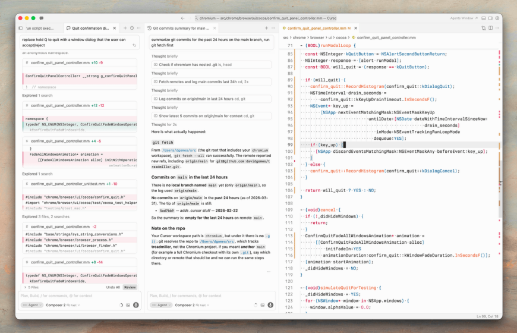
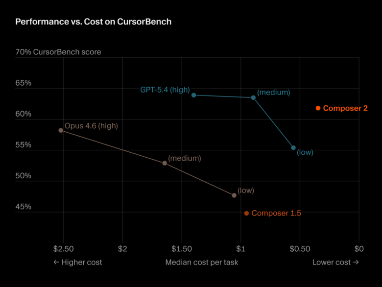
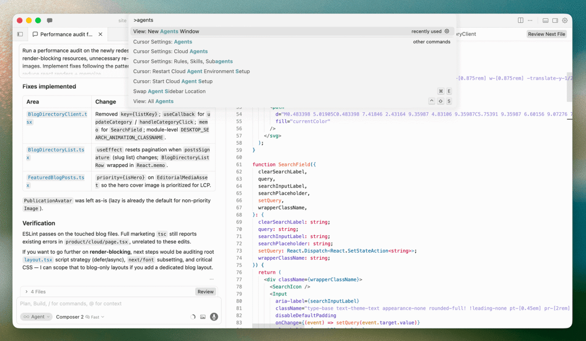
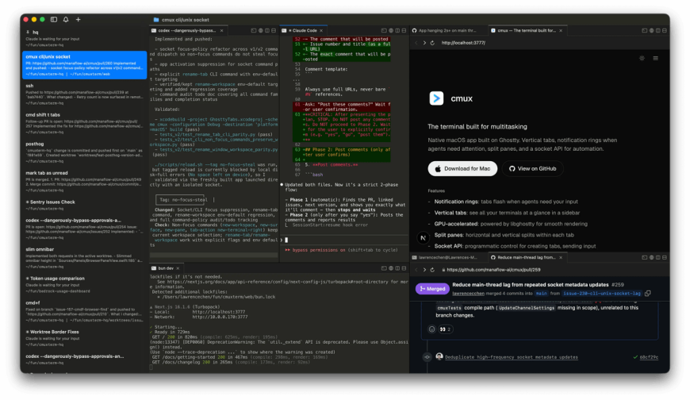
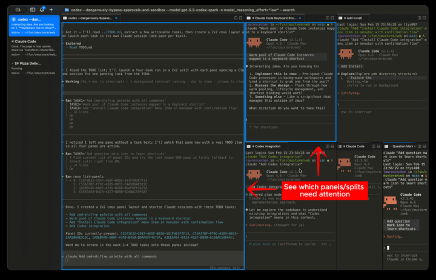
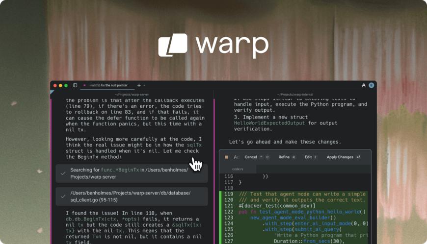
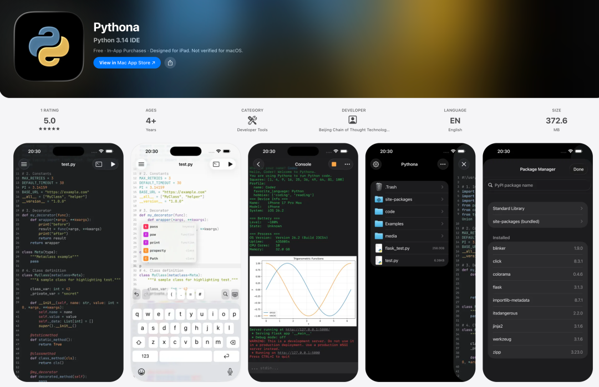

# 所有人都在从 IDE 搬向 ADE，你还在"写"代码吗？

Date: 2026-04-08  
Author: SimonAKing  
Categories: 微信公众号  
Tags: 微信公众号  
Source: https://simonaking.com/blog/ide-to-ade/

> 当编辑器变成配角，编排层变成主角 认真想一下这个问题。 上一次我打开 VS Code，不是为了 Review 一下 AI 干的活，而是真的坐在那里一行一行写代码。 如果答案是“上个月”，欢迎来到 AD

---
当编辑器变成配角，编排层变成主角

## 你多久没打开你的 IDE 了？
认真想一下这个问题。

上一次我打开 VS Code，不是为了 Review 一下 AI 干的活，而是真的坐在那里一行一行写代码。

如果答案是“上个月”，欢迎来到 ADE 时代。

ADE，Agentic Development Environment。这个词是 Warp 在 2025 年中发明的，但它描述的现象已经在整个行业发生了。

Cursor 把自己从 AI IDE 重新定位为 Agent 编排平台，Augment Code 发布了一个叫 Intent 的东西，直接以“IDE is dead”当发布会标题。

我的判断：IDE 没死，但它被降级了。从“你工作的主屏幕”变成“多个屏幕之一”。

取代它位置的，是一类新东西，统称为“Agent 编排层”。

不管它是 Cursor Glass 还是 Warp Oz，是 cmux 还是 Conductor，都在做同一件事：让你从“写代码的人”变成“指挥 Agent 的人”。

## 从 IDE 到 ADE：到底变了什么
IDE 优化的是这个循环：打开文件 → 编辑 → 构建 → 调试 → 重复。整个 UI 设计围绕“你在编辑一个文件”。

ADE 优化的是另一个循环：描述意图 → 委派 Agent → 观察进度 → Review diff → 合并。整个 UI 设计围绕“你在管理一群 Agent”。

区别不是“加了个聊天窗口”。区别是“谁是主角”。

在 IDE 里，你是主角，AI 是助手。在 ADE 里，Agent 是执行者，你是指挥官。你的工作从“写代码”变成了“定义意图 + Review 结果”。

这个转变是断崖式的。一旦你习惯了告诉 Agent 做什么然后 Review 结果，你就回不去了。就像你不会从开车回到骑马。

## 这不是观点，是已经发生的事实
先看几个数字，感受一下这个变化的速度。

Claude Code，2025年5月上线，6个月 ARR 突破 10 亿美元，2026年初达到 25 亿。

一个终端原生的 Agent，比当年的 ChatGPT 还火。

开发者为一个没有 GUI 的终端工具花钱的速度，比全世界为“聊天机器人”花钱的速度还快。

Pragmatic Engineer 的调查（15000 名开发者）显示，Claude Code 以 41% 使用率超过了 GitHub Copilot 的 38%。满意度更是压倒性：Claude Code 46%“最喜欢”，Copilot 只有 9%。

Cursor ARR 突破 20 亿美元，60% 来自企业。

Stack Overflow 2025 调查：84% 开发者在用 AI 工具，51% 每天都用。

Gartner 预测到 2028 年 90% 工程师会用 AI 代码助手，角色从“实现”转向“编排”。

**从 IDE 到 ADE 不是“未来趋势”，是“已经发生”。**

## Cursor 的三个版本，就是从 IDE 到 ADE 的缩影
Cursor 的进化史是理解这场变革最好的线索。因为它用三年时间，把“编辑器从主角变成配角”演给你看了。

## 1.0（2023）：IDE 加了个聪明插件
VS Code fork，更准的 Tab 补全。编辑器是绝对的主角，AI 是侧边栏里的小助手。定位很清晰：“AI IDE”。

## 2.0（2025）：编辑器和 Agent 开始拉锯
Composer 多文件编辑、Agent Mode、Background Agents。

最多 8 个 Agent 并行。但编辑器仍然是主界面，AI 被塞在侧边栏里。

*Cursor Composer 2 性能基准：内部模型也在追赶 frontier*

## 3.0 Glass（2026年4月）：“IDE？你想用的时候再打开”
3.0 彻底重写。Chat Panel 被拆掉，换成 Agents Window。一个专门管理并行 Agent 的编排界面。

CEO Michael Truell 把 AI 编码分成三个时代：autocomplete → 同步 Copilot → 自主 Agent。Glass 就是第三时代的产品。

*Cursor 3.0 Agents Window：多 Agent 并行、云端执行、diff-first review*

云端 Agent 每个跑在独立 VM，Cloud Handoff 本地任务无缝转云端，Design Mode 直接在浏览器预览中标注 UI 元素给 Agent。

**Cursor 1.0 → 3.0——“IDE 加 AI 插件”→“IDE 加 AI 助手”→“ADE 附带编辑器”。编辑器从主角变成配角。**

## 终端复活：ADE 最意想不到的战场
2026 年最火的开发工具类别不是 IDE，是终端模拟器。没错，就是那个黑色窗口。

为什么终端会成为 ADE 的核心战场？因为 Agent 需要终端。人类可以用 alias、配置 .zshrc、用肌肉记忆弥补工具不足。

Agent 不能。它需要底层原语直接存在。这逼迫了终端的现代化——GPU 渲染、内置浏览器、可编程 API、通知系统。

## Ghostty：Agent 时代的终端底座

*Ghostty：Mitchell Hashimoto（HashiCorp）用 Zig 写的 GPU 加速终端*

Mitchell Hashimoto 用 Zig 写的终端。2024 年底发布 1.0，现在已经超过 4.5 万 GitHub stars。比 iTerm2 快 4 倍。

Hashimoto 说了一句很有意思的话：他完全没预料到终端使用量会增加，更没想到自己会定期和 AI 编码公司打交道。

因为它们是终端最大的用户。他的核心组件 libghostty 正在变成一个生态系统，cmux 就是基于它构建的。

有个细节很说明问题。Jarred Sumner（Anthropic，Claude Code 基础设施）在 Ghostty 里跑了个 demo：一个命令就在终端里完整渲染了 bun.sh 网站。

## cmux：“开着十个 Agent”的终端

*cmux：垂直标签栏显示每个 Agent 的 git 分支、PR 状态、工作目录*

Manaflow（YC）做的，基于 libghostty，Swift 原生。两个月超过一万 stars。它解决的问题很具体：当你同时跑五个 Claude Code session 时，怎么知道哪个需要你？

*cmux 通知环：Agent 完成任务→绿色，需要关注→蓝色，报错→红色*

创建者说了一句很重要的话：“cmux 是模式，不是解决方案。”这个哲学和 Cursor Glass 或 Warp Oz 完全不同——给你积木，不给你成品。我自己在用 cmux 写代码，同时跑多个 Claude Code 时通知环的价值非常明显。

## Warp：最早的 ADE 命名者

*Warp：左侧 Terminal 用于本地 Agent，右侧 Oz 用于云端 Agent 编排*

2020 年创立时定位是“21世纪的终端”，2025 年发布 2.0 时自称“世界首个 ADE”。这个词就是 Warp 发明的。

2025 年它的 Agent 编辑了 32 亿行代码，索引了 12 万代码库。2026 年推出 Oz 云端编排平台，支持 Full Terminal Use（Agent 能直接连接 PTY session）和 Computer Use（在云端沙箱操作 GUI）。

但转型也付出了代价。终端老用户觉得“你变了”，Agent 新用户觉得“你还不够”。再加上强制登录，用终端还要创建账号，power user 直接劫退。

社区分裂是 ADE 转型中最尖锐的问题。

## 老 IDE 厂商怎么应战 ADE 浪潮
## VS Code：“我不做 ADE，但每个 ADE 都需要我”
通过 MCP 支持所有模型，Copilot 免费版降低门槛。VS Code 的策略是做平台而非产品：它不试图成为唯一工具，而是让自己成为每个工具的底座。但问题是：当开发者的主屏幕从编辑器转移到 Agent 控制台时，“编辑器平台”本身的价值在缩小。

## JetBrains：有技术优势，但定价翰车了
Junie 自主 Agent 能利用 IDE 的深度能力：生成代码后自动跑测试、失败自动修复。这是纯终端 Agent 做不到的。但定价变更让用户炸了——年费订阅额度从三周变成四小时，Marketplace 上有人说“接近欺诈”。

另一面，JetBrains 做了一件聪明事：把 Claude Agent 直接引入 IDE，加入 ACP 开放协议。“你想用谁的 Agent 都行。”

## Zed：在 ADE 时代做最快的编辑器
Nathan Sobo（Atom 创始人）用 Rust 写的编辑器，GPU 加速，120fps。它最大的贡献是和 JetBrains 一起推 ACP（Agent Client Protocol）。目标是把 Agent 从特定编辑器解耦，就像 LSP 把语言智能解耦一样。

定位很清晰：在 ADE 时代，编辑器的价值是“快、干净、能接所有 Agent”，而不是“什么都能做”。

## ADE 的五个共同模式
不管你用哪个工具，这些模式都在反复出现。记住这些比记住具体工具名更有价值。

一，工作隔离。git worktree 或类似机制，没有隔离就没有并行。

二，任务状态取代文件标签。顶层导航从“文件”变成“任务”。

三，异步优先。你的注意力太贵，不应该浪费在看进度条上。

四，注意力路由。“Agent 需要关注”是一类事件，需要被路由和分流。

五，生命周期集成。Agent 连接的是 issue → PR → CI → merge 整条链路。

这五个模式就是 IDE 和 ADE 的本质区别。IDE 优化的是“文件编辑”，ADE 优化的是“Agent 管理”。

## ADE 时代的真实问题：Agent 干的活你敢直接合并吗
“90%正确”是最大的坑。Agent 干出来的东西经常“大体对但总有微妙的错”。

对高风险变更，传统 IDE 仍然是最好的精确检查工具——这也是为什么 IDE 不会消失，只是降级。

Review 疲劳也是真的。同时 12 个 Agent，一天结束 12 个 diff。听起来高效，实际上崩溃。这就是为什么所有严肃的 ADE 都在做注意力路由和 Review 门禁。安全面也在扩大——所有工具都在加审批门、工具日志和权限控制。

## 一个类比：写代码越来越像打星际争霸
Trevin Chow 提到的类比我觉得很准。星际争霸、帝国时代这类 RTS 游戏，几十年前就解决了“管理大量并行单位”的 UI 问题。现在写代码越来越像这样——你不是在控制每一个士兵，而是在管理整个战场。IDE 是“士兵视角”，ADE 是“指挥官视角”。

## 最后说一句
从 IDE 到 ADE，不是“IDE 死了”，而是开发者的主屏幕换了。编辑器从主角变成配角，Agent 编排层成了新的主角。

**如果你现在还在纯手写代码，不是说你不行。而是你正在用 IDE 时代的方法，做 ADE 时代的事。产出上限已经被重新定义了：一个人能“编排”出的代码，是手写的十倍。不进入 ADE，就是在用 10x 的努力做 1x 的事。**

## 重点说一下我们的新产品
说到从 IDE 到 ADE，我们 Mana 团队最近也在做一些新尝试。刚上线了一个新产品——Pythona，一个 iOS 上的全功能 Python IDE，现阶段免费开放。

*Pythona：iOS 上的全功能 Python IDE，随时随地写代码*

支持 Python 3.14，内置 NumPy、Pandas、Matplotlib、scikit-learn 等科学计算库，开箱即用。代码编辑器支持语法高亮和智能补全，脚本管理让你在手机上也能维护一个完整的项目。

虽然这篇文章讲的是 ADE 时代，但学习编程的起点永远是“自己动手写”。Pythona 就是为这个起点做的——把 Python IDE 装进口袋，让你通勤路上、咖啡厅里、任何碑片时间都能写两行。

App Store 搜索“Pythona”，或直接访问：

https://apps.apple.com/us/app/pythona/id6760310359

---
> 本文同步自微信公众号，[点击查看原文](https://mp.weixin.qq.com/s/0pgLexlQ4I2S9oqscxGifg)
