# 深度分析：Karpathy 的 Wiki 与 PKM 赛道的变数

Date: 2026-04-06  
Author: SimonAKing  
Categories: 微信公众号  
Tags: 微信公众号  
Source: https://simonaking.com/blog/pkm/

> 四次变革、30 个产品、一张象限图。 在创业前，我观察最久的行业 与 最想做的产品都是 PKM(个人知识管理)赛道的。这些年，我前后用过十几个知识管理产品——Readwise 读文章、Obsidian

---
四次变革、30 个产品、一张象限图。

在创业前，我观察最久的行业 与 最想做的产品都是 PKM(个人知识管理)赛道的。这些年，我前后用过十几个知识管理产品——Readwise 读文章、Obsidian 记笔记、Raindrop 存链接、Heptabase 做规划，还有 mymind、Notion、MyMemo 都试过一圈。

每个都有可取之处，但每个都用一阵就搁置了。花在整理上的时间经常比真正使用知识的时间还长，需要找东西的时候还是回到搜索引擎。

4 月 3 号 Karpathy 发了一条推文，说他现在把大量 token 从写代码转向了知识管理。用 LLM 把原始资料编译成结构化的 markdown wiki，不用向量数据库、RAG。

我这两天断断续续把这个赛道以及之前的各种产品收藏翻了一遍，结论比我预想的要悲观得多：过去六年 PKM 赛道出了上百个产品，融了几十亿美金，但几乎没有一个真正解决了「管理知识比使用知识还累」这个问题。

不是某个产品不行，是整个品类的底层假设就是错的——它们都在让人干活，只是给人换了不同的工具。

Karpathy 的方案之所以让人眼前一亮，不是因为技术多先进，而是因为他终于把「人」从知识流转的循环里踢了出去。

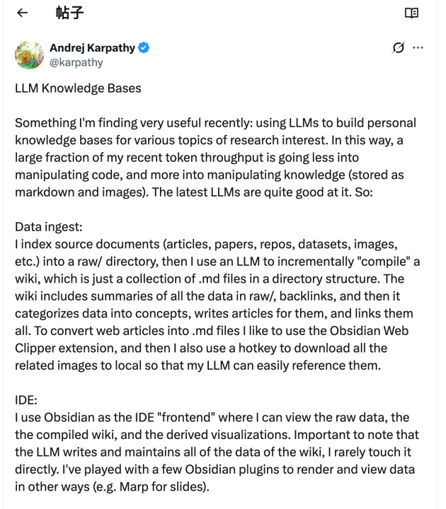

*▲ Karpathy 4月3日原始推文（部分）：LLM Knowledge Bases*

## 一、PKM 赛道的四轮范式尝试
个人知识管理不是新概念，从 2015 年至今这个品类每隔两三年就集体换一次方向。每一轮都解决了上一轮的部分问题，但都卡在同一个根本矛盾上——管理知识这件事本身的成本太高了。

在讲这四轮之前，有必要先提一下 Evernote 这个前车之鉴。

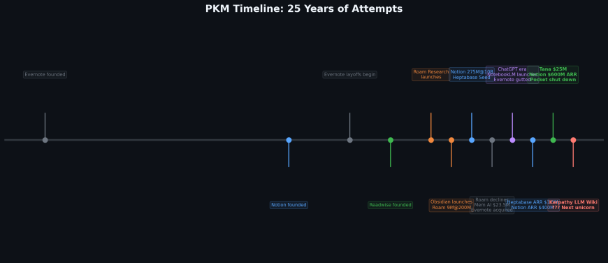

*▲ PKM 赛道 25 年关键事件时间线*

Evernote 成立于 2000 年，巅峰估值 $10 亿，一度被 Engadget 称为「笔记应用之王」。但从 2015 年开始连续裁员，2018 年 CTO、CFO、CPO 集体出走，2020 年推出的 v10 重写版因为性能倒退和功能缺失激怒了核心用户，2022 年被意大利公司 Bending Spoons 收购，2023 年先裁 129 人、再裁掉美国和智利几乎全部员工，整个运营搬到欧洲。收购时 Bending Spoons CEO 说「对 Evernote 的计划一如既往地宏大」，但所有人都知道这个产品已经回不来了。

Evernote 的故事经常被归结为「执行力不行」或者「竞争太激烈」，一个笔记工具的付费意愿天然就很低——Apple Notes 免费、Google Keep 免费，你凭什么收钱？Evernote 融了 $2.9 亿试图回答这个问题，最后的答案是「凭什么也不行」。这不是 Evernote 一家的问题，这是整个 PKM 赛道的结构性困境。

## 第一轮：收藏夹（Read-it-later）时代（2015-2020）
代表产品是 Pocket、Instapaper、Raindrop.io、Poche/Wallabag、BookmarkJar、Distill.id。解决的问题很朴素：看到好东西，存下来以后看。

Pocket 巅峰期几千万用户，Raindrop.io 至今仍然是设计最精良的书签管理器。但这代产品有一个人性洞察上的失误——它们假设保存等于以后会读。

Pocket 自己的数据显示超过 60% 的保存内容从未被打开过，收藏夹越来越长，打开 app 的焦虑感越来越强。

Mozilla 2025 年关闭 Pocket，算是给这代产品做了个了结。

我自己的 Raindrop 里现在有 2000 多条链接，上次认真翻它找东西是什么时候已经想不起来了，但每次看到好链接还是条件反射地存进去。

保存不是管理，囤积不是学习，收藏夹是一个只有入口没有出口的单向管道。

## 第二轮：双向链接时代（2020-2022）
代表产品是 Roam Research、Logseq、Obsidian（早期）、Athens。

2020 年 Roam Research 爆火带来了双向链接的概念——你在 A 笔记里提到 B，B 自动出现指向 A 的引用。

Roam 的创始人 Conor White-Sullivan 之前在 MIT 研究集体智慧工具，2020 年 9 月以 $2 亿估值融了 $9M 种子轮，投资人包括 Lux Capital。Twitter 上的 #RoamCult 标签一时风头无两，用户包括 Facebook、Google、DeepMind 的研究人员。Zettelkasten 方法论被重新发掘，「第二大脑」成了流行词，Graph View 成了 PKM 社区最具标志性的视觉符号。

但 Roam 的热度本质上更接近一个社交网络现象而非产品现象——用户发现新功能时的兴奋感、超级用户创建和分享「脚本」的社区循环、Nat Eliason 和 Tiago Forte 这些意见领袖围绕 Roam 建立的内容生态——这些东西在新用户增速放缓后就失去了正反馈。

到 2022 年 Roam 的日活数据断崖下跌，Athens 直接关闭，团队至今仍然只有 12 个人。$2 亿的估值大概率回不来了。

我的看法是 Roam 的失败不是产品问题而是品类问题——双向链接本身就是一个被过度浪漫化的概念。你真的需要看到「哪些笔记引用了这条笔记」吗？大多数时候不需要。

你需要的是理解，不是引用关系。

Obsidian 活了下来，但活下来的原因不是双向链接，是它的插件生态和 local-first 理念。

我的 Obsidian 有 300 多条笔记，Graph View 打开过三次就再没点过，现在还在用 Obsidian 纯粹是因为 markdown 和本地存储的特性。连接不等于理解，这是这一轮最重要的教训。

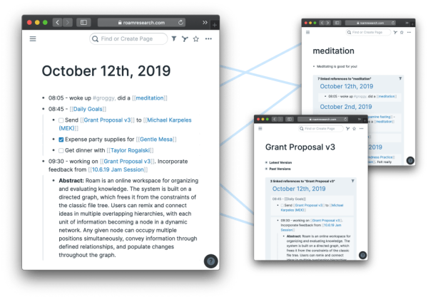

*▲ Roam Research 界面：双向链接和大纲式笔记*

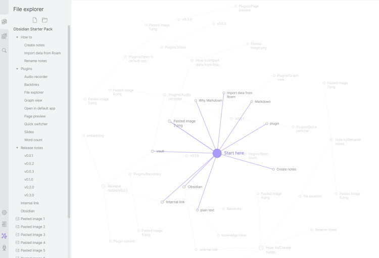

*▲ Obsidian Graph View：好看但没用的知识图谱*

**我的判断：Graph View 是 PKM 赛道最成功的营销素材，也是最没用的功能。它让你觉得自己在「构建知识网络」，实际上你只是在看一张好看的壁纸。**

## 第三轮：白板式思维（2022-2024）
代表产品是 Heptabase、Muse、Scrintal。

Heptabase 是这一轮的标杆——台湾团队做的，创始人詹雨安之前在做量子计算相关的研究，2022 年拿了 Kleiner Perkins 和 YC 的 $2.2M 种子轮，到 2024 年 ARR 约 $1.5M，2026 年估计用户达到 35 万、ARR 约 $7M，团队始终只有 8 人。2025 年 4 月还收到了收购要约。

产品体验确实好，用无限白板来组织知识，卡片自由摆放和连线。但问题在可扩展性：卡片超过几百张白板就变成一锅粥，空间记忆是有限的。

我用 Heptabase 做过 Mana 的产品路线图，前两周确实帮助理清了思路，但到第三周维护成本就上来了——每次有新想法都要考虑放哪个白板、跟哪些卡片连。

第四周我回了 Obsidian 写纯文本。白板降低了组织知识的认知门槛，但没有降低劳动量，维护的认知负担随内容量线性增长。

## 第四轮：AI 辅助时代（2023-2025）
代表产品是 NotebookLM、Notion AI、Mem AI、Tana、Recall、Readwise Ghostreader、MyMemo、Reflect、Remio、Constella、YouMind。

ChatGPT 出来之后所有人都往产品里加 AI——NotebookLM 做文档问答和播客生成（2024 年 9 月推出的 Audio Overviews 功能一度在社交媒体上刷屏），Notion 2025 年 ARR 到 $600M 估值 $11B 其中 AI 功能贡献了超过一半付费转化，Mem AI 从 OpenAI Startup Fund 拿了 $23.5M 估值 $110M，Readwise 加了 Ghostreader 对话功能，Remio 做「基于记忆的 AI 助理」。

值得单独提一下 Tana——这家挪威公司 2025 年 2 月刚融了 $25M，创始团队是前 Google 工程师（其中一位参与过 Google Wave 的开发），产品核心是 Supertag 系统——把非结构化笔记自动转成结构化数据，等于把 Roam 的双向链接和 Notion 的数据库做了一次融合。（和 K神的 LLM Wiki 思路神似）

16 万人在等待名单上，声称 80% 以上的财富 500 强公司都有员工在用。

但这些产品做的事情归结到一句话就是：给旧范式加了个 AI 外挂。

底层逻辑没变，还是人创建知识、人组织知识，AI 只是帮你搜得更快总结得更简洁。

NotebookLM 每个笔记本限制 50 个来源、笔记本之间不能共享上下文、没有导出功能、没有 API——说难听点，这不是知识管理系统，这是一个有 AI 加持的文件阅读器。

你问它问题它答得不错，但你关掉页面之后什么也没留下。

Mem 的「自动连接」更接近向量相似度匹配而不是语义理解——拿了 OpenAI 的 $23.5M 做出来的东西跟一个 embedding 搜索套壳差距不大，有人称之为「$40M 的第二大脑失败」，我觉得不冤。

AI 作为 feature 和 AI 作为 foundation 是两回事，前者是锦上添花，后者才是范式转移，目前这些产品还停留在前者。

## 二、一张产品地图：30 个产品到底在干什么
我把收集到的 30+ 个产品按两个维度做了分类。横轴是信息处理深度——从「原样保存」到「深度理解」。纵轴是 AI 的角色——从「无 AI」到「AI 主导」。

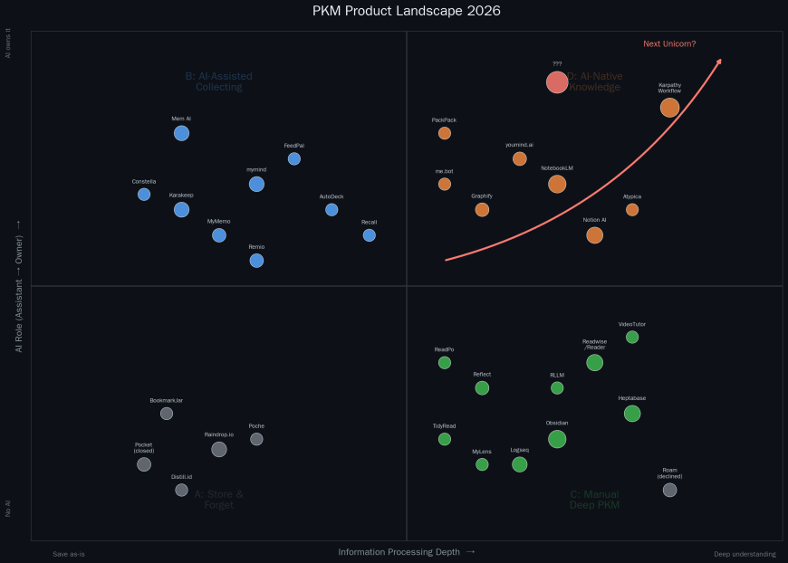

*▲ PKM 产品象限图：30+ 产品的定位*

## 象限 A：存而不理（低 AI × 浅处理）
Raindrop.io、Pocket（已关闭）、BookmarkJar、Poche/Wallabag、Distill.id。纯存东西，不消化。

Raindrop 靠设计感活了下来，但天花板明显——Pocket 的关闭证明纯收藏工具用户根本不愿意付费。

## 象限 B：AI 帮你收，但收完就完了（高 AI × 浅处理）
Karakeep、MyMemo、mymind、FeedPal、Constella、AutoDeck、Remio、Mem AI、Recall、PackPack。这些产品在「存」的基础上加了 AI 自动打标签、自动摘要、自动分类。

Karakeep 是开源自托管方案里的明星——扔个链接进去 AI 自动抓标题描述打标签，支持本地 Ollama 模型，Github stars 增长极快。

mymind 走极简美学路线，号称不需要文件夹不需要标签。但我对这个象限整体不太看好——AI 帮你分类了，然后呢？分完类的信息仍然躺在那里，你不去看它就永远是死的。

这些产品本质上是用 AI 解决了一个伪问题：打标签从来不是知识管理的瓶颈，「不想读」才是。

Karakeep 免费开源有社区价值，但 Mem AI 融了 $28.6M 产品口碑持续下滑，说明砸钱做 AI 标签这个方向的商业回报很有限。

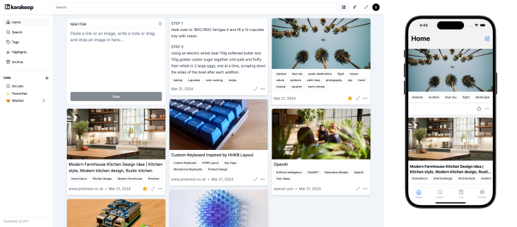

*▲ Karakeep（原 Hoarder）：开源自托管书签管理，AI 自动打标签*

**打标签从来不是知识管理的瓶颈。「不想读」才是。AI 把这个不存在的问题解决得再好，也不会让你的收藏夹活过来。**

## 象限 C：传统 PKM 重镇（低 AI × 深处理）
Readwise/Reader、Heptabase、Obsidian、Logseq、TidyRead、Reflect、ReadPo、MyLens、RLLM、VideoTutor。

这是商业模式最健康的区域。Readwise Reader 把文章、PDF、YouTube 转写、RSS 聚合到一处，高亮后同步到 Obsidian，Daily Review 功能试图解决遗忘曲线，团队 11 人，$9.99/月，bootstrapped 不拿风投。

Obsidian 同样不融资，150 万月活，估计 ARR 约 $25M，18 人团队。

Heptabase 35 万用户，ARR 约 $7M，8 人。TidyRead 做 RSS 聚合支持 Webhook，RLLM 是开源的 LLM 增强阅读项目。

这些产品的共同优点是真正关心用户对知识的理解，设计流程帮你阅读、标注、连接、复习。

共同的问题是太依赖人的意志力——三天没打开 Readwise，系统就开始腐烂。值得注意的是小团队 bootstrapped 模式反而活得最好，Obsidian 18 人做 $25M ARR，比 Mem AI 融 $28.6M 还赚钱。

## 象限 D：AI 原生——最大的空白（高 AI × 深处理）
Karpathy 的工作流、NotebookLM（接近但没到）、Notion AI、Graphify、youmind.ai、me.bot、Atypica。

这个象限的定义是 AI 不是辅助你管理知识，而是 AI 本身就是知识管理者。

目前没有一个成熟产品占据这个位置。

NotebookLM 最接近但缺少复利机制——查询结果不回填知识库。Notion 在做 Agent 方向但困在自己的 workspace 框架里。

Graphify 和 youmind.ai 在尝试自动知识图谱，成熟度还不够。

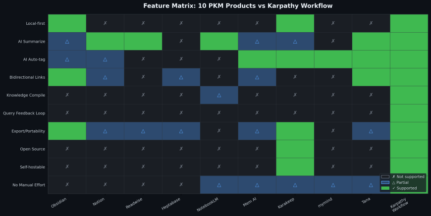

*▲ 功能对比矩阵：10 个产品 vs Karpathy 工作流——注意最后一列*

## 三、钱和数字：这个赛道的商业真相
| **公司** | **融资** | **估值** | **ARR** | **团队** | **象限** |
| --- | --- | --- | --- | --- | --- |
| Notion | $343M | $11B | ~$600M | ~800人 | C→D |
| Obsidian | 未融资 | \- | ~$25M | ~18人 | C |
| Evernote | $290M | 峰值$1B | 亏损 | 已裁员 | 已出局 |
| Heptabase | $2.2M | \- | ~$7M | 8人 | C |
| Readwise | 少量 | \- | 未公开 | 11人 | C |
| Roam Research | $9M | $200M(2020) | 未公开 | 12人 | C(衰退) |
| Tana | $25M | 未公开 | 未公开 | 挪威+美国 | C→D |
| Mem AI | $28.6M | $110M | 未公开 | 未公开 | B |
| Karakeep | 开源 | \- | \- | 社区驱动 | B |
| NotebookLM | Google内部 | \- | \- | Google | D- |

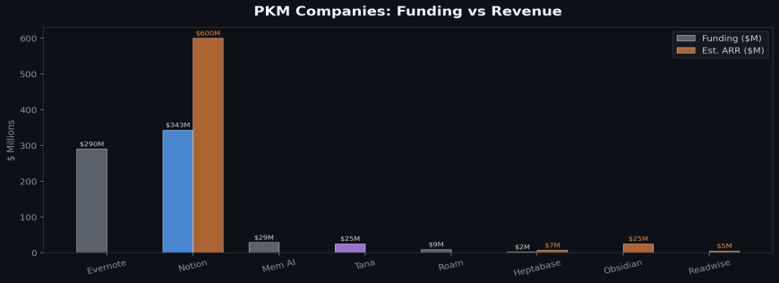

*▲ PKM 公司融资额 vs 营收对比*

从这张表里可以看出几个关键趋势。首先，PKM 赛道的商业天花板远比想象中低——除了 Notion（它本质上是 Productivity Suite 不是纯 PKM），整个赛道没有一家公司 ARR 过 $50M，Obsidian 做到 $25M 已经是行业标杆，而且它不融资不搞增长黑客，纯靠口碑。

Evernote 的教训尤其值得注意：巅峰时 $10 亿估值、$290M 融资，但长期亏损，最终被贱卖给一家意大利 app 工厂——融资规模和产品生命力之间没有正相关关系。

其次，Notion 的 AI 转型提供了重要信号：2025 年超过 50% 的付费用户使用 AI 功能，AI 对 ARR 贡献超过一半，从 $67M（2022）到 $600M（2025）年均增速约 100%，说明用户愿意为 AI 驱动的知识处理付费，但前提是 AI 要真的有用而不是花瓶。

Notion 目前正在做 AI Agent 方向——2025 年 9 月推出了自主 Agent 功能，可以跨页面跨数据库执行多步任务——市场观察人士预计其 18 个月内会提交 S-1 申请 IPO。

第三，小团队 bootstrapped 模式在 PKM 赛道表现突出——Obsidian 18 人做 $25M、Readwise 11 人、Heptabase 8 人做 $7M，PKM 不需要烧钱增长，需要把产品做到深度用户离不开。Mem AI 拿了 $28.6M 融资反而陷入增长困境，Roam 以 $2 亿估值融了 $9M 后团队始终只有 12 人、产品迭代停滞——这两个案例都说明 VC 模式不一定适合 PKM 赛道。但 Tana 是一个值得观察的变量：$25M 融资、前 Google 团队、16 万候补名单，如果它能把 Supertag 的结构化能力和 AI Agent 结合起来形成真正的知识编译循环，有可能成为从象限 C 跨入象限 D 的第一个有资金支撑的选手。

第四，开源正在侵蚀付费产品的底盘——Karakeep 作为 Pocket 的开源替代品社区极活跃，Logseq 开源，RLLM 开源，随着 LLM API 成本每年降 10 倍，用户越来越有能力用开源工具加 LLM 自己搭建知识系统，这正是 Karpathy 在做的事。

Karpathy 推文发出后两天内 Github 上就出现了 llm-wiki-compiler 等多个复现项目，说明这个方向的需求是真实存在的。

## 四、Karpathy 方案的三个关键差异
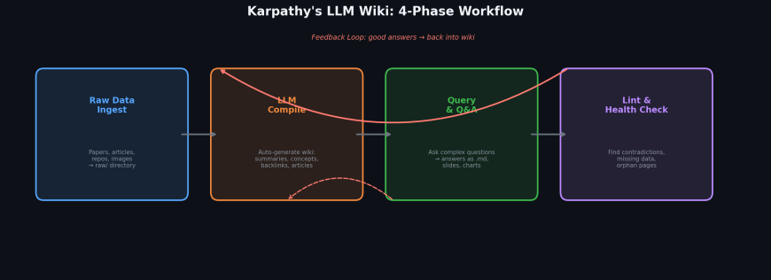

*▲ Karpathy 的 LLM Wiki 四阶段工作流与知识复利循环*

## 社区反应：从 Farzapedia 到 llm-wiki-compiler
这条推文发出后社区的反应速度和强度都值得关注。

开发者 Farza（@FarzaTV）在推文发出当天就做了一个叫 Farzapedia 的东西——用 LLM 把自己 2500 条日记、Apple Notes 和 iMessage 聊天记录编译成了一个个人维基百科，生成了 400 篇互相链接的文章，涵盖他的朋友、创业项目、研究方向甚至最喜欢的动漫对他的影响。

Karpathy 本人转发并评价说，他特别认可这种个人化方式的几个优点：记忆是显性的可检查的（你能看到 AI 知道和不知道什么），数据在你本地（不在某个 AI 提供商的系统里），文件格式通用（不被任何 app 锁定），而且可以随时换 AI 模型。

Farza 自己开玩笑说：「不，Farzapedia 不会公开——考虑到它自动生成了一整篇 Relationship History 文章，有些事还是留在我和我的 LLM 之间吧。」

技术社区的跟进同样快。

推文发出两天内 Github 上出现了多个复现项目：llm-wiki-compiler 是一个 Claude Code 插件，可以把分散的 markdown 文件编译成主题式 wiki，作者实测 383 个文件 13MB 的项目，编译后每次 session 的 context 消耗从 3200 行降到 330 行，减少了 90%。

CRATE 是另一个 Python CLI 实现。DAIR.AI 的 Elvis Saravia 说他一直在做类似的事情，关键是先把数据结构搞对。Lex Fridman 说他也在用类似的方案，还加了 HTML 可视化层。

VentureBeat 用了一个我觉得很精准的描述：Karpathy 没有分享一个脚本，他分享了一种哲学。

**Karpathy 没有分享代码，他分享了一个 idea file——因为在 LLM Agent 时代，分享具体实现已经没什么意义了，你分享想法，每个人的 Agent 会构建属于自己的版本。这本身就是一个关于 AI 时代的 meta 观察。**

## 从笔记到 wiki
传统 PKM 的载体是笔记——碎片化的、个人化的随手记录。

Karpathy 的载体是 wiki 文章——结构化的、百科式的、有交叉引用的。

一篇 wiki 综合了多个原始来源，做了去重归纳和关联。回答复杂问题时，从 wiki 找答案和从几百条笔记碎片里拼凑答案效率完全不在一个量级。

做 Mana 的过程中我经常需要研究特定技术方向比如 WKWebView 的兼容性问题，传统方式是在 Obsidian 里存十几条零散笔记下次查的时候自己拼凑，如果有一篇 LLM 编译的 wiki 文章把所有相关的坑、解决方案、版本差异整合在一起并自动更新，效率能翻好几倍。

以至于最近做的最多的一件事是：“请同步当前实现到文档”。

## 从查询时理解到入库时理解
RAG 和传统 PKM 都是查询时才理解——数据原样存进来，问问题时现场检索拼凑。Karpathy 的方案是入库时就理解——LLM 在数据进来的时候就把它消化成结构化文章并建好链接。他用的隐喻很精准：传统方案是解释器每次运行时翻译，他的方案是编译器提前编好运行时直接用。

编译的优势不只是速度，更重要的是编译过程本身会暴露矛盾、发现缺漏、建立新关联，这些是查询时理解做不到的。

## 知识可以复利
在 Karpathy 的系统里，每次对 wiki 提问的好答案都可以回填进 wiki——一次比较分析、一张图表、一个新发现的关联不会消失在聊天记录里，而是变成知识库永久的一部分。系统的价值随使用时间复合增长，用得越多知识库越完善答案质量越高。这不是效率工具的逻辑，效率工具节省的是时间；这是资产的逻辑，资产会增值。

现有所有 PKM 产品包括 NotebookLM、Readwise、Notion AI 都不具备这个特性，每次查询都是一次性的，探索不会积累。

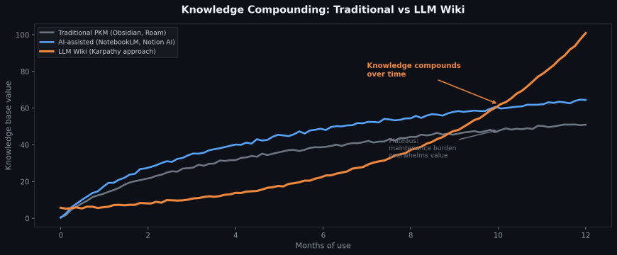

*▲ 知识复利曲线：传统 PKM 增长见顶，LLM Wiki 指数增长*

**传统 PKM 是效率工具——节省时间。Karpathy 的方案是资产——会增值。这两个东西的商业逻辑完全不同，估值逻辑也完全不同。**

## 五、产品化的四个硬问题
方向清楚了，但从 Karpathy 的脚本到一个真正的产品之间还有不小的距离。

冷启动是第一个问题——Karpathy 自己说早期他需要在 loop 里帮 LLM 建立 wiki 的 pattern，什么算一个概念、怎么分目录、文章写多长，普通用户不具备这个 prompt 工程能力，产品需要提供足够好的默认模板和编译策略让人扔进去就能用。

幻觉传染是第二个问题——LLM 在编译阶段如果理解错了原始资料，这个错误会固化进 wiki，后续所有查询都被污染，而且因为 wiki 看起来结构严谨引用完整你可能根本发现不了错误，产品必须设计出处追溯机制让每句话都能追溯到原始文档。

成本是第三个问题。100 篇文章 40 万词的 wiki 做一次全量体检 token 消耗非常可观，如果面向消费者定价 $10/月，token 成本能不能打平需要在编译策略上做大量优化——增量编译而非全量重建、分层摘要而非逐篇精读。

好消息是 LLM 推理成本每年降数倍左右，这个问题两年后可能不再是瓶颈。

规模是第四个问题——Karpathy 的方案在约 100 篇文章规模下不需要任何检索系统，LLM 自己维护 index 就够了，但企业场景动辄上万份文档纯靠 context window 不可能，到了那个规模某种检索机制还是绕不开，个人版和企业版可能需要完全不同的技术架构。

## 六、谁可能跑出来
我认为最有可能在这个方向上做出产品的不是现有 PKM 公司，而是两类玩家。

第一类是从 Obsidian 生态里长出来的独立产品。Obsidian 的 local-first markdown 架构天然适合 Karpathy 的方案——文件在本地，LLM agent 可以直接读写，Karpathy 自己就用 Obsidian 当前端。

推文发出两天后已经有人发布了 llm-wiki-compiler 这个 Claude Code 插件做的就是这件事。Obsidian 的 150 万深度用户是这个新品类最好的种子用户池。

  

第二类是 AI-native 的新产品，从第一天就按「AI 管理知识、人消费知识」的逻辑来设计。这类产品的 UI 不应该长得像笔记软件，更接近一个研究助理的控制台——左边原始资料库，中间 AI 编译出的知识 wiki，右边查询和探索界面，用户的主要交互方式不是写笔记而是提问。

反过来说，我不太看好现有大厂在这个方向上的转型。Notion $11B 估值 $600M ARR，它的数据模型和商业利益都围绕「人在 Notion 里写内容」设计，转向「AI 替你写」。

等于颠覆自己的核心价值主张——你告诉 1 亿用户「其实你不用自己写了」，那他们为什么还要付你 $20/月的 Business 套餐？

## 七、再远一步
Karpathy 在推文最后提到了一个方向：用 wiki 生成合成数据，fine-tune 一个 LLM，让模型把知识记在权重里而不只是放在 context window 里。

这个方向如果走通，就不是个人知识管理了，而是个人智能体——你的专业知识变成一个模型，不需要 context window，离线可用，随时提问，真正的 secomd me。

回看 PKM 赛道的演进，从 Zettelkasten 的卡片盒到 Roam 的双向链接，从 Obsidian 的 markdown 图谱到 NotebookLM 的文档问答，每一次跃迁本质上都在回答同一个问题：谁来做苦活。

答案从「你自己做」一步步走向「AI 做」，Karpathy 的方案是目前走得最远的一步。

再下一步可能是你连提问都不用，模型本身就是你的知识。

至于谁先把这个故事做成产品，我也在思考。Mana 目前在做的是用自然语言创造 App，但更深层一直在想的问题是怎么让每个人拥有自己的知识资产和 AI 能力，从 vibe coding 到 vibe knowledge 方向是一致的。如果你也在想这些问题，欢迎交流。

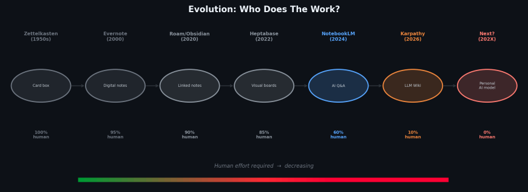

*▲ PKM 演进：谁来做苦活？从 100% 人工到 0%*

*本文价值 100 元，对你有帮助请推荐或公益捐赠。*

---
> 本文同步自微信公众号，[点击查看原文](https://mp.weixin.qq.com/s/0QYwFRrjISihB8iR6ljxvg)
