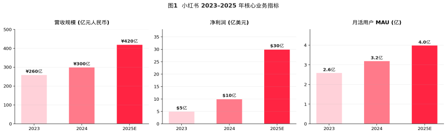
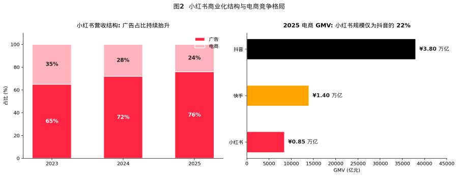
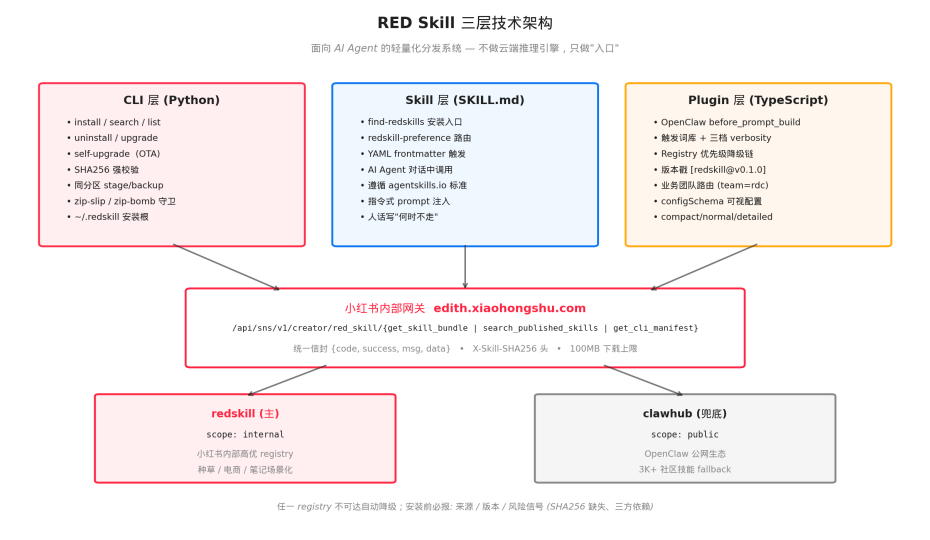
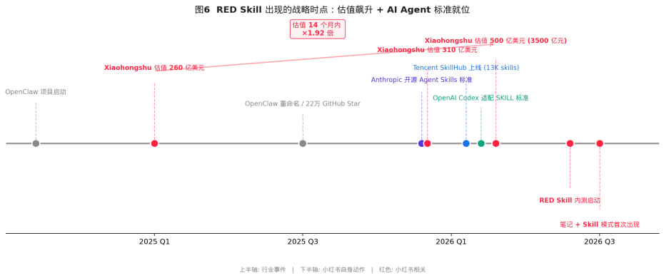
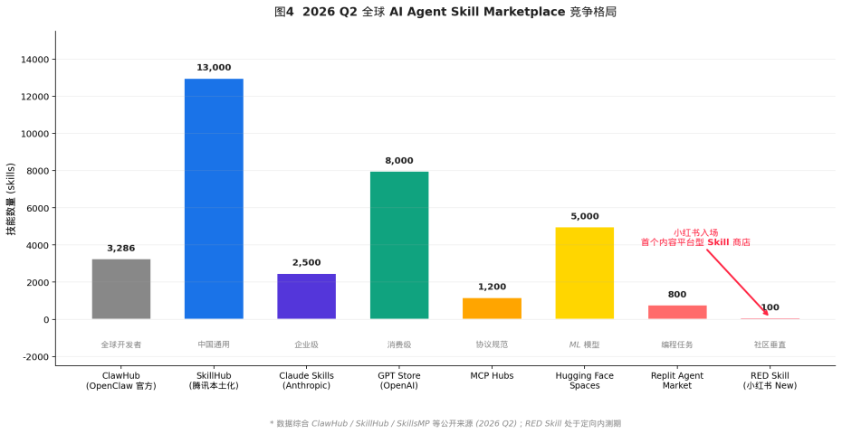
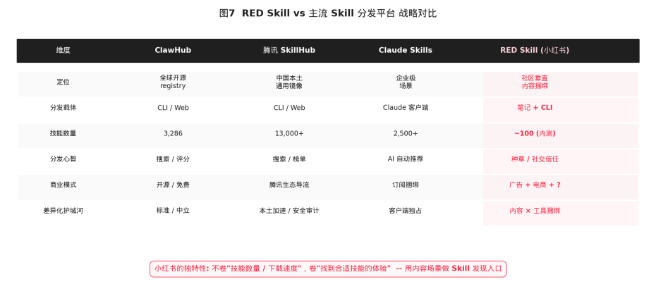
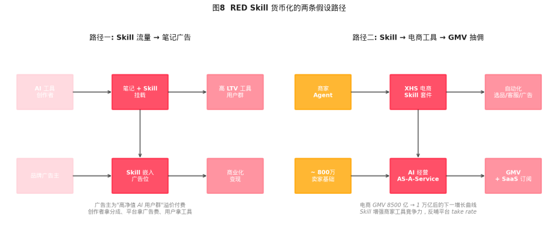
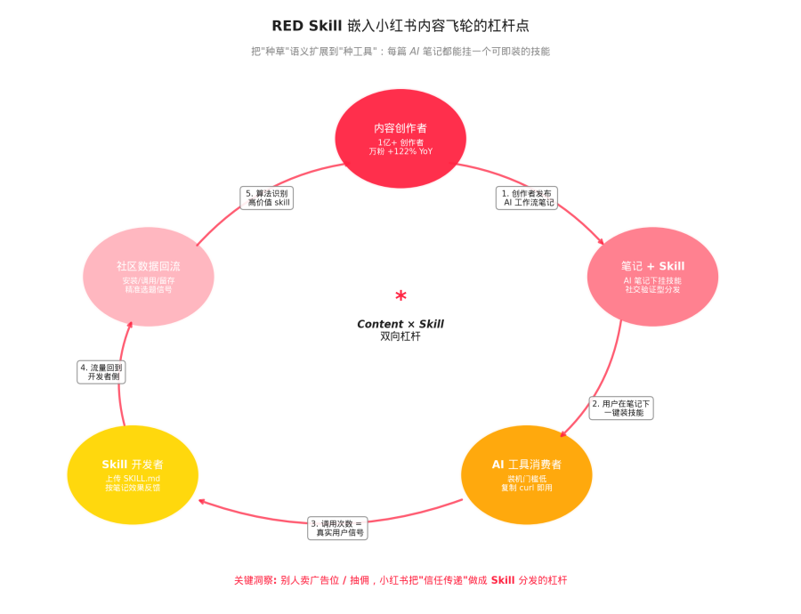
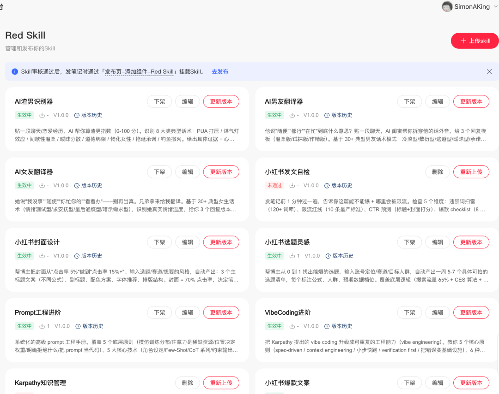
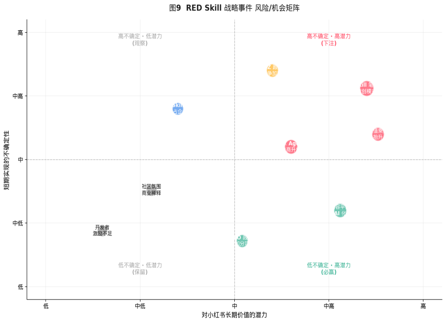

# 小红书 RED Skill：把 "种草" 升级成 "种 Skill"

Date: 2026-05-29  
Author: SimonAKing  
Categories: 微信公众号  
Tags: 微信公众号  
Source: https://simonaking.com/blog/red-skill/

> 2026 年 5 月下旬，距离港股市场期待已久的小红书 IPO 越来越近的窗口期里，小红书做了一个表面上几乎毫无声响、本质上意义重大的动作。

---


*图1 小红书 2023–2025 年核心业务指标 (来源：彭博 / 公开报道整理)*

## 摘要：一次值得分析的产品级动作
2026 年 5 月下旬，距离港股市场期待已久的小红书 IPO 越来越近的窗口期里，小红书做了一个表面上几乎毫无声响、本质上意义重大的动作。

在创作者侧定向内测一款名为「RED Skill」新的组件功能。没有发布会、没有海报、没有 KOL 矩阵式刷屏；所有的安装都通过终端里一行 curl 完成。

我们拿到了 RED Skill 的初版工具包 redskill-kit-0.1.0 并对其完整代码做了逐行审阅，叠加目前可在公网检索到的内测细节、社区生态信号以及小红书自身的业务面，本文章回答了四个问题：

第一，RED Skill 在技术上究竟是什么？它和我们已经熟知的 ClawHub、腾讯 SkillHub、Claude Skills、GPT Store 之间是何种关系？

第二，小红书选择在当下推出 RED Skill，背后是什么样的战略时点判断？

第三，它能为小红书的内容生态、商业化路径、估值故事分别贡献多少新的增长杠杆？

第四，作为投资人，应当在什么样的关键指标上盯紧它的演进？

先说结论：RED Skill 是小红书第一次在产品层面把「内容」和「AI 生产力工具」做了绑定。它的代码风格、API 设计，呈现出一种极其克制的判断，小红书并不打算下场去和 OpenAI、Anthropic 卷模型本身，也不打算和腾讯 SkillHub 在通用技能镜像速度上硬拼，而是希望用自己最稀缺的资产（一亿+ 创作者、社交、近 70% 的搜索渗透率），切下一个全新的细分赛道：以社区场景为单位的 AI Skill 发现与分发。

我们认为，这是一个非常符合小红书过去十年「在克制中长跑」战略动作，也是其在 IPO 估值故事里值得加分的一笔。

但能否真正跑通，仍然取决于三个变量：创作者能否把「Skill 上传」纳入日常发布动作；垂类场景，如电商商家是否会主动接入它做经营自动化；以及 B 站、知乎等同类社区平台会不会在 一个季度内跟进，把 AI Skill 分发推向白热化竞争。  



*图2 小红书商业化结构与电商竞争格局 (来源：彭博 / CBNData / 虎嗅)* 

第一章  代码视角：RED Skill 到底是什么？

在讨论商业策略之前，我们先从工程视角把 RED Skill 这件事拆透。这一节会稍微技术一些，不感兴趣的朋友可以先跳过。

## 1.1 三层架构：CLI + Skill + Plugin
redskill-kit-0.1.0 的目录结构非常工整，整个工具包由三个相互独立、又彼此关联的部分组成：

•**CLI 层（Python）**：一个名为 redskill 的命令行工具，提供 install / search / list / uninstall / upgrade / self-upgrade 六个子命令。它运行在用户本机，是开发者和 AI Agent 与小红书技能仓库交互的唯一入口。

•**Skill 层（Markdown）**：两个 SKILL.md 文件（find-redskills 和 redskill-preference），遵循 Anthropic 在 2025 年 12 月开源的 Agent Skills 规范。它们被部署到 OpenClaw 工作区，由 AI Agent 在对话过程中根据用户意图调用。

•**Plugin 层（TypeScript）**：一个挂在 OpenClaw before\_prompt\_build 钩子上的 TypeScript 插件，它会在每一次 prompt 构建之前检查触发词，命中后把 RED Skill 的检索策略注入到系统消息中，引导 AI Agent 优先走 redskill 仓库。



*图3 RED Skill 三层技术架构（代码级拆解）* 

1.2 后端：直接挂在「creator」域名下的内部网关

RED Skill 的所有后端调用都指向 edith.xiaohongshu.com，这是小红书内部多年沉淀下来的统一网关域名。三个核心 API 路径如下：

```
/api/sns/v1/creator/red\_skill/get\_skill\_bundle

/api/sns/v1/creator/red\_skill/search\_published\_skills

/api/sns/v1/creator/red\_skill/get\_cli\_manifest
```

路径中 creator 这个目录非常关键。它意味着小红书内部把 RED Skill 明确定位在「创作者侧产品」之下，与商家工具、营销工具同级。从组织架构上就指向了「服务创作者经营效率」而不是「平台基础设施」。

## 1.3 一个有趣的小细节：与「腾讯 skillhub」的隔空对话
install.sh 脚本顶部有一段被刻意写出来的注释，说明它的命令行设计风格与「Tencent skillhub」不同。这一行注释，把小红书团队对腾讯 SkillHub 的态度暴露得很清楚。

## 第二章  为什么是 2026 年 5 月？


*图6 RED Skill 出现的战略时点：估值飙升 + AI Agent 标准就位*

时间回到小红书自己的资本曲线上。根据公开报道，小红书的估值在 2025 年 3 月被金沙江创投的投资组合文件标注为 260 亿美元，6 月上调至 310 亿美元，并在 2026 年 2 月的老股转让中飙升到约 500 亿美元，14 个月内估值乘数 1.92 倍。市场普遍预期它将在 2026 年内启动港股 IPO。

在这样的时间窗口里推出 RED Skill，无论是出于估值故事的考量，还是出于 IPO 路演时的叙事补强，都极其合理。

它给了二级市场一个完美的「小红书不只是流量公司、它还是 AI 时代的入口公司」的标签。

在中国互联网公司里，能讲清楚自己在 AI 浪潮中具体扮演什么角色的资产并不多，RED Skill 让小红书的 AI 故事第一次有了一个具体的产品载体。

## 第三章  RED Skill 在全球版图中的坐标
要理解 RED Skill 的差异化价值，必须先把视角拉到全球 AI Agent Skill Marketplace 这个宏观赛道。截至 2026 年第二季度，全球已经形成了至少 8 个有相当影响力的 Skill 分发平台，每一个都有自己独特的定位与经济模型。 



*图4 2026 Q2 全球 AI Agent Skill Marketplace 竞争格局*

## 3.1 已经形成的三大梯队
从技能数量、活跃开发者、商业模式三个维度来看，目前的市场可以分为三层：

•**第一梯队— 通用基础设施：**腾讯 SkillHub（1.3 万 skills）、ClawHub（3286 skills）、GPT Store（约 8 千 skills），它们的角色是 "AI 技能的应用商店操作系统"。

•**第二梯队— 企业级垂直：**Claude Skills、SkillsMP、LangChain Hub 主打企业流程类技能，强调安全审计、版本治理、组织权限。

•**第三梯队— 场景化新势力：**Hugging Face Spaces 偏 ML 模型分发、Replit Agent Market 偏编程任务、Cloudflare AI Marketplace 偏边缘推理，每一家都在挖自己的差异化场景。

RED Skill 进入的并不是这三个梯队里的任何一个，它定义了一个全新的细分赛道：内容平台原生的 Skill 分发系统。它的核心差异并不是技能数量（内测期只有约 100 个），也不是镜像速度（小红书没有腾讯云的 CDN 优势），而是「在哪里发现技能」这件事本身。

## 3.2 关键差异：分发心智的根本不同
ClawHub 的分发心智是「搜索 + 评分」，腾讯 SkillHub 是「搜索 + 编辑精选榜单」，Claude Skills 是「AI 根据上下文自动推荐」。这些都假设了一件事：用户已经知道自己需要技能，然后到一个商店里去找。

RED Skill 把这个前提颠覆了。在小红书的场景里，用户并不是"先有需求、后去技能商店搜"，而是"先看到一篇如何用 AI 一周涨粉的笔记，然后顺手把这篇笔记里挂载的技能装上自己的 Agent"。也就是说，Skill 是被嵌入到内容的语境里被消费的。

这种模式的本质，是把小红书过去十年最值钱的资产，社区信任平移到 AI 工具消费场景。

一个普通用户对 "OpenClaw 官方仓库里的工具好不好用" 是没有判断能力的，但是当 ta 看到自己关注了两年的博主写了一篇详细教程，并且评论区有几十个人晒出 "用这个 Skill 真的两小时写完了一份选题表" 的反馈时，决策成本会急剧下降。 



*图7 RED Skill vs 主流 Skill 分发平台 战略对比*

## 3.3 谁会跟进？B 站、知乎的可能动作
RED Skill 一旦在内测期跑出标杆案例，最有可能在 1–3 个月内做出对标动作的是 B 站和知乎。

B 站的优势在于：根据其 2025 年财报，平台上有 1.2 亿月活用户消费 AI 内容，2025 年 Q4 AI 内容时长同比增长 53%，2026 年 Q1 AI 相关广告收入增长 170%。

B 站的 UP 主社群里，长期活跃着大量做模型测评、Agent 工作流、Skill 配置教程的内容生产者，社区氛围里已经形成了「评论区求链接」「视频简介挂安装命令」的天然 Skill 分发雏形。

知乎的优势在于专业问答的强语义场景。一个典型的知乎用户 "在 PySpark 大数据流水线中如何用 AI 自动生成 ETL 脚本" 类型的提问，本身就是一个完美的 Skill 检索 query。

如果知乎在回答页下方挂上「相关 AI Skill」推荐位，分发效率可能比纯搜索更高。

但这两家如果跟进，节奏上几乎都会落后 RED Skill 至少一个完整产品迭代周期。第一个吃螃蟹的人在用户教育、创作者激励、技能存量积累上将拥有显著先发优势。

## 第四章  RED Skill 怎么帮小红书赚钱？
讨论商业模式之前，先看一下小红书的财务面。根据公开报道与 36Kr / 虎嗅 / 彭博等媒体的交叉验证：

•2024 年总营收 300 亿元，广告占 72%（约 216 亿元，同比 +48%），电商 GMV 约 4000 亿元。

•2025 年总营收 420 亿元（同比 +40%），广告占比 76%（约 320 亿元），电商 GMV 突破 8500 亿元；净利润预计 30 亿美元。

•2025 年 8 月，小红书内部组建「大商业板块」，由 COO 柯南担任总负责人，电商板块首次提升至一级入口。

这是一家典型的「广告强、电商在补」的内容公司。在这个结构下，RED Skill 至少可以服务两条货币化路径。



*图8 RED Skill 货币化的两条假设路径*

## 4.1 路径一：高净值 AI 用户群的广告溢价
RED Skill 让创作者可以在笔记下挂载 Skill。这件事看似只是用户体验的优化，实际上为广告系统提供了一个全新的高质量「人群标签」，一个会在笔记下点击安装 Skill 的用户，几乎一定是 AI 工具的早期使用者，是典型的高 LTV 群体。

这群人对 SaaS、企业服务、开发者工具、AI 硬件的付费意愿与单 ARPU 都远高于普通信息流用户。当小红书把这一群人筛出来作为定向广告位的人群包，理论上单点击 / 千次曝光价格可以做到比常规笔记广告显著更高的溢价。

这是一个 "用产品功能开辟新广告库存" 的经典动作，过去抖音用电商挂载、淘宝用直播间挂宝贝都做过类似事情，只是这一次承载的是「AI 工具」消费场景。

## 4.2 路径二：商家 Agent 与电商 GMV 抽佣
更具想象空间的是第二条路径：把 RED Skill 接到约 800 万小红书商家的经营自动化场景。

根据小红书 2025 年的电商动作，「百万免佣计划」让前 100 万元支付交易额免佣，是一个明确的低门槛拉商家进场的姿态。但商家进场之后，能否做大单店 GMV，取决于 ta 的运营能力，而这正是 AI Agent 可以大幅提升的环节：

•选品 Agent：基于站内搜索 / 笔记爆文趋势的选品 Skill。

•写文 Agent：自动生成种草笔记 + 千人千面变体的 Skill。

•客服 Agent：根据店铺 SOP 自动回复私信的 Skill。

•投流 Agent：根据 ROI 自动调整薯条出价的 Skill。

这些 Skill 一旦标准化、做成小红书官方背书的版本，商家就具备了 "装上即用" 的经营自动化能力。

商家经营效率的提升会直接体现为：

（1）单店 GMV 上升 → 平台 take rate 收入上升；

（2）商家活跃度上升 → 广告 / 直播 / 薯条 ROI 上升；

（3）平台向中小商家提供 SaaS 化能力 → 可能开启全新的订阅 / 软件费收入科目。

这一切并不需要小红书自己去训练模型，它只需要做一件事：用 RED Skill 把市场上最好的 AI 能力按场景策展进来。这是一个非常高杠杆的位置，把别人的算力变成自己的护城河。



*图5 RED Skill 嵌入小红书内容飞轮的杠杆点*



**图6 笔者发布的 red skills，既有创作供给相关的，也有娱乐向的**

## 4.3 一个未被广泛讨论的可能性：开发者订阅
代码里 metadata.json 已经预留了一个值得注意的字段 skills\_search\_url，它和 Anthropic / OpenAI 提供给开发者的「分成 / 订阅 / 标签计费」是同构的。

这意味着 RED Skill 的后端架构其实已经为「付费 Skill」预留了入口。 一旦平台心智成型、创作者积累足够多的优质 Skill 后，小红书完全可以在开启 Skill 订阅功能，让头部开发者从他们的技能里直接获得分成收入。

这一步可能会把小红书的收入结构扩展到「广告 + 电商 + 开发者经济」的三元。

## 第五章  值得在内测期就密切关注的变量
接下来这一节，我们尝试用一个「潜力× 不确定性」的二维矩阵，把 RED Skill 落地过程中最关键的变量摆出来。



*图9 RED Skill 战略事件 风险/机会矩阵*

## 5.1 风险一：社区氛围与商业化稀释
小红书最核心的护城河，是社区里「真实分享」的氛围。一旦 Skill 挂载机制被过度商业化，比如出现大量「装这个 Skill 的笔记其实是软广」的情况，社区信任的稀释会传染到所有其他品类。CBNData 在 2025 年的报告里曾经指出：小红书最大的悖论是 "社区越商业化，用户的真实感就越被稀释"。

## 5.2 风险二：开发者激励不足
内测期靠定向邀请的 AI 创作者维持热度可以做得很漂亮，但要把生态长出来，必须解决「为什么一个开发者愿意花一周时间写一个开源的 RED Skill」这个核心问题。

这背后藏着一个比表面看上去更尖锐的结构性矛盾，我们姑且称之为「Skill 的贪吃蛇困境」。

**先想一个问题：抖音上为什么人人都跳同一首歌的舞，还能各自出圈？** 因为每一支舞都是独特的，同样的副歌、同样的卡点，叠加上每个人的肢体、表情、情绪、生活背景之后，作品就有了独属于这个人的签名。创作者的价值之所以能够被「看到」，是因为不论 ta 是为名、为人、还是为钱，那一周的劳动都能在最终作品里留下一个不可替代的烙印。这是所有 UGC 内容平台繁荣的最根本动力：人是独特的，于是 ta 的作品就是独特的。

**但 Skill 不是舞蹈，Skill 是贪吃蛇。** 两个功能完全一样的「自动生成小红书爆款标题」的 Skill 之间，并不会因为开发者的性格不同而产生消费者愿意感知的差异。第二个出来的版本一旦比第一个晚发布一周、安装量少一个数量级，它的存在价值就近乎归零，这是软件功能型产品与生俱来的「赢家通吃」属性。一个开发者花一周时间写出来的不是「我的舞蹈」，而是「一段任何人都可以平替的代码」。如果激励机制不对，他下一周就不会再写第二个。

这就是为什么开源软件世界历来需要 GitHub Star、issue 讨论，只有当一段代码被绑定到一个人格、一个故事之后，「功能可被复刻」这件事才会被相对削弱，作者的劳动价值才有机会被看到。ClawHub 用社区荣誉机制 + GitHub Star 心智把这件事大体跑通了，OpenAI 则在 GPT Store 用真金白银的直接补贴绕过了这个问题。

RED Skill 目前的位置介于两者之间，但它握着一个其他平台都没有的独特资产，**小红书本身就是一台把「内容创作者→ 粉丝 → 消费者」链条做到极致的人格化引擎。** 如果它愿意把这台引擎反向接到 Skill 分发上，让一个 Skill 的安装数、调用次数、用户在笔记里晒出的口碑反馈，能够反向变成这个开发者笔记的流量、粉丝增长、商业合作机会，那么 RED Skill 就有可能创造一种全新的开发者激励范式：***Skill 不再只是开发者写过的某一段代码，而是某场景下解决方案的体现。*** 这是任何技术中心化、纯仓库式的 Skill 商店（包括腾讯 SkillHub 和 ClawHub）都给不了的。

平台的「贪吃蛇困境」：存量看上去不少，但每一条蛇都长得差不多，谁也没有动力再多写一条。

## 5.3 风险三：竞争窗口收窄
如果腾讯 SkillHub 选择直接复制 "在内容平台挂载 Skill" 的模式，它可以借微信视频号、公众号的庞大流量做同样动作；字节系也完全可以让抖音 / 头条做对标产品。RED Skill 目前的领先窗口里能不能把内测扩展到全量、能不能跑出一两个标杆爆款 Skill、能不能完成对 Top100 AI 创作者的捆绑，还是个未知数。

同时作为小红书的创作者，我真心建议大家不要盯着效率类，多看看情绪类，比如上图作者的“渣男识别”、“女友翻译”。

最后给我们打个广告，Mana(https://mana.am) 正在内测中，欢迎你的关注。

*免责声明：本报告的所有商业判断与估值假设均为基于公开信息的研究性分析，不构成任何投资建议。*

---
> 本文同步自微信公众号，[点击查看原文](https://mp.weixin.qq.com/s/BGNj4I_h4eRccA8DCL5CGQ)
