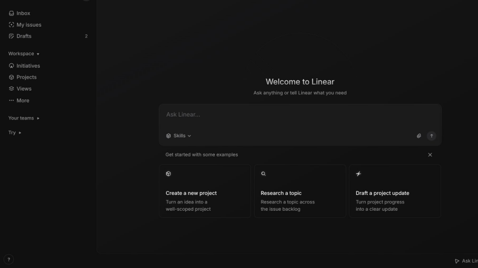
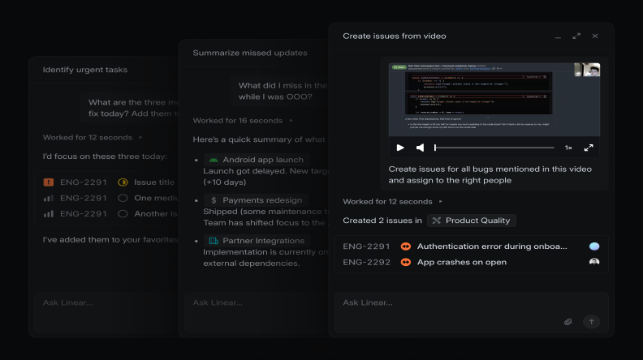
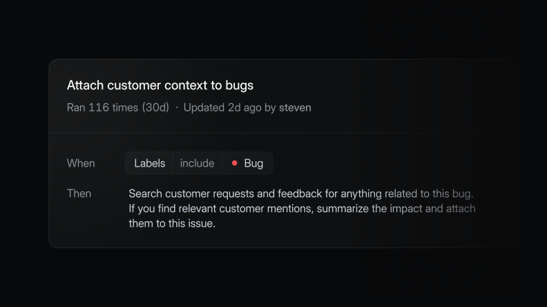
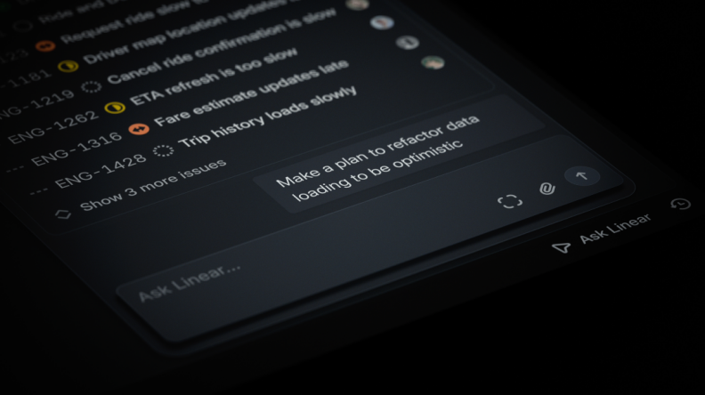
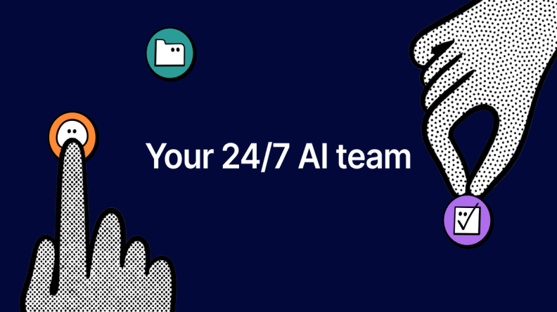
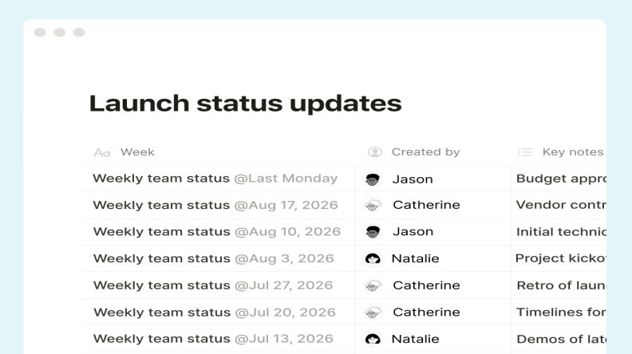
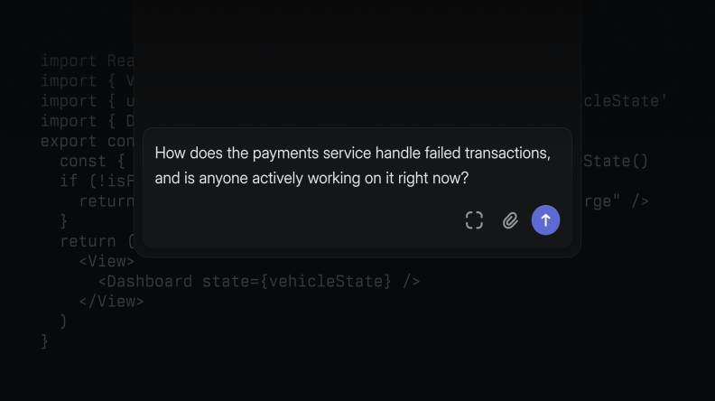

# 深度分析：在 Linear、Notion、Basecamp 同时把产品变成聊天框后

Date: 2026-04-05  
Author: SimonAKing  
Categories: 微信公众号  
Tags: 微信公众号  
Source: https://simonaking.com/blog/saas-agent-crisis/

> Linear 宣布 Issue Tracking 已死、Notion 发布自主 Agent、Basecamp 全面拥抱 CLI *——2026 年，SaaS 行业正在经历一场集体身份危机* **202

---
Linear 宣布 Issue Tracking 已死、Notion 发布自主 Agent、Basecamp 全面拥抱 CLI

*——2026 年，SaaS 行业正在经历一场集体身份危机*

**2026 年 3 月 24 日，Linear CEO Karri Saarinen 发了一篇公开信，标题四个字：****「Issue tracking is dead.」**

同一周，Notion 发布了 Custom Agents——完全自主运行的 AI Agent，不需要人手动 prompt，给它一个任务、设个触发条件，它 7x24 自己干。Basecamp 的 DHH 也跳出来，宣布 Basecamp 全面 Agent 可访问——API 重构、全新 CLI、Agent Skill 一步到位。

Figma 前一天刚发了「Skills」。Shopify 在搞 Shopify Magic。HubSpot 在重构成 AI 客户平台。

所有人都在做同一件事：**把自己的核心界面从「人操作的工具」变成「Agent 操作的平台」。**

说白了，2026 年的 SaaS 行业，正在经历一场**集体身份危机**。每家公司都在问自己同一个问题：如果 AI Agent 能替用户干活，我的 UI 还有存在的意义吗？

## 一、「Issue Tracking is Dead」——Linear 的豪赌

*打开 Linear，迎接你的不再是看板，而是一个聊天框——「Ask Linear...」*

先说 Linear，因为它是这波里喊得最响、动作最大的。

Karri Saarinen 的核心论点不复杂：传统 Issue Tracking 是为「交接模型」设计的。PM 写 Spec，建个 Ticket，工程师接手。系统靠优先级、Sprint、状态流转来弥合中间的 gap。

但这个模型的前提是——**人是执行主体**。当 Agent 变成执行主体的时候，整个交接链条就多余了。Agent 不需要等 Sprint Planning，它需要的是上下文。

他给了三个数据：75% 的 Linear 企业客户已经装了 coding agent，Agent 工作量三个月涨了 5 倍，25% 的新 Issue 是 Agent 自动建的。

所以 Linear 发布了三个东西——

*三种典型用法：识别紧急任务、总结错过的更新、从视频中自动创建 Issue*

•**Linear Agent：**内嵌在产品里的 Chat 界面（Cmd/Ctrl+J），你可以用自然语言让它建 Issue、整理 Backlog、写 Spec、总结项目进展。它能读你的 Roadmap、Issue 历史、代码仓库。

•**Skills：**可复用的工作流。你跟 Agent 聊出一个好模式，存成 Skill，以后一键复用。跟 Figma 前一天发的「Skills」概念一模一样——这个词正在成为 2026 年 Agent 交互的标准术语。

•**Automations：**Issue 进入 Triage 时自动触发 Agent 处理。Business 和 Enterprise 才有。

*「当 Label 包含 Bug 时，自动搜索客户反馈并挂载上下文」——运行了 116 次，无人值守*

另外预告了 Code Intelligence（Agent 理解代码库）和 Coding Agent（直接写代码修 Bug），都还没上线。

### 社区怎么看？
Linear 自家 Slack 社区里，用户对方向总体正面，但最关心的是 MCP 支持。Linear 员工回了一句「we’re working on MCP support」。

Hacker News 上的反应就冷多了。有几条很有代表性——

*「我一直觉得 Linear 是一家审慎、克制的公司。这个突然的声明让我感觉他们内部在经历某种存在危机。」——steve\_adams\_86*

*「写自己的悼词不再只是斯坦福 MBA 课程作业了。」——demuis*

*「This industry is becoming so boring.」——ezekg*

最有深度的质疑来自 aurareturn：客户反馈来自电话、表单、会议、Twitter；内部讨论在 Slack/Teams 上。Linear 说要成为上下文中枢，但**真正的 AI Agent 会直接绕过 Linear 这类工具**——它会像另一个员工一样加入 Slack 频道、参加 Zoom 会议、翻公司文件。根本不需要中间商。

Linear 的人在 HN 上回复了，说 Agent 已经存在于 Slack、Intercom、Zendesk、Gong 等渠道。还有人问「为什么不直接用 Claude Cowork + MCP？」Linear 的回答是：Claude Cowork 是个人工具，Linear 是多人协作的 system of record，定位不同。

*「Ask Linear...」——Issue 列表之上悬浮的 Chat 输入框，Linear 的新入口*

划重点：Linear 的赌注本质上是**上下文垄断**——你的 Roadmap、Issue、代码、客户反馈全在我这，所以我是最好的 Agent 中枢。能不能赢，取决于团队愿不愿意把所有上下文都灌进一个工具里。

## 二、所有人都在做同一件事
### Notion：Custom Agents

*「Your 24/7 AI team」——Notion Custom Agents 的愿景：AI 不是助手，是同事*

2 月 24 日，Notion 发了 Custom Agents。跟之前的 Notion AI（本质是个 Copilot）完全不同——这次是**完全自主运行**的 Agent。你给它一个任务，设个触发器或定时，它 7x24 自己干。

能干什么？自动分类 Triage、内部 Q&A、每日 Standup 汇报、甚至帮你清收件箱到零。支持 MCP 连接 Slack、Figma、Linear、HubSpot。

*「Launch status updates」——Agent 自动生成的周报，不再需要人手动填写*

Vercel 的人说了一句很有意思的话：「很快，Vercel 里跑的 Agent 数量可能会比员工还多。」

定价上，Notion 走了 credit 制——5 月 4 日之前免费试用，之后按 credit 消耗付费。跟 Linear 的「基础免费、高级按量」思路一致。

### Basecamp：DHH 的务实路线
3 月 25 日，DHH 发了一篇博客，标题叫「Basecamp becomes agent accessible」。

37signals 的做法跟 Linear/Notion 不同。他们没有在产品里内嵌 AI，而是**把 Basecamp 变成 Agent 可以操作的基础设施**——重构 API、新建 CLI、写了一套 Agent Skill 文档教 Agent 怎么用。

DHH 的原话很诚实：过去 18 个月试了一堆 AI 功能，做不出真正好用的东西，所以没发。但 Agent 是 AI 的杀手级应用。与其硬塞 AI 功能进产品，不如让外部 Agent 自由进出 Basecamp。

说白了，DHH 选了一条跟 Linear/Notion 相反的路：**不做 Agent 本身，做 Agent 的工作空间**。你用 Claude Code、Cursor 还是什么自建 Agent 都行，只要它能调 Basecamp 的 CLI 就好。

### Figma：Skills 系统
Figma 在 Linear 发布前一天推出了「Skills」——可复用的 AI 工作流。加上之前的 Figma Make（AI 原型工具）、Figma Draw（AI 辅助绘图）、Figma Sites（AI 建站），Figma 在设计工具里的 AI 布局已经很深了。

有意思的是 Figma 的市场处境：IPO 后股价从高点跌了 85%。市场对「设计工具会不会被 AI 取代」的恐慌非常真实。Figma 的应对策略是——**如果 AI 要取代设计师，那最好由 Figma 来做这个取代者**。

## 三、为什么是现在？三股力量同时到位
### 1\. Agent 的能力突破了可用阈值
2024 年的 AI Copilot 本质上还是个高级自动补全。2025-2026 年的 Agent 已经能做多步推理、调用工具、跨系统操作。Claude Code、Cursor、Codex 这些 coding agent 已经在企业里大面积部署。Linear 说 75% 的企业客户装了 coding agent——这不是概念验证，是生产环境。

### 2\. MCP 成了事实标准
Anthropic 的 Model Context Protocol 让 Agent 可以用标准化方式连接任何工具。Notion 的 Custom Agents 用 MCP 连 Slack、Figma、HubSpot。Linear 在赶着做 MCP 支持。Basecamp 的 Agent Skill 本质上也是类似的接口层。

MCP 的意义是：Agent 不再需要为每个工具写定制集成。有了 MCP，一个 Agent 可以同时操作 Linear、Notion、GitHub、Slack。这让**「哪个工具是 Agent 中枢」**变成了一个真正的战场。

### 3\. 定价模型正在被颠覆
传统 SaaS 按人头收费——每个 seat $8-$16/月。但如果 Agent 替代了一半的人工操作，seat 数就会下降。Deloitte 预测到 2030 年，40% 以上的企业 SaaS 支出会转向按使用量、Agent 数量或结果付费。

Linear 和 Notion 已经在探路了：基础 Chat 功能免费、Automations 按量计费。这是一个信号——**SaaS 的价值衡量单位正在从「人坐在屏幕前的时间」变成「Agent 完成的任务数」**。

## 四、回到 Apple：巨头的困境与 SaaS 的困境，是同一个问题
我之前写过一篇深度分析 Apple 的 AI 困局。那篇文章的核心观察是：Apple 技术上有能力（芯片、隐私架构、MLX 框架），但组织上执行不了（Siri 内斗、四次跳票、AI 掌门被退休）。

现在看 SaaS 行业的集体转型，底层逻辑是一样的：**AI 不是一个可以「加上去」的功能，它要求产品从底层重新设计交互范式**。

Apple 的教训是什么？

1.**第一，速度。**Apple 在 2022 年 ChatGPT 发布时，高层说 chatbot 没什么用。两年后被迫跟 Google 签约买 Gemini。在 AI 领域，慢半拍就是慢一个时代。Linear 显然学到了这一点——即使产品还在 Beta，先喊出来占位。

2.**第二，定位。**Apple 从「收租的」（每年收 Google 200 亿搜索默认费）变成了「付租的」（每年付 Google 10 亿 Gemini 授权费）。SaaS 公司面临同样的选择：你是 Agent 的操作者，还是 Agent 的基础设施？Linear 选了前者，Basecamp 选了后者。选错了，就从平台变成管道。

3.**第三，开放 vs 封闭。**Apple 封杀 Vibe Coding 应用（Replit、Vibecode），试图用审核权力控制 AI 创作的 App 分发。结果激怒了整个开发者社区。SaaS 公司恰好走了反方向——Linear 支持 Claude Code、Cursor、Codex 直接打开 Issue；Basecamp 直接开放 CLI。但话说回来，开放也有代价：如果 Agent 可以随便操作你的数据，你的产品护城河在哪？

## 五、Chat 界面的陷阱：连 Linear CEO 自己都承认了

*代码之上的 Chat——Linear Code Intelligence 让非技术人员也能问代码问题*

这是这轮转型里最值得关注的一个细节。

Karri Saarinen 在 Linear Agent 发布后几天，在 every.to 上发了一篇设计思考文章。他**亲口承认了 Chat 界面的根本性缺陷**——

*「Chat 用得越多越发现它的弱点。所有东西变成一串文本流，很难留存、比较、跟其他工作关联起来。输出质量完全依赖输入质量，两个人问同一个问题可能得到完全不同的结果。界面本质上是一个空白页加一个闪烁的光标，所有获取价值的负担都压在打字的人身上。」*

说白了，Chat 适合探索，不适合严肃的、重复的团队工作。Linear 自己的 CEO 都知道这一点。

他的结论是需要在 Chat 之上加更多**结构化的交互设计**——引导用户和 Agent 走向更好的结果，但又不能太死板。这是一个真正的设计挑战，目前没有人解决得好。

我的看法：这恰恰说明了为什么这轮「SaaS 大逃杀」还远没有结束。大家都在往 Chat/Agent 方向跑，但 Chat 本身可能不是终态。最终的赢家不是谁先加了聊天框，而是谁先找到**Chat 之后的交互范式**。

## 六、SaaS 股价暴跌：市场已经在定价这场变革
先看数据。过去 12 个月的 SaaS 股价表现，惨不忍睹——

| **公司** | **跌幅** | **背景** |
| --- | --- | --- |
| HubSpot | \-50%+ | 品类龙头，AI 威胁高利润工作流 |
| ServiceNow | \-30~40% | 分析师公开讨论「SaaS 已死」 |
| Monday.com | \-40%+ | 产品和增长都好，但市场不买账 |
| Atlassian | 两位数下跌 | 开发者网络深厚，仍被抛售 |
| Adobe | \-30~35% | 发了一堆 AI 功能，股价继续跌 |
| Salesforce | \-25~30% | 企业嵌入最深，照样被砸 |
| Figma | \-85% 从高点 | IPO 后暴跌，AI 取代恐慌严重 |

这些不是投机股，是成熟的、有现金流的平台公司。市场在干一件事：**给 AI 颠覆风险定最高价**。尤其是面向 SMB、按人头收费的水平型 SaaS。

Jensen Huang 前段时间在 Cisco AI Summit 上说了一句反调：「AI 会取代软件行业，这是世上最不合逻辑的说法。AI 会使用现有工具，而不是重新发明它们。」

但话说回来，Jensen 的意思是 AI 需要软件**基础设施**，不是说 AI 需要你的**UI**。如果 Agent 可以直接调 API 完成工作，那精心打磨的 Dashboard 和看板，对谁有价值？

## 七、三种路线，三种赌注
目前看到的 SaaS 公司应对 Agent 时代的策略，可以分成三类——

### 路线 A：成为 Agent 本身（Linear、Notion）
在产品里内嵌 AI Agent，用 Chat 界面让用户与 Agent 交互。Agent 理解你的数据、你的工作流，替你执行操作。

**赌注：**上下文是护城河。你的 Roadmap、Backlog、客户反馈都在我的数据库里，别的 Agent 拿不到。

**风险：**如果通用 Agent（Claude Cowork、ChatGPT）通过 MCP 可以读取同样的数据，你的内嵌 Agent 就没有独特优势。更危险的是，用户可能更信任他们已经在用的通用 AI，而不是你的专用 AI。

### 路线 B：成为 Agent 的基础设施（Basecamp）
不做 Agent，做 Agent 可以操作的平台。开放 API、CLI、Skill 文档，让外部 Agent 自由进出。

**赌注：**Agent 需要一个可靠的「工作空间」来存放数据、管理状态、协调团队。不管用什么 Agent，你都需要 Basecamp。

**风险：**如果你只是一个 Agent 可以操作的数据库，那你的竞争壁垒就退化成了 API 质量和数据迁移成本。很多团队可能干脆用 Google Docs + MCP 就够了。

### 路线 C：两边都做（Shopify）
产品里有 AI 功能（Shopify Magic），同时开放 API 让外部 Agent 操作。既做用户的 Copilot，又做 Agent 的基础设施。

**赌注：**电商场景太垂直、太复杂，通用 Agent 做不好。用户需要一个「懂电商」的 AI。

**风险：**两边都做意味着两边都做得一般。资源分散。

## 八、我的判断
写了这么多，最后说几个我自己的判断——

**第一，「Issue Tracking is Dead」是营销话术，不是产品事实。**Linear 自己都说了，Issue 还是核心数据单元。死的不是 Issue，是「人手动建 Issue、手动改状态、手动跟进」这套工作流。Agent 会自动建 Issue、自动更新状态。Issue 不会消失，只是创建者从人变成了机器。

**第二，Chat 不是终态。**连 Karri 自己都承认了 Chat 的缺陷。2026 年的 Chat 界面就像 2007 年的触屏——方向对了，但交互范式还没成熟。谁先找到「Chat + 结构化操作」的混合界面，谁就能拿下下一个十年。

**第三，真正的赢家不是 SaaS 公司，是 Agent 平台。**Anthropic（Claude Code + MCP）、OpenAI（Codex + ChatGPT）、Google（Gemini + Agent Space）——这三家才是真正的「上下文中枢」候选者。SaaS 公司再怎么折腾，底层模型能力受制于人。就像我在 Apple 那篇文章里说的：从收租的变成付租的。Linear 的 Agent 聪不聪明，取决于 Claude 或 GPT 聪不聪明，不取决于 Linear。

**第四，对创业者来说，这是一个巨大的窗口期。**当所有 SaaS 巨头都在重构自己的交互范式时，它们的用户体验会有一段「青黄不接」的过渡期。老界面还在，新 Agent 还不稳定。这时候如果有人能在垂直场景做出一个 Agent-native 的产品——**不是在旧产品上加 Chat，而是从第一天就围绕 Agent 设计的产品**——机会很大。

**第五，安全和信任问题被严重低估了。**The Register 指出 Linear Agent 的所有文档里，关于安全的描述只有一句话：「Agent 在你现有权限范围内运作。」一句话。一个可以自动建 Issue、修改项目、读取客户反馈的 Agent，安全模型只有一句话。Notion 好一点，有权限控制和操作日志。但整个行业在 Agent 安全上的投入，远远不够。

SaaS 行业让我想起 2007 年的手机行业。iPhone 发布之前，诺基亚、摩托罗拉、黑莓各有各的键盘方案。然后一块触屏改变了一切。

现在的 SaaS 公司就像当年的手机厂商——都知道 AI Agent 是未来，都在往那个方向跑，但没人确切知道终态长什么样。Linear 觉得是 Chat + 上下文，Basecamp 觉得是 CLI + 开放 API，Notion 觉得是自主 Agent + MCP 生态。

但有一件事是确定的：**谁的交互范式最后被证明是对的，谁就是下一个十年的赢家**。

不是 AI 能力最强的赢——那是模型公司的事。

不是数据最多的赢——数据可以通过 MCP 流动。

**是交互范式的赢家通吃。**

就像触屏之于手机，鼠标之于 PC。

这个答案，2026 年还没有人找到。

---
> 本文同步自微信公众号，[点击查看原文](https://mp.weixin.qq.com/s/f1F69mdb0l0ge2rw7MtArw)
