# 深度拆解 Vercel：AI 时代最被低估的基建公司

Date: 2026-04-11  
Author: SimonAKing  
Categories: 微信公众号  
Tags: 微信公众号  
Source: https://simonaking.com/blog/vercel-deep-dive/

> 如果你只把 Vercel 理解为“一个部署前端项目的工具”，那你大概只看到了它的 10%。Vercel 现在的估值是 93 亿美元，GAAP 年化收入已达 3.4 亿，同比增长 84%。这个数字放在

---
如果你只把 Vercel 理解为“一个部署前端项目的工具”，那你大概只看到了它的 10%。Vercel 现在的估值是 93 亿美元，GAAP 年化收入已达 3.4 亿，同比增长 84%。这个数字放在 2026 年的 AI 公司里不算最耀眼的，但绝对是最不可思议的——因为它的起点不是 AI，而是“部署”。

我的判断：Vercel 是这个时代最被低估的“基建型”公司之一。它花了十年先把自己变成“前端世界的水电煤”，然后在 AI 浪潮来的时候用这套基建接住了新时代的流量。

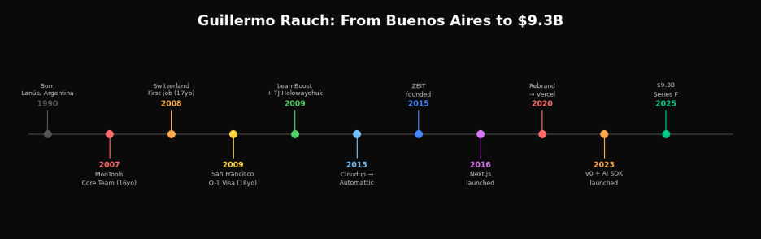

*Guillermo Rauch：从布宜诺斯艾利斯到 93 亿美元的十年路*

## 一、发家史：一个阿根廷辍学生的十年路
### 从 Lanús 到旧金山
Guillermo Rauch 1990 年出生在阿根廷 Lanús，父亲是工程师。爸爸把一台 Windows 95 电脑带回家，他就此开始自学编程。到11岁折腾 Linux，13岁已经在听 Richard Stallman 的演讲，开始深度参与开源社区。16岁成为 MooTools 框架核心开发者，主导开发了 MooTools Forge 包管理器。MooTools 虽然后来输给了 jQuery，但这段经历让 Rauch 深刻理解了开源社区怎么运作、怎么失败。

17岁跑去瑞士工作。18岁，连学都没读完就移民旧金山——拿的是 O-1“杰出人才”签证，为了证明能力写了一本《Smashing Node.js》。这本书后来成了 Node.js 早期最重要的入门读物之一。

### LearnBoost：Node.js 的“黄埔军校”（2009-2013）
Rauch 到旧金山后和 Rafael Corrales、Thianh Lu 一起创办了 LearnBoost（2009），做教师用的数字成绩册。这家公司从 CRV、Bessemer、RRE 等拿到了约 500 万美元融资。产品本身没做起来，但它的“副产品”却影响了整个 Node.js 生态。

为什么？因为 LearnBoost 是最早全面拥抱 Node.js 的公司之一。当时 Node.js 生态太早期，很多基础设施压根不存在，团队不得不自己造。Rauch 自己说过：“有时候我们会用很早期的软件，发现不够好，然后就自己写一个并开源。”Socket.IO、Mongoose 就是这么来的。他后来总结了一条规律：创业公司的副产品有时会变成主产品。这条规律后来在 Vercel 身上又重演了一次——Next.js 原本只是平台的配套工具，结果反过来变成了公司最大的资产。

这里得重点说说 LearnBoost 团队里的另一个关键人物：TJ Holowaychuk。

### TJ Holowaychuk：Node.js 早期生态的单人发电机
TJ 是加拿大开发者，在 LearnBoost 全职工作（远程）。他的产出量离谱到有人怀疑他是不是真人——从 2009 年到 2014 年，他一个人创建和维护了超过 600 个 npm 包，几乎以一己之力构建了 Node.js 早期生态的半壁江山。他创建的项目包括：

Express.js——Node.js 最流行的 Web 框架，灵感来自 Ruby 的 Sinatra，现在被 PayPal、Uber、IBM 等使用。Connect——Express 的中间件基础。Mocha——最流行的 JavaScript 测试框架。Jade（后改名 Pug）——模板引擎。Commander.js——命令行参数解析器。Stylus——CSS 预处理器。Koa——他离开 Express 后做的下一代框架。Superagent、Co、n（Node 版本管理器）等等。

你几乎不可能用 Node.js 而不碰到 TJ 写的代码。而这些全是他在 LearnBoost 期间产出的。某种意义上，LearnBoost 的教育 SaaS 产品是副业，这些开源项目才是主业。

2014 年，TJ 在 Medium 上发了一篇《Farewell Node.js》，宣布转向 Go 语言。他离开后创办了 Apex（Serverless 工具），后来又回到了“隱居”状态。他从未在任何主要技术会议上公开演讲过，是开源世界里最神秘的大神之一。他后来明确表达过对开源的失望：“开源不付账单。”

### Cloudup、Automattic 与“开源商业化”的启蒙（2013-2015）
2013 年，LearnBoost 团队做了 Cloudup——一个拖拽上传分享工具，连上传都没完成就能分享链接。这个产品引起了 WordPress 母公司 Automattic 的注意。Automattic 创始人 Matt Mullenweg 觉得 Cloudup 比 WordPress 自己的媒体库好太多，于是收购了整个团队，包括 LearnBoost 和所有相关开源库（包括 Socket.IO 和 Mongoose）。

Rauch 在 Automattic 待了两年。这段经历对他的影响比很多人想象的要深。他亲眼看到 WordPress 如何用开源软件构建商业帝国——WordPress 开源免费，Automattic 用 WordPress.com 的托管服务赚钱。这个“开源框架拉用户，云服务变现”的模式，后来几乎原样复制到了 Vercel 上。

### ZEIT / Vercel：核心理念的诞生（2015）
2015 年 Rauch 创办 ZEIT（2020 年改名 Vercel）。他的出发点很简单：部署网站应该像分享文件一样简单。当时部署一个网站还得配 nginx、设置 CI/CD、处理 SSL、管理 DNS。ZEIT 把这一切变成一个命令：now。

但 Rauch 的野心不止于“部署工具”。他在 a16z 的一次对谈里说过一句很重要的话：“我一直把开源看作“加速找到 PMF 的捷径”——因为如果人们在免费的时候都不用你的东西，那你可能应该做别的。”对他来说，开源不是慈善，是商业验证的工具。

同一年，他创建了 Next.js。这两件事之间的关系就是整个故事的核心：开源框架拉开发者，云平台变现。正如 WordPress 之于 Automattic，Terraform 之于 HashiCorp，Elasticsearch 之于 Elastic。但 Vercel 做得特别漂亮的地方在于：它的开源项目不只是一个工具，而是变成了事实上的行业标准。这让转化漏斗的丝滑程度远超同类公司。

## 二、开源全景图：从 Socket.IO 到 skills.sh
这一节把 Rauch 个人 + LearnBoost + ZEIT + Vercel 时期的所有重要开源项目梳理一遍。看完你会明白，为什么说 Vercel 的护城河是“开源生态”而不是某个单点产品。

### 第一阶段：Rauch 个人 + LearnBoost（2007-2013）
**MooTools 核心贡献：**16岁加入 MooTools 核心团队，主导开发 MooTools Forge。虽然 MooTools 后来输给了 jQuery，但让 Rauch 深刻理解了开源社区的运作方式。

**Socket.IO（2010）：**WebSocket 实时通信库，Node.js 生态的事实标准。GitHub 6.1万+ star。诗意的是，Vercel 的 Serverless 架构至今不支持 WebSocket，等于创始人最著名的开源作品在自己平台上跑不了。

**Mongoose（2010）：**MongoDB 的 Node.js ORM，2.7万+ star，现在依然是最流行的 MongoDB ODM。同样源自 LearnBoost 的实际需求。

前面已经详细讲过 LearnBoost 时期产出的大量 npm 包。除了 Socket.IO 和 Mongoose，TJ Holowaychuk 在这个时期创建的 Express、Mocha、Commander 等同样影响深远。

### 第二阶段：ZEIT 时期（2015-2020）
**Now CLI（2015）：**ZEIT 的第一个产品。在终端输入 now，项目就部署上线。当时部署一个网站还得配 nginx、设置 CI/CD、处理 SSL，Now 把这一切变成一个命令。后来演变成 Vercel CLI。

**Hyper（2016）：**基于 Electron 的终端模拟器，4.3万+ star。“Web 技术做终端”的先驱，后来被 Ghostty、Warp 超越，但说明 Rauch 对终端的执念可以追溯到童年。

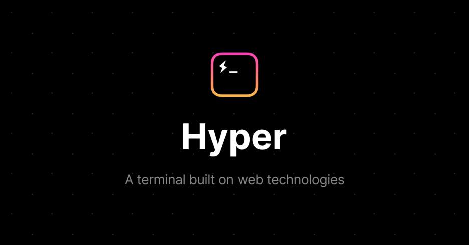

*Hyper 终端：基于 Web 技术的开源终端模拟器，4.3 万 GitHub Star*

**micro、serve、pkg（2016）：**micro 是极简 HTTP 微服务框架，“每个文件就是一个微服务”的哲学直接影响了 Serverless Functions 设计。serve 是单命令静态服务器。pkg 把 Node.js 项目打包成可执行文件。都体现了 ZEIT 对“零配置”的执念。

**Next.js（2016）：**重头戏。React 在 2016 年已经很火但没有好用的 SSR 方案，Next.js 填了这个空白。现在每周下载超 2 亿次，Walmart、Apple、Nike、Netflix、TikTok 都在用。后面详说。

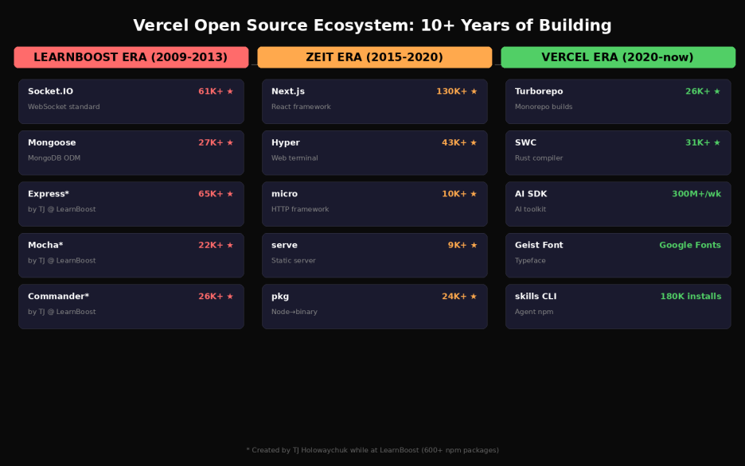

*Vercel 开源生态全景：10+ 年的开源积累*

### 第三阶段：Vercel 时期（2020至今）
**SWR（2019）：**React 数据获取 hooks 库，stale-while-revalidate 策略。影响了后续的 React Query 等方案。

**Turborepo（2021年收购）：**Monorepo 构建工具，创始人 Jared Palmer 加入后成为 Vercel VP of AI。用 Rust 重写核心，配合 Remote Cache 大幅加速团队构建。把 Vercel 从“部署工具”延伸到“构建工具”。

**SWC（赞助/雇佣）：**Rust 写的 JS/TS 编译器，比 Babel 快 20-70 倍。原创者 kdy1 被 Vercel 雇佣全职开发，整合进 Next.js 作为默认编译器。ByteDance、Shopify、Deno 等也在用。

**Svelte（雇佣 Rich Harris，2021）：**主推 React 的公司花钱养竞争框架创始人。背后逻辑：Vercel 卖的是“前端部署”这个品类，不是某一个框架。

**AI SDK（2023）：**开源 TypeScript AI 工具包，每周 300万+ 下载，Vercel 增长最快的开源项目。后面详说。

**Workflow SDK / Flags SDK / Chat SDK（2025-2026）：**近期一系列小而精的开源 SDK，加在一起构成“AI 应用开发基建”。

### 收购补充：Splitbee（2022）、ModelFusion（2024）
Splitbee 是隐私优先的分析工具，收购后整合进 Vercel Analytics。ModelFusion 是 TypeScript AI 抽象层，整合进 AI SDK 3.1。

### Next.js：从副产品到事实标准，以及它的争议
Next.js 的演化本身就是一部前端史。2016 年主打 SSR；2020 年发布 ISR，解决大规模静态网站更新难题；2022-2023 年的 App Router + React Server Components 最具争议；2025 年每周下载超 2 亿次，基于 Next.js 的网站从 3.5万增到 400万+；2026 年 3 月 Next.js 16.2 终于加入稳定的 Adapter API。

不过 Next.js 的很多新功能在 Vercel 上体验最好，其他平台必须基于未文档化 API 去支持。Cloudflare 和 Netlify 发起 OpenNext 运动就是为了解决这个问题。Adapter API 从承诺到落地花了近三年。

安全事件也加剧了信任危机。2025年3月的中间件授权绕过漏洞（CVE-2025-29927）处理方式被安全社区批评为不透明。2025年12月更严重：React Server Components 的 RCE 漏洞（CVE-2025-55182，CVSS 10.0 满分）被积极利用。Wiz 的研究人员说这个漏洞成功率接近 100%，而且默认配置就有漏洞。对于一家控制着数百万生产网站的公司，安全处理的信任度就是老命。

把所有开源项目串起来看，规律很清晰：Vercel 不是“做一个项目然后卖服务”，而是“构建一个网状生态的每一个节点”。框架、构建工具、编译器、字体、数据获取、AI 工具包——每一个都是这张网的一个结点。

## 三、平台产品与商业模式：产品就是护城河
Vercel 的商业模式说开很简单：开源框架拉开发者，云平台变现。但实际上它的产品线已经远远超出“部署”了。

### 基础设施：Fluid Compute + Functions + CDN
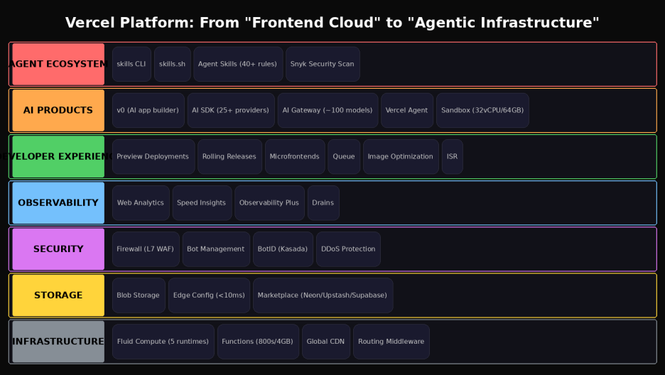

*Vercel 平台产品七层架构：从基础设施到 Agent 生态*

Fluid Compute（2025）是 Vercel 的新计算模型，结合 Serverless 弹性和传统服务器并发。一个实例同时处理多个请求，大幅降低冷启动。支持 Node.js、Python、Edge、Bun、Rust 五种运行时。定价也变了：Active CPU 计费——等待 I/O 的时间不收钱，对 AI 工作负载特别友好。Vercel Functions 支持最长 800 秒执行、4GB 内存。

*Fluid Compute：“The power of servers, in serverless form”*

### 存储 + 安全 + 可观测性
存储：Vercel Blob（文件存储）、Edge Config（全球 KV，99% 读取 <10ms）。Vercel Postgres 和 KV 已弃用，现在通过 Marketplace 接入 Neon、Upstash、Supabase 等第三方——不自己做数据库，做“数据库商店”，这个策略很聪明。

安全：Vercel Firewall（L7 WAF + DDoS 防护）、Bot Management、BotID（与 Kasada 合作的“隱形验证码”，不需要用户点图片，靠深层信号分析识别机器人）。

可观测性：Web Analytics（来自 Splitbee、无 cookie）、Speed Insights（真实用户性能监控）、Observability Plus（自定义查询）、Drains（日志导出到 Datadog 等）。

### 开发体验层：真正的护城河
Preview Deployments（每个 PR 自动生成预览环境）、Rolling Releases（2025，渐进式全球部署）、Microfrontends（2025 GA，原生微前端支持）、Vercel Queue（2025，原生任务队列）、Image Optimization、ISR——每一个都让开发者更难离开 Vercel。

这就是 Vercel 的护城河：不是某一个功能无可替代，而是所有功能加在一起的“综合体验”无可替代。任何一个单独的竞争对手都只能覆盖其中一小块。

### 财务数据
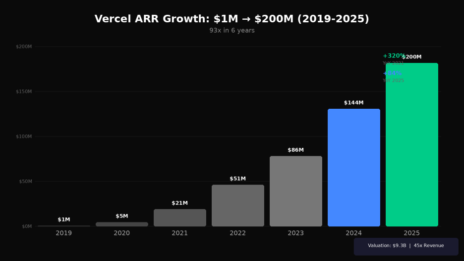

*Vercel ARR 增长曲线：6 年从 $1M 到 $200M*

收入曲线：2019年 100万 → 2020年 500万 → 2021年 2100万（+320%）→ 2022年 5100万 → 2023年 8600万 → 2024年底 1.44亿 → 2025年中 2亿。从 1亿到 2亿只用 15 个月。毛利率约 70%。

融资：总融资 8.63亿，6轮。最新是 2025年9月 3亿 Series F，Accel+GIC 领投，估值 93亿。同时启动约3亿老股回购。4F估值对应 2亿 ARR = 45倍收入倍数，即使 AI 公司里也算高的。

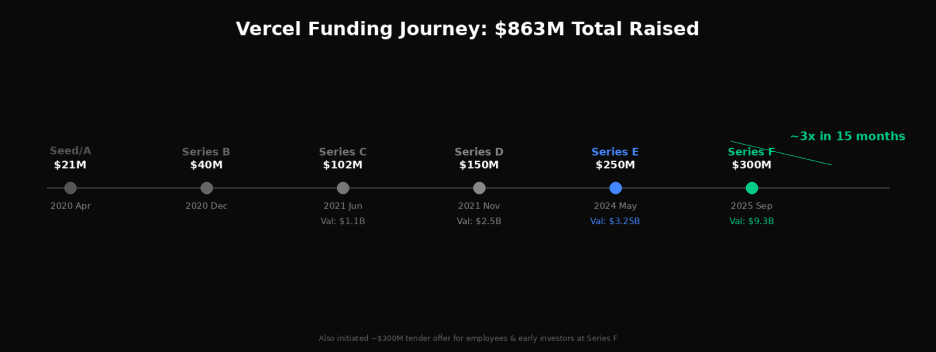

*Vercel 融资历程：$863M 总融资，15 个月估值翻三倍*

人事：Stripe 前 CBO 任 COO，HashiCorp 联创 Mitchell Hashimoto 加入董事会，Stripe CFO 任顾问。全公司约 800-900 人。

### 定价争议：增长的另一面
Vercel 的定价是开发者社区最集中的抱怨点。Hacker News 上有个经典评论：“乍一看 Vercel 的定价贵得难以置信：带宽 $550/TB，128MB 函数满负载运行一年 $60K。”多个开发者报告说从 Vercel 迁到 $6/月的 DigitalOcean VPS 后效果一样。

一个 Indie Hacker 的真实案例：他收到 $1800/月的 Vercel 账单，被迫关闭新用户注册，甚至“开始盼着用户退订因为这样就能少付一点”。最后迁移到 Cloudflare Workers，账单大幅下降。他说：Vercel 在小规模时非常爽，但一旦规模上来就发现它不是为你设计的。

更极端的是 DDoS：有记录的案例显示一次攻击产生 $23000 账单——恶意流量也按 $0.15/GB 收费。不像 AWS Shield 或 Cloudflare 会吸收攻击流量，Vercel 把费用转嫁给用户。虽然后来加了 Spend Management，但“先收钱后治理”的方式已经伤害了信任。

还有个结构性问题：AI 工作负载对 Vercel 计费特别不友好。一个 AI 聊天会话可能占用 60 秒计算和几十 MB 内存。有开发者报告一个截图服务 12 天测试用掉 494 GB-hours，推算月超 1200 GB-hours，额外产生 $160+/月。这意味着 Vercel 在推 AI 的同时，自己的计费模式反而是 AI 增长的摆力。Fluid Compute 的 Active CPU 计费部分缓解了这个问题，但带宽的结构性贵没变。

竞争定位：两种锁定的对决

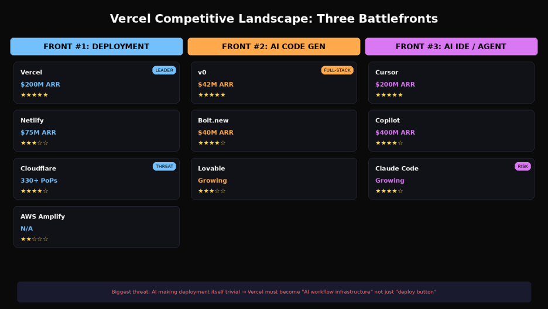

*Vercel 的三线作战：部署平台 / AI 代码生成 / AI IDE*

理解 Vercel 的竞争位置，最好的方式是和 Cloudflare 对比着看。Cloudflare 有 330+ 个边缘节点（Vercel 约 19 个区域），冷启动低于 5ms，没有出口带宽费。Rauch 自己在推特上承认过：Vercel 当年认真尝试过 Edge Runtime，但因为 CPU 性能差、延迟不稳定、和云服务连接慢等原因迁走了，然后才做了 Fluid Compute。他也说“没有 beef”，承认 Cloudflare 的 CPU 计费模式启发了 Vercel。

但两家的锁定方式完全不同。Cloudflare 是“存储形锁定”——用了 Durable Objects、R2、D1，应用逻辑就和 Cloudflare 绑死了，没有可移植的 Durable Objects 替代品。Vercel 是“框架形锁定”——用了 Next.js 的 ISR、Server Actions、图片优化，迁出去就会丢功能。

## 四、AI 转型与 Agent 生态：为什么说 Vercel 做对了
### v0：350 万用户的“说话变网站”
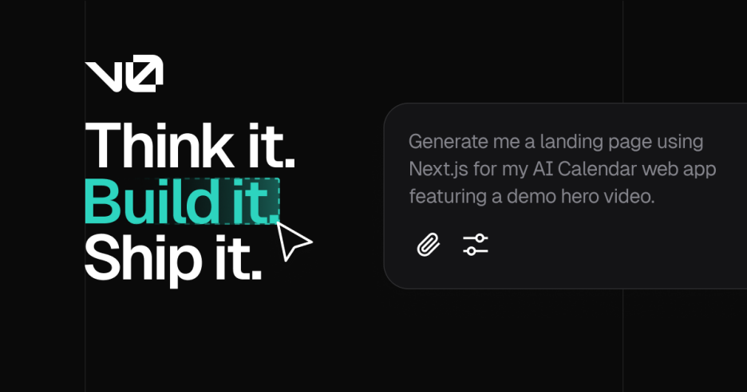

*v0.app：“您想创建什么？”——说话就能生成应用*

2023 年发布，早期是组件生成工具。到 2025 年已变成全功能 AI 开发平台：多文件项目、GitHub 同步、PR 分支、连接 Snowflake/AWS 数据库、一键部署。

2026年1月改域名 v0.app，2月切换 token 计费。ARR 约 4200万，占总收入 21%，企业账户占 v0 收入一半以上。

划重点：v0 的精妙不在“生成代码”，而在于它生成的是 Next.js + React 代码，可以一键部署到 Vercel。生成 → 部署 → 在线，链路闭环。每个 v0 用户都是 Vercel 平台的潜在付费用户。这个双重收入飞轮是 Bolt.new 和 Lovable 都没有的。

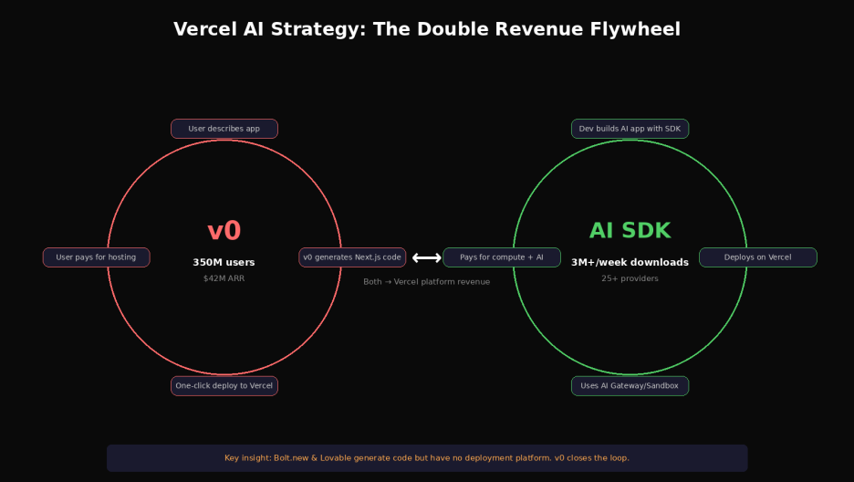

*Vercel AI 策略：v0 + AI SDK 双重收入飞轮*

### AI SDK：前端 AI 的水电煤
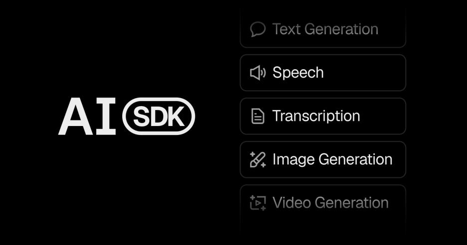

*AI SDK：统一的 TypeScript AI 开发工具包，npm install ai*

开源 TypeScript 库，统一 API 调用 25+ AI 提供商。处理 streaming、tool calling、structured output、React hooks。每周 300万+ 下载。AI SDK 6（2025年底）加入 Agent 抽象、human-in-the-loop、MCP 支持。和 Next.js 策略一样：用开源占心智，然后转化为平台用户。

### AI Gateway + Vercel Agent + Sandbox
AI Gateway（alpha）：统一的 AI 模型路由层，约 100 个模型，处理认证、用量、重试、failover。Vercel Agent（beta）：自动化 PR 审查和生产诊断，在 Sandbox 里验证修复。Sandbox 支持企业版 32vCPU/64GB。

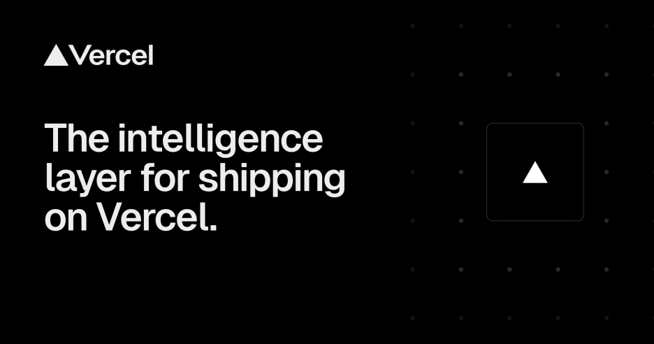

*Vercel Agent：“The intelligence layer for shipping on Vercel”*

### skills CLI 与 skills.sh：Agent 时代的 npm
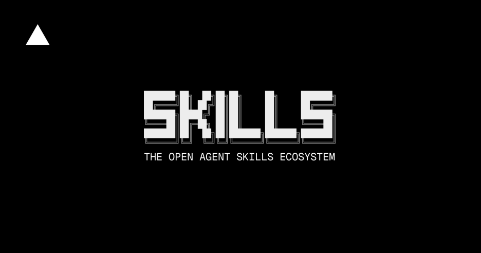

*skills.sh：开源 Agent Skills 生态，已有 91,623 个 skills*

这是 2026 年初最值得关注的新动作。skills CLI 是开源命令行工具，用 npx skills add 就能给 AI Agent 安装“技能包”。支持 18+ 个 Agent：Claude Code、Cursor、GitHub Copilot、Gemini CLI、Windsurf 等。skills.sh 是配套的在线目录和排行榜。

Vercel 官方 skill 包括：React/Next.js 最佳实践（40+ 规则）18.5万安装）、Web 设计指南（100+ 规则）、React Native、AI SDK、部署 skill 等。Stripe 等公司在几小时内就发布了自己的 skill。安全方面与 Snyk 合作自动扫描。

InfoQ 有人评论得很好：“MCP 解决了 Agent 怎么跟工具说话，Skills 解决了开发者怎么分享和发现 Agent 能力。”如果这个生态能像 npm 一样站住，Vercel 就在 Agent 时代拿到了一个非常重要的位置。

把这些东西串起来看：Vercel 的官方定位已从“Frontend Cloud”变成“Agentic Infrastructure”。

## 五、最后说几句
Vercel 的故事本质是“十年磨一剑”。一个阿根廷辍学生，18岁来到旧金山，花十年做开源做基建做开发者体验。当 AI 浪潮来的时候，他的公司已经是“铁路和电网”。SaaStr 说得对：AI 的“一夜成功”，其实都是十年的路。

但也得看到风险。Vercel 的护城河本质上是“综合体验”而非技术壁垒。当 AI 让每一个单点都变得可替代时，“综合体验”能不能继续构成护城河？这是 Vercel 未来几年要回答的核心问题。

如果本文对你有帮助，欢迎点赞、推荐。

---
> 本文同步自微信公众号，[点击查看原文](https://mp.weixin.qq.com/s/batRRnsUTTURA6j1lzDCtw)
