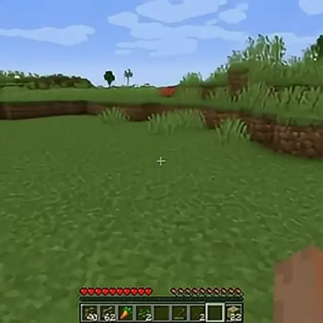
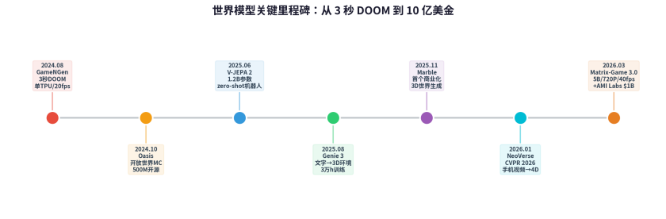
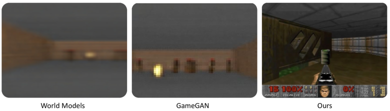
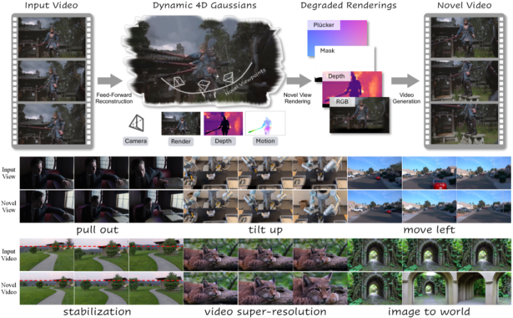
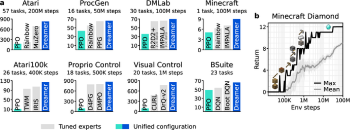
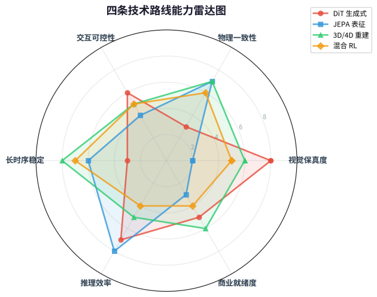
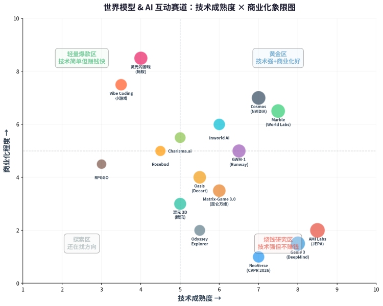
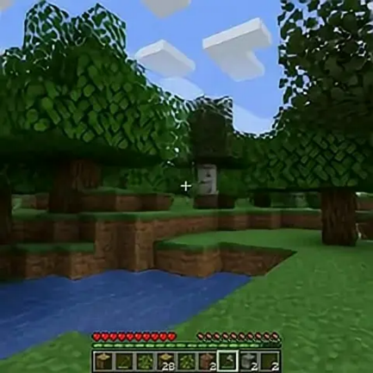
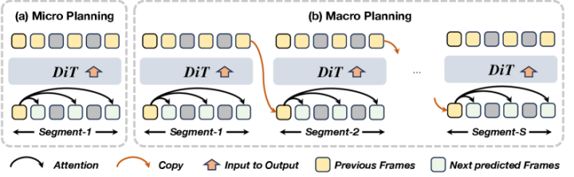
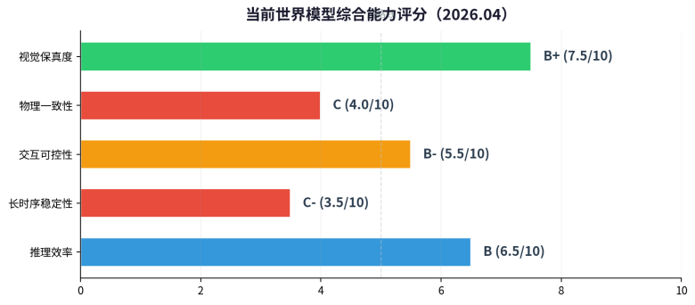

# 深度分析：世界模型全景地图—从 30 秒手搓小游戏到 10 亿种子轮

Date: 2026-04-07  
Author: SimonAKing  
Categories: 微信公众号  
Tags: 微信公众号  
Source: https://simonaking.com/blog/world-model/

> 三组数据，先感受一下这个赛道的温度： **①** 2026 年 3 月，Yann LeCun 的 AMI Labs 完成 **10.3 亿美金种子轮**，欧洲史上最大。同一个月，李飞飞的 World

---
三组数据，先感受一下这个赛道的温度：

**①** 2026 年 3 月，Yann LeCun 的 AMI Labs 完成 **10.3 亿美金种子轮**，欧洲史上最大。同一个月，李飞飞的 World Labs 累计融资突破 **12 亿美金**。

两个人加起来拿了 22 亿美金，做的都是同一件事——世界模型。

**②** 蚂蚁的「灵光」App 上线 6 天下载 200 万，用户两周手搓了 330 万个「闪应用」，其中互动小游戏占比最高。一句话、30 秒，一个可玩的游戏就出来了。

**③** 昆仑万维 Matrix-Game 3.0 做到了 5B 参数、720P、40fps 实时生成游戏画面。两年前这个赛道的天花板是「跑 3 秒 DOOM」。

一边是顶级研究者带着几十亿美金从 LLM 阵营集体出走，一边是普通用户已经在用 AI 30 秒手搓小游戏。**世界模型（World Model）**这个词，正在同时从最高的塔尖和最低的地面向中间挤压。

它到底是什么？为什么突然所有人都在做？

说白了：**LLM 是个瞎子。**它再强，也只是在预测下一个 token。

你跟它说「请描述一下重力」，它能写三千字论文。但你让它模拟一个球从桌上滚下去？它脑子里根本没有「桌子」这个东西。

世界模型要解决的就是这件事：让 AI 不只会说话，还会「看路」。

这篇文章梳理了这个赛道的**40+ 产品、4 条技术路线、7 种商业场景**，从 10 亿美金的基础研究到 30 秒手搓的小游戏。

先说结论：**方向确定没问题，但 90% 的公司会死在随着基模升级的路上。**

**本文价值 100 元，有帮助请点赞。**

  

## 一、什么是世界模型？为什么突然火了？
先给个最直白的解释。

你让 Sora 生成一个视频，一只狗从沙发后面跑过去——它可能跑到一半项圈消失了，沙发变成了另一张沙发。

Sora 2 了还是这样。为什么？因为视频模型本质上在猜「下一帧最像什么」，它脑子里压根没有「这是同一只狗」「这是同一张沙发」的概念。它在做的事，类似于一个美术生蒙着眼睛画接力——每一笔单看都不错，连起来就是毕加索附体。

**世界模型就是要解决这个问题。**  

它不只是「生成看起来对的画面」，而是在内部维护一个对环境的理解：哪些物体在哪、物理规则是什么、你的操作会导致什么后果。这玩意一旦做成了，游戏、机器人、自动驾驶、AR/VR 全都能受益。

划重点：世界模型不是一个单一技术，而是一个研究范式。它把感知、预测、决策串成一条链。  

LeCun 的 JEPA 是一种路线，DeepMind 的 Genie 是另一种，李飞飞的 Marble 又是一种。大家殊途同归，但技术路线差别很大（后面详细拆）。

那为什么 2026 年突然火了？三个原因：

•**LLM scaling 遇到瓶颈。**预训练数据快到天花板了，纯堆算力的边际收益在下降。OpenAI 自己内部都承认 GPT-5 的提升没达预期。

行业需要新叙事，投资人需要新故事。你不能连续三年跟 LP 说「我们还在 scale」。

•**视频生成暴露了「理解」的缺失。**Sora、Veo 生成的视频越来越好看，但物理一致性一塌糊涂。一个人走路走着走着多了条腿，这叫什么 AI？这叫 PS 自动化。行业开始反思：光会画不行，得真懂啊。

•**具身智能和机器人需要训练环境。**机器人不能全在真实世界试错，需要大量仿真环境。世界模型天然是最佳造场景的工具。

## 二、全球玩家点名：谁在做，做到哪了
### 1\. Yann LeCun / AMI Labs —— 最贵的「理想主义」
2026 年 3 月，LeCun 正式公布 AMI Labs，种子轮 10.3 亿美元，估值 35 亿。欧洲史上最大种子轮，还没出产品。Bezos Expeditions、NVIDIA、Samsung、Toyota Ventures 全来了。

他的核心赌注是 JEPA（Joint Embedding Predictive Architecture）不在像素空间做预测，而是在抽象表征空间学习世界的运行规律。

说人话就是：不学「下一帧长什么样」，学「下一步世界状态会怎么变」。LeCun 自己说过：「LLM 太局限了，scaling 不会带来 AGI。」

但话说回来，这是个非常长期的赌注。AMI Labs CEO Alex LeBrun 自己都说「大概需要一年才能出第一个可用的东西」。投资人买的是 LeCun 的名字和他十年的学术积累，不是短期回报。瞄准的场景是医疗、机器人、可穿戴设备和工业自动化。

### 2\. 李飞飞 / World Labs / Marble —— 最先商业化的
李飞飞的打法完全不同。2025 年 11 月就发布了 Marble，2026 年 2 月又融了 10 亿美金（NVIDIA、AMD、Autodesk 全来了）。这是目前世界模型赛道里唯一一个已经商业化、有定价、普通人可以用的产品。

Marble 的定位是「多模态 3D 世界生成模型」。给一张照片、一段文字、一个视频，它生成一个可以 360° 走进去的 3D 空间。不是全景图，是真3D，能导出 Gaussian Splat 和三角网格，直接丢进 Unity 或 Unreal。

它还搞了一个叫 Chisel 的编辑器，你先用方块搭好空间结构，AI 再补视觉细节——结构和风格分离，创作者不会被 AI 牵着走。

传统游戏做一个 3D 场景可能花几万到几十万，周期几天到几个月。Marble 几分钟搞定。定价从免费到 95 美金/月不等。有人说这是在革游戏美术的命，我觉得不至于，但至少是在革「3D 场景外包公司」的命。

### 3\. Google DeepMind / Genie 3 —— 研究最扎实的
DeepMind 在世界模型上的积累最深。

从 Genie 1 到 Genie 2 再到 2025 年 8 月发布的 Genie 3，一步步推进。Genie 3 训练了超过 3 万小时的游戏录像，能根据文字描述实时生成可交互的 3D 环境，24fps 运行。2026 年 1 月对外开放了研究预览。

DeepMind 把它定位为 AGI 路上的关键垫脚石——有了世界模型，就能无限生成训练环境来教 AI agent。但目前还是研究预览状态，没有商业化。

### 4\. Decart / Oasis —— 第一个让你「玩」的
Oasis 号称是第一个完全由 AI 实时生成的可玩游戏。

你用键盘鼠标操作，它用 Diffusion Transformer 逐帧生成画面，20fps，零延迟。没有预渲染，没有传统游戏引擎，所有画面、物理、规则全是 AI 现编的。效果类似 Minecraft。开源了 500M 参数的小模型。

局限也很明显：画面模糊、物品管理不精确、长时间玩一致性崩。但比 2024 年 Google 的 GameNGen（只能跑 DOOM 3 秒）进了一大步。最近还推出了 Lucy 2.0 和 Custom Worlds，可以上传图片变成可玩世界。

坦率地说，现在的 Oasis 更像是一个「AI 能做游戏」的信仰充值器，而不是一个真正能玩的东西。但信仰这玩意，在 AI 行业比技术值钱。

*▲ Oasis 实时生成的 Minecraft 风格游戏画面——全部由 AI 逐帧生成，没有传统游戏引擎*

### 5\. Runway —— 从视频工具到世界模拟
Runway 本来做 AI 视频生成，Gen-1 到 Gen-3 在影视广告行业很有名。

但 2025 年底直接发布了「通用世界模型」GWM-1，官网 slogan 改成了「Building AI to Simulate the World」。2026 年 3 月底又搞了个 1000 万美金的基金投 AI+世界模拟方向。

很明显，它想从工具公司变平台公司。

我个人觉得 Runway 是这个赛道里最被低估的玩家，它有真实的商业收入（视频生成 SaaS）、有成熟的用户基础（影视行业）、有技术积累（Gen 系列的视频生成能力直接复用到世界模型）。

不像 AMI Labs 纯烧钱做研究，Runway 是一边赚钱一边转型。这种路径成功率高得多。

### 6\. 腾讯混元 3D + 昆仑万维 Matrix-Game
**腾讯**结合自己的游戏、地图、AR/VR 业务做混元 3D。

发布了 World Play 交互模型，2025 年 11 月国际版上线腾讯云，开源版下载量破 300 万。优势是有真实业务需求做牵引。

**昆仑万维**在 2026 年 3 月中关村论坛一口气发了 Matrix-Game 3.0、SkyReels V4、Mureka V9 三个模型。Matrix-Game 3.0 做到了 5B 参数、720P、40fps 实时生成，打通了 GTA5、赛博朋克 2077 等 3A 游戏做数据采集。还搞了一个「AI 版 Roblox」猫森学园。

## 三、AI 互动游戏：两年进化时间线

*▲ 世界模型关键里程碑时间线：从 3 秒 DOOM 到 10 亿美金种子轮*

**2024.08 GameNGen** —— Google Research 用改版 Stable Diffusion 跑出了可玩的 DOOM，单张 TPU、20fps。

训练分两阶段：先用 RL agent 玩 DOOM 生成轨迹数据，再学「给定历史帧+操作 → 预测下一帧」。人类分不清 AI 和真实画面。但只能跑 3 秒。意义：证明了这事可行。

*▲ GameNGen 效果对比：左为早期世界模型（糊到看不清），中为 GameGAN，右为 GameNGen（几乎和真实 DOOM 一样）*

**2024.10 Oasis** —— Decart 把同样思路换成 DiT 架构 + Diffusion Forcing 训练，开放世界 Minecraft，20fps。比 GameNGen 进了一大步——从 3 秒 DOOM 到持续可玩的开放世界。

**2025.08 Genie 3** —— DeepMind 做到了文字生成可交互环境，不局限于模仿已有游戏，能凭空创造新世界。3 万+小时训练数据。

**2026.03 Matrix-Game 3.0** —— 昆仑万维做到 5B 参数、720P、40fps，引入 Memory 机制解决长时序一致性，Unreal Engine 合成数据+3A 游戏数据双管线。开始有工业级的味道。

两年时间，从「跑 3 秒 DOOM」到「720P 40fps 实时开放世界」。进步飞快，但离替代传统游戏引擎还早。

目前这些 AI 游戏的共同问题：画面不够清晰、物理不精确、长时间一致性崩。

**我的判断：**AI 互动游戏最靠谱的落地方式不是替代传统引擎，而是做增量——场景快速生成、NPC 行为、关卡自动创建。

全由 AI 实时生成一整个游戏？再等两三年。

那些天天喊「游戏引擎要被颠覆」的人，大概率没做过游戏。

你让 AI 模型保证两个玩家在同一个世界里看到完全一样的物理表现试试？确定性这一条就够卡死 99% 了。

就和现在 vibe coding 小游戏头部的产品，都是几个固定的玩法模版，动态化一些素材而已。

## 四、技术路线速览：四条路线，谁先跑出来？
世界模型不是一个统一方案，至少四条路线在并行推进。

路线一：DiT 生成式（Oasis / GameNGen / Matrix-Game）—— 把游戏画面当视频逐帧生成。好看，但不懂物理。

**路线二：JEPA 表征预测**（AMI Labs / V-JEPA 2 / VL-JEPA）—— 不生成像素，在 embedding 空间预测「世界状态会怎么变」。V-JEPA 2（1.2B 参数）已经能做 zero-shot 机器人规划。

**路线三：3D/4D 重建**（Marble / NeoVerse / TeleWorld）—— 把 2D 重建成持久 3D 结构。NeoVerse（CVPR 2026）用普通手机视频就能做 4D 重建，推理比同类快 7.5 倍。

*▲ NeoVerse 4D 世界模型架构：输入单目视频 → 4D Gaussian 重建 → 任意视角生成（CVPR 2026）*

**路线四：混合 RL + 仿真**（Genie 3 / Cosmos / DreamerV3）—— 最务实的路线。Genie 3 的价值公式：世界模型 = 无限训练场生成器。

*▲ DreamerV3：agent 在学到的世界模型中「做梦」练习，再迁移到真实环境（Nature 2025）*

### 四条路线对比

*▲ 四条技术路线能力雷达图：没有一条路线在所有维度占优，这就是为什么我赌混合路线*

| **路线** | **核心方法** | **代表** | **优势** | **局限** |
| --- | --- | --- | --- | --- |
| **DiT 生成式** | 扩散模型逐帧生成 | Oasis, Matrix-Game 3.0 | 视觉直观，用户体验好 | 不理解物理，长时序崩 |
| **JEPA** | embedding 空间预测 | V-JEPA 2, AMI Labs | 高效、语义理解、可规划 | 无视觉输出 |
| **3D/4D 重建** | 2D → 持久 3D 结构 | Marble, NeoVerse | 几何一致、可编辑导出 | 动态场景弱 |
| **混合 RL+仿真** | RL + 世界模型 + 物理仿真 | Genie 3, Cosmos, Dreamer | 最接近真实推理 | 计算量巨大 |

## 五、产品图鉴：谁已经能玩了？商业场景在哪？
前面讲了技术路线和论文，但普通人更关心的是：有没有东西我现在就能上手玩？钱从哪来？谁愿意付费？

*▲ 世界模型 & AI 互动赛道象限图：右上「黄金区」的玩家最少，左上「轻量爆款区」最拥挤*

先拉一张全景产品地图。这个赛道最容易被误导的一点是：一提世界模型就只想到 LeCun 和李飞飞那些几十亿美金的大玩家。

其实从大厂到一个人的 side project，这条赛道上至少有 40+ 个产品在同时跑。按体量分三层：

**第一梯队：巨头与独角兽（融资 $100M+）**—— AMI Labs（$1.03B / JEPA 世界模型）、World Labs / Marble（$1.23B / 3D 世界生成）、Google DeepMind / Genie 3（未独立融资 / 互动世界生成）、NVIDIA Cosmos（平台级 / 物理 AI 基础模型）、Runway GWM-1（$860M 累计 / 通用世界模型三条线）、General Intuition（$134M 种子 / 空间推理 agent）。

这一层的共同特点是：都在做底层模型或平台，烧钱凶猛，商业化普遍没跑通。

**第二梯队：中腰部产品公司（融资 $5M-$50M 或有稳定收入）**—— Decart / Oasis（$53M / 实时游戏生成）、Odyssey Explorer（自动驾驶团队转型 / 互动视频）、昆仑万维 Matrix-Game（上市公司 / 游戏世界模型）、腾讯 HunyuanWorld 系列（1.0/1.5 WorldPlay/Voyager 全开源 / 3D+探索）、Inworld AI（NPC 引擎 / 已集成 Unity+Unreal / 被 Skyrim mod 验证）、Charisma.ai（对话叙事 AI / VR+教育）、RPGGO（Pre-Seed / Text-to-Openworld RPG / 腾讯系团队）、Scenario（游戏美术资产 / 自定义风格训练）、Rosebud（浏览器端全流程游戏创作）、SEELE / 百度系（端到端 3D 游戏生成 / Unity 导出）、WebSim（$11M / AI 网页/游戏生成器）、Jenova.ai（AI Agent 驱动的角色扮演+叙事游戏平台）、SpAItial（$13M 种子 / 图片→3D Gaussian Splat / 欧洲团队）。

这一层特点是：要么有明确的垂直场景，要么有可验证的用户数据。

**第三梯队：小而美 / 开源 / 早期探索（种子轮或 bootstrap）**—— MakeGamesWithAI（一句话生成可玩游戏 / 浏览器端）、Spawn.co（自然语言创建 3D 多人世界）、Ludo.ai（AI 游戏创意+市场调研+Playable Generator）、Saga（AI 文字冒险/角色扮演平台）、AI Town（Convex 开发 / AI 角色社交模拟）、Layer AI（自定义 3D 资产风格训练）、Meshy（文字/图片→3D 模型）、Cascadeur（AI 动画替代动捕）、Replica Studios（AI 配音+商用授权）、Leonardo AI（美术资产批量生成）、Convai（实时语音 NPC / VR 场景）、Promethean AI（自然语言→3D 环境 / Unreal 集成 / AAA 在用）、AIVA + Beatoven.ai（AI 游戏配乐）、Etched / Sohu（专用 Transformer ASIC / Oasis 的硬件搭档）、Yume 1.5（开源互动世界生成模型）、Microsoft Muse（Xbox 部门 / 研究阶段）、RADiCAL（视频→动捕数据）、Figma Make（AI 游戏原型 / 设计工具内置）、Google Playables Builder（YouTube 内置 / Gemini 3 驱动）。

这一层的特点是：切口极小，但如果赛道起来了，每个都可能成为生态里不可或缺的一块拼图。

**我的看法：**大多数人只看第一梯队——因为融资新闻最响。

但真正离钱最近的是第二梯队：Inworld 已经被 Skyrim mod 社区验证了、Scenario 的独立开发者在用真金白银订阅、腾讯 HunyuanWorld 系列开源下载破 300 万。

第三梯队看着小，但别忘了 Roblox 当年也是从一个不起眼的小工具做起来的。这个赛道最终的赢家，很可能不在今天的头条新闻里。

下面按产品形态详细拆解，每种都给商业场景判断：

### 类型一：Vibe Coding 小游戏 —— 2026 年的第一个爆款品类
2026 年 1 月，很多游戏人最关心的产品居然不是 3A 大作，而是比小游戏还小的文字型游戏。《大厂模拟器》上线当天挤爆服务器，《赛博徒步：生死鳌太线》在社交媒体刷屏。这些游戏只有一两个人做，形式就是一条链接，没有美术画面，只有文字选择和数值养成。

为什么火？因为 Vibe Coding 不是降低了游戏制作门槛，而是**摧毁了门槛**。

开发者不需要编程，不需要美术，只需要一个好点子 + 买点 token。AI 生成系统、数值、剧情分支，你提供创意就行。一个周末就能做出一款可玩的游戏。

这对传统游戏行业意味着什么？意味着你花三年做的独立游戏，可能被一个大学生周末手搓的东西抢走热度。

不是因为他做得好，是因为他快到离谱，而且话题性拉满。

**商业场景：**社交裂变 + 广告变现。

这类游戏只需要一个网页链接就能玩，加载比小游戏还快，心理负担极低，天然适合社交传播。

《大厂模拟器》就是靠互联网人群的圈层传播爆的。变现路径是广告（页面内嵌入）和付费解锁（额外剧情线）。单款游戏天花板不高（几万到几十万），但制作成本几乎为零，ROI 极高。

### 类型二：AI 闪应用/闪游戏 —— 灵光、Google Playables
**灵光（蚂蚁集团）**是 2025 年底中国最火的 AI 产品之一。6 天下载量超 200 万，速度超过 ChatGPT 和 Sora 2。核心功能「闪应用」：一句话最快 30 秒生成一个可交互、可编辑、可分享的小应用。上线两周用户创建了 330 万个闪应用，覆盖互动游戏、情绪减压、倒计时、备考自测等场景。后来又升级了「闪游戏」功能——输入'帮我生成一个空战 1942 的小游戏'，30 秒就出来了，还能改角色、背景、难度。

**Google Playables Builder**是 YouTube 官方推出的 AI 游戏生成工具，基于 Gemini 3，让 YouTube 创作者用文字/图片/视频片段生成 HTML5 小游戏，直接嵌入 YouTube 播放页面。Google 的意图很明确：对抗 Roblox，争夺年轻用户时长。

**商业场景：**平台粘性 + 生态闭环。灵光的逻辑是用闪应用/闪游戏把用户留在蚂蚁生态里，未来接支付宝小程序、信用体系。业内预测 2026 年会出现「生成式小程序」爆发潮——字节、阿里、腾讯都会把生成能力嫁接到自己的支付、社交、电商场景里。Google Playables 则是内容平台的互动化：让视频从单向播放变成双向交互。

划重点：闪应用这个品类的竞争不是产品竞争，是生态战争。

谁的分发渠道强，谁的闪应用就能活。灵光背后是支付宝，Playables 背后是 YouTube，你一个独立开发者或者小团队拿什么打？

抖音现在的小游戏广告占比 也比之前高了，而重分发的赛道 如果没有持续的爆款就很难做出成绩。低频产品再怎么折腾也没用。

### 类型三：AI NPC / 互动叙事 —— Charisma.ai、RPGGO
**Charisma.ai** 不做完整游戏，而是提供一套面向叙事和角色对话的 AI 系统——让创作者构建可控的 AI 角色、对话逻辑和互动剧情。用在互动叙事游戏、培训模拟、品牌体验、教育内容等场景。

**RPGGO** 主打 Text-to-Openworld：输入一个故事梗概，AI 构建出包含分支剧情、智能 NPC 记忆、实时生成立绘和语音的可玩 RPG 游戏。核心团队来自腾讯等一线大厂，拿到了 Makers Fund 的 Pre-Seed 轮融资。

**Jenova.ai** 用专门的 AI Agent 做不同类型的互动内容——Roleplay Game Master（桌游式 RPG，无限记忆+任意规则系统）、Film Screenwriter（剧本协作）、Webtoon Creator（竖屏漫画连载）。它不做自己的模型，而是调用 GPT-5.2 / Claude / Gemini 3 等前沿模型搭 agent 框架。思路是：模型层不碰，只做场景层。这可能是小团队最聪明的打法。

**Saga** 做 AI 文字冒险和角色扮演平台——从经典文字 RPG 那套复古审美出发，加入 AI 动态对话和剧情生成。可以用官方预设世界，也可以自建。小而美的产品，主打怀旧 RPG 玩家群体。

**AI Town（Convex）** 是个很有意思的实验项目——AI 角色在一个虚拟小镇里自主生活、社交、形成记忆和目标。每个角色有独立人格。开发者可以搭建自己的 AI 驱动小镇。斯坦福那篇著名的「25 个 AI agent 生活在虚拟小镇」论文的产品化版本。

**商业场景：**B2B 中间件 + C 端订阅。Charisma.ai 这类走 B2B 路线——卖给游戏工作室、教育机构、品牌方做 NPC 对话引擎，按 API 调用收费。RPGGO 走 C 端——玩家订阅制玩无限 AI 生成的 RPG。

更大的商业想象力在于：当 NPC 能真正「记住你」并动态反应，游戏的复玩价值和付费意愿都会大幅提升。

### 类型四：世界模型原生产品—— Oasis、猫森学园、WebSim
**Oasis（Decart）** 前面详细说过了——AI 完全实时生成的 Minecraft 类游戏。目前还是免费 Demo 状态，商业化路径不明。

*▲ Oasis 生成的开放世界——所有方块、天空、光影都是 AI 实时计算的，没有一个像素是预制的*

**猫森学园 2.0（昆仑万维）** 定位是「AI 版 Roblox」——可以口述玩游戏、口述 DIY 游戏。是昆仑万维「3+1」AGI 战略中面向互动娱乐的产品层。

**WebSim** 是 AI 网页/交互应用生成器：用自然语言描述一个网站或小游戏，直接生成可运行的 Web 页面，支持持续迭代和链接分享。融资约 1100 万美元。不是完整游戏引擎，但非常适合做网页游戏原型和互动体验。

**商业场景：**UGC 平台经济。这些产品的共同逻辑是：不是自己做游戏，而是让用户做游戏，平台抽成。

Roblox 已经证明了这个模式的天花板有多高（年收入 30 亿美金+）。AI 的加入会让创作门槛进一步降低——从「会编程的人能做游戏」到「会说话的人能做游戏」。

### 类型五：3D 世界生成工具 —— Marble、Rosebud
**Marble（World Labs）** 前面说过了，从免费到 95 美金/月。定位是给游戏开发者、VFX 工作室、建筑设计师用的 3D 场景生成器。已经有早期用户在把生成的 Gaussian Splat 导入 Unity 做游戏和互动内容。Vision Pro 和 Quest 3 可以直接查看生成的 3D 世界。

**Rosebud** 是云端全流程游戏创作平台——输入 prompt 生成可玩的 2D/3D 游戏原型，内置精灵动画生成器、AI NPC 创作器、视觉小说工具。主打教育场景和浏览器端快速原型。

**SEELE（百度系）** 定位端到端多模态游戏生成平台，文字描述直接生成可交互 3D 游戏世界，支持 Unity 项目导出（这点比 Rosebud 强），内置 500 万+动画预设库和完整音频生成。号称生成速度比手写代码快 480 倍。

**Spawn.co** 用自然语言指令创建 3D 多人游戏、应用和虚拟世界。

**SpAItial** 欧洲团队，$13M 种子轮。用自家模型 Echo 从单张图片生成 3D Gaussian Splat 模型。比 Marble 轻量得多——不做完整世界，只做单场景 3D 化。适合电商产品 3D 展示、室内设计预览这类不需要「走进去」的场景。

**腾讯 HunyuanWorld 系列** 是目前开源世界模型里迭代最快的。2025 年 7 月发 1.0（文字/图片→360° 3D 世界，支持 Unity/Unreal 导出），10 月发 1.1 WorldMirror（视频→3D），同月还出了 FlashWorld（单 GPU 5-10 秒生成 3DGS），9 月发 Voyager（超长距离 3D 探索），12 月发 1.5 WorldPlay（实时交互）。半年迭代五个版本，开源下载破 300 万。说句实话，如果你是个独立开发者想试水世界模型，HunyuanWorld 开源版是目前性价比最高的起点——免费、有文档、能跑在 4090 上。

**商业场景：**SaaS 订阅 + 降本增效。

游戏行业美术成本通常占研发总成本的 50%-80%，一个 3D 角色模型成本几万到近百万。

Marble 这类工具的价值公式：原来花 10 万做的场景，现在 20 美金/月几分钟搞定。

### 类型六：AI 游戏资产工具链 —— 隐形基建
这一类不是做完整游戏，而是做游戏开发中某个环节的 AI 加速。单拎出来不够性感，但组合起来就是一条完整的 AI 原生游戏生产线。

**Scenario** —— AI 游戏美术资产生成。核心能力是训练自定义 AI 模型，保持风格一致性。你把自己游戏的美术风格喂给它，它就能批量生成风格统一的角色、道具、场景。支持像素风、写实风等 12 种生成模式，每批最多 16 张。对美术团队少的独立工作室是刚需。

**Inworld AI** —— AI NPC 引擎，由 Google Dialogflow 团队出身的人做的。NPC 有独立人格、记忆、情感系统，能根据玩家行为动态反应。已经直接集成 Unity 和 Unreal，按用量付费。Skyrim 和骑马与砍杀 2 的 mod 社区已经在用它，证明了玩家确实愿意为「更聪明的 NPC」买单。

**Convai** —— 实时语音 NPC 交互，延迟 200-300ms。和 Inworld 的区别是更偏语音端，适合 VR/AR 场景。

**Replica Studios** —— AI 配音和对话生成。给 NPC 配音不用真人录音棚了，订阅制，付费版有完整商用授权。

**Cascadeur** —— AI 辅助角色动画。设好关键帧，AI 自动计算中间的自然动作。相当于用软件替代动作捕捉，成本降几个量级。

**Leonardo AI** —— 游戏美术资产批量生成，支持角色、纹理、环境。可以用预训练模型，也可以训练自己的风格模型。

**Meshy** —— 文字/图片转 3D 模型，快速生成道具和场景元素，导入游戏引擎使用。

**Promethean AI** —— 用自然语言描述生成完整 3D 环境，专为关卡设计师打造。直接集成 Unreal Engine，AAA 工作室在用。

**AIVA / Beatoven.ai** —— AI 游戏音乐生成。AIVA 专注古典和影视配乐风格，Beatoven.ai 可以根据游戏场景情绪实时适配音乐。

**Ludo.ai** —— AI 游戏研发助手。不生成资产也不写代码，而是做游戏创意和市场调研——分析排行榜游戏 DNA、混合机制生成新概念、自动生成可玩原型。最近推出了 Playable Generator，输入描述直接出可玩 Demo。

**商业场景：**工具链 SaaS，各切一刀。

一个独立开发者的理想工作流：Ludo.ai 做创意 → Scenario 生成美术 → Meshy 做 3D 模型 → Inworld 做 NPC → Replica Studios 配音 → AIVA 配乐。

每个环节都有人收月费。这种「乐高式拼装」的 AI 游戏工具链，2026 年已经是独立开发者的标配。

### 类型七：世界模型驱动的互动视频/探索 —— 新品类
这一类是技术最前沿、离商业化最远、但想象力最大的。

*▲ TeleWorld 的 Macro-from-Micro Planning：DiT 逐段生成视频，上层宏观规划控制长时序一致性*

**Runway GWM-1 / Game Worlds** —— Runway 的世界模型产品分三条线：GWM-Worlds（游戏互动世界）、GWM-Robotics（机器人仿真，提供 Python SDK）、GWM-Avatars（对话式数字人）。Game Worlds 是面向消费者的入口——浏览器端直接创建和分享 AI 生成的互动文字冒险。720P/24fps 实时交互，物理感知环境。

**Odyssey Explorer** —— 主打「互动视频」——你能同时看和操作的视频。每 40-50ms 生成一帧，20fps 流式输出。用「因果式」方法生成：只基于过去事件，不预设未来，所以你的每个操作都会改变所有可能的后续。训练数据来自自动驾驶团队的真实 360° 拍摄，输出更偏写实风格（Gaussian Splat），可以导入 Unreal/Blender/After Effects。

**Microsoft Muse** —— 微软 Xbox 部门做的世界模型，用 7 年的 Xbox 游戏《Bleeding Edge》录像训练。能根据手柄操作实时生成游戏场景。目前还在研究阶段。

**Yume 1.5** —— 文字控制的互动世界生成模型，2025 年底开源。输入文字描述控制世界变化。

**NVIDIA Cosmos** —— 不面向消费者，而是面向开发者的「世界基础模型平台」。提供物理感知的合成训练数据，主要客户是自动驾驶和机器人公司。200 万+下载。

**商业场景：**目前以 B2B 和研究为主。Runway GWM-Robotics 卖给机器人公司做仿真训练（比在真实世界测试便宜几个数量级）。Game Worlds 尝试 C 端但还在 beta。Odyssey 瞄准影视后期和游戏环境预览。Cosmos 走开发者平台路线。说白了，这一类产品的商业化还在「找第一个愿意付钱的客户」阶段，但一旦跑通，想象空间巨大——世界模型 as a Service，按「世界数量」收费。

### 小结：七种产品形态的商业逻辑
| **产品形态** | **代表产品** | **商业模式** | **目标用户** |
| --- | --- | --- | --- |
| **Vibe Coding 小游戏** | 《大厂模拟器》等 | 社交裂变 + 广告/付费解锁 | 独立创作者、自媒体人 |
| **闪应用/闪游戏** | 灵光、Google Playables | 平台生态闭环、广告时长 | 普通用户（零门槛） |
| **AI NPC / 互动叙事** | Charisma.ai、RPGGO | B2B API + C 端订阅 | 游戏工作室、RPG 玩家 |
| **世界模型原生** | Oasis、猫森学园、WebSim | UGC 平台抽成 | 创作者生态 |
| **3D 世界生成** | Marble、Rosebud、SEELE | SaaS 订阅、降本增效 | 游戏/影视/建筑开发者 |
| **资产工具链** | Scenario、Inworld、Replica 等 | 环节 SaaS，乐高式拼装 | 独立开发者、中小工作室 |
| **世界模型互动** | GWM-1、Odyssey、Muse、Cosmos | B2B 仿真 + C 端探索 | 机器人/自动驾驶/影视 |

**我的看法：**短期内最赚钱的不是世界模型本身，而是基于 AI 生成能力的轻量产品——闪应用、Vibe Coding 小游戏这些。它们不需要等世界模型技术成熟，用现有的 LLM 能力就够了。

世界模型的商业化更像是一个 2-3 年的中期故事：先从工具链切入（Marble 卖订阅给开发者），再逐渐渗透到平台层（UGC 世界构建），最终可能改变整个内容产业的成本结构。

现在这个赛道里，赚到钱的是卖铲子的（Scenario、Inworld 这些工具），不是挖金子的（做世界模型本体的）。

信仰要充值，很合理。

## 六、别被 Demo 骗了：当前世界模型的真实水平
先说结论：**能看，但不能用。能发朋友圈，但不能上生产线。**别被那些精心挑选的 demo 视频骗了——那都是跑了一百次选出来最好的那一次。

*▲ 当前世界模型综合能力评分：物理一致性和长时序稳定性两项不及格，这是最大的短板*

**视觉保真度 B+：**短时间（几秒到几十秒）画面相当好。拉长到分钟级逐渐模糊变形。Marble 的静态 3D 不错，细看有 Gaussian Splatting 特有的「斑点感」。

**物理一致性 C：**最大短板，也是这个赛道的「皇帝的新衣」。球可能穿墙、水可能往上流、一个杯子放在桌上你转个身回来变成了花瓶。CVPR 2025 的 benchmark 论文直接打脸——最好的视觉语言模型区分运动轨迹的准确率接近随机猜。接近随机猜啊朋友们，这些模型号称「理解世界」的。

**交互可控性 B-：**键盘鼠标控制基本实时，但精度不够——想把方块放特定位置，模型可能放偏。Matrix-Game 3.0 通过分离鼠标/键盘信号有改进。

**长时序稳定性 C-：**自回归方案的通病——误差累积。Error Buffer、Diffusion Forcing、4D 重建引导都在试图解决，但没有方案能做到「无限时长稳定」。

**推理效率 B：**20-40fps 实时已实现，但在 256×256 到 720P 的低分辨率下。1080P/4K 实时还差一到两个数量级的算力。DyDiT 等效率优化在帮忙，专用硬件可能才是终极解。

## 七、未来 1-3 年会发生什么
**2026 下半年（6-12 个月）**

•世界模型在游戏场景生成（NPC、地图、背景）上进入生产流水线，作为传统引擎的补充而非替代。第一波买单的是中小游戏工作室——大厂有自己的技术栈，看不上；独立开发者没预算，用不起。中间这层最饥渴。

•V-JEPA 系列在机器人 sim-to-real 跑通概念验证，但无法量产。学术界会很兴奋，工业界会继续观望。

•4D 世界模型（NeoVerse 类）成为自动驾驶仿真的标配数据增强手段。这是世界模型最先赚到真金白银的场景——自动驾驶公司不缺钱，缺的就是仿真数据。

•Vibe Coding 小游戏继续爆发，但 99% 是垃圾。Steam 上 AI 生成游戏的数量会翻三倍，但能赚钱的不超过 1%。

•AMI Labs 大概率还在闷头研究，没有产品。LeCun 不是做产品的人，他是做范式的人。别催他。

**2027 年（1-2 年）**

•专用推理芯片到位，1080P 实时交互式世界模型成为可能。AI 原生游戏从 Demo 变成可玩 10-30 分钟的完整体验。注意是「完整体验」不是「好游戏」——能连续玩 30 分钟不崩已经是巨大进步了。

•路线开始收敛——大概率「3D/4D 重建 + 生成式」的混合路线胜出。纯生成式（Oasis 这条线）画面好但物理假；纯 JEPA 理解深但什么都看不到。把两者嫁接起来——用 JEPA 做「大脑」理解物理，用 DiT 做「眼睛」渲染画面——才是终局。

•出现第一个被 Unity/Unreal 官方集成的世界模型 API。这是这个赛道真正的里程碑——一旦进了游戏引擎的工具链，就意味着从「研究玩具」变成了「生产工具」。我赌 Unity 先动手，因为他们更缺差异化。

•第一批世界模型初创公司倒闭潮。融了钱但烧不出产品的、技术路线押错的、创始人只会写论文不会做产品的——2027 年会是筛选年。

•版权和训练数据合规问题爆发，多起诉讼出现。游戏公司是比出版社更凶的版权维护者——Rockstar 的律师团可不是吃素的。

**2028 年（2-3 年）**

•世界模型 + LLM + Agent 成为标准架构——LLM 当嘴，世界模型当眼和脑，Agent 当手和脚。LeCun 说的「LLM 是接口层，世界模型是底层」有望被验证。到那时候再回头看 2024 年的纯 LLM 应用，就像今天看翻盖手机——能用，但属于上个时代。

•AR 眼镜成为世界模型的杀手级硬件载体。Meta Orion、Apple Vision 后续产品——这些东西离了世界模型就是个贵得离谱的看片器。有了世界模型才能实现真正的空间计算：看到一个房间自动理解布局、虚拟物体和真实桌子产生正确的遮挡关系、走过一面墙记住墙后面有什么。这才是 AR 应该有的样子。

•「说一句话就能走进一个世界」从科幻变成消费级产品。但画质可能只相当于今天的 VR Chat——能用但粗糙。别信那些说 2028 年就能达到电影级画质的人，他们大概率在融资。

•一个大胆预测：到 2028 年底，「世界模型」这个词会像今天的「大模型」一样变成日常用语。普通人可能不知道 JEPA 是什么，但会随口说「那个 AI 生成的装修效果图真不错」。技术最终都会隐身到产品背后。

## 写在最后：方向对了，别急
从 LLM 到世界模型，AI 正在经历一次认知升级。文字 → 图片 → 视频 → 3D 世界 → 可交互的世界，每一步都是维度跃迁。如果 LLM 是教 AI 学会了「说话」，世界模型就是教 AI 学会了「看路」。一个只会说话的 AI 和一个又会说话又会看路的 AI，差距不是一星半点。

但别被融资数字冲昏头。LeCun 拿了 10 亿美金，自己说产品一年后才有；Marble 能用了但离工业级有距离；Genie 3 效果惊艳但没商业化；Matrix-Game 3.0 跑分好看但离真正好玩还差。这个行业的通病就是：demo 永远是最好的产品。

确定性在于方向——AI 迟早要从理解文字走向理解世界。不确定性在于时间和路线——谁先做出来、用什么方法做出来，现在还是一团迷雾。

比如我做 Mana，本质也是帮普通人用自然语言创造应用和交互体验。世界模型这条线跑通了，未来「说一句话就能生成一个可以走进去的世界」，想想就兴奋。

但在那之前，还有很多脏活累活要干。

做 AI 产品的人都知道，最难的不是让模型生成一个惊艳的 demo，而是让它在第一万个用户手里还能稳定工作。

这个行业不缺会讲故事的人，缺的是愿意把无数恶心的 edge case 一个个填完的人。

大模型卷参数的时代正在过去，卷「世界理解力」的时代刚刚开始。

---
> 本文同步自微信公众号，[点击查看原文](https://mp.weixin.qq.com/s/PnehqsY4FgjaUsQXHBAZNQ)
